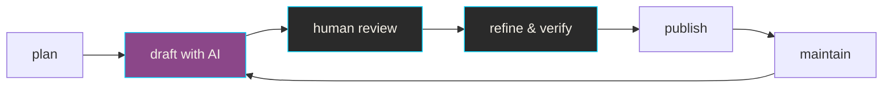

# AI & APIs

Artificial intelligence technologies and concepts relevant to API
documentation. This section covers AI tools, terminology, and practices
that impact how technical writers create and enhance API documentation.

**AI-assisted documentation workflow**:

## AI-assisted documentation

**Definition**: documentation created or enhanced using AI tools while
maintaining human oversight for accuracy, technical correctness, and
quality

**Purpose**: accelerates documentation workflows by handling repetitive
tasks, allowing technical writers to focus on complex explanations,
accuracy verification, and user experience

**Example**: using AI to generate initial drafts of API reference
descriptions, then manually reviewing and enhancing with technical
details and examples

**Related Terms**: [Artificial Intelligence (AI)](#artificial-intelligence-ai),
[Generative AI (genAI)](#generative-ai-genai),
[Large Language Model (LLM)](#large-language-model-llm)

**Source**: UW API Docs - Module 1, Lesson 4, "Intro to AI and API docs"

---

## AI-assisted usability analysis

**Definition**: use of artificial intelligence tools to analyze
usability test results and identify patterns in user behavior or
interface issues

**Purpose**: accelerates analysis of certain types of usability
data while recognizing the limitations of AI in evaluating human
factors

**Appropriate use cases**:

- Mechanical tests: language clarity, navigation patterns,
consistency checks
- Pattern identification: recurring user errors, common
interaction sequences
- Quantitative analysis: time-on-task, completion rates,
click paths

**Limitations**:

- Cannot reliably assess human factors: credibility,
perception, satisfaction, emotional responses
- AI capabilities and best practices evolve rapidly, requiring
ongoing evaluation
- Results should supplement, not replace, human expertise in
usability research
- Interpretation quality depends on the specific AI tools and
prompts used

_**Note**: this represents current perspectives on AI implementation
into usability testing strategies and may evolve as AI capabilities
develop_

**Related Terms**:
[Guerrilla Usability Testing](workflows-methodologies.md#guerrilla-usability-testing),
[usability testing](workflows-methodologies.md#usability-testing)

**Source**: UW API Docs - Module 4, Lesson 3, "Review usability testing for API"

---

## AI bias

**Definition**: systematic errors or unfair outcomes in AI systems that
reflect prejudices present in training data or model design

**Purpose**: awareness of AI bias ensures documentation teams critically
assess AI-generated content rather than accepting it as authoritative,
particularly for examples involving people, places, or cultural contexts

**Related Terms**: [Artificial Intelligence (AI)](#artificial-intelligence-ai),
[training data](#training-data)

**Sources**:

- [UW AI + Teaching](https://teaching.washington.edu/course-design/ai/)
- UW API Docs - Module 1, Lesson 4, "Intro to AI and API docs"

---

## Artificial Intelligence (AI)

**Definition**: technologies that use computers and large datasets to perform
tasks, make predictions, or solve problems that typically require human
intelligence

**Purpose**: encompasses tools and techniques increasingly used in API
documentation workflows, from content generation to automated testing

**Related Terms**: [Generative AI (genAI)](#generative-ai-genai),
[Large Language Model (LLM)](#large-language-model-llm),
[Machine Learning](#machine-learning),
[Natural Language Processing (NLP)](#natural-language-processing-nlp)

**Sources**:

- [UW AI + Teaching](https://teaching.washington.edu/course-design/ai/)
- UW API Docs - Module 1, Lesson 4, "Intro to AI and API docs"

---

## Generative AI (genAI)

**Definition**: AI systems that create new content by identifying
patterns in training data and using probability to generate text,
images, or other media

**Purpose**: assists API documentation writers with drafting, editing,
and formatting tasks while requiring human oversight for accuracy
and quality

**Example**: using Claude or ChatGPT to draft initial API endpoint
descriptions that writers then refine and verify

**Related Terms**: [Artificial Intelligence (AI)](#artificial-intelligence-ai),
[Large Language Model (LLM)](#large-language-model-llm),
[Machine Learning](#machine-learning)

**Sources**:

- [UW AI + Teaching](https://teaching.washington.edu/course-design/ai/)
- UW API Docs - Module 1, Lesson 4, "Intro to AI and API docs"

---

## Large Language Model (LLM)

**Definition**: form of genAI trained on large amounts of text
that generates human-like responses using deep learning and neural
networks

**Purpose**: handles repetitive or foundational documentation tasks
such as generating boilerplate descriptions, summarizing content,
or translating text

**Example**: LLMs can draft initial OpenAPI specification descriptions
or generate code examples in many programming languages

**Related Terms**: [Artificial Intelligence (AI)](#artificial-intelligence-ai),
[Generative AI (genAI)](#generative-ai-genai),
[Natural Language Processing (NLP)](#natural-language-processing-nlp)

**Sources**:

- [UW AI + Teaching](https://teaching.washington.edu/course-design/ai/)
- UW API Docs - Module 1, Lesson 4, "Intro to AI and API docs"

---

## Machine Learning

**Definition**: practice of using algorithms and large datasets to
train computers to recognize patterns and apply learned patterns
to complete new tasks

**Purpose**: enables AI tools to improve API documentation through
pattern recognition in existing documentation, automated categorization,
and predictive suggestions

**Related Terms**: [Artificial Intelligence (AI)](#artificial-intelligence-ai),
[Generative AI (genAI)](#generative-ai-genai),
[Natural Language Processing (NLP)](#natural-language-processing-nlp)

**Sources**:

- [UW AI + Teaching](https://teaching.washington.edu/course-design/ai/)
- UW API Docs - Module 1, Lesson 4, "Intro to AI and API docs"

---

## Natural Language Processing (NLP)

**Definition**: computer's ability to analyze and generate responses that
mimic human language use through machine learning on large text datasets

**Purpose**: powers features in documentation tools such as search capability,
autocomplete, spell-check, and automated translation of API documentation

**Example**: NLP enables smart search in API documentation that understands
queries like "how to authenticate" and returns relevant authentication endpoints

**Related Terms**: [Artificial Intelligence (AI)](#artificial-intelligence-ai),
[Large Language Model (LLM)](#large-language-model-llm),
[Machine Learning](#machine-learning)
**Sources**:

- [UW AI + Teaching](https://teaching.washington.edu/course-design/ai/)
- UW API Docs - Module 1, Lesson 4, "Intro to AI and API docs"

---

## prompt engineering

**Definition**: practice of crafting effective instructions and
queries to AI systems to generate desired outputs

**Purpose**: enables documentation teams to consistently collect
useful results from AI tools by providing clear context, constraints,
and expected output formats

**Example**: requesting "Generate an OpenAPI description for a
`GET` endpoint that retrieves user profiles, including response codes
and example JSON" rather than "describe this endpoint"

**Related Terms**: [Artificial Intelligence (AI)](#artificial-intelligence-ai),
[Large Language Model (LLM)](#large-language-model-llm)

**Sources**:

- [UW AI + Teaching](https://teaching.washington.edu/course-design/ai/)
- UW API Docs - Module 1, Lesson 4, "Intro to AI and API docs"

---

## training data

**Definition**: large datasets used to teach machine learning models to
recognize patterns and generate responses

**Purpose**: understanding training data limitations helps documentation teams
recognize when AI outputs may contain biases, outdated information, or
inaccuracies requiring verification

**Related Terms**: [Artificial Intelligence (AI)](#artificial-intelligence-ai),
[Large Language Model (LLM)](#large-language-model-llm),
[Machine Learning](#machine-learning)

**Sources**:

- [UW AI + Teaching](https://teaching.washington.edu/course-design/ai/)
- UW API Docs - Module 1, Lesson 4, "Intro to AI and API docs"

---
