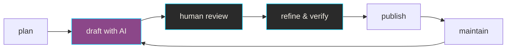
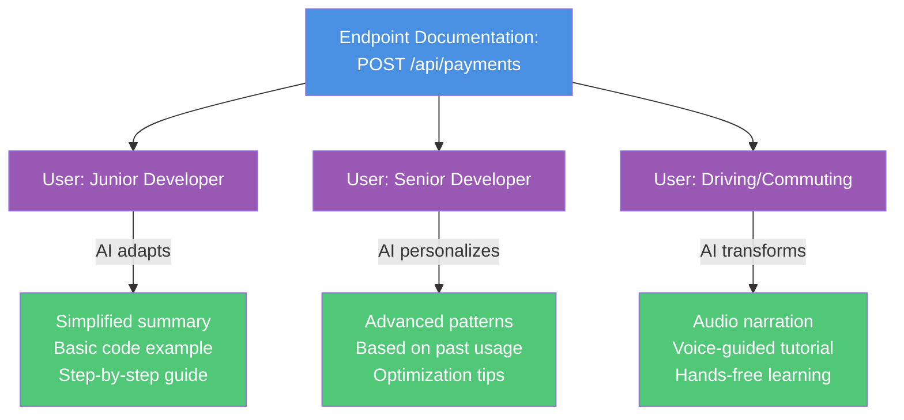
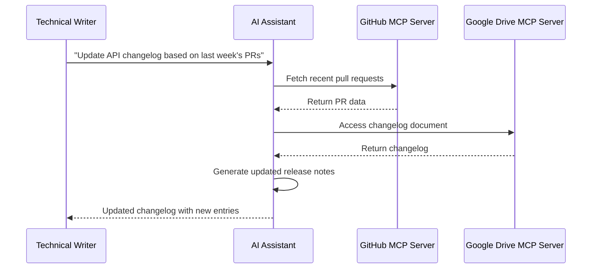

# AI & APIs

Artificial intelligence technologies and concepts relevant to API
documentation. This section covers AI tools, terminology, and practices
that impact how technical writers create and enhance API documentation.

**AI-assisted documentation workflow**:

---

## AI

**Definition**: acronym for Artificial Intelligence; technologies that
use computers and large datasets to perform tasks, make predictions,
or solve problems that typically require human intelligence

**Purpose**: encompasses tools and techniques increasingly used in API
documentation workflows, from content generation to automated testing

**Related Terms**: [genAI](#genai), [Large Language Model](#large-language-model),
[Machine Learning](#machine-learning),
[Natural Language Processing](#natural-language-processing)

**Sources**:

- [University of Washington: "AI + Teaching"](https://teaching.washington.edu/course-design/ai/)
- UW API Docs: Module 1, Lesson 4, "Intro to AI and API docs"

---

## AI-assisted documentation

**Definition**: documentation created or enhanced using AI tools while
maintaining human oversight for accuracy, technical correctness, and
quality

**Purpose**: accelerates documentation workflows by handling repetitive
tasks, allowing technical writers to focus on complex explanations,
accuracy verification, and user experience

**Example**: using AI to generate initial drafts of API reference
descriptions, then manually reviewing and enhancing with technical
details and examples

**Related Terms**: [AI](#ai), [genAI](#genai),
[Large Language Model](#large-language-model)

**Source**: UW API Docs: Module 1, Lesson 4, "Intro to AI and API docs"

---

## AI-assisted usability analysis

**Definition**: use of artificial intelligence tools to analyze
usability test results and identify patterns in user behavior or
interface issues

**Purpose**: accelerates analysis of certain types of usability
data while recognizing the limitations of AI in evaluating human
factors

**Appropriate use cases**:

- Mechanical tests: language clarity, navigation patterns,
consistency checks
- Pattern identification: recurring user errors, common
interaction sequences
- Quantitative analysis: time-on-task, completion rates,
click paths

**Limitations**:

- Can't reliably assess human factors: credibility,
perception, satisfaction, emotional responses
- AI capabilities and best practices evolve rapidly, requiring
ongoing evaluation
- Results should supplement, not replace, human expertise in
usability research
- Interpretation quality depends on the specific AI tools and
prompts used

_**Note**: this represents current perspectives on AI implementation
into usability testing strategies and may evolve as AI capabilities
develop_

**Related Terms**: [AI](#ai),
[guerrilla usability testing](workflows-methodologies.md#guerrilla-usability-testing),
[usability testing](workflows-methodologies.md#usability-testing)

**Source**: UW API Docs: Module 4, Lesson 3, "Review usability testing for API"

---

## AI bias

**Definition**: systematic errors or unfair outcomes in AI systems that
reflect prejudices present in training data or model design

**Purpose**: awareness of AI bias ensures documentation teams critically
assess AI-generated content rather than accepting it as authoritative,
particularly for examples involving people, places, or cultural contexts

**Related Terms**: [AI](#ai), [training data](#training-data)

**Sources**:

- [University of Washington: "AI + Teaching"](https://teaching.washington.edu/course-design/ai/)
- UW API Docs: Module 1, Lesson 4, "Intro to AI and API docs"

---

## genAI

**Definition**: acronym for Generative AI; AI systems that create
new content by identifying patterns in training data and using
probability to generate text, images, or other media

**Purpose**: assists API documentation writers with drafting, editing,
and formatting tasks while requiring human oversight for accuracy
and quality

**Example**: using Claude or ChatGPT to draft initial API endpoint
descriptions that writers then refine and verify

**Related Terms**: [AI](#ai), [Large Language Model](#large-language-model),
[Machine Learning](#machine-learning)

**Sources**:

- [University of Washington: "AI + Teaching"](https://teaching.washington.edu/course-design/ai/)
- UW API Docs: Module 1, Lesson 4, "Intro to AI and API docs"

---

## Large Language Model

**Definition**: also known as an LLM; form of genAI trained on large
amounts of text that generates human-like responses using deep learning
and neural networks

**Purpose**: handles repetitive or foundational documentation tasks
such as generating boilerplate descriptions, summarizing content,
or translating text

**Example**: LLMs can draft initial OpenAPI specification descriptions
or generate code examples in many programming languages

**Related Terms**: [AI](#ai), [genAI](#genai), [liquid content](#liquid-content),
[Natural Language Processing](#natural-language-processing)

**Sources**:

- [University of Washington: "AI + Teaching"](https://teaching.washington.edu/course-design/ai/)
- UW API Docs: Module 1, Lesson 4, "Intro to AI and API docs"

---

## liquid content

**Definition**: content strategy that uses AI to transform and personalize
kinetic content; content that adapts in real-time based on user context,
preferences, or behavior, typically powered by LLMs to transform
between formats - text, audio, video, summaries - while maintaining accuracy

**Purpose**: delivers personalized documentation experiences and enables
content to flow across different formats and interfaces based on user needs;
represents the AI-powered implementation of kinetic content principles where
LLMs actively reshape content for different consumption modes

**Why this belongs in `AI & APIs`**: liquid content is directly tied to AI
capabilities, has specific emerging use cases in publishing, and sits at
the technical intersection of AI and content delivery, while other content
stategies may or may not be AI-assisted

**Example**: liquid content transformation paths

**Related Terms**: [content](writing-style.md#content),
[kinetic content](writing-style.md#kinetic-content), [Large Language Model](#large-language-model),
[modular content](writing-style.md#modular-content), [real-time](api-types-architectures.md#real-time),
[structured content](writing-style.md#structured-content)

**Sources**:

- [Digiday Media: "WTF is liquid content?" by Sara Guaglione](https://digiday.com/media/wtf-is-liquid-content/)
- [Reuters Institute: "Journalism, Media and Technology Trends and Predictions 2026" by Nic Newman](http://reutersinstitute.politics.ox.ac.uk/journalism-media-and-technology-trends-and-predictions-2026)
- [Story Needle: "Are LLMs making content 'liquid'?" by Michael Andrews](https://storyneedle.com/are-llms-making-content-liquid/)

---

## Machine Learning

**Definition**: practice of using algorithms and large datasets to
train computers to recognize patterns and apply learned patterns
to complete new tasks

**Purpose**: enables AI tools to improve API documentation through
pattern recognition in existing documentation, automated categorization,
and predictive suggestions

**Related Terms**: [AI](#ai), [genAI](#genai),
[Natural Language Processing](#natural-language-processing)

**Sources**:

- [University of Washington: "AI + Teaching"](https://teaching.washington.edu/course-design/ai/)
- UW API Docs - Module 1, Lesson 4, "Intro to AI and API docs"

---

## MCP server

**Definition**: acronym for _Model Context Protocol_ server; a server
implementation that enables AI assistants to programmatically access
external tools, data sources, and services through a standardized
protocol; acts as a bridge between AI models and the resources they
need to complete tasks

**Purpose**: provides a standardized way for AI assistants to interact
with tools and data that exist outside their training data; enables
technical writers to build workflows where AI can access internal
documentation systems, retrieve files from cloud storage, search
knowledge bases, or execute commands—all through a consistent API-like
interface; particularly relevant for documentation teams looking to
integrate AI assistance into their existing toolchains without rebuilding
infrastructure

**How MCP Servers Work**:

- MCP servers expose resources like files, database records, or API
endpoints, and tools like search functions, file operations, or commands,
through a JSON-RPC interface
- AI assistants connect to MCP servers as clients, sending requests to
access resources or invoke tools
- the protocol handles authentication, authorization, and data exchange
between the AI and external systems
- multiple MCP servers can run simultaneously, each providing access to
different tools or data sources

**Example**: updating an API changelog using MCP servers

**Common Use Cases for Technical Writers**:

- searching internal documentation systems - Confluence, SharePoint,
Google Drive
- fetching API specifications from version control - GitHub, GitLab
- accessing customer support data to identify documentation gaps
- automating repetitive documentation tasks across multiple platforms
- integrating AI assistance with existing docs-as-code workflows

**Related Terms**:
[authentication](./core-concepts/api-fundamentals.md#authentication),
[JSON](./core-concepts/api-fundamentals.md#json),
[JSON-RPC](api-types-architectures.md#json-rpc),
[REST API](./api-types-architectures.md#rest-api),
[webhook API](./api-types-architectures.md#webhook-api)

**Sources**:

- [GitHub Repository, Anthropic: "Model Context Protocol servers"](https://github.com/modelcontextprotocol/servers)
- [LF Projects, LLC.: "What is the Model Context Protocol (MCP)?"](https://modelcontextprotocol.io/)

---

## Natural Language Processing

**Definition**: also known as NLP; computer's ability to analyze and
generate responses that mimic human language use through machine learning
on large text datasets

**Purpose**: powers features in documentation tools such as search capability,
autocomplete, spell-check, and automated translation of API documentation

**Example**: NLP enables smart search in API documentation that understands
queries like "how to authenticate" and returns relevant authentication endpoints

**Related Terms**: [AI](#ai), [Large Language Model](#large-language-model),
[Machine Learning](#machine-learning)

**Sources**:

- [University of Washington: "AI + Teaching"](https://teaching.washington.edu/course-design/ai/)
- UW API Docs: Module 1, Lesson 4, "Intro to AI and API docs"

---

## prompt engineering

**Definition**: practice of crafting effective instructions and
queries to AI systems to generate desired outputs

**Purpose**: enables documentation teams to consistently collect
useful results from AI tools by providing clear context, constraints,
and expected output formats

**Example**: requesting "Generate an OpenAPI description for a
`GET` endpoint that retrieves user profiles, including response codes
and example JSON" rather than "describe this endpoint"

**Related Terms**: [AI](#ai), [Large Language Model](#large-language-model)

**Sources**:

- [University of Washington: "AI + Teaching"](https://teaching.washington.edu/course-design/ai/)
- UW API Docs: Module 1, Lesson 4, "Intro to AI and API docs"

---

## training data

**Definition**: large datasets used to teach machine learning models to
recognize patterns and generate responses

**Purpose**: understanding training data limitations helps documentation teams
recognize when AI outputs may contain biases, outdated information, or
inaccuracies requiring verification

**Related Terms**: [AI](#ai), [Large Language Model](#large-language-model),
[Machine Learning](#machine-learning)

**Sources**:

- [University of Washington: "AI + Teaching"](https://teaching.washington.edu/course-design/ai/)
- UW API Docs: Module 1, Lesson 4, "Intro to AI and API docs"

---
