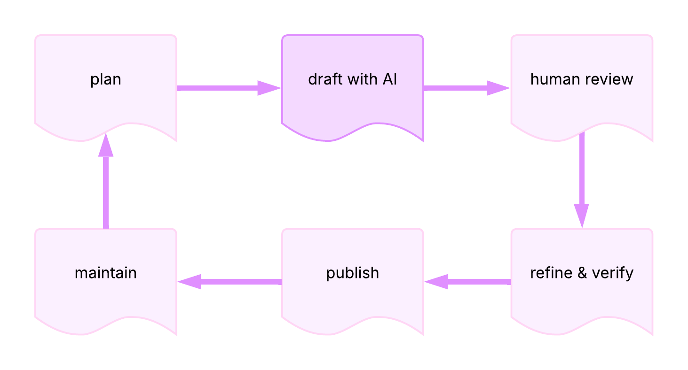
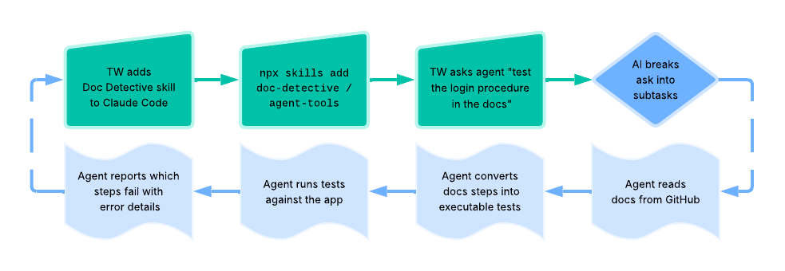
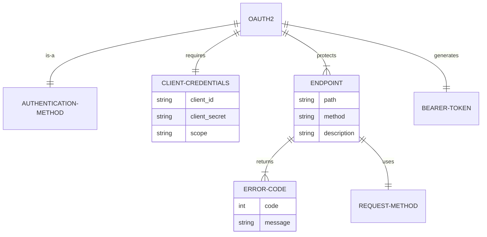
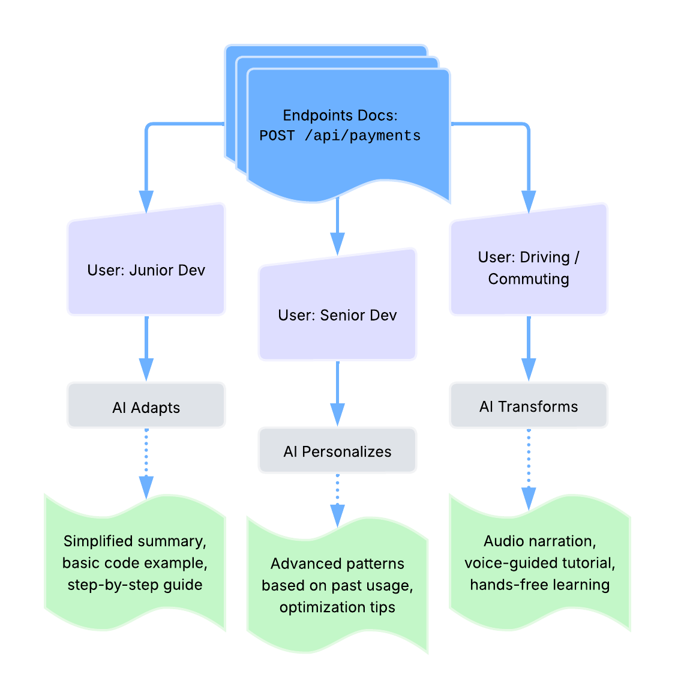
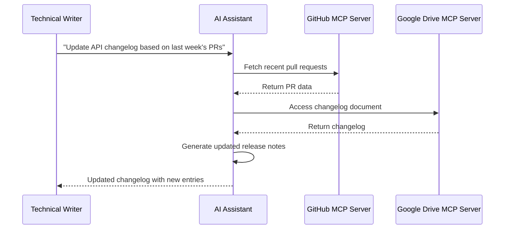

import React from 'react';

# AI & APIs

Artificial intelligence technologies and concepts relevant to API
documentation. This section covers AI tools, terminology, and practices
that impact how technical writers create and enhance API documentation.

**AI-assisted documentation workflow**:

## AI

**Definition**: acronym for _Artificial Intelligence_; technologies
that use computers and large datasets to perform tasks, make predictions,
or solve problems that typically require human intelligence

**Purpose**: encompasses tools and techniques increasingly used in API
documentation workflows, from content generation to automated testing

**Related Terms**: [AI agent](#ai-agent), [genAI](#genai),
[Large Language Model](#large-language-model), [Machine Learning](#machine-learning),
[Natural Language Processing](#natural-language-processing),
[prompt engineering](#prompt-engineering)

**Sources**:

- [University of Washington: "AI + Teaching"](https://teaching.washington.edu/course-design/ai/)
- UW API Docs: Module 1, Lesson 4, "Intro to AI and API docs"

---

## AI agent

**Definition**: single implementation and/or instance of an autonomous system that
independently plans, uses tools, and takes actions to accomplish tasks on behalf of
users; combines NLP - _Natural Language Processing_ - with reasoning capabilities to
break down complex goals into steps, gather information through external tools, and
adapt its approach based on observations

**Purpose**: enables automation of complex, multi-step workflows that previously
required human decision-making; particularly valuable in API documentation contexts
for automating docs testing, generating code examples, maintaining accuracy
across docs updates, and integrating with external systems through APIs and tools

**How AI Agents Work**: agents operate through a cycle of reasoning about the task,
deciding which actions or tools to use, observing results from those actions, and
adapting their plan accordingly; they maintain memory of past interactions, can call
external APIs or tools, and continue iterating until the goal is accomplished or
they determine they cannot proceed

### agentic AI vs AI agent skills

Also known as compound AI systems, **agentic AI** refers to the _broader field and
architectural pattern_ of building autonomous AI systems; similar to how
"a microservice" is an instance while "microservices architecture" is the pattern.

**AI agent skills** refer to modular folders of instructions, scripts, and resources that
AI agents can discover and load on demand. Instead of hardcoding knowledge into prompts
or creating specialized tools for every task, skills provide a flexible way to extend
agent capabilities.

>_Note: agentic AI is an emerging technology; humans must build sophisticated
mental models to enable agents to develop the correct intuition to make effective,
positive changes in software systems_

**Example**: tech writer &rarr; [Docs Detective](https://doc-detective.com/) &rarr;
[Claude Code](https://claude.com/product/claude-code) skills workflow -

**Related Terms**: [AI](#ai),
[API documentation testing](workflows-methodologies.md#api-documentation-testing),
[docs-as-tests](workflows-methodologies.md#docs-as-tests), [Large Language Model](#large-language-model),
[MCP server](#mcp-server), [Natural Language Processing](#natural-language-processing),
[prompt engineering](#prompt-engineering), [RAG](#rag)

**Sources**:

- [IBM: "What Are AI Agents?" by Anna Gutowska](https://www.ibm.com/think/topics/ai-agents)
- [Stripe: "Minions: Stripe's one-shot, end-to-end coding agents" by Alistair Gray](https://stripe.dev/blog/minions-stripes-one-shot-end-to-end-coding-agents)
- [GitHub: doc-detective/agent-tools](https://github.com/doc-detective/agent-tools)
- [Google Cloud: "What is agentic AI?"](https://cloud.google.com/discover/what-is-agentic-ai)
- [Spring by VMware Tanzu: "Spring AI Agentic Patterns (Part 1): Agent Skills - Modular, Reusable Capabilities" by Christian Tzolov](https://spring.io/blog/2026/01/13/spring-ai-generic-agent-skills)
- [Wikipedia: "AI agent"](https://en.wikipedia.org/wiki/AI_agent)

---

## AI-assisted documentation

**Definition**: documentation created or enhanced using AI tools while
maintaining human oversight for accuracy, technical correctness, and
quality

**Purpose**: accelerates documentation workflows by handling repetitive
tasks, allowing technical writers to focus on complex explanations,
accuracy verification, and user experience

**Example**: using AI to generate initial drafts of API reference
descriptions, then manually reviewing and enhancing with technical
details and examples

**Related Terms**: [AI](#ai), [genAI](#genai),
[Large Language Model](#large-language-model)

**Source**: UW API Docs: Module 1, Lesson 4, "Intro to AI and API docs"

---

## AI-assisted usability analysis

**Definition**: use of AI tools to analyze usability test results
and identify patterns in user behavior or interface issues

**Purpose**: accelerates analysis of certain types of usability
data while recognizing the limitations of AI in evaluating human
factors

**Appropriate use cases**:

- Mechanical tests: language clarity, navigation patterns,
consistency checks
- Pattern identification: recurring user errors, common
interaction sequences
- Quantitative analysis: time-on-task, completion rates,
click paths

**Limitations**:

- Can't reliably assess human factors: credibility,
perception, satisfaction, emotional responses
- AI capabilities and best practices evolve rapidly, requiring
ongoing evaluation
- Results should supplement, not replace, human expertise in
usability research
- Interpretation quality depends on the specific AI tools and
prompts used

_**Note**: this represents current perspectives on AI implementation
into usability testing strategies and may evolve as AI capabilities
develop_

**Related Terms**: [AI](#ai),
[guerrilla usability testing](workflows-methodologies.md#guerrilla-usability-testing),
[usability testing](workflows-methodologies.md#usability-testing)

**Source**: UW API Docs: Module 4, Lesson 3, "Review usability testing for API"

---

## AI bias

**Definition**: systematic errors or unfair outcomes in AI systems that
reflect prejudices present in training data or model design

**Purpose**: awareness of AI bias ensures documentation teams critically
assess AI-generated content rather than accepting it as authoritative,
particularly for examples involving people, places, or cultural contexts

**Related Terms**: [AI](#ai), [training data](#training-data)

**Sources**:

- [University of Washington: "AI + Teaching"](https://teaching.washington.edu/course-design/ai/)
- UW API Docs: Module 1, Lesson 4, "Intro to AI and API docs"

---

## genAI

**Definition**: acronym for Generative AI; AI systems that create
new content by identifying patterns in training data and using
probability to generate text, images, or other media

**Purpose**: assists API documentation writers with drafting, editing,
and formatting tasks while requiring human oversight for accuracy
and quality

**Example**: using Claude or ChatGPT to draft initial API endpoint
descriptions that writers then refine and verify

**Related Terms**: [AI](#ai), [Large Language Model](#large-language-model),
[Machine Learning](#machine-learning), [prompt engineering](#prompt-engineering)

**Sources**:

- [University of Washington: "AI + Teaching"](https://teaching.washington.edu/course-design/ai/)
- UW API Docs: Module 1, Lesson 4, "Intro to AI and API docs"

---

## knowledge graph

**Definition**: also known as a KG; structured representation of knowledge
using entities - concepts, objects, events - and the relationships between
them, organized in a graph format that both humans and machines can query
and reason about

**Purpose**: enables semantic understanding and intelligent querying of API
documentation by representing relationships between endpoints, parameters,
authentication methods, error codes, and other API concepts; supports
AI-powered documentation search, chatbots, and automated content assembly

**Example**: a KG enables AI to traverse relationships to
answer development questions such as _"What authentication does the payment
endpoint need?"_ - instead of relying on keyboard matching in documentation
text, the KG reveals that the payment endpoint is protected by
["OAuth 2.0"](https://oauth.net/2/), which requires client credentials - 
`client_id`, `client_secret`, and `scope` - and generates a bearer token
used in requests

### Interactive KG Explorer

export const KnowledgeGraphExplorer = () => {
  const [selectedNode, setSelectedNode] = React.useState('OAuth 2.0');
  
  const graph = {
    'OAuth 2.0': {
      type: 'Authentication Method',
      relationships: [
        { type: 'is-a', target: 'Authentication Method' },
        { type: 'requires', target: 'Client Credentials' },
        { type: 'requires', target: 'Scope' },
        { type: 'protects', target: 'Payment Endpoint' },
        { type: 'protects', target: 'User Endpoint' },
        { type: 'generates', target: 'Bearer Token' }
      ],
      color: '#4A90E2'
    },
    'Authentication Method': {
      type: 'Concept',
      relationships: [
        { type: 'implemented-by', target: 'OAuth 2.0' },
        { type: 'implemented-by', target: 'API Key' }
      ],
      color: '#50C878'
    },
    'Client Credentials': {
      type: 'Required Data',
      relationships: [
        { type: 'required-by', target: 'OAuth 2.0' },
        { type: 'includes', target: 'Client ID' },
        { type: 'includes', target: 'Client Secret' }
      ],
      color: '#FFB347'
    },
    'Scope': {
      type: 'Permission Definition',
      relationships: [
        { type: 'required-by', target: 'OAuth 2.0' },
        { type: 'defines-access-to', target: 'Payment Endpoint' },
        { type: 'defines-access-to', target: 'User Endpoint' },
        { type: 'included-in', target: 'Bearer Token' }
      ],
      color: '#9B59B6'
    },
    'Client ID': {
      type: 'Credential Component',
      relationships: [
        { type: 'part-of', target: 'Client Credentials' },
        { type: 'identifies', target: 'Application' }
      ],
      color: '#F39C12'
    },
    'Client Secret': {
      type: 'Credential Component',
      relationships: [
        { type: 'part-of', target: 'Client Credentials' },
        { type: 'authenticates', target: 'Application' }
      ],
      color: '#F39C12'
    },
    'Payment Endpoint': {
      type: 'Endpoint',
      relationships: [
        { type: 'protected-by', target: 'OAuth 2.0' },
        { type: 'requires-scope', target: 'Scope' },
        { type: 'returns', target: '401 Error' },
        { type: 'returns', target: '403 Error' },
        { type: 'uses', target: 'POST Method' }
      ],
      color: '#E74C3C'
    },
    'User Endpoint': {
      type: 'Endpoint',
      relationships: [
        { type: 'protected-by', target: 'OAuth 2.0' },
        { type: 'requires-scope', target: 'Scope' },
        { type: 'returns', target: '401 Error' },
        { type: 'uses', target: 'GET Method' }
      ],
      color: '#E74C3C'
    },
    'Bearer Token': {
      type: 'Token',
      relationships: [
        { type: 'generated-by', target: 'OAuth 2.0' },
        { type: 'contains', target: 'Scope' },
        { type: 'used-in', target: 'HTTP Headers' },
        { type: 'validates', target: 'Payment Endpoint' },
        { type: 'validates', target: 'User Endpoint' }
      ],
      color: '#16A085'
    },
    'API Key': {
      type: 'Authentication Method',
      relationships: [
        { type: 'is-a', target: 'Authentication Method' },
        { type: 'simpler-than', target: 'OAuth 2.0' },
        { type: 'used-in', target: 'HTTP Headers' }
      ],
      color: '#4A90E2'
    },
    '401 Error': {
      type: 'Error Response',
      relationships: [
        { type: 'returned-by', target: 'Payment Endpoint' },
        { type: 'returned-by', target: 'User Endpoint' },
        { type: 'indicates', target: 'Missing or Invalid Token' }
      ],
      color: '#C0392B'
    },
    '403 Error': {
      type: 'Error Response',
      relationships: [
        { type: 'returned-by', target: 'Payment Endpoint' },
        { type: 'indicates', target: 'Insufficient Scope' }
      ],
      color: '#C0392B'
    },
    'HTTP Headers': {
      type: 'Technical Component',
      relationships: [
        { type: 'contains', target: 'Bearer Token' },
        { type: 'contains', target: 'API Key' }
      ],
      color: '#34495E'
    },
    'POST Method': {
      type: 'HTTP Method',
      relationships: [
        { type: 'used-by', target: 'Payment Endpoint' }
      ],
      color: '#7F8C8D'
    },
    'GET Method': {
      type: 'HTTP Method',
      relationships: [
        { type: 'used-by', target: 'User Endpoint' }
      ],
      color: '#7F8C8D'
    },
    'Application': {
      type: 'Client',
      relationships: [
        { type: 'identified-by', target: 'Client ID' },
        { type: 'authenticated-by', target: 'Client Secret' },
        { type: 'requests', target: 'Scope' }
      ],
      color: '#2C3E50'
    },
    'Missing or Invalid Token': {
      type: 'Error Condition',
      relationships: [
        { type: 'causes', target: '401 Error' }
      ],
      color: '#E67E22'
    },
    'Insufficient Scope': {
      type: 'Error Condition',
      relationships: [
        { type: 'causes', target: '403 Error' },
        { type: 'related-to', target: 'Scope' }
      ],
      color: '#E67E22'
    }
  };
  
  const allNodes = Object.keys(graph).sort();
  const currentNode = graph[selectedNode];
  
  return (
    

      
      

        {/* Node selector */}
        

          

            Select Entity ({allNodes.length} total):
            

          

          {allNodes.map(node => (
            
 setSelectedNode(node)}
              style={{
                padding: '0.5rem',
                marginBottom: '0.25rem',
                backgroundColor: selectedNode === node ? (graph[node]?.color || '#f0f0f0') : '#f9f9f9',
                color: selectedNode === node ? 'white' : 'black',
                borderRadius: '4px',
                cursor: 'pointer',
                fontSize: '0.85rem',
                transition: 'all 0.2s ease',
                border: selectedNode === node ? 'none' : '1px solid #eee'
              }}>
              {node}
            

          ))}
        

        
        {/* Relationship display */}
        

          

            <h3 style={{margin: 0, color: 'white', fontSize: '1.5rem'}}>{selectedNode}</h3>
            

              Type: {currentNode?.type}
            

          

          
          

            

              Relationships ({currentNode?.relationships.length || 0}):
            

            {currentNode?.relationships.length > 0 ? (
              currentNode.relationships.map((rel, idx) => (
                
 {
                    e.currentTarget.style.backgroundColor = '#f0f0f0';
                  }}
                  onMouseLeave={(e) => {
                    e.currentTarget.style.backgroundColor = '#f9f9f9';
                  }}>
                  
                    {rel.type}
                  
                  →
                   allNodes.includes(rel.target) && setSelectedNode(rel.target)}
                    style={{
                      cursor: allNodes.includes(rel.target) ? 'pointer' : 'default',
                      textDecoration: allNodes.includes(rel.target) ? 'underline' : 'none',
                      color: allNodes.includes(rel.target) ? '#4A90E2' : '#333',
                      fontWeight: allNodes.includes(rel.target) ? '600' : 'normal',
                      fontSize: '0.95rem'
                    }}>
                    {rel.target}
                  
                

              ))
            ) : (
              

                No relationships defined
              

            )}
          

        

      

      
      

        <strong>💡 Tip:</strong> explore how concepts connect in an API docs KG by clicking on entity names in the left sidebar, labeled <i>Select Entity</i> - or within <i>Relationships</i> in which <u>entities are underlined</u>
      

    

  );
};

<KnowledgeGraphExplorer />

**Related Terms**: [content](writing-style.md#content),
[information architecture](frameworks-strategy.md#information-architecture),
[liquid content](#liquid-content),
[modular content](writing-style.md#modular-content),
[structured content](writing-style.md#structured-content)

**Sources**:

- [Geeks for Geeks: "What is a Knowledge Graph?"](https://www.geeksforgeeks.org/data-analysis/what-is-a-knowledge-graph/)
- [Wikipedia: Knowledge Graph](https://en.wikipedia.org/wiki/Knowledge_graph)

---

## Large Language Model

**Definition**: also known as an LLM; form of genAI trained on large
amounts of text that generates human-like responses using deep learning
and neural networks

**Purpose**: handles repetitive or foundational documentation tasks
such as generating boilerplate descriptions, summarizing content,
or translating text

**Example**: LLMs can draft initial OpenAPI specification descriptions
or generate code examples in many programming languages

**Related Terms**: [AI](#ai), [AI agent](#ai-agent), 
[genAI](#genai), [liquid content](#liquid-content),
[Natural Language Processing](#natural-language-processing),
[prompt engineering](#prompt-engineering), [RAG](#rag)

**Sources**:

- [University of Washington: "AI + Teaching"](https://teaching.washington.edu/course-design/ai/)
- UW API Docs: Module 1, Lesson 4, "Intro to AI and API docs"

---

## liquid content

**Definition**: content strategy that uses AI to transform and personalize
kinetic content; content that adapts in real-time based on user context,
preferences, or behavior, typically powered by LLMs to transform
between formats - text, audio, video, summaries - while maintaining accuracy

**Purpose**: delivers personalized documentation experiences and enables
content to flow across different formats and interfaces based on user needs;
represents the AI-powered implementation of kinetic content principles where
LLMs actively reshape content for different consumption modes

**Why this belongs in `AI & APIs`**: liquid content is directly tied to AI
capabilities, has specific emerging use cases in publishing, and sits at
the technical intersection of AI and content delivery, while other content
stategies may or may not be AI-assisted

**Example**: liquid content transformation paths -

**Related Terms**: [content](writing-style.md#content),
[kinetic content](writing-style.md#kinetic-content), [Large Language Model](#large-language-model),
[modular content](writing-style.md#modular-content), [real-time](api-types-architectures.md#real-time),
[structured content](writing-style.md#structured-content)

**Sources**:

- [Digiday Media: "WTF is liquid content?" by Sara Guaglione](https://digiday.com/media/wtf-is-liquid-content/)
- [Reuters Institute: "Journalism, Media and Technology Trends and Predictions 2026" by Nic Newman](http://reutersinstitute.politics.ox.ac.uk/journalism-media-and-technology-trends-and-predictions-2026)
- [Story Needle: "Are LLMs making content 'liquid'?" by Michael Andrews](https://storyneedle.com/are-llms-making-content-liquid/)

---

## Machine Learning

**Definition**: practice of using algorithms and large datasets to
train computers to recognize patterns and apply learned patterns
to complete new tasks

**Purpose**: enables AI tools to improve API documentation through
pattern recognition in existing documentation, automated categorization,
and predictive suggestions

**Related Terms**: [AI](#ai), [genAI](#genai),
[Natural Language Processing](#natural-language-processing)

**Sources**:

- [University of Washington: "AI + Teaching"](https://teaching.washington.edu/course-design/ai/)
- UW API Docs - Module 1, Lesson 4, "Intro to AI and API docs"

---

## MCP server

**Definition**: acronym for _Model Context Protocol_ server; a server
implementation that enables AI assistants to programmatically access
external tools, data sources, and services through a standardized
protocol; acts as a bridge between AI models and the resources they
need to complete tasks

**Purpose**: provides a standardized way for AI assistants to interact
with tools and data that exist outside their training data; enables
technical writers to build workflows where AI can access internal
documentation systems, retrieve files from cloud storage, search
knowledge bases, or execute commands—all through a consistent API-like
interface; particularly relevant for documentation teams looking to
integrate AI assistance into their existing toolchains without rebuilding
infrastructure

**How MCP Servers Work**:

- MCP servers expose resources like files, database records, or API
endpoints, and tools like search functions, file operations, or commands,
through a JSON-RPC interface
- AI assistants connect to MCP servers as clients, sending requests to
access resources or invoke tools
- the protocol handles authentication, authorization, and data exchange
between the AI and external systems
- multiple MCP servers can run simultaneously, each providing access to
different tools or data sources

**Example**: updating an API changelog using MCP servers

**Common Use Cases for Technical Writers**:

- searching internal documentation systems - Confluence, SharePoint,
Google Drive
- fetching API specifications from version control - GitHub, GitLab
- accessing customer support data to identify documentation gaps
- automating repetitive documentation tasks across multiple platforms
- integrating AI assistance with existing docs-as-code workflows

**Related Terms**: [AI agent](#ai-agent), 
[authentication](./core-concepts/api-fundamentals.md#authentication),
[JSON](./core-concepts/api-fundamentals.md#json),
[JSON-RPC](api-types-architectures.md#json-rpc),
[REST API](./api-types-architectures.md#rest-api),
[webhook API](./api-types-architectures.md#webhook-api)

**Sources**:

- [GitHub Repository, Anthropic: "Model Context Protocol servers"](https://github.com/modelcontextprotocol/servers)
- [LF Projects, LLC.: "What is the Model Context Protocol (MCP)?"](https://modelcontextprotocol.io/)

---

## Natural Language Processing

**Definition**: also known as NLP; computer's ability to analyze and
generate responses that mimic human language use through machine learning
on large text datasets

**Purpose**: powers features in documentation tools such as search capability,
autocomplete, spell-check, and automated translation of API documentation

**Example**: NLP enables smart search in API documentation that understands
queries like "how to authenticate" and returns relevant authentication endpoints

**Related Terms**: [AI](#ai), [AI agent](#ai-agent),
[Large Language Model](#large-language-model), [Machine Learning](#machine-learning)

**Sources**:

- [University of Washington: "AI + Teaching"](https://teaching.washington.edu/course-design/ai/)
- UW API Docs: Module 1, Lesson 4, "Intro to AI and API docs"

---

## prompt engineering

**Definition**: practice of crafting effective instructions and
queries to AI systems to generate desired outputs

**Purpose**: enables documentation teams to consistently collect
useful results from AI tools by providing clear context, constraints,
and expected output formats

**Example**: requesting "Generate an OpenAPI description for a
`GET` endpoint that retrieves user profiles, including response codes
and example JSON" rather than "describe this endpoint"

**Related Terms**: [AI](#ai), [AI agent](#ai-agent), [genAI](#genai),
[Large Language Model](#large-language-model)

**Sources**:

- [University of Washington: "AI + Teaching"](https://teaching.washington.edu/course-design/ai/)
- UW API Docs: Module 1, Lesson 4, "Intro to AI and API docs"

---

## RAG

**Definition**: acronym for _Retrieval-Augmented Generation_;
AI technique that combines information retrieval with text generation
to produce accurate, contextually relevant answers to technical questions;
retrieves relevant docs and/or data from a knowledge base, then uses that
context to generate responses rather than relying solely on the AI model's
training data

**Purpose**: improves accuracy and reduces hallucinations in AI-powered docs
tools by grounding responses in real source material; enables AI assistants
to provide up-to-date, domain-specific answers with verifiable sources

**Example**: when a developer asks _"How do I authenticate?"_, a RAG-based
system fetches relevant sections from authentication docs, API reference, and
code examples, then generates a synthesized answer such as _"Based on the
authentication guide, you need to include your API key in the Authorization
header as a Bearer token"_ with citations to the source docs

**Related Terms**: [AI agent](#ai-agent),
[docs-as-ecosystem](frameworks-strategy.md#docs-as-ecosystem),
[domain knowledge](frameworks-strategy.md#domain-knowledge),
[Fin](./tools-techniques/documentation-specific.md#fin),
[Inkeep](./tools-techniques/documentation-specific.md#inkeep),
[Kapa.ai](./tools-techniques/documentation-specific.md#kapaai),
[Large Language Model](#large-language-model)

**Sources**:

- [Amazon Web Services, Inc.: "What is RAG (Retrieval-Augmented Generation)?](https://aws.amazon.com/what-is/retrieval-augmented-generation/)
- [GeeksforGeeks: "What is Retrieval Augmented Generation (RAG)?](https://www.geeksforgeeks.org/nlp/what-is-retrieval-augmented-generation-rag/)
- [Wikipedia: "Retrieval-augmented generation"](https://en.wikipedia.org/wiki/Retrieval-augmented_generation)

---

## training data

**Definition**: large datasets used to teach machine learning models to
recognize patterns and generate responses

**Purpose**: understanding training data limitations helps documentation teams
recognize when AI outputs may contain biases, outdated information, or
inaccuracies requiring verification

**Related Terms**: [AI](#ai), [genAI](#genai),
[Large Language Model](#large-language-model),
[Machine Learning](#machine-learning)

**Sources**:

- [University of Washington: "AI + Teaching"](https://teaching.washington.edu/course-design/ai/)
- UW API Docs: Module 1, Lesson 4, "Intro to AI and API docs"

---
