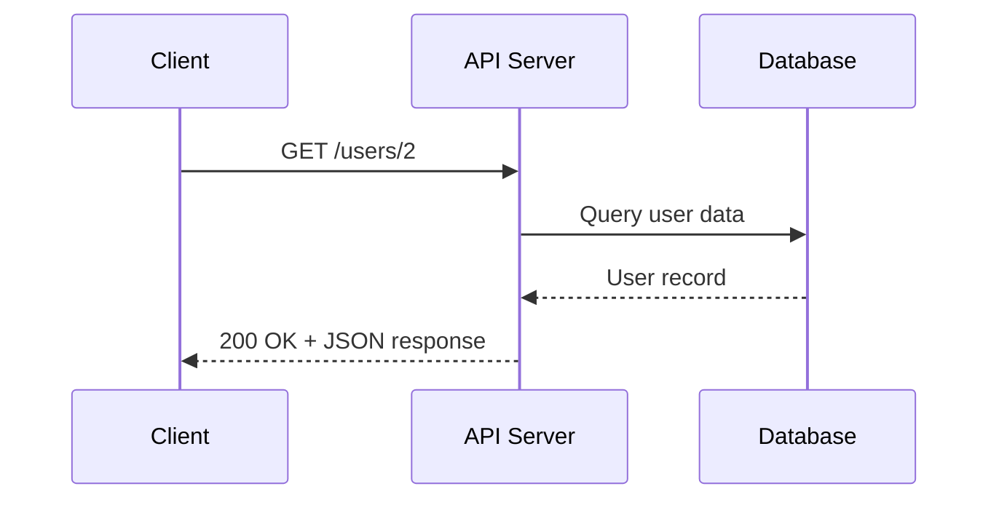

# API Types & Architectures

Different architectural patterns and protocols for building APIs.
Understanding these API types helps documentarians choose appropriate
documentation approaches, explain implementation differences to users,
and recognize when standard REST documentation conventions don't apply.

---

## AMQP

**Definition**: acronym for _Advanced Message Queuing Protocol_ -
open standard application layer protocol for message-oriented middleware
that enables reliable, asynchronous communication between applications

**Purpose**: provides interoperable wire format for messaging systems;
supports message queuing, routing, reliability guarantees, and security
features across different platforms and programming languages

**Why this belongs in `API Types & Architectures`**: AMQP is a messaging
protocol specification ratified by OASIS -
_Organization for the Advancement of Structured Information Standards_ -
and ISO - _International Organization for Standardization_ -
that defines message format and transmission, similar to how HTTP defines
request-response communication; while tools like RabbitMQ implement AMQP,
the protocol itself belongs with other communication protocols and
architectural patterns

**Example**: financial services use AMQP to ensure reliable message
delivery between trading systems, with guaranteed delivery options of
at-most-once, at-least-once, or exactly once

**Related Terms**: [AsyncAPI](core-concepts.md#asyncapi),
[HTTP](core-concepts.md#http), [MQTT](#mqtt),
[request/response](core-concepts.md#requestresponse), STOMP,
[WebSocket API](#websocket-api)

**Sources**:

- [OASIS, AMQP About Page: "AMQP is the Internet Protocol for Business Messaging"](https://www.amqp.org/about/what)
- [Wikipedia: "Advanced Message Queuing Protocol"](https://en.wikipedia.org/wiki/Advanced_Message_Queuing_Protocol)

---

## API gateway

**Definition**: server that acts as a single entry point for many backend
services, handling request routing, authentication, rate limiting, and
response transformation

**Purpose**: simplifies client integration by providing a unified interface
to many microservices; enables centralized security, monitoring, and versioning
without clients needing to know about backend architecture

**Example**: an e-commerce API gateway routes `/products` requests to the product
service, `/orders` to the order service, and `/users` to the user service, while
handling authentication for all three

**Related Terms**: [API](core-concepts.md#api), [API endpoint](core-concepts.md#api-endpoint),
[microservices](#microservices), [rate limiting](core-concepts.md#rate-limiting)

**Source**: [F5, Inc., NGINX: "What Is an API Gateway?"](https://www.f5.com/glossary/api-gateway)

---

## event-driven

**Definition**: architectural pattern where actions trigger in response
to specific events rather than through continuous polling or scheduled
intervals

**Purpose**: improves efficiency and responsiveness by processing only
when relevant changes occur; reduces unnecessary network traffic and
server load

**Example**: a webhook API notifies an e-commerce system when payment
completes, triggering immediate order fulfillment rather than checking
payment status every few minutes

**Related Terms**: [API](core-concepts.md#api),
[AsyncAPI](core-concepts.md#asyncapi),
[Microcks](./tools-techniques/testing-validation.md#microcks),
[real-time](#real-time), [webhook API](#webhook-api),
[WebSocket API](#websocket-api)

**Source**: [Amazon Web Service, Inc., (AWS): "What is an Event-Driven Architecture?"](https://aws.amazon.com/event-driven-architecture/)

---

## GraphQL API

**Definition**: uses GraphQL - _a query language and runtime_ - to let
clients request exactly the data they need through a single endpoint
with a strongly typed schema

**Purpose**: compared to REST APIs, reduces over-fetching and
under-fetching of data; provides strongly typed schema and introspection
capabilities for self-documenting APIs; particularly valuable for complex,
interconnected data models; GraphQL can test query validation, field-level
access controls, and schema compliance

**Why this belongs in `API Types & Architectures`**: GraphQL is both a
query language and an architectural approach that fundamentally defines
API design, structure, and function; unlike AsyncAPI and OpenAPI Specification
which are documentation formats for describing existing APIs, _GraphQL is
the API implementation itself_ - it determines endpoint structure,
data fetching patterns, and client-server interaction models; belongs
alongside REST API and WebSocket API as an architectural pattern rather than
in `Core Concepts` with documentation specification formats

**Example**: instead of calling `/users/123`, `/users/123/posts`, and
`/users/123/followers` separately, a client queries one endpoint requesting

```graphQL
{ user(id: 123) { name, posts { title }, followers { name } } }
```

**Related Terms**: [API](core-concepts.md#api),
[AsyncAPI](core-concepts.md#asyncapi),
[Microcks](./tools-techniques/testing-validation.md#microcks),
[REST API](#rest-api),
[schema](core-concepts.md#schema), [validation](core-concepts.md#validation)

**Sources**:

- [The GraphQL Foundation: "Learn GraphQL"](https://graphql.org/learn/)
- [Silva, Manny. _Docs As Tests_. First edition, Release 2, Boffin Education, May 2025.](https://boffin.education/about-docs-as-tests/)

---

## gRPC API

**Definition**: uses gRPC - _Google's Remote Procedure Call_ - framework,
which relies on Protocol Buffers for serialization and HTTP/2 for transport

**Purpose**: enables high-performance, strongly typed communication between
services; common in microservices architectures where efficiency and type
safety matter more than human readability

**Example**: a payment processing service exposes gRPC methods like
`ProcessPayment()` that accept and return strongly typed Protocol Buffers
messages rather than JSON

**Related Terms**: [API](core-concepts.md#api),
[HTTP versions](core-concepts.md#http-versions),
[Microcks](./tools-techniques/testing-validation.md#microcks),
[Protocol Buffers](./tools-techniques/development-essentials.md#protocol-buffers),
[RPC API](#rpc-api),
[serialization](core-concepts.md#serialization)

**Source**: [gRPC Authors: "What is gRPC?"](https://grpc.io/docs/what-is-grpc/)

---

## microservices

**Definition**: architectural approach in which applications are collections
of small, independently deployable services that communicate via APIs

**Purpose**: enables teams to develop, deploy, and scale services independently;
improves fault isolation and technology flexibility compared to
[monolithic architectures](https://www.geeksforgeeks.org/system-design/monolithic-architecture-system-design/)

**Example**: Netflix's streaming platform uses hundreds of microservices for
recommendations, playback, billing, and user profiles, each with its own API

**Related Terms**: [API](core-concepts.md#api), [API gateway](#api-gateway),
[REST API](#rest-api)

**Source**: [Martin Fowler: "Microservices"](https://martinfowler.com/articles/microservices.html)

---

## MQTT

**Definition**: acronym for _Message Queuing Telemetry Transport_ -
lightweight publish-subscribe messaging protocol designed for constrained
devices and networks with limited bandwidth or unreliable connections

**Purpose**: enables efficient IoT - _Internet of Things_ - and
machine-to-machine communication with minimal code footprint, low network
overhead, and quality of service levels for delivery guarantees; optimized
for battery-powered devices; used in a wide variety of industries, such
as automotive, manufacturing, telecommunications, and oil and gas

**Why this belongs in `API Types & Architectures`**: MQTT is a messaging
protocol standard ratified by OASIS -
_Organization for the Advancement of Structured Information Standards_ -
and ISO - _International Organization for Standardization_ -
that defines communication patterns and message format,
not a specific software implementation; comparable to how AMQP and
WebSocket are protocol specifications in this category

**Example**: IoT devices like smart thermostats and industrial sensors
use MQTT to publish temperature and pressure data to cloud brokers
with minimal battery drain, leveraging persistent sessions that survive
network disconnections and automatic reconnection capabilities

**Related Terms**: [AMQP](#amqp), [AsyncAPI](core-concepts.md#asyncapi),
[HTTP](core-concepts.md#http), STOMP,
[WebSocket API](api-types-architectures.md#websocket-api)

**Sources**:

- [MQTT.org: "MQTT - The Standard for IoT Messaging"](https://mqtt.org/)
- [Amazon Web Services, Inc.: "What is MQTT?"](https://aws.amazon.com/what-is/mqtt/)

---

## real-time

**Definition**: describes systems and/or APIs that process and deliver data
with minimal delay, enabling immediate responses to events as they occur

**Purpose**: supports use cases requiring instant updates like live
notifications, streaming data, collaborative editing, and monitoring
dashboards

**Example**: a WebSocket API delivers stock price changes to trading
applications within milliseconds of market movements

**Related Terms**: [event-driven](#event-driven),
[webhook API](api-types-architectures.md#webhook-api),
[WebSocket API](api-types-architectures.md#websocket-api)

**Sources**:

- [Mozilla Corporation, MDN: "WebRTC API (Web Real-time Communication)"](https://developer.mozilla.org/en-US/docs/Web/API/WebRTC_API)
- [Wikipedia: "Real-time computing"](https://en.wikipedia.org/wiki/Real-time_computing)

---

## REST API

**Definition**: acronym for _Representational State Transfer_
API - one of the most widely used approaches for building web-based
APIs

**REST isn't a regulated standard**, but an architectural style for
distributed hypermedia systems, first presented by Roy Fielding in 2000;
REST is a convention, used by APIs exposed through HTTP/HTTPS web
services to exchange data.

**Key characteristics**:

- **Client-server architecture**: assumes "clients," resource users,
and "servers," resource providers
- **Stateless**: clients maintain the complete state of the interaction;
servers provide only self-contained resources
- **Cacheable**: resources saved locally to improve performance
- **Uniform interface**: standardized way of communicating between
client and server
- **Uses HTTP methods**: [`DELETE` (remove)](core-concepts.md#delete),
[`GET` (read)](core-concepts.md#get),
[`PATCH` (edit)](core-concepts.md#patch),
[`POST` (create)](core-concepts.md#post),
[`PUT` (replace)](core-concepts.md#put)
- **Commonly uses JSON**: due to its wide support in programming
languages, REST APIs use JSON, but it's not required and also
support other formats like XML

**Example request**:

```bash
GET http://localhost:3000/users/2
```

Break down this URL:

- _How_: Uses the `GET` method of the HTTP protocol
- _Where_: From `localhost:3000` server
- _What_: `users/2` instance of this resource



**Example response**:

`GET` requests a user resource, and the response body contains the
resource formatted as a JSON document:

```json
{
  "id": 2,
  "first_name": "Ferdinand",
  "last_name": "Smith",
  "email": "f.smith@example.com"
}
```

**Related Terms**: [API](core-concepts.md#api),
[API documentation testing](workflows-methodologies.md#api-documentation-testing),
[CLI](./tools-techniques/development-essentials.md#cli),
[HTTP](core-concepts.md#http),
[HTTP status codes](core-concepts.md#http-status-codes),
[JSON](core-concepts.md#json), [parameters](core-concepts.md#parameters),
[resource](core-concepts.md#resource), [URL](core-concepts.md#url)

**Sources**:

- UW API Docs: Module 5, Lesson 1, "REST API Fundamentals"
- [RESTful API: "What is REST?" by Lokesh Gupta](https://restfulapi.net/)

---

## REST vs *REST*ful

**Definition**: terms are often used interchangeably, though technically
"REST" refers to the architectural style itself while "RESTful"
describes APIs that follow REST principles; in practice, both terms
describe APIs that use HTTP methods, stateless communication, and
resource-based URLs

**Purpose**: understanding this distinction helps API documentation
writers use consistent terminology; while some sources differentiate
between the two, most modern API documentation treats them as synonyms;
what matters is plainly explaining whether an API follows REST
architectural constraints rather than debating terminology

**Example**: documentation might say "this RESTful API uses HTTP methods"
or "this REST API returns JSON responses" - both are acceptable; the key
is explaining the API's behavior: stateless requests, resource-based
endpoints like `/users/123`, standard HTTP methods - `GET`, `POST`, `PUT`,
`DELETE`

**Related Terms**: [API endpoint](core-concepts.md#api-endpoint),
[HTTP](core-concepts.md#http), [HTTP method](core-concepts.md#http-method),
[resource](core-concepts.md#resource), [REST API](#rest-api)

**Sources**:

- [RESTful API: "What is REST?" by Lokesh Gupta](https://restfulapi.net/)
- [Roy Thomas Fielding's University of California Dissertation: Chapter 5 - "Representational State Transfer (REST)"](https://roy.gbiv.com/pubs/dissertation/rest_arch_style.htm)

---

## RPC API

**Definition**: acronym for Remote Procedure Call API; allows clients
to execute functions on remote servers as if calling local functions,
abstracting network communication details

**Purpose**: simplifies distributed computing by making remote operations
look like local function calls; common in internal service-to-service
communication

**Example**: a client calls `getUserProfile(userId)` which executes on
a remote server and returns the result, hiding the network request details

**Related Terms**: [API](core-concepts.md#api), [gRPC API](#grpc-api)

**Source**: [Geeks for Geeks: "Difference Between REST API and RPC API"](https://www.geeksforgeeks.org/system-design/difference-between-rest-api-and-rpc-api/)

---

## SOAP API

**Definition**: acronym for Simple Object Access Protocol; uses XML-based
messaging protocol to exchange structured information between systems,
typically over HTTP or HTTPS

**Purpose**: provides standardized, contract-based communication with
built-in error handling and security; common in enterprise environments
where formal contracts, transactions, and ACID compliance matter more
than simplicity or performance

**Key characteristics**:

- **WSDL contracts**: Web Services Description Language defines the API contract
- **XML-only**: all requests and responses use XML format
- **Protocol-independent**: can work over HTTP, SMTP, TCP, or other protocols
- **Built-in standards**: includes WS-Security, WS-AtomicTransaction,
and other enterprise features

**Example**: a banking system exposes a SOAP API for account transfers
with a formal WSDL contract specifying exact XML structure, security
requirements, and transaction guarantees

**SOAP vs REST**:

| Aspect | SOAP | REST |
| ------ | ------ | ------ |
| Protocol | Strict with rules | Architectural style with guidelines |
| Format | XML only | JSON, XML, others |
| Contract | WSDL required | Optional - OpenAPI |
| Overhead | Higher, verbose XML | Lower, lightweight JSON |
| Common use | Enterprise, legacy systems | Modern web/mobile APIs |

**Related Terms**: [API](core-concepts.md#api),
[error handling](core-concepts.md#error-handling),
[HTTP](core-concepts.md#http), [REST API](#rest-api),
[XML](./tools-techniques/development-essentials.md#xml)

**Source**: [W3C: "SOAP Version 1.2 Part 1: Messaging Framework"](https://www.w3.org/TR/soap12/)

---

## webhook API

**Definition**: pattern where a service sends HTTP `POST` requests to
client-specified URLs when specific events occur, enabling event-driven
integrations

**Purpose**: eliminates constant polling by pushing data to clients only
when relevant events happen; commonly used for notifications, integrations,
and workflow automation

**Example**: GitHub sends a webhook `POST` request to a specified URL
whenever someone opens a pull request, allowing CI/CD systems to
automatically run tests

**Related Terms**: [API](core-concepts.md#api),
[API endpoint](core-concepts.md#api-endpoint), [event-driven](#event-driven),
[HTTP](core-concepts.md#http), [`POST`](core-concepts.md#post),
[real-time](#real-time)

**Source**: [Zapier: "What are webhooks?"](https://zapier.com/blog/what-are-webhooks/)

---

## WebSocket API

**Definition**: also known as WebSockets; maintains persistent, bidirectional
connections between client and server, enabling real-time data exchange without
repeated HTTP requests

**Purpose**: supports live updates, streaming data, and instant communication;
essential for chat applications, live dashboards, multiplayer games, and
collaborative tools

**Example**: a stock trading dashboard maintains a WebSocket connection
to receive price updates instantly as they occur, rather than polling the
server every few seconds

**Related Terms**: [AMQP](#amqp), [API](core-concepts.md#api),
[AsyncAPI](core-concepts.md#asyncapi), [event-driven](#event-driven),
[HTTP](core-concepts.md#http), [MQTT](#mqtt), [real-time](#real-time)

**Source**: [Mozilla Corporation, MDN: "The WebSocket API (WebSockets)"](https://developer.mozilla.org/en-US/docs/Web/API/WebSockets_API)

---
