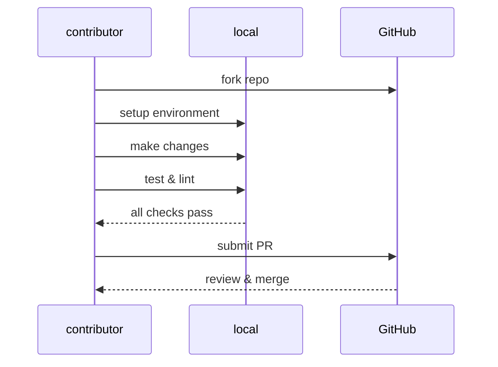

# Contribution guide

This guide covers the technical process for contributing to the
API Docs Glossary: forking the repository, setting up the
development environment, submitting pull requests,
and troubleshooting common issues.

**Contribution workflow**:



==========================================================================================

_For content standards, writing conventions, and formatting
requirements, visit the [Style Guide](style-guide.md)._

---

## Code of conduct

Please be respectful and constructive in all interactions.
This project follows standard open source etiquette.

## Pull request tips

1. Fork this repository to a personal [GitHub](https://github.com) account.
2. Build a local copy of the documentation from the fork:

   ```bash
      npm install
      npm start
   ```

3. Install [Vale](https://vale.sh/) in the development environment.
4. If using [VS Code](https://code.visualstudio.com/download), install extensions
[markdownlint](https://marketplace.visualstudio.com/items?itemName=DavidAnson.vscode-markdownlint)
and [Vale VS Code](https://marketplace.visualstudio.com/items?itemName=ChrisChinchilla.vale-vscode).
5. Test all changes locally before submitting a pull request.
6. Pull requests should be complete and self-contained. Don't submit
placeholder content or partial entries.
7. Ideally, pull requests should address an existing issue,
but this isn't required.
8. Don't submit pull requests with lint or Vale errors in
the content or code examples.

## Troubleshooting

### Documentation build fails locally

Make sure all software requirements installed correctly.
For example, ensure [Node.js](https://nodejs.org/en/download)
and [npm](https://docs.npmjs.com/downloading-and-installing-node-js-and-npm)
are up to date. Run `npm install` in the fork directory,
then attempt the build again.

### Vale or markdownlint extensions don't appear in VS Code

Install the extensions from
[the Visual Studio Code marketplace](https://marketplace.visualstudio.com/VSCode).
Reload VS Code (`Ctrl+R` on Windows/Linux, `Cmd+R` on Mac) after installation.

### Vale reports errors but the content appears correct

Check the `.vale.ini` configuration file in the repository root.
Use `vale .` to run Vale from the command line and observe
detailed error output.

### Pull request marked as having lint errors

Run `npm run lint` locally to identify errors before submission.
Most formatting issues can be auto-fixed with `npm run lint:fix`.

### Changes don't appear after pushing to GitHub

GitHub Pages can take a few minutes to rebuild and deploy.
Wait a few minutes, then refresh the site. Clear the browser cache
(`Ctrl+Shift+Delete` on Windows/Linux, `Cmd+Shift+Delete` on Mac)
if changes still don't appear.

## Related topics

- [Introduction](introduction.md)
- [Getting Started](getting-started.md)
- [Quick Reference](quick-reference.md)
- [Style Guide](style-guide.md)
