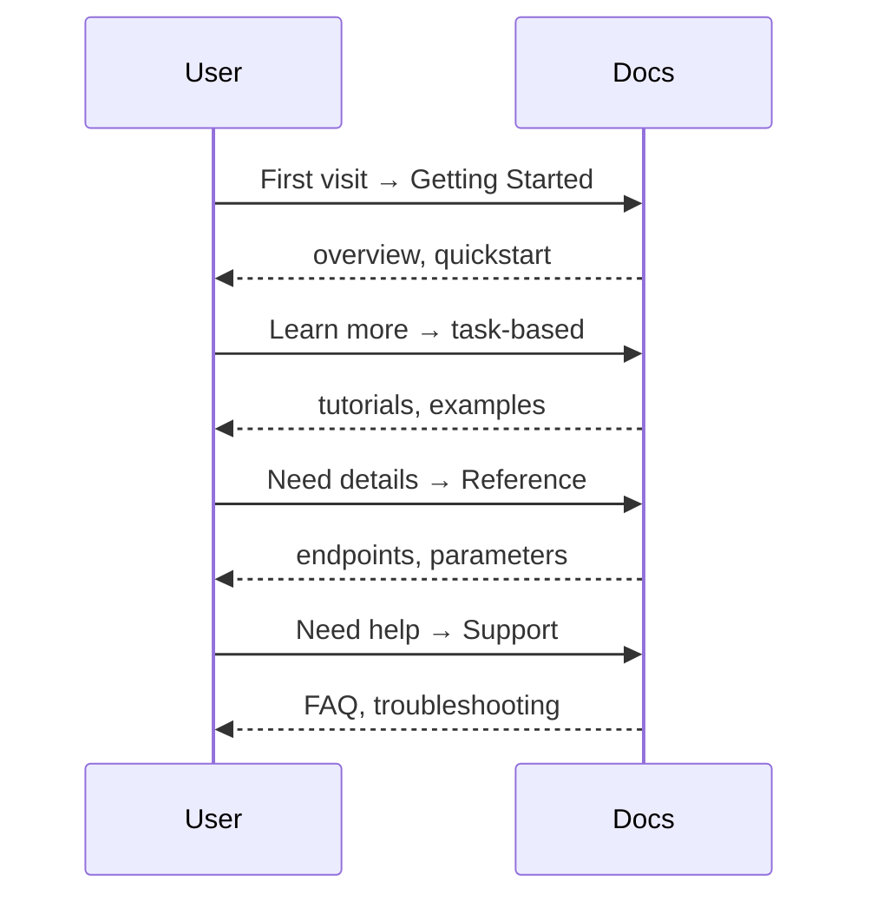
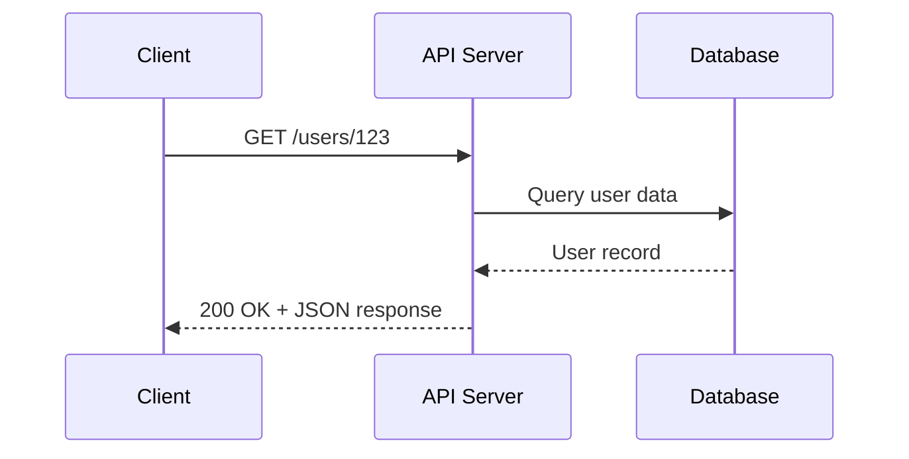

# Core concepts

Essential terms and concepts for API documentation. This section defines
the key terminology encountered when documenting REST APIs, from basic
architecture to documentation standards.

**API documentation stages and user journeys**:



## API fundamentals

### API

**Definition**: acronym for _application programming interface_

**Purpose**: enables resource sharing - how one program or service uses
the resources of another program or service, in which the resources
are program functions, data, or shared devices that with
other computers

**Every API description must describe**:

- **What the program wants**: procedure name, URL of resource
- **Where they want it from**: address/location of the procedure or resource
- **How they want it**: parameters to change or specify aspects of the request;
response must be predictable for the program to use it effectively

**Why documentation matters**:

- Acts as the contract between resources and programs using them
- Without documentation, crossing the interface likely fails
- Enables programmers to contruct correct code
- Prevents developers from needing to reverse-engineer, which is
often prohibited by license

**Related terms**:

- **Program**: sequence of instructions for a computer to perform,
often stored in a file
- **Interface**: program that runs on a computer and provides resources
for other computers, programs, or services, also known as
the server

**Source**: UW API Docs - Module 5, Lesson 1, "REST API Fundamentals"

---

### API security

**Definition**: measures taken to protect APIs from unauthorized access,
misuse, and attacks

**Why security matters**: APIs are commonly used to enable access to
sensitive software functions and data - in result, they're becoming an
increasingly desired target for attackers

#### Authentication

**Definition**: determines who you are - a technique invented
to overcome the weakness of shared credentials; an API
authentication key is commonly a long series of numbers and letters
that's included in a request header or request URL

#### Authorization

**Definition**: determines what you can do - confirms users are who
they claim to be by using techniques such as checking ID to
verify identity

**Source**: UW API Docs Intentional Outcomes, Canvas Forum Thread

---

### Hypertext Transfer Protocol (HTTP)

**Definition**: synchronous request/response protocol that enables
communication between clients and servers over the web; defines
message format and transmission type, and how web servers and
browsers should respond to a variety of commands

**Purpose**: HTTP forms the foundation of API communication;
understanding HTTP is essential for documenting API endpoints,
request methods- `GET`, `POST`, `PUT`, `DELETE` - status codes,
headers, and error handling; most RESTful APIs rely on HTTP
as their underlying protocol

**Example**: when a user submits a form on a website, the browser
sends an HTTP POST request to the server with the form data; the
server processes the request and returns an HTTP response with a
status code, such as `200` for success or `400` for a bad request,
and any relevant data

**Related Terms**: HTTPS, REST API, API endpoint, status codes,
request methods

**Source**: [IETF RFC 9110 - HTTP Semantics](https://www.rfc-editor.org/rfc/rfc9110.html)

---

### Hypertext Transfer Protocol Secure (HTTPS)

**Definition**: a secure version of HTTP that encrypts communication
between clients and servers using Transport Layer Security (TLS) or
its predecessor, Secure Sockets Layer (SSL); HTTPS protects data from
interception and tampering during transmission

**Purpose**: HTTPS is critical for API security documentation; all
modern APIs should use HTTPS to protect sensitive data like authentication
tokens, user credentials, and personal information; API documentation must
specify HTTPS endpoints and explain security requirements

**Example**: When users log into a banking app, their credentials travel
over HTTPS; the encrypted connection ensures that even if someone intercepts
the network traffic, they can't read the username, password, or account
information

**Related Terms**: HTTP, TLS/SSL, API security, authentication, encryption

**Source**: [IETF RFC 9110 - HTTP Semantics](https://www.rfc-editor.org/rfc/rfc9110.html)

---

### REST API

**Definition**: acronym for *RE*presentational State Transfer
application programming interface - one of the most widely used
approaches for building web-based APIs

**What it is**: an architectural style for distributed hypermedia systems,
first presented by Roy Fielding in 2000; REST is a convention,
not a regulated standard, used by APIs exposed through HTTP/HTTPS web
services to exchange data

**Key characteristics:**

- **Client-server architecture**: assumes "clients," resource users,
and "servers," resource providers
- **Stateless**: clients maintain the complete state of the interaction;
servers provide only self-contained resources
- **Cacheable**: resources saved locally to improve performance
- **Uniform interface**: standardized way of communicating between
client and server

**How REST APIs work**:

REST APIs use HTTP methods to perform actions on resources:

| HTTP Method | Resource Action |
|-------------|-----------------|
| GET | Read resource |
| POST | Create a new resource |
| PUT/PATCH | Update a resource |
| DELETE | Delete a resource |

**HTTP Protocol**: synchronous request/response protocol,
webhooks can support asynchronous interactions

**Resource identification**:

- **URI, Uniform Resource Identifier**: Identifies a resource,
but doesn't necessarily locate it
- **URL, Uniform Resource Locator**: Locates a resource on the web
and identifies what to access in your HTTP request, which
contains the how, where, and what

**Example request**:

```bash
GET http://localhost:3000/users/2
```

Breaking down this URL:

- **How:** Uses the `GET` method of the HTTP protocol
- **Where:** From `localhost:3000` server
- **What:** `users/2` instance of this resource



**Example response**:

`GET` requests a user resource, and the response body contains the
resource formatted as a JSON document:

```json
{
  "id": 2,
  "first_name": "Ferdinand",
  "last_name": "Smith",
  "email": "f.smith@example.com"
}
```

**JSON, JavaScript Object Notation**:

- Describes data using text characters in name-value pairs
- Consists of objects, arrays, properties, and values
- Objects contain properties; properties have values
- Values can be objects, arrays, numbers, Boolean values, or character strings
- Generally, a JSON document contains one object
- Note: JSON isn't the only format REST APIs can use

**Related Terms**: API, HTTP, HTTPS

**Sources**:

- UW API Docs - Module 5, Lesson 1, "REST API Fundamentals"
- [What is REST?](https://restfulapi.net/)

---

## Documentation-specific concepts

### API overview topic

**Definition**: also known as "the landing page" in which
the audience is everyone

**Common use cases**:

- **Not aware of API**: readers researching new options
or products
- **Aware of API**: readers looking for more specific
information

**Reader's goals**:

- Become aware of the product
- Learn more about the product
- Navigate to other documentation about the product

**Key characteristics**:

- A value proposition, a tagline
- Calls-to-action (CTA) as in "Get started," "Contact us,"
and/or "Learn more"
- Links to common destinations such as "Docs," "FAQ,"
"Reference," and/or "Support"

**When designing user-centered API overview topics**:

- Consider the audience and their goals, and consider
many users, use cases and goals
- How readers might use the overview topic, "might
adding or removing this content help the reader
achieve their goal?"
- Determine how visual design and branding might
be significant

| Topic Type | Reader Goal | Doc Task |
| --------- | --------- | ---------- |
| Overview, Landing Page | Awareness | Attract |
| First-use, Quickstart | Awareness | Attract |
| Tutorials, Examples | Adoption, Application | Exhibit, Apply |
| Conceptual | Learn | Teach |
| Reference | Delivery, Maintenance | Assist |

**Source**: UW API Docs - Module 6, Lesson 1, "API Documentation Overview Topics"

---

### API reference topic

**Definition**: also known as "getting finished topics" -
documentation that describes specific aspects of an API
operation or object

**Audience**: people using or considering using the API

**Common use cases**:

- **Quick reference**: API reference topics remember the details
so developers don't have to
- **Research**: determine the API's utility, usability, and
suitability

**Reader's goals**:

- Look up information and get back on task quickly
- Assess whether the API fits their needs

**Standard contents**:

| Element | Purpose |
| --------- | --------- |
| Title | Confirms you're in the right place |
| Endpoint or URL | How to call it |
| Description | What it does |
| Properties | What it contains |
| Property descriptions | Details about each property |
| Operations | Available actions, such as `GET`, `POST` |
| Examples | Sample requests and responses |
| Related links | Navigation to related topics |

**Related Terms**: API Overview Topic, OpenAPI Specification

**Source**: UW API Docs - Module 6, Lesson 1, "API Documentation Overview Topics"

---

### OpenAPI specification (OAS)

**Definition**: a standard, language-agnostic way to define
the interface of an HTTP API, allowing both humans and computers
to discover and understand the service's capabilities without
accessing source code, documentation, or inspecting network traffic

**Format**: YAML - human-readable data serialization language -
with a hierarchical collection of properties and values that describe
a REST API

**Purpose**: used to create both the interface and documentation, but,
the OAS document itself is neither implementation nor documentation -
it requires interpretation before it can become either

**Document structure:**

| Section | Purpose |
| --------- | --------- |
| `info` | Metadata about the specification document |
| `servers` | List of servers that support the API |
| `tags` | Tokens used to group and organize endpoints such as resource names |
| `security` | Security schemes used to restrict API access |
| `paths` | URL path segments and their operations |
| `components` | Reusable objects referenced throughout the document |

**Path properties:**

| Property | Description |
| ---------- | ------------- |
| `summary` | Short description; appears as the API operation name |
| `description` | Detailed explanation of the API and how to use it |
| `tags` | Groups similar paths together |
| `operationId` | Unique identifier for this operation |
| `parameters` | URL and query parameters - URL parameters appear in the path itself |
| `responses` | All possible HTTP responses for requests to this path |

**Related terms**: REST APIs, API Reference Topic

**Sources**:

- UW API Docs - Module 5, Lesson 2, "Open API specification (OAS) documents"
- [Wikipedia: YAML](https://en.wikipedia.org/wiki/YAML)

---

<!-- Todo: determine if these terms are needed
## Supporting technical concepts

### Request/response

### Endpoints

### Parameters

### Status codes
--->
