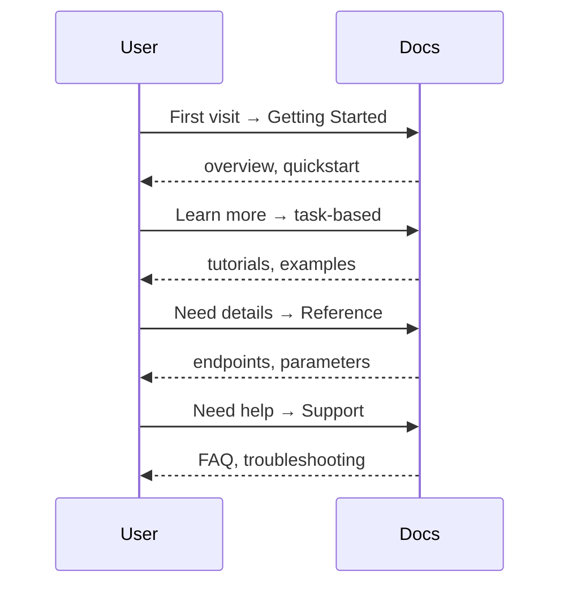
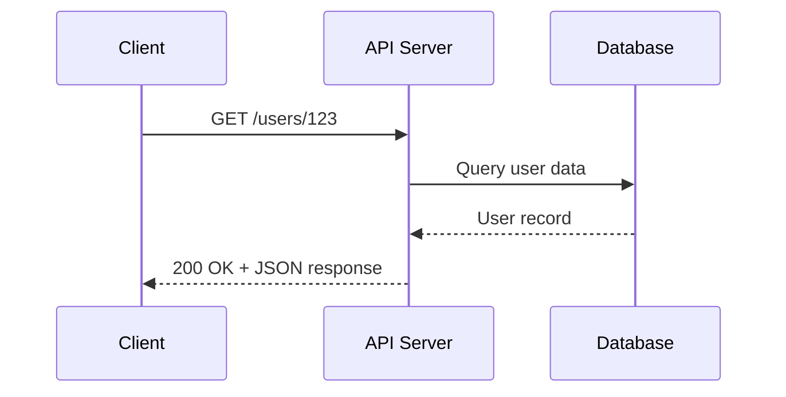

# Core Concepts
<!-- ignore this Vale capitalization error, see Style Guide #Headings-->

Essential terms and concepts for API documentation. This section defines
foundational terminology encountered when documenting APIs, from basic
architectural principles to documentation standards that apply across
different API types.

**API documentation stages and user journeys**:



---

## API Fundamentals
<!-- ignore this Vale capitalization error, see Style Guide #Headings-->

---

### API

**Definition**: acronym for _application programming interface_

**Purpose**: enables resource sharing - how one program or service uses
the resources of another program or service, in which the resources
are program functions, data, or shared devices that with
other computers

**Understanding API components**:

- **Program**: sequence of instructions for a computer to perform,
often stored in a file
- **Interface**: program that runs on a computer and provides resources
for other computers, programs, or services, also known as
the server

**Every API description must describe**:

- **What the program wants**: procedure name, URL of resource
- **Where they want it from**: address/location of the procedure or resource
- **How they want it**: parameters to change or specify aspects of the request;
response must be predictable for the program to use it effectively

**Why documentation matters**:

- Acts as the contract between resources and programs using them
- Without documentation, crossing the interface likely fails
- Enables programmers to contruct correct code
- Prevents developers from needing to reverse-engineer, which is
often prohibited by license

**Related Terms**: [API endpoint](#api-endpoint), [API security](#api-security),
[REST API](#rest-api)

**Source**: UW API Docs: Module 5, Lesson 1, "REST API Fundamentals"

---

### API endpoint

**Definition**: specific URL where an API can access resources;
the touchpoint where clients interact with the API server to perform operations

**Purpose**: define the structure of API requests and enable developers to access
specific resources or perform specific actions; each endpoint represents a distinct
function or resource in the API

**Key characteristics**:

- **URL structure**: combines base URL with resource path
- **HTTP method**: defines the operation - `GET`, `POST`, `PUT`, `DELETE`
- **Unique purpose**: each endpoint performs a specific function

**Example**:

```bash
https://api.example.com/v1/users/123
```

Breaking down this endpoint:

- **Base URL**: `https://api.example.com`
- **Version**: `/v1`
- **Resource path**: `/users/123`
- **Action**: determined by HTTP method
- `GET` retrieves user 123 while `DELETE` removes user 123

**Common endpoint patterns**:

| Pattern | Purpose | Example |
| --------- | --------- | --------- |
| `/resource` | Collection operations | `GET /users` lists all users |
| `/resource/{id}` | Single resource operations | `GET /users/123` retrieves one user |
| `/resource/{id}/subresource` | Related resources | `GET /users/123/orders` |

**Related Terms**: [API](#api), [HTTP](#hypertext-transfer-protocol-http),
[parameters](#parameters), [request/response](#requestresponse), [REST API](#rest-api)

**Source**: UW API Docs: Module 5, Lesson 1, "REST API Fundamentals"

---

### API security

**Definition**: measures taken to protect APIs from unauthorized access,
misuse, and attacks

**Why security matters**: APIs are commonly used to enable access to
sensitive software functions and data - in result, they're becoming an
increasingly desired target for attackers

#### authentication

**Definition**: determines who users are - a technique invented
to overcome the weakness of shared credentials; an API
authentication key is commonly a long series of numbers and letters
that's included in a request header or request URL

#### authorization

**Definition**: determines what users can do - confirms users are who
they claim to be by using techniques such as checking ID to
verify identity

**Related Terms**: [API](#api), [HTTPS](#hypertext-transfer-protocol-secure-https)

**Source**: UW API Docs "Intentional Outcomes," Canvas Forum Thread

---

### Hypertext Transfer Protocol (HTTP)

**Definition**: synchronous request/response protocol that enables
communication between clients and servers over the web; defines
message format and transmission type, and how web servers and
browsers should respond to a variety of commands

**Purpose**: HTTP forms the foundation of API communication;
understanding HTTP is essential for documenting API endpoints,
request methods- `GET`, `POST`, `PUT`, `DELETE` - status codes,
headers, and error handling; most RESTful APIs rely on HTTP
as their underlying protocol

**Example**: when a user submits a form on a website, the browser
sends an HTTP POST request to the server with the form data; the
server processes the request and returns an HTTP response with a
status code, such as `200` for success or `400` for a bad request,
and any relevant data

**Related Terms**: [API endpoint](#api-endpoint),
[HTTPS](#hypertext-transfer-protocol-http),
[HTTP status codes](#http-status-codes),
[REST API](#rest-api)

**Source**: [IETF RFC 9110 - HTTP Semantics](https://www.rfc-editor.org/rfc/rfc9110.html)

---

### Hypertext Transfer Protocol Secure (HTTPS)

**Definition**: secure version of HTTP that encrypts communication
between clients and servers using Transport Layer Security (TLS) or
its predecessor, Secure Sockets Layer (SSL); HTTPS protects data from
interception and tampering during transmission through encryption -
the process of encoding data so only authorized parties can read it

**Purpose**: HTTPS is critical for API security documentation; all
modern APIs should use HTTPS to protect sensitive data like authentication
tokens, user credentials, and personal information; API documentation must
specify HTTPS endpoints and explain security requirements

**Example**: when users log into a banking app, their credentials travel
over HTTPS; the encrypted connection ensures that even if someone
intercepts the network traffic, they can't read the username, password,
or account information

**Related Terms**: [API security](#api-security),
[HTTP](#hypertext-transfer-protocol-http),[authentication](#authentication)

**Source**: [IETF RFC 9110 - HTTP Semantics](https://www.rfc-editor.org/rfc/rfc9110.html)

---

### HTTP status codes

**Definition**: three-digit codes returned by servers in HTTP responses that
show whether a specific request succeeded or failed, and why

**Purpose**: status codes enable developers to handle different response
scenarios appropriately, add proper error handling, and debug API issues;
API documentation must explain which status codes an endpoint returns
and what they mean

**Status code categories**:

| Code Range | Category | Meaning |
| ------------ | ---------- | --------- |
| 1xx | Informational | Request received, continuing process |
| 2xx | Success | Request successfully received, understood, and accepted |
| 3xx | Redirection | Further action needed to complete the request |
| 4xx | Client Error | Request contains bad syntax and/or server can't process |
| 5xx | Server Error | Server failed to fulfill an apparently valid request |

**Common status codes**:

| Code | Label | Meaning |
| ------ | ------ | --------- |
| `200` | `OK` | Request succeeded |
| `201` | `Created` | New resource successfully created |
| `204` | `No Content` | Request succeeded but no content to return |
| `400` | `Bad Request` | Server can't process due to client error |
| `401` | `Unauthorized` | Authentication required or failed |
| `403` | `Forbidden` | Server understood but refuses to process |
| `404` | `Not Found` | Requested resource doesn't exist |
| `500` | `Internal Server Error` | Server encountered an unexpected condition |
| `503` | `Service Unavailable` | Server temporarily unable to handle request |

**Client requests a user that doesn't exist**:

```bash
GET https://api.example.com/users/999
```

**Response**:

```json
{
  "status": 404,
  "error": "Not Found",
  "message": "User with ID 999 does not exist"
}
```

**Related Terms**: [API endpoint](#api-endpoint),
[HTTP](#hypertext-transfer-protocol-http),
[request/response](#requestresponse), [REST API](#rest-api)

**Source**: [IETF RFC 9110 - HTTP Semantics](https://www.rfc-editor.org/rfc/rfc9110.html)

---

## idempotent

**Definition**: describes an operation that produces the same result
regardless of how many times it's executed; making the same request
many times has the same effect as making it once

**Purpose**: enables safe request retries without unintended
side effects; critical for network reliability when timeouts and/or
connection issues risk request duplication

**Example**: `DELETE /users/123` is idempotent as deleting the same user
many times results in the same state: "user deleted" - while `POST /users`
isn't idempotent, as posting the same user data many times creates
many user records

**HTTP methods & idempotency**:

| Method | Idempotent | Reason |
| ------ | ------ | ------ |
| `GET` | Yes | Reading data doesn’t change server state |
| `DELETE` | Yes | Deleting an already-deleted resource has same outcome |
| `PATCH` | Depends | Partial updates may or may not be idempotent based on implementation |
| `POST` | No | Creating resources many times produces different results |
| `PUT` | Yes | Replacing a resource with the same data produces identical result |

**Related Terms**: `DELETE`, `GET`, `HTTP method`, `PUT`

**Source**: [IETF RFC 9110 - HTTP Semantics: Section 9.2.2](https://www.rfc-editor.org/rfc/rfc9110.html#name-idempotent-methods)

---

### parameters

**Definition**: variables passed in API requests to specify or filter
the data returned, change behavior, or provide necessary information for
the operation

**Purpose**: parameters enable flexible, precise API requests without
requiring separate endpoints for every variation; API documentation must
describe each parameter's purpose, data type, whether it's required
or optional, and valid values

**Parameter types**:

| Type | Location | Purpose | Example |
| ------ | ---------- | --------- | --------- |
| Path parameters | In the URL path | Identify specific resources | `/users/{id}` |
| Query parameters | After `?` in URL | Filter, sort, or paginate results | `/users?role=admin&limit=10` |
| Header parameters | HTTP headers | Authentication, content type | `Authorization: Bearer token123` |
| Body parameters | Request body | Complex data for `POST/PUT` | JSON object with user details |

**Example using many parameter types**:

```bash
GET https://api.example.com/v1/users/123/orders?status=pending&limit=5
Authorization: Bearer abc123xyz
```

Breaking down the parameters:

- **Path parameter**: `123` - user ID
- **Query parameters**: `status=pending` and `limit=5`
- **Header parameter**: `Authorization: Bearer abc123xyz`

**Documentation requirements for each parameter**:

- Name and data type - string, integer, boolean
- Whether it's required or optional
- Valid values or format
- Default value if applicable
- Description of what it does

**Related Terms**: [API endpoint](#api-endpoint),
[request/response](#requestresponse), [REST API](#rest-api)

**Source**: UW API Docs: Module 5, Lesson 1, "REST API Fundamentals"

---

### request/response

**Definition**: the two-part communication pattern in API interactions
where a client sends a request to a server and receives a response

**Purpose**: understanding the request/response cycle is fundamental
to using and documenting APIs; documentation must show what requests
look like, what data to include, and what responses to expect

**Request components**:

| Component | Description | Example |
| ----------- | ------------- | --------- |
| HTTP method | Action to perform | `GET`, `POST`, `PUT`, `DELETE` |
| Endpoint URL | Resource location | `https://api.example.com/users` |
| Headers | Metadata about the request | `Content-Type: application/json` |
| Body | Data sent with request - `POST/PUT` | JSON object |
| Parameters | Request specifications | Query or path parameters |

**Response components**:

| Component | Description | Example |
| ----------- | ------------- | --------- |
| Status code | Outcome of the request | `200`, `404`, `500` |
| Headers | Metadata about the response | `Content-Type: application/json` |
| Body | Data returned from server | JSON object |

**Example request**:

```bash
POST https://api.example.com/users
Content-Type: application/json
Authorization: Bearer token123

{
  "first_name": "Jane",
  "last_name": "Doe",
  "email": "jane.doe@example.com"
}
```

**Example response**:

```bash
HTTP/1.1 201 Created
Content-Type: application/json

{
  "id": 456,
  "first_name": "Jane",
  "last_name": "Doe",
  "email": "jane.doe@example.com",
  "created_at": "2025-12-30T10:30:00Z"
}
```

**Related Terms**: [API endpoint](#api-endpoint),
[HTTP](#hypertext-transfer-protocol-http),
[HTTP status codes](#http-status-codes),
[parameters](#parameters), [REST API](#rest-api)

**Source**: UW API Docs: Module 5, Lesson 1, "REST API Fundamentals"

---

### schema (Schema Object)

**Definition**: also know as the Schema Object, the formal definition that
describes the structure, data types, constraints, and relationships within
an API's requests and responses

**Purpose**: enables validation, auto-generated documentation, and type
safety; helps both API providers and consumers understand exactly what
data format to expect

**Example**: an OpenAPI schema defines that a `POST` `/users` endpoint
requires a request body with string type for email field and integer type
for age field

**Related Terms**: [API](#api), [API endpoint](#api-endpoint),
[GraphQL API](api-types-architectures.md#graphql-api),
[OpenAPI specification](#openapi-specification-oas),
[request/response](#requestresponse), validation

**Sources**:

- [Geeks for Geeks: "What is API Schema?"](https://www.geeksforgeeks.org/websites-apps/what-is-api-schema/)
- [OpenAPI Initiative, Specification v3.2.0: "Schema Object"](https://spec.openapis.org/oas/latest.html#schema-object)

---

### serialization

**Definition**: the process of converting data structures and/or objects
into a format appropriate for network transmission or storage,
then reconstructed later

**Purpose**: enables data exchange between systems by transforming
programming language objects into formats like JSON, XML, or binary
that can travel across network boundaries

**Example**: serializing a JavaScript user object `{name: "Alice", age: 30}`
into JSON string `{"name":"Alice", "age":30}` before sending it in an
API request

**Related Terms**: [JSON](#javascript-object-notation-json),
[protocol buffers](tools-techniques.md#protocol-buffers),
[XML](tools-techniques.md#xml)

**Source**: [Mozilla Corporation, MDN: "Serialization"](https://developer.mozilla.org/en-US/docs/Glossary/Serialization)

---

### REST API

**Definition**: acronym for *RE*presentational State Transfer
application programming interface - one of the most widely used
approaches for building web-based APIs

**REST isn't a regulated standard**, but an architectural style for
distributed hypermedia systems, first presented by Roy Fielding in 2000;
REST is a convention, used by APIs exposed through HTTP/HTTPS web
services to exchange data

**Key characteristics**:

- **Client-server architecture**: assumes "clients," resource users,
and "servers," resource providers
- **Stateless**: clients maintain the complete state of the interaction;
servers provide only self-contained resources
- **Cacheable**: resources saved locally to improve performance
- **Uniform interface**: standardized way of communicating between
client and server

**REST APIs use HTTP methods**:

| HTTP Method | Resource Action |
| ------------- | ----------------- |
| `GET` | Read resource |
| `POST` | Create a new resource |
| `PUT/PATCH` | Update a resource |
| `DELETE` | Remove a resource |

#### HTTP protocol

- synchronous request/response protocol
- webhooks can support asynchronous interactions
- visit full term entries [HTTP](#hypertext-transfer-protocol-http)
and [HTTPS](#hypertext-transfer-protocol-secure-https)
for more information

#### Uniform Resource Identifier (URI)

- resource identification concept
- identifies a resource, but doesn't necessarily locate it

#### Uniform Resource Locator (URL)

- resource identification concept
- locates a resource on the web and identifies what to access
in the HTTP request
- contains the how, where, and what

**Example request**:

```bash
GET http://localhost:3000/users/2
```

Breaking down this URL:

- **How:** Uses the `GET` method of the HTTP protocol
- **Where:** From `localhost:3000` server
- **What:** `users/2` instance of this resource



**Example response**:

`GET` requests a user resource, and the response body contains the
resource formatted as a JSON document:

```json
{
  "id": 2,
  "first_name": "Ferdinand",
  "last_name": "Smith",
  "email": "f.smith@example.com"
}
```

#### JavaScript Object Notation (JSON)

- describes data using text characters in name-value pairs
- consists of objects, arrays, properties, and values
- objects contain properties; properties have values
- values can be objects, arrays, numbers, Boolean values,
or character strings
- generally, a JSON document contains one object
- _**note**: JSON isn't the only format REST APIs can use_

**Related Terms**: [API](#api), [API endpoint](#api-endpoint),
[HTTP](#hypertext-transfer-protocol-http),
[HTTP status codes](#http-status-codes),
[parameters](#parameters), [request/response](#requestresponse)

**Sources**:

- UW API Docs: Module 5, Lesson 1, "REST API Fundamentals"
- [RESTful API: "What is REST?" by Lokesh Gupta](https://restfulapi.net/)

---

### REST vs *REST*ful

**Definition**: terms are often used interchangeably, though technically
"REST" refers to the architectural style itself while "RESTful"
describes APIs that follow REST principles; in practice, both terms
describe APIs that use HTTP methods, stateless communication, and
resource-based URLs

**Purpose**: understanding this distinction helps API documentation
writers use consistent terminology; while some sources differentiate
between the two, most modern API documentation treats them as synonyms;
what matters is plainly explaining whether an API follows REST
architectural constraints rather than debating terminology

**Example**: documentation might say "this RESTful API uses HTTP methods"
or "this REST API returns JSON responses" - both are acceptable; the key
is explaining the API's behavior: stateless requests, resource-based
endpoints like `/users/123`, standard HTTP methods - `GET`, `POST`, `PUT`,
`DELETE`

**Related Terms**: [API endpoint](#api-endpoint), [HTTP](#hypertext-transfer-protocol-http),
[REST API](#rest-api)

**Sources**:

- [RESTful API: "What is REST?" by Lokesh Gupta](https://restfulapi.net/)
- [Roy Thomas Fielding's University of California Dissertation: Chapter 5 - "Representational State Transfer (REST)"](https://roy.gbiv.com/pubs/dissertation/rest_arch_style.htm)

---

## Documentation-specific Concepts
<!-- ignore this Vale capitalization error, see Style Guide #Headings-->

### API overview topic

**Definition**: also known as "the landing page" in which
the audience is everyone

**Common use cases**:

- **Not aware of API**: readers researching new options
or products
- **Aware of API**: readers looking for more specific
information

**Reader's goals**:

- Become aware of the product
- Learn more about the product
- Navigate to other documentation about the product

**Key characteristics**:

- A value proposition, a tagline
- Calls-to-action (CTA) as in "Get started," "Contact us,"
and/or "Learn more"
- Links to common destinations such as "Docs," "FAQ,"
"Reference," and/or "Support"

**When designing user-centered API overview topics**:

- Consider the audience and their goals, and consider
many users, use cases and goals
- How readers might use the overview topic, "might
adding or removing this content help the reader
achieve their goal?"
- Determine how visual design and branding might
be significant

| Topic Type | Reader Goal | Doc Task |
| --------- | --------- | ---------- |
| Overview, Landing Page | Awareness | Attract |
| First-use, Quickstart | Awareness | Attract |
| Tutorials, Examples | Adoption, Application | Exhibit, Apply |
| Conceptual | Learn | Teach |
| Reference | Delivery, Maintenance | Assist |

**Related Terms**: [API reference topic](#api-reference-topic),
[market](frameworks-strategy.md#market),
[sales collateral](frameworks-strategy.md#sales-collateral)

**Source**: UW API Docs: Module 6, Lesson 1, "API Documentation Overview Topics"

---

### API reference topic

**Definition**: also known as "getting finished topics" -
documentation that describes specific aspects of an API
operation or object

**Audience**: people using or considering using the API

**Common use cases**:

- **Quick reference**: API reference topics remember the details
so developers don't have to
- **Research**: determine the API's utility, usability, and
suitability

**Reader's goals**:

- Look up information and get back on task quickly
- Assess whether the API fits their needs

**Standard contents**:

| Element | Purpose |
| --------- | --------- |
| Title | Confirms you're in the right place |
| Endpoint or URL | How to call it |
| Description | What it does |
| Properties | What it contains |
| Property descriptions | Details about each property |
| Operations | Available actions, such as `GET`, `POST` |
| Examples | Sample requests and responses |
| Related links | Navigation to related topics |

**Related Terms**: [API overview topic](#api-overview-topic),
[OpenAPI specification (OAS)](#openapi-specification-oas)

**Source**: UW API Docs: Module 6, Lesson 1, "API Documentation Overview Topics"

---

### OpenAPI specification (OAS)

**Definition**: a standard, language-agnostic way to define
the interface of an HTTP API, allowing both humans and computers
to discover and understand the service's capabilities without
accessing source code, documentation, or inspecting network traffic

**Format**: YAML - human-readable data serialization language -
with a hierarchical collection of properties and values that describe
a REST API

**Purpose**: used to create both the interface and documentation, but,
the OAS document itself is neither implementation nor documentation -
it requires interpretation before it can become either

**Document structure:**

| Section | Purpose |
| --------- | --------- |
| `info` | Metadata about the specification document |
| `servers` | List of servers that support the API |
| `tags` | Tokens used to group and organize endpoints such as resource names |
| `security` | Security schemes used to restrict API access |
| `paths` | URL path segments and their operations |
| `components` | Reusable objects referenced throughout the document |

**Path properties:**

| Property | Description |
| ---------- | ------------- |
| `summary` | Short description; appears as the API operation name |
| `description` | Detailed explanation of the API and how to use it |
| `tags` | Groups similar paths together |
| `operationId` | Unique identifier for this operation |
| `parameters` | URL and query parameters - URL parameters appear in the path itself |
| `responses` | All possible HTTP responses for requests to this path |

**Related terms**: [API](#api), [API reference topic](#api-reference-topic),
[REST API](#rest-api), [schema (Schema Object)](#schema-schema-object)

**Sources**:

- UW API Docs: Module 5, Lesson 2, "Open API specification (OAS) documents"
- [Wikipedia: YAML](https://en.wikipedia.org/wiki/YAML)

---
