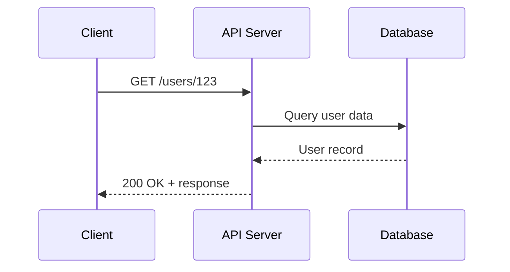

# Core Concepts
<!-- ignore this Vale capitalization error, see Style Guide #Headings-->

Essential terms and concepts for API documentation. This section defines
foundational terminology encountered when documenting APIs, from basic
architectural principles to documentation standards that apply across
different API types.

---

## API Fundamentals
<!-- ignore this Vale capitalization error, see Style Guide #Headings-->

---

### API

**Definition**: acronym for _application programming interface_

- **Application**: software for end-users -
not operating, administering or programming a computer
- **Program**: sequence of instructions for a computer to perform,
often stored in a file
- **Interface**: program that runs on a computer and provides resources
for other computers, programs, or services, also known as
the server

**Purpose**: enables resource sharing - how one program or service uses
the resources of another program or service, in which the resources
are program functions, data, or shared devices that with
other computers

**Every API description must describe**:

- _What the program wants_: procedure name, URL of resource
- _Where they want it from_: address/location of the procedure or resource
- _How they want it_: parameters to change or specify aspects of the request;
response must be predictable for the program to use it effectively

**Why documentation matters**:

- acts as the contract between resources and programs using them
- without documentation, crossing the interface likely fails
- enables programmers to contruct correct code
- prevents developers from needing to reverse-engineer, which is
often prohibited by license

**Example API request/response flow**:



**Related Terms**: [API endpoint](#api-endpoint),
[API gateway](api-types-architectures.md#api-gateway),
[API security](#api-security), [REST API](api-types-architectures.md#rest-api)

**Source**: UW API Docs: Module 5, Lesson 1, "REST API Fundamentals"

---

### API endpoint

**Definition**: specific URL where an API can access resources;
the touchpoint where clients interact with the API server to perform operations

**Purpose**: define the structure of API requests and enable developers to access
specific resources or perform specific actions; each endpoint represents a distinct
function or resource in the API

**Key characteristics**:

- **URL structure**: combines base URL with resource path
- **HTTP method**: defines the operation - `GET`, `POST`, `PUT`, `DELETE`
- **Unique purpose**: each endpoint performs a specific function

**Example**:

```bash
https://api.example.com/v1/users/123
```

Breaking down this endpoint:

- **Base URL**: `https://api.example.com`
- **Version**: `/v1`
- **Resource path**: `/users/123`
- **Action**: determined by HTTP method
- `GET` retrieves user 123 while `DELETE` removes user 123

**Common endpoint patterns**:

| Pattern | Purpose | Example |
| --------- | --------- | --------- |
| `/resource` | Collection operations | `GET /users` lists all users |
| `/resource/{id}` | Single resource operations | `GET /users/123` retrieves one user |
| `/resource/{id}/subresource` | Related resources | `GET /users/123/orders` |

**Related Terms**: [API](#api), [HTTP](core-concepts.md#http),
[HTTP method](#http-method), [parameters](#parameters), [request/response](#requestresponse),
[resource](core-concepts.md#resource), [REST API](api-types-architectures.md#rest-api)

**Source**: UW API Docs: Module 5, Lesson 1, "REST API Fundamentals"

---

### API security

**Definition**: measures taken to protect APIs from unauthorized access,
misuse, and attacks

**Why security matters**: APIs are commonly used to enable access to
sensitive software functions and data - in result, they're becoming an
increasingly desired target for attackers

#### authentication

**Definition**: determines who users are - a technique invented
to overcome the weakness of shared credentials; an API
authentication key is commonly a long series of numbers and letters
that's included in a request header or request URL

#### authorization

**Definition**: determines what users can do - confirms users are who
they claim to be by using techniques such as checking ID to
verify identity

**Related Terms**: [API](#api), [error handling](#error-handling),
[HTTPS](core-concepts.md#https), [rate limiting](#rate-limiting),
[validation](#validation)

**Source**: UW API Docs "Intentional Outcomes," Canvas Forum Thread

---

### CRUD

**Definition**: acronym for "Create, Read, Update, Delete"; the four basic
operations for persistent storage and data management in APIs

**Purpose**: provides a standard framework for API operations that maps
directly to HTTP methods, making API design intuitive and predictable;
CRUD operations form the foundation of most REST API interactions

**HTTP method mapping**:

| CRUD Operation | HTTP Method | Action | Example |
| -------------- | ----------- | ------ | ------- |
| Create | `POST` | Add new resource | `POST /users` creates a new user |
| Read | `GET` | Retrieve resource | `GET /users/123` retrieves user 123 |
| Update | `PUT` or `PATCH` | Change resource | `PUT /users/123` edits entire user record |
| Delete | `DELETE` | Remove resource | `DELETE /users/123` removes user 123 |

**Example**: a typical CRUD API for managing blog posts supports creating
new posts via `POST /posts`, reading posts via `GET /posts/{id}`, updating
posts via `PUT /posts/{id}`, and deleting posts via `DELETE /posts/{id}`

**Related Terms**: [`DELETE`](#delete), [`GET`](#get), [HTTP method](#http-method),
[`PATCH`](#patch), [`POST`](#post), [`PUT`](#put), [resource](#resource),
[REST API](api-types-architectures.md#rest-api)

**Sources**:

- [Mozilla Corporation, MDN: "HTTP request methods"](https://developer.mozilla.org/en-US/docs/Web/HTTP/Methods)
- UW API Docs: Module 2, Lesson 5: "Create a Master Prompt"

---

### `DELETE`

**Definition**: HTTP method that requests removal of a specified
resource from the server

**Purpose**: enables clients to delete records, remove files, or
clean up resources through standardized HTTP operations

**Example**: sending `DELETE /api/users/123` removes the user account
with ID 123 from the system

**Related Terms**: [`GET`](#get), [HTTP method](#http-method),
[`PATCH`](#patch), [`POST`](#post), [`PUT`](#put)

**Source**: [Mozilla Corporation, MDN: "`DELETE` request method"](https://developer.mozilla.org/en-US/docs/Web/HTTP/Methods/DELETE)

---

### error handling

**Definition**: the process of anticipating, detecting, and responding
to errors that occur during API operations; includes both how the API
communicates errors and how clients should handle them

**Purpose**: enables developers to build robust applications that
gracefully handle failures, provide meaningful feedback to users, and
recover from issues; good error handling documentation explains which
errors can occur, what they mean, and how to resolve them

**Example**: when a client sends invalid data in a `POST` request,
the API returns a `400 Bad Request` status code with a JSON response
body that specifies which fields are invalid and why:

**Common Pattern**:

```json
{
  "error": "Bad Request",
  "message": "Invalid email format"
}
```

_**Note**: This is the most widely used format, though field names vary
`error`, `code`, `message`, etc._

**RFC 9457:**

```json
{
  "type": "https://api.example.com/errors/validation-error",
  "title": "Validation Error",
  "status": 400,
  "detail": "Invalid email format",
  "instance": "/users/123"
}
```

_**Note**: This is a standardized format that provides machine-
readable error types and more context; uses `application/problem+json`
media type; less common but increasingly adopted by modern APIs;
only required field is `type`, defaults to `"about:blank"`_

**Related Terms**: [API](#api), [HTTP status codes](#http-status-codes),
[JSON](#json), [rate limiting](#rate-limiting), [validation](#validation)

**Sources**:

- [Baeldung: "Best Practices for REST API Error Handling"](https://www.baeldung.com/rest-api-error-handling-best-practices)
- [IETF RFC 9457 - Problem Details for HTTP APIs](https://www.rfc-editor.org/rfc/rfc9457.html)
- [Mozilla Corporation, MDN: "HTTP response status codes"](https://developer.mozilla.org/en-US/docs/Web/HTTP/Status)

---

### `GET`

**Definition**: HTTP method that requests data from a server without
modifying any resources; the most common method for retrieving information

**Purpose**: enables clients to read data, view resources, or query information
while ensuring the request remains safe and idempotent

**Example**: sending `GET /api/users/123` retrieves information about the
user with ID 123 without changing any data

**Related Terms**: [`DELETE`](#delete), [HTTP method](#http-method),
[idempotent](#idempotent), [`PATCH`](#patch), [`POST`](#post), [`PUT`](#put)

**Source**: [Mozilla Corporation, MDN: "`GET` request method"](https://developer.mozilla.org/en-US/docs/Web/HTTP/Methods/GET)

---

### HTTP

**Definition**: acronym for Hypertext Transfer Protocol;
synchronous request/response protocol that enables communication
between clients and servers over the web; defines message format
and transmission type, and how web servers and browsers should
respond to a variety of commands

**Purpose**: HTTP forms the foundation of API communication;
understanding HTTP is essential for documenting API endpoints,
request methods- `GET`, `POST`, `PUT`, `DELETE` - status codes,
headers, and error handling; most RESTful APIs rely on HTTP
as their underlying protocol

**Example**: when a user submits a form on a website, the browser
sends an HTTP POST request to the server with the form data; the
server processes the request and returns an HTTP response with a
status code, such as `200` for success or `400` for a bad request,
and any relevant data

**Related Terms**: [API endpoint](#api-endpoint),
[error-handling](#error-handling), [HTTPS](core-concepts.md#https),
[HTTP status codes](#http-status-codes), [HTTP versions](#http-versions),
[REST API](api-types-architectures.md#rest-api)

**Source**: [IETF RFC 9110 - HTTP Semantics](https://www.rfc-editor.org/rfc/rfc9110.html)

---

### HTTP method

**Definition**: verb that indicates the desired action to perform
on a resource in an HTTP request; defines what operation the client
wants the server to execute

**Purpose**: provides standardized semantics for API operations,
making it clear whether a request reads, creates, updates, or
deletes data

**Example**: REST APIs use methods like `GET` for reading,
`POST` for creating, `PATCH` for editing specific fields, `PUT` for
updating whole resources, and `DELETE` for removing resources

**Related Terms**: [CRUD](#crud), [`DELETE`](#delete), [`GET`](#get),
[HTTP](core-concepts.md#http), [`PATCH`](#patch),
[`POST`](#post), [`PUT`](#put)

**Source**: [Mozilla Corporation, MDN: "HTTP request methods"](https://developer.mozilla.org/en-US/docs/Web/HTTP/Methods)

---

### HTTPS

**Definition**: acronym for Hypertext Transfer Protocol Secure;
encrypts communication between clients and servers using Transport
Layer Security - TLS, or its predecessor, Secure Sockets Layer - SSL;
HTTPS protects data from interception and tampering during transmission
through encryption - the process of encoding data so only authorized
parties can read it

**Purpose**: HTTPS is critical for API security documentation; all
modern APIs should use HTTPS to protect sensitive data like authentication
tokens, user credentials, and personal information; API documentation must
specify HTTPS endpoints and explain security requirements

**Security Note**: while HTTPS provides security, it's not an API security
_measure_ or _technique_, but a protocol implementation; security is one
aspect of HTTPS, but not its defining characteristic

**Example**: when users log into a banking app, their credentials travel
over HTTPS; the encrypted connection ensures that even if someone
intercepts the network traffic, they can't read the username, password,
or account information

**Related Terms**: [API security](#api-security), [authentication](#authentication),
[HTTP](core-concepts.md#http), [HTTP versions](#http-versions)

**Source**: [IETF RFC 9110 - HTTP Semantics](https://www.rfc-editor.org/rfc/rfc9110.html)

---

### HTTP status codes

**Definition**: three-digit codes returned by servers in HTTP responses that
show whether a specific request succeeded or failed, and why

**Purpose**: status codes enable developers to handle different response
scenarios appropriately, add proper error handling, and debug API issues;
API documentation must explain which status codes an endpoint returns
and what they mean

**Status code categories**:

| Code Range | Category | Meaning |
| ------------ | ---------- | --------- |
| 1xx | Informational | Request received, continuing process |
| 2xx | Success | Request successfully received, understood, and accepted |
| 3xx | Redirection | Further action needed to complete the request |
| 4xx | Client Error | Request contains bad syntax and/or server can't process |
| 5xx | Server Error | Server failed to fulfill an apparently valid request |

**Common status codes**:

| Code | Label | Meaning |
| ------ | ------ | --------- |
| `200` | `OK` | Request succeeded |
| `201` | `Created` | New resource successfully created |
| `204` | `No Content` | Request succeeded but no content to return |
| `400` | `Bad Request` | Server can't process due to client error |
| `401` | `Unauthorized` | Authentication required or failed |
| `403` | `Forbidden` | Server understood but refuses to process |
| `404` | `Not Found` | Requested resource doesn't exist |
| `500` | `Internal Server Error` | Server encountered an unexpected condition |
| `503` | `Service Unavailable` | Server temporarily unable to handle request |

**Client requests a user that doesn't exist**:

```bash
GET https://api.example.com/users/999
```

**Response**:

```json
{
  "status": 404,
  "error": "Not Found",
  "message": "User with ID 999 does not exist"
}
```

**Related Terms**: [API endpoint](#api-endpoint), [HTTP](core-concepts.md#http),
[rate limiting](#rate-limiting), [request/response](#requestresponse),
[REST API](api-types-architectures.md#rest-api), [validation](#validation)

**Source**: [IETF RFC 9110 - HTTP Semantics](https://www.rfc-editor.org/rfc/rfc9110.html)

---

### HTTP versions

**Definition**: iterations of the Hypertext Transfer Protocol
with different performance and feature capabilities;
HTTP/1.1 (1997) uses sequential requests, HTTP/2 (2015) enables
concurrent requests over one connection, HTTP/3 (2022) uses
QUIC protocol - originally "Quick UDP Internet Connections," now
just QUIC - for improved reliability

**Purpose**: understanding version differences helps explain
why certain API architectures like gRPC require specific HTTP
versions for their performance characteristics

**Example**: a gRPC API requires HTTP/2 because it relies on
features like multiplexing and bidirectional streaming that aren't
available in HTTP/1.1

**Related Terms**: [gRPC API](api-types-architectures.md#grpc-api),
[HTTP](core-concepts.md#http), [HTTPS](core-concepts.md#https),
[REST API](api-types-architectures.md#rest-api)

**Source**: [IETF RFC 9110 - HTTP Semantics](https://www.rfc-editor.org/rfc/rfc9110.html)

---

### idempotent

**Definition**: describes an operation that produces the same result
regardless of how many times it's executed; making the same request
many times has the same effect as making it once

**Purpose**: enables safe request retries without unintended
side effects; critical for network reliability when timeouts and/or
connection issues risk request duplication

**Example**: `DELETE /users/123` is idempotent as deleting the same user
many times results in the same state: "user deleted" - while `POST /users`
isn't idempotent, as posting the same user data many times creates
many user records

**HTTP methods & idempotency**:

| Method | Idempotent | Reason |
| ------ | ------ | ------ |
| `DELETE` | Yes | Deleting an already-deleted resource has same outcome |
| `GET` | Yes | Reading data doesn’t change server state |
| `PATCH` | Depends | Partial updates may or may not be idempotent based on implementation |
| `POST` | No | Creating resources many times produces different results |
| `PUT` | Yes | Replacing a resource with the same data produces identical result |

**Related Terms**: [`DELETE`](#delete), [`GET`](#get),
[HTTP method](#http-method), [`POST`](#post), [`PUT`](#put)

**Source**: [IETF RFC 9110 - HTTP Semantics: Section 9.2.2](https://www.rfc-editor.org/rfc/rfc9110.html#name-idempotent-methods)

---

### JSON

**Definition**: acronym for JavaScript Object Notation; a lightweight,
text-based data format that uses human-readable key-value pairs to
represent structured data

**Purpose**: provides an efficient way to exchange data between
clients and servers; JSON has become the dominant format for modern
REST APIs due to its readability, compact size, and native compatibility
with JavaScript

**Key characteristics**:

- Objects: collections of key-value pairs enclosed in curly braces `{}`
- Arrays: ordered lists of values enclosed in square brackets `[]`
- Values: can be strings, numbers, booleans, `null`, objects, or arrays
- Properties: keys that identify values within objects

**Example**:

```json
{
  "id": 123,
  "firstName": "Jane",
  "lastName": "Doe",
  "email": "jane.doe@example.com",
  "active": true,
  "roles": ["user", "admin"],
  "address": {
    "street": "123 Main St",
    "city": "Seattle",
    "state": "WA"
  }
}
```

**Common API use cases**:

| Use Case | Example |
| -------- | -------- |
| Request body | Sending data in `POST` or `PUT` requests |
| Response body | Returning data from API endpoints |
| Configuration | Storing API settings and options |
| Error messages | Structured error information |

**Related Terms**: [payload](#payload),
[REST API](api-types-architectures.md#rest-api),
[serialization](#serialization),
[XML](tools-techniques.md#xml)

**Source**: [JSON.org: "Introducing JSON"](https://www.json.org/)

---

### parameters

**Definition**: variables passed in API requests to specify or filter
the data returned, change behavior, or provide necessary information for
the operation

**Purpose**: parameters enable flexible, precise API requests without
requiring separate endpoints for every variation; API documentation must
describe each parameter's purpose, data type, whether it's required
or optional, and valid values

**Parameter types**:

| Type | Location | Purpose | Example |
| ------ | ---------- | --------- | --------- |
| Path parameters | In the URL path | Identify specific resources | `/users/{id}` |
| Query parameters | After `?` in URL | Filter, sort, or paginate results | `/users?role=admin&limit=10` |
| Header parameters | HTTP headers | Authentication, content type | `Authorization: Bearer token123` |
| Body parameters | Request body | Complex data for `POST/PUT` | JSON object with user details |

**Example using many parameter types**:

```bash
GET https://api.example.com/v1/users/123/orders?status=pending&limit=5
Authorization: Bearer abc123xyz
```

Breaking down the parameters:

- **Path parameter**: `123` - user ID
- **Query parameters**: `status=pending` and `limit=5`
- **Header parameter**: `Authorization: Bearer abc123xyz`

**Documentation requirements for each parameter**:

- Name and data type - string, integer, boolean
- Whether it's required or optional
- Valid values or format
- Default value if applicable
- Description of what it does

**Related Terms**: [API endpoint](#api-endpoint),
[request/response](#requestresponse), [REST API](api-types-architectures.md#rest-api)

**Source**: UW API Docs: Module 5, Lesson 1, "REST API Fundamentals"

---

### payload

**Definition**: the actual data transmitted in an API request or response
body, excluding headers and metadata; contains the information sent
and/or received

**Purpose**: distinguishes the meaningful content from the technical
transmission details; understanding payload structure is essential for API
documentation as it defines what data clients send and receive

**Example**: in a `POST /users` request, the payload contains the data
required to create a user:

```json
{
  "firstName": "Alice",
  "lastName": "Smith",
  "email": "alice@example.com",
  "role": "developer"
}
```

**Common payload formats**:

| Format | Use Case | Example |
| ------ | -------- | ------- |
| JSON | Most REST APIs | `{"name": "value"}` |
| XML | Legacy systems, SOAP | `<name>value</name>` |
| Form data | File uploads, form submissions | `name=value&email=user@example.com` |
| Binary | File transfers, images | Raw bytes |

**Related Terms**: [HTTP method](#http-method), [JSON](#json),
[request/response](#requestresponse), [REST API](api-types-architectures.md#rest-api),
[serialization](#serialization), [XML](tools-techniques.md#xml)

**Sources**:

- [Mozilla Corporation, MDN: "HTTP Messages"](https://developer.mozilla.org/en-US/docs/Web/HTTP/Messages)
- UW API Docs: Module 2, Lesson 5: "Create a Master Prompt"

---

### `PATCH`

**Definition**: HTTP method that applies partial modifications to
an existing resource; sends only the fields that need updates
rather than the entire resource

**Purpose**: enables clients to update specific fields of a resource
efficiently without sending unchanged data; reduces bandwidth usage
and streamlines updates when only a few fields need modification

**Example**: sending `PATCH /api/users/123` with a JSON body
containing `{"email": "newemail@example.com"}` updates only the email
field of user 123, leaving other fields like `name` and
`phone_number` unchanged

**Related Terms**: [`DELETE`](#delete), [`GET`](#get), [HTTP method](#http-method),
[`POST`](#post), [`PUT`](#put)

**Source**: [Mozilla Corporation, MDN: "`PATCH` request method"](https://developer.mozilla.org/en-US/docs/Web/HTTP/Methods/PATCH)

---

### `POST`

**Definition**: HTTP method that submits data to a server to create
new resources or trigger actions; submission data typically
includes a request body

**Purpose**: enables clients to add new records, submit forms,
upload files, or execute operations that change server state

**Example**: sending `POST /api/users` with a JSON body containing
`{"name": "Alice", "email": "alice@example.com"}` creates a
new user account

**Related Terms**: [`DELETE`](#delete), [`GET`](#get), [HTTP method](#http-method),
[`PATCH`](#patch), [`PUT`](#put), [webhook API](api-types-architectures.md#webhook-api)

**Source**: [Mozilla Corporation, MDN: "`POST` request method"](https://developer.mozilla.org/en-US/docs/Web/HTTP/Methods/POST)

---

### `PUT`

**Definition**: HTTP method that replaces an existing resource
with new data or creates a resource at a specific URL if it
doesn't exist

**Purpose**: enables clients to update entire resources with complete
replacement semantics; differs from `PATCH` which performs partial
updates

**Example**: sending `PUT /api/users/123` with a complete user object
replaces all existing data for user 123 with the new data

**Related Terms**: [`DELETE`](#delete), [`GET`](#get),
[HTTP method](#http-method), [idempotent](#idempotent),
[`PATCH`](#patch), [`POST`](#post)

**Source**: [Mozilla Corporation, MDN: "`PUT` request method"](https://developer.mozilla.org/en-US/docs/Web/HTTP/Methods/PUT)

---

### rate limiting

**Definition**: mechanism that restricts the number of API requests a
client can make within a specified time window; protects servers from
overload and ensures fair resource distribution

**Purpose**: prevents abuse, maintains service stability, and ensures
fair access for all users; API documentation must explain rate limits,
how they're enforced, and what happens as they're exceeded

**Security Implications**: rate limiting is a fundamental operational
and/or data handling concept that affects all API usage - not just security
scenarios; it's about resource management, fair access, and system stability
as much as it's about preventing abuse

**Common rate limiting patterns**:

| Pattern | Description | Example |
| ------- | ----------- | ------- |
| Fixed window | Set number of requests per time unit | 1000 requests per hour |
| Sliding window | Rolling time window for more precision | 1000 requests per 60-minute window |
| Token bucket | Requests consume tokens that regenerate | 10 tokens/second, burst up to 100 |
| Per-user | Limits apply to individual users/keys | 100 requests/minute per API key |

**Example**: an API with rate limiting returns `429 Too Many Requests`
when a client exceeds the rate limit, along with headers indicating when
the client can retry:

```bash
HTTP/1.1 429 Too Many Requests
X-RateLimit-Limit: 1000
X-RateLimit-Remaining: 0
X-RateLimit-Reset: 1704398400
Retry-After: 3600
```

**Related Terms**: [API security](#api-security), [authentication](#authentication),
[authorization](#authorization), [error handling](#error-handling),
[HTTP status codes](#http-status-codes), [validation](#validation)

**Sources**:

- [IETF RFC 6585 - Additional HTTP Status Codes: Section 4](https://www.rfc-editor.org/rfc/rfc6585.html#section-4)
- [Mozilla Corporation, MDN: "429 Too Many Requests"](https://developer.mozilla.org/en-US/docs/Web/HTTP/Status/429)
- UW API Docs: Module 2, Lesson 5, "Create a Master Prompt"

---

### request/response

**Definition**: the two-part communication pattern in API interactions
where a client sends a request to a server and receives a response

**Purpose**: understanding the request/response cycle is fundamental
to using and documenting APIs; documentation must show what requests
look like, what data to include, and what responses to expect

**Request components**:

| Component | Description | Example |
| ----------- | ------------- | --------- |
| HTTP method | Action to perform | `GET`, `POST`, `PUT`, `DELETE` |
| Endpoint URL | Resource location | `https://api.example.com/users` |
| Headers | Metadata about the request | `Content-Type: application/json` |
| Body | Data sent with request - `POST/PUT` | JSON object |
| Parameters | Request specifications | Query or path parameters |

**Response components**:

| Component | Description | Example |
| ----------- | ------------- | --------- |
| Status code | Outcome of the request | `200`, `404`, `500` |
| Headers | Metadata about the response | `Content-Type: application/json` |
| Body | Data returned from server | JSON object |

**Example request**:

```bash
POST https://api.example.com/users
Content-Type: application/json
Authorization: Bearer token123

{
  "first_name": "Jane",
  "last_name": "Doe",
  "email": "jane.doe@example.com"
}
```

**Example response**:

```bash
HTTP/1.1 201 Created
Content-Type: application/json

{
  "id": 456,
  "first_name": "Jane",
  "last_name": "Doe",
  "email": "jane.doe@example.com",
  "created_at": "2025-12-30T10:30:00Z"
}
```

**Related Terms**: [API endpoint](#api-endpoint),
[HTTP](core-concepts.md#http), [HTTP method](#http-method),
[HTTP status codes](#http-status-codes), [parameters](#parameters),
[REST API](api-types-architectures.md#rest-api)

**Source**: UW API Docs: Module 5, Lesson 1, "REST API Fundamentals"

---

### resource

**Definition**: a distinct piece of data or entity available for reference
or modification through an API; REST architecture fundamental concept
in which everything is a resource with a unique identifier

**Purpose**: provides a consistent mental model for API design and usage;
resources map to real-world entities and enable intuitive API structures
where URLs represent resources and HTTP methods represent actions on those
resources

**Key characteristics for each resource**:

- **Unique identifier**: has a distinct URI or ID
- **Representations**: return in different formats like JSON or XML
- **State**: have properties available for reading or updating
- **Relationships**: can relate to other resources

**Common resource types**:

| Type | Example | Typical Operations |
| ---- | ------- | ------------------ |
| Collection | `/users` | List all, create new |
| Individual | `/users/123` | Read, edit, delete one |
| Nested | `/users/123/orders` | Access related resources |
| Singleton | `/profile` | Read or change single instance |

**Example**: in an e-commerce API, resources include users, products,
orders, and payments; each resource type has its own endpoint structure
like `/products/456` for a specific product resource

**Related Terms**: [API endpoint](#api-endpoint), [CRUD](#crud), [HTTP method](#http-method),
[REST API](api-types-architectures.md#rest-api), [URI](#uri), [URL](#url)

**Sources**: 

- [IETF RFC 9110 - HTTP Semantics: Section 3.1](https://www.rfc-editor.org/rfc/rfc9110.html#name-resources)
- UW API Docs: Module 2, Lesson 5: "Create a Master Prompt"

---

### schema

**Definition**: also know as the Schema Object, the formal definition that
describes the structure, data types, constraints, and relationships within
an API's requests and responses

**Purpose**: enables validation, auto-generated documentation, and type
safety; helps both API providers and consumers understand exactly what
data format to expect

**Example**: an OpenAPI schema defines that a `POST` `/users` endpoint
requires a request body with string type for email field and integer type
for age field

**Related Terms**: [API](#api), [API endpoint](#api-endpoint),
[GraphQL API](api-types-architectures.md#graphql-api),
[OpenAPI specification](#openapi-specification),
[request/response](#requestresponse), [validation](#validation)

**Sources**:

- [Geeks for Geeks: "What is API Schema?"](https://www.geeksforgeeks.org/websites-apps/what-is-api-schema/)
- [OpenAPI Initiative, Specification v3.2.0: "Schema Object"](https://spec.openapis.org/oas/latest.html#schema-object)

---

### serialization

**Definition**: the process of converting data structures and/or objects
into a format appropriate for network transmission or storage,
then reconstructed later

**Purpose**: enables data exchange between systems by transforming
programming language objects into formats like JSON, XML, or binary
that can travel across network boundaries

**Example**: serializing a JavaScript user object `{name: "Alice", age: 30}`
into JSON string `{"name":"Alice", "age":30}` before sending it in an
API request

**Related Terms**: [JSON](#json), [payload](#payload),
[protocol buffers](tools-techniques.md#protocol-buffers),
[XML](tools-techniques.md#xml)

**Source**: [Mozilla Corporation, MDN: "Serialization"](https://developer.mozilla.org/en-US/docs/Glossary/Serialization)

---

### URI

**Definition**: acronym for Uniform Resource Identifier; standard
format for identifying resources in a way that enables consistent
reference across different systems; identifies a resource but
doesn't necessarily specify how to locate or access it

**Purpose**: provides a unified way to name resources regardless of
their location or access method; forms the foundation for both URLs
and URNs - Uniform Resource Names - creating a consistent
identification system across the web

**Example**: `mailto:user@example.com` is a URI that identifies an
email address resource; `urn:isbn:0-486-27557-4` is a URI that
identifies a book by its ISBN - International Standard Book Number;
both identify resources without specifying network locations

**Related Terms**: [API endpoint](#api-endpoint),
[HTTP](core-concepts.md#http), [resource](#resource),
[REST API](api-types-architectures.md#rest-api), [URL](#url)

**Source**: [IETF RFC 3986 - Uniform Resource Identifier (URI): Generic Syntax](https://www.rfc-editor.org/rfc/rfc3986.html)

---

### URL

**Definition**: acronym for Uniform Resource Locator; specific URI type
that _not only_ identifies a resource but also provides the means to locate
it on a network by describing its primary access mechanism and network location

**Purpose**: enables clients to locate and retrieve resources over the web;
essential for API documentation as URLs define exactly where endpoints exist
and how to reach them

**Example**:

```markdown
https://api.example.com:443/v1/users/123?include=orders
```

**Break down this URL**:

| Category | Component | Example | Description |
| ---------- | ----------- | --------- | ------------- |
| how | schema | `https://` | protocol for accessing the resource |
| where | host | `api.example.com` | server location |
| _optional_ | port | `:443` | HTTPS default, directs traffic |
| what | endpoint/path | `/v1/users/123` | specific resource location |
| _optional_ | query parameters | `?include=orders` | request modifications |

**Related Terms**: [API endpoint](#api-endpoint), [HTTP](core-concepts.md#http),
[parameters](#parameters), [resource](#resource),
[REST API](api-types-architectures.md#rest-api), [schema](#schema), [URI](#uri)

**Sources**:

- [IETF RFC 3986 - Uniform Resource Identifier (URI): Generic Syntax](https://www.rfc-editor.org/rfc/rfc3986.html)
- [Mozilla Corporation, MDN: "What is a URL?"](https://developer.mozilla.org/en-US/docs/Learn/Common_questions/Web_mechanics/What_is_a_URL)

---

### validation

**Definition**: process of checking whether data meets specified rules,
constraints, and format requirements before processing or storage

**Purpose**: ensures data quality, prevents errors, and protects systems
from invalid input; improves API reliability by catching problems early

**Security Implications**: validation is a fundamental operation
that happens on every request regardless of security context - even
authenticated and authorized users need their input validated; while
primarly a core data handling concept, validation can also prevent
injection attacks and enforce data constraints

**Example**: validating that an email field contains a properly formatted
email address and that an age field contains a positive integer before
creating a user account

**Related Terms**: [API security](#api-security),
[error handling](#error-handling), [HTTP status codes](#http-status-codes),
[rate limiting](#rate-limiting), [schema](#schema)

**Sources**:

- [OpenAPI Initiative: "Data Validation"](https://spec.openapis.org/oas/latest.html#data-types)
- [Open Worldwide Application Security Project - OWASP: "API data validation - API security"](https://owasp10.com/api-data-validation-api-security/)

---

## Documentation-specific Concepts
<!-- ignore this Vale capitalization error, see Style Guide #Headings-->

---

### API overview topic

**Definition**: also known as "the landing page" in which
the audience is everyone

**Common use cases**:

- **Not aware of API**: readers researching new options
or products
- **Aware of API**: readers looking for more specific
information

**Reader's goals**:

- become aware of the product
- learn more about the product
- navigate to other documentation about the product

**Key characteristics**:

- a value proposition, a tagline
- CTAs, call-to-action, as in "Get Started," "Contact Us,"
and/or "Learn More"
- links to common destinations such as "Docs," "FAQ,"
"Reference," and/or "Support"

**When designing user-centered API overview topics**:

- consider the audience and their goals, and consider
many users, use cases and goals
- how readers might use the overview topic, "might
adding or removing this content help the reader
achieve their goal?"
- determine how visual design and branding might
be significant

**Topic &harr; Reader &harr; Doc Relationships**

| Topic Type | Reader Goal | Doc Task |
| --------- | --------- | ---------- |
| Overview, Landing Page | Awareness | Attract |
| First-use, Quickstart | Awareness | Attract |
| Tutorials, Examples | Adoption, Application | Exhibit, Apply |
| Conceptual | Learn | Teach |
| Reference | Delivery, Maintenance | Assist |

**API Documentation Stages &harr; User Journeys**:


**Related Terms**: [API reference topic](#api-reference-topic),
[getting started](#getting-started), [market](frameworks-strategy.md#market),
[sales collateral](frameworks-strategy.md#sales-collateral),
[top-level](#top-level)

**Source**: UW API Docs: Module 6, Lesson 1, "API Documentation Overview Topics"

---

### API reference topic

**Definition**: also known as "getting finished topics" -
documentation that describes specific aspects of an API
operation or object

**Audience**: people using or considering using the API

**Common use cases**:

- **Quick reference**: API reference topics remember the details
so developers don't have to
- **Research**: determine the API's utility, usability, and
suitability

**Reader's goals**:

- Look up information and get back on task quickly
- Assess whether the API fits their needs

**Standard contents**:

| Element | Purpose |
| --------- | --------- |
| Title | Confirms you're in the right place |
| Endpoint or URL | How to call it |
| Description | What it does |
| Properties | What it contains |
| Property descriptions | Details about each property |
| Operations | Available actions, such as `GET`, `POST` |
| Examples | Sample requests and responses |
| Related links | Navigation to related topics |

**Related Terms**: [API overview topic](#api-overview-topic),
[OpenAPI specification](#openapi-specification),
[reference](#reference)

**Source**: UW API Docs: Module 6, Lesson 1, "API Documentation Overview Topics"

---

### concept

**Definition**: documentation topic type; explains what something is,
how it works, or why it matters; provides understanding without
instructing readers to perform specific tasks

**Purpose**: builds foundational knowledge that helps readers
understand the context, principles, and reasoning behind features
or systems; concept topics answer "what" and "why" questions

**Key Characteristics**:

- explains ideas, principles, or components
- provides context and background information
- avoids step-by-step instructions
- may include diagrams, analogies, or examples to illustrate concepts

**Example**: a concept topic about API authentication explains what
authentication is, why it's necessary for API security, and how
different authentication methods compare, without providing setup
instructions

**Related Terms**: [glossary](#glossary), [reference](#reference),
[task](#task), [top-level](#top-level), troubleshooting,
[tutorial](#tutorial)

**Source**: [GitLab Docs: "Concept topic type"](https://docs.gitlab.com/development/documentation/topic_types/concept/)

---

### getting started

**Definition**: documentation topic type; also known as "get started" -
comprehensive onboarding documentation that helps new users complete
their first meaningful interaction with a product or feature; provides
detailed setup, configuration, and foundational knowledge

**Purpose**: reduces time-to-value by guiding users through essential
setup and first use; builds confidence and momentum for deeper
engagement with the product through thorough, step-by-step guidance

**Key Characteristics**:

- covers complete setup and configuration process
- assumes minimal prior knowledge
- provides clear, sequential steps with explanations
- includes prerequisites and troubleshooting
- often spans many pages or sections
- balances depth with accessibility

**Onboarding Topics Comparison**:

| Aspect | Introduction | Getting Started | Quickstart |
| ------ | ------------ | --------------- | ---------- |
| **Purpose** | Awareness | Foundation building | Immediate action |
| **Action required** | None | Yes - comprehensive | Yes - minimal |
| **Length** | Variable | Longer - Many pages | Shortest - single page |
| **Depth** | Conceptual only | Detailed guidance | Essential steps only |
| **Audience** | All levels | New users | Experienced users |
| **Content** | What and why | Setup &rarr; config &rarr; examples | Fastest path to success |

**Example**: a getting started guide for an API walks through obtaining
API credentials, installing required libraries, configuring authentication,
understanding key concepts, making many API calls with different parameters,
and interpreting different response types

**Related Terms**: [API overview topic](#api-overview-topic), introduction,
quickstart, [task](#task), [top-level](#top-level), [tutorial](#tutorial)

**Sources**:

- [Document360: "How to Write a Getting Started Guide"](https://document360.com/blog/write-a-getting-started-guide/)
- [GitLab Docs: "Get started page type"](https://docs.gitlab.com/development/documentation/topic_types/get_started/)

---

### glossary

**Definition**: documentation topic type; alphabetically organized collection
of terms and their definitions; provides quick reference for terminology
specific to a product, domain, or technology

**Purpose**: establishes consistent vocabulary, reduces confusion, and helps
readers understand specialized terms without interrupting their workflow to
search elsewhere

**Key Characteristics**:

- terms listed alphabetically
- concise, clear definitions
- may include links to related terms or detailed concept topics
- focused on domain-specific or product-specific terminology

**Example**: an API glossary defines terms like "endpoint," "rate limiting,"
and "webhook" with brief explanations and links to detailed documentation

**Related Terms**: [concept](#concept), [reference](#reference)

**Source**: [GitLab Docs: "Glossary topic type"](https://docs.gitlab.com/development/documentation/topic_types/glossary/)

---

### reference

**Definition**: documentation topic type; provides detailed, factual
information about APIs, commands, parameters, or system specifications;
designed for lookup rather than learning

**Purpose**: serves as a comprehensive source of technical details that
developers consult during implementation; prioritizes completeness and
accuracy over explanation

**Key Characteristics**:

- structured, consistent format
- lists all available options, parameters, or endpoints
- includes data types, default values, and constraints
- minimal explanatory text
- optimized for scanning and searching

**Example**: an API reference lists all endpoints with their HTTP methods,
parameters, request/response formats, and status codes

**Related Terms**: [API reference topic](#api-reference-topic), [concept](#concept),
[glossary](#glossary), [OpenAPI Specification](#openapi-specification),
[task](#task)

**Source**: [GitLab Docs: "Reference topic type"](https://docs.gitlab.com/development/documentation/topic_types/reference/)

---

### task

**Definition**: documentation topic type; guides users through completing a
specific goal; focuses on "how to" perform an action with step-by-step
instructions

**Purpose**: enables users to complete work efficiently without needing to
understand all underlying concepts

**Key Characteristics**:

- starts with a clear goal
- provides numbered steps in logical order
- includes prerequisites when necessary
- may include expected results or verification steps
- focuses on one specific outcome

**Example**: a task topic titled "Authenticate with OAuth 2.0" lists the exact
steps to configure OAuth credentials and enable the authentication flow

**Related Terms**: [concept](#concept), [getting started](#getting-started),
[reference](#reference), troubleshooting, [tutorial](#tutorial)

**Source**: [GitLab Docs: "Task topic type"](https://docs.gitlab.com/development/documentation/topic_types/task/)

---

### top-level

**Definition**: documentation topic type; high-level page that introduces a
subject area and provides navigation to related topics; serves as an entry
point for a documentation section

**Purpose**: orients readers to available resources, establishes information
architecture, and helps users find relevant documentation quickly

**Key Characteristics**:

- broad overview of the subject area
- links to child topics organized logically
- minimal detailed content
- may include brief descriptions of linked topics
- focuses on navigation and discoverability

**Example**: a "Security" top-level page introduces security concepts and
links to topics about authentication, authorization, encryption, and security
best practices

**Related Terms**: [API overview topic](#api-overview-topic), [concept](#concept),
[getting started](#getting-started)

**Source**: [GitLab Docs: "Top-level page type"](https://docs.gitlab.com/development/documentation/topic_types/top_level_page/)

---

### tutorial

**Definition**: documentation topic type; guides users through a complete,
real-world scenario from start to finish; combines many tasks and concepts
into a cohesive learning experience

**Purpose**: teaches users how to apply a product or feature to solve a
practical problem; builds skills and confidence through hands-on practice
with a meaningful outcome

**Key Characteristics**:

- focuses on a realistic use case or scenario
- includes many steps or stages
- combines tasks with conceptual explanations
- takes longer to complete than a single task
- often includes a working example or project as the result

**Example**: a tutorial titled "Build a REST API client" walks through
setting up a development environment, authenticating with an API, making
requests, handling responses, and implementing error handling

**Related Terms**: [concept](#concept), [getting started](#getting-started),
[task](#task)

**Source**: [GitLab Docs: "Tutorial page type"](https://docs.gitlab.com/development/documentation/topic_types/tutorial/)

---

### OpenAPI Specification

**Definition**: also known as the OAS, a standard, language-agnostic way
to define the interface of an HTTP API, allowing both humans and computers
to discover and understand the service's capabilities without
accessing source code, documentation, or inspecting network traffic

**Format**: YAML - human-readable data serialization language -
with a hierarchical collection of properties and values that describe
a REST API

**Purpose**: used to create both the interface and documentation, but,
the OAS document itself is neither implementation nor documentation -
it requires interpretation before it can become either

**Document structure:**

| Section | Purpose |
| --------- | --------- |
| `info` | Metadata about the specification document |
| `servers` | List of servers that support the API |
| `tags` | Tokens used to group and organize endpoints such as resource names |
| `security` | Security schemes used to restrict API access |
| `paths` | URL path segments and their operations |
| `components` | Reusable objects referenced throughout the document |

**Path properties:**

| Property | Description |
| ---------- | ------------- |
| `summary` | Short description; appears as the API operation name |
| `description` | Detailed explanation of the API and how to use it |
| `tags` | Groups similar paths together |
| `operationId` | Unique identifier for this operation |
| `parameters` | URL and query parameters - URL parameters appear in the path itself |
| `responses` | All possible HTTP responses for requests to this path |

**Related terms**: [API](#api), [API reference topic](#api-reference-topic),
[reference](#reference), [REST API](api-types-architectures.md#rest-api),
[schema](#schema)

**Sources**:

- UW API Docs: Module 5, Lesson 2, "Open API specification (OAS) documents"
- [Wikipedia: YAML](https://en.wikipedia.org/wiki/YAML)

---
