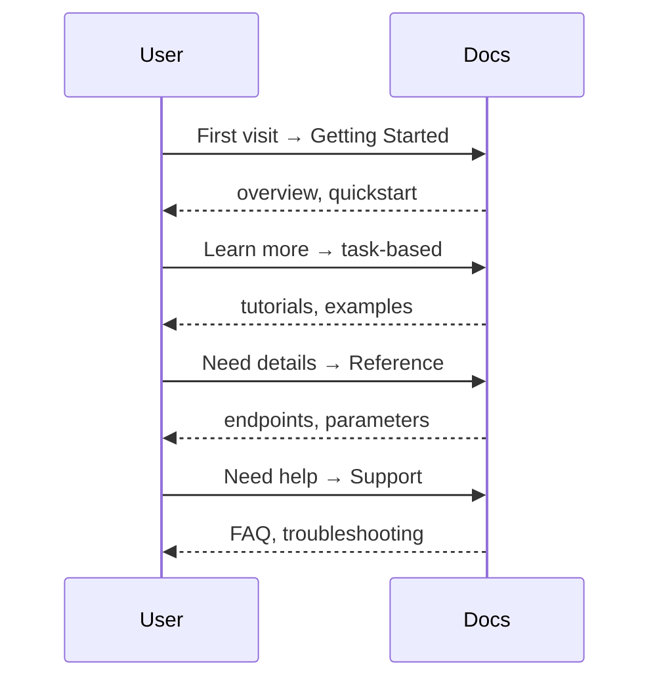

# Documentation-Specific

<!--Essential terms and concepts for API documentation. This section defines
foundational terminology encountered when documenting APIs, from basic
architectural principles to documentation standards that apply across
different API types.-->

---

## API overview topic

**Definition**: also known as "the landing page" in which
the audience is everyone

**Common Use Cases**:

- **Not aware of API**: readers researching new options
or products
- **Aware of API**: readers looking for more specific
information

**Reader's goals**:

- become aware of the product
- learn more about the product
- navigate to other documentation about the product

**Key characteristics**:

- a value proposition, a tagline
- CTAs, call-to-action, as in "Get Started," "Contact Us,"
and/or "Learn More"
- links to common destinations such as "Docs," "FAQ,"
"Reference," and/or "Support"

**When designing user-centered API overview topics**:

- consider the audience and their goals, and consider
many users, use cases and goals
- how readers might use the overview topic, "might
adding or removing this content help the reader
achieve their goal?"
- determine how visual design and branding might
be significant

**Topic &harr; Reader &harr; Doc Relationships**

| Topic Type | Reader Goal | Doc Task |
| --------- | --------- | ---------- |
| Overview, Landing Page | Awareness | Attract |
| First-use, Quickstart | Awareness | Attract |
| Tutorials, Examples | Adoption, Application | Exhibit, Apply |
| Conceptual | Learn | Teach |
| Reference | Delivery, Maintenance | Assist |

**API Documentation Stages &harr; User Journeys**:

**Related Terms**: [API reference topic](#api-reference-topic),
[getting started](#getting-started), [introduction](#introduction),
[market](../frameworks-strategy.md#market),
[sales collateral](../frameworks-strategy.md#sales-collateral),
[top-level](#top-level)

**Source**: UW API Docs: Module 6, Lesson 1, "API Documentation Overview Topics"

---

## API reference topic

**Definition**: also known as "getting finished topics" -
documentation that describes specific aspects of an API
operation or object

**Audience**: people using or considering using the API

**Common Use Cases**:

- **Quick Reference**: API reference topics remember the details
so developers don't have to
- **Research**: determine the API's utility, usability, and
suitability

**Reader's goals**:

- Look up information and get back on task quickly
- Assess whether the API fits their needs

**Standard contents**:

| Element | Purpose |
| --------- | --------- |
| Title | Confirms you're in the right place |
| Endpoint or URL | How to call it |
| Description | What it does |
| Properties | What it contains |
| Property descriptions | Details about each property |
| Operations | Available actions, such as `GET`, `POST` |
| Examples | Sample requests and responses |
| Related links | Navigation to related topics |

**Related Terms**: [API overview topic](#api-overview-topic),
[OpenAPI specification](#openapi-specification),
[reference](#reference)

**Source**: UW API Docs: Module 6, Lesson 1, "API Documentation Overview Topics"

---

## AsyncAPI

**Definition**: specification for defining asynchronous, event-driven
APIs in machine-readable format using JSON or YAML

**Purpose**: enables standardized documentation and tooling for APIs
that work over protocols like AMQP, HTTP, Kafka, Mercure, MQTT, STOMP,
and WebSockets; provides similar benefits to OpenAPI but for
message-driven architectures

**Why this belongs in `Core Concepts`**: AsyncAPI is a documentation
specification format, not an architectural pattern; consistency with
OpenAPI Specification placement is essential since both are fundamental
specification standards for documenting APIs; _OpenAPI for synchronous
REST APIs, AsyncAPI for asynchronous event-driven APIs_;
`API Types & Architectures` covers architectural patterns and protocols -
REST, GraphQL as a query language -  while `Core Concepts` covers the
documentation specification formats that API documentation writers use
to describe those architectures

**Example**: developers create AsyncAPI specifications to document
event-driven systems, then generate documentation, code, and tests from
the specification

**Related Terms**: [AMQP](../api-types-architectures.md#amqp),
[event-driven](../api-types-architectures.md#event-driven),
[GraphQL API](../api-types-architectures.md#graphql-api),
[HTTP](api-fundamentals.md#http), [Kafka](../tools-techniques/infrastructure-platforms.md#kafka),
[Mercure](../api-types-architectures.md#mercure),
[MQTT](../api-types-architectures.md#mqtt),
[OpenAPI Specification](#openapi-specification),
[REST API](../api-types-architectures.md#rest-api),
[STOMP](../api-types-architectures.md#stomp),
[WebSocket API](../api-types-architectures.md#websocket-api)

**Sources**:

- [LF Projects, LLC, AsyncAPI Initiative: "AsyncAPI Specification"](https://www.asyncapi.com/docs/reference/specification/v3.0.0)
- [GitHub Repository: asyncapi/spec](https://github.com/asyncapi/spec)

---

## concept

**Definition**: documentation topic type; explains what something is,
how it works, or why it matters; provides understanding without
instructing readers to perform specific tasks

**Purpose**: builds foundational knowledge that helps readers understand
the context, principles, and reasoning behind features or systems;
concept topics answer "what" and "why" questions at an accessible,
introductory level

**Key Characteristics**:

- explains ideas, principles, or components at a foundational level
- provides context and background information
- avoids step-by-step instructions
- may include diagrams, analogies, or examples to illustrate concepts
- typically more standalone, focused on building knowledge without
explicit connections to procedural content

**Scope**: concept topics provide introductory-level understanding,
offering the essential knowledge readers need to grasp what something
is and why it matters before diving deeper

**Example**: a concept topic about API authentication explains what
authentication is, why it's necessary for API security, and how
different authentication methods compare, without providing setup
instructions

**Related Terms**: [explanation guide](#explanation-guide),
[glossary](#glossary), [introduction](#introduction),
[reference](#reference), [task](#task), [top-level](#top-level),
[troubleshooting](#troubleshooting), [tutorial](#tutorial)

**Source**: [GitLab Docs: "Concept topic type"](https://docs.gitlab.com/development/documentation/topic_types/concept/)

---

## explanation guide

**Definition**: documentation topic type; clarifies a single topic in
depth without providing step-by-step instructions; focuses on
comprehensive understanding of concepts, principles, or features rather
than completing tasks

**Purpose**: builds in-depth knowledge that helps readers understand
how and why something works; enables users to get the most value from
a product by providing extensive context and conceptual background that
goes beyond foundational understanding

**Key Characteristics**:

- explains concepts rather than procedures with greater depth than
concept topics
- no step-by-step instructions
- may include diagrams, code examples, or real-life scenarios
- explicitly links to related how-to guides, tutorials, or getting
started guides
- helps readers understand the "what" and "why" at a comprehensive level
- serves as a bridge between understanding and doing

**Scope**: explanation guides provide comprehensive, in-depth understanding
that goes beyond introductory concepts, offering the extensive context
needed to fully grasp how systems work and make informed decisions

**Example**: an explanation guide about API rate limiting explains what
rate limiting is, why it exists, how different rate limiting algorithms
work, when to use each approach, and the trade-offs between them -
without providing setup instructions but linking to implementation guides

**Related Terms**: [concept](#concept), [Diátaxis](frameworks-strategy.md#diátaxis),
[getting started](#getting-started), [how-to guide](#how-to-guide),
[introduction](#introduction), [reference](#reference), [tutorial](#tutorial)

**Sources**:

- [Diátaxis by Daniele Procida: "Explanation"](https://diataxis.fr/explanation/)
- [Squarespace Engineering: "Part 1: Learn The Different Types Of Technical Documentation"](https://engineering.squarespace.com/blog/2023/part-1-learn-the-different-types-of-technical-documentation)

---

## getting started

**Definition**: documentation topic type; also known as "get started" -
comprehensive onboarding documentation that helps new users complete
their first meaningful interaction with a product or feature; provides
detailed setup, configuration, and foundational knowledge

**Purpose**: reduces time-to-value by guiding users through essential
setup and first use; builds confidence and momentum for deeper
engagement with the product through thorough, step-by-step guidance

**Key Characteristics**:

- covers complete setup and configuration process
- assumes minimal prior knowledge
- provides clear, sequential steps with explanations
- includes prerequisites and troubleshooting
- often spans many pages or sections
- balances depth with accessibility

**Onboarding Topics Comparison**:

| Aspect | Introduction | Getting Started | Quickstart |
| ------ | ------------ | --------------- | ---------- |
| **Purpose** | Awareness | Foundation building | Immediate action |
| **Action required** | None | Yes - comprehensive | Yes - minimal |
| **Length** | Variable | Longer - Many pages | Shortest - single page |
| **Depth** | Conceptual only | Detailed guidance | Essential steps only |
| **Audience** | All levels | New users | Experienced users |
| **Content** | What and why | Setup &rarr; config &rarr; examples | Fastest path to success |

**Example**: a getting started guide for an API walks through obtaining
API credentials, installing required libraries, configuring authentication,
understanding key concepts, making many API calls with different parameters,
and interpreting different response types

**Related Terms**: [API overview topic](#api-overview-topic),
[introduction](#introduction), [onboarding guide](#onboarding-guide),
[quickstart](#quickstart), [task](#task), [top-level](#top-level),
[tutorial](#tutorial)

**Sources**:

- [Document360: "How to Write a Getting Started Guide"](https://document360.com/blog/write-a-getting-started-guide/)
- [GitLab Docs: "Get started page type"](https://docs.gitlab.com/development/documentation/topic_types/get_started/)

---

## glossary

**Definition**: documentation topic type; alphabetically organized collection
of terms and their definitions; provides quick reference for terminology
specific to a product, domain, or technology

**Purpose**: establishes consistent vocabulary, reduces confusion, and helps
readers understand specialized terms without interrupting their workflow to
search elsewhere

**Key Characteristics**:

- terms listed alphabetically
- concise, clear definitions
- may include links to related terms or detailed concept topics
- focused on domain-specific or product-specific terminology

**Example**: an API glossary defines terms like "endpoint," "rate limiting,"
and "webhook" with brief explanations and links to detailed documentation

**Related Terms**: [concept](#concept), [reference](#reference)

**Source**: [GitLab Docs: "Glossary topic type"](https://docs.gitlab.com/development/documentation/topic_types/glossary/)

---

## how-to guide

**Definition**: documentation topic type; step-by-step instructions for
completing a specific real-world task; limited to a single task without
detailed conceptual explanations

**Purpose**: enables users to complete a practical task successfully;
provides focused, action-oriented guidance for readers who know what they
want to achieve

**Key Characteristics**:

- focused on a single, specific task
- provides numbered steps in sequence
- minimal conceptual explanation
- often links to explanation guides for deeper context
- assumes basic familiarity with the product

**Example**: a how-to guide titled "Add OAuth authentication to your API"
provides the exact steps to configure OAuth without explaining authentication
concepts in depth

**Related Terms**: [Diátaxis](frameworks-strategy.md#diátaxis),
[explanation guide](#explanation-guide), [getting started](#getting-started),
[quickstart](#quickstart), [task](#task), [tutorial](#tutorial)

**Sources**:

- [Diátaxis by Daniele Procida: "How-to guides"](https://diataxis.fr/how-to-guides/)
- [Squarespace Engineering: "Part 1: Learn The Different Types Of Technical Documentation"](https://engineering.squarespace.com/blog/2023/part-1-learn-the-different-types-of-technical-documentation)

---

## introduction

**Definition**: broad overview documentation that explains what a product or
feature is, why it exists, and what problems it solves; provides context without
requiring hands-on action

**Purpose**: builds awareness and understanding; helps readers determine if the
product meets their needs before investing time in setup or implementation

**Key Characteristics**:

- focuses on the "what" and "why"
- no step-by-step instructions
- often includes use cases, benefits, and high-level architecture
- may appear as landing page or overview topic content
- suitable for all experience levels

**Example**: an API introduction explains what the API does, which problems it
solves, key features, and typical use cases without providing setup
instructions or code examples;
[API Docs Glossary: "Introduction"](../introduction.md)

**Related Terms**: [API overview topic](#api-overview-topic), [concept](#concept),
[explanation guide](#explanation-guide), [getting started](#getting-started),
[quickstart](#quickstart), [top-level](#top-level)

**Sources**:

- [Squarespace Engineering: "Part 1: Learn The Different Types Of Technical Documentation"](https://engineering.squarespace.com/blog/2023/part-1-learn-the-different-types-of-technical-documentation)
- [Hedera: "Understanding different types of documentation"](https://docs.hedera.com/hedera/support-and-community/contributing-guide/style-guide/understanding-different-types-of-documentation)

---

## onboarding guide

**Definition**: documentation topic type; handbook for new team members that
provides broader understanding of team systems, processes, and practices;
helps teammates gain necessary context to work effectively

**Purpose**: enables new team members to complete essential setup and
understand team workflows, tools, and conventions; reduces time-to-productivity
for new hires

**Key Characteristics**:

- comprehensive coverage of team-specific information
- combines setup tasks with team context
- may include checklists and milestones
- targets new team members specifically
- often covers tools, processes, coding standards, and team culture

**Example**: an engineering onboarding guide walks new developers through setting
up their development environment, understanding the team's Git workflow, learning
deployment processes, and accessing team resources

**Related Terms**: [getting started](#getting-started),
[how-to guide](#how-to-guide), [runbook](#runbook), [tutorial](#tutorial)

**Source**: [Squarespace Engineering: "Part 1: Learn The Different Types Of Technical Documentation"](https://engineering.squarespace.com/blog/2023/part-1-learn-the-different-types-of-technical-documentation)

---

## OpenAPI Specification

**Definition**: also known as the OAS, a standard, language-agnostic way
to define the interface of an HTTP API, allowing both humans and computers
to discover and understand the service's capabilities without
accessing source code, documentation, or inspecting network traffic

**Format**: YAML - human-readable data serialization language -
with a hierarchical collection of properties and values that describe
a REST API

**Purpose**: used to create both the interface and documentation, but,
the OAS document itself is neither implementation nor documentation -
it requires interpretation before it can become either

**Document structure:**

| Section | Purpose |
| --------- | --------- |
| `info` | Metadata about the specification document |
| `servers` | List of servers that support the API |
| `tags` | Tokens used to group and organize endpoints such as resource names |
| `security` | Security schemes used to restrict API access |
| `paths` | URL path segments and their operations |
| `components` | Reusable objects referenced throughout the document |

**Path properties:**

| Property | Description |
| ---------- | ------------- |
| `summary` | Short description; appears as the API operation name |
| `description` | Detailed explanation of the API and how to use it |
| `tags` | Groups similar paths together |
| `operationId` | Unique identifier for this operation |
| `parameters` | URL and query parameters - URL parameters appear in the path itself |
| `responses` | All possible HTTP responses for requests to this path |

**Related terms**: [API](api-fundamentals.md#api),
[API reference topic](#api-reference-topic),
[AsyncAPI](#asyncapi),
[Dredd](../tools-techniques/testing-validation.md#dredd),
[Microcks](../tools-techniques/testing-validation.md#microcks),
[reference](#reference), [REST API](../api-types-architectures.md#rest-api),
[schema](api-fundamentals.md#schema)

**Sources**:

- UW API Docs: Module 5, Lesson 2, "Open API specification (OAS) documents"
- [Wikipedia: YAML](https://en.wikipedia.org/wiki/YAML)

---

## quickstart

**Definition**: condensed documentation that provides the absolute least
amount of steps needed to achieve first success with a product; prioritizes
speed over comprehensiveness

**Purpose**: enables immediate hands-on experience and demonstrates value
within minutes; hooks developers quickly before they explore deeper documentation

**Key Characteristics**:

- concise - often a tenth the length of full documentation
- action-oriented with minimal explanation
- shows one clear path to success
- may use simplified examples or defaults
- targets developers who want fast results
- single page or short video format

**Example**: a quickstart for a payment API provides a pre-configured code snippet
that processes a test transaction in three steps: copy the code, add an API key,
run the script - achievable in under five minutes

**Related Terms**: [getting started](#getting-started), [how-to guide](#how-to-guide),
[introduction](#introduction), [task](#task), [tutorial](#tutorial)

**Sources**:

- [Document360: "How to Write a Getting Started Guide" by Jubina Prabhakaran](https://document360.com/blog/write-a-getting-started-guide/)
- [Document360: "Quick Start Guide: What is it & how do you create one" by Pradeepa Somasundaram](https://document360.com/blog/quick-start-guide/)
- ["Quick start guides and in-depth API documentation" by Dr. Jarkko Moilanen](https://medium.com/@kyyberi/quick-start-guides-and-in-depth-api-documentation-4697e8056fea)

---

## reference

**Definition**: documentation topic type; provides detailed, factual
information about APIs, commands, parameters, or system specifications;
designed for lookup rather than learning

**Purpose**: serves as a comprehensive source of technical details that
developers consult during implementation; prioritizes completeness and
accuracy over explanation

**Key Characteristics**:

- structured, consistent format
- lists all available options, parameters, or endpoints
- includes data types, default values, and constraints
- minimal explanatory text
- optimized for scanning and searching

**Example**: an API reference lists all endpoints with their HTTP methods,
parameters, request/response formats, and status codes

**Related Terms**: [API reference topic](#api-reference-topic), [concept](#concept),
[Diátaxis](frameworks-strategy.md#diátaxis), [explanation guide](#explanation-guide),
[glossary](#glossary), [OpenAPI Specification](#openapi-specification),
[task](#task)

**Sources**:

- [Diátaxis by Daniele Procida: "Reference"](https://diataxis.fr/reference/)
- [GitLab Docs: "Reference topic type"](https://docs.gitlab.com/development/documentation/topic_types/reference/)

---

## runbook

**Definition**: documentation topic type; step-by-step team guide for
completing common tasks or procedures; provides standardized instructions
for operational or maintenance activities

**Purpose**: ensures consistency and reliability when executing routine
or critical procedures; enables any team member to perform necessary
tasks correctly

**Key Characteristics**:

- procedural instructions for specific operations
- designed for scanning for specific steps or in sequence
- often includes context about when and why to use the procedure
- targets team members at many experience levels
- critical for incident response and routine maintenance

**Example**: a deployment runbook details the exact steps to deploy code to
production, including pre-deployment checks, deployment commands, verification
steps, and rollback procedures

**Related Terms**: [how-to guide](#how-to-guide), [onboarding guide](#onboarding-guide),
[task](#task), [troubleshooting](#troubleshooting)

**Source**: [Squarespace Engineering: "Part 1: Learn The Different Types Of Technical Documentation"](https://engineering.squarespace.com/blog/2023/part-1-learn-the-different-types-of-technical-documentation)

---

## task

**Definition**: documentation topic type; guides users through completing a
specific goal; focuses on "how to" perform an action with step-by-step
instructions

**Purpose**: enables users to complete work efficiently without needing to
understand all underlying concepts

**Key Characteristics**:

- starts with a clear goal
- provides numbered steps in logical order
- includes prerequisites when necessary
- may include expected results or verification steps
- focuses on one specific outcome

**Example**: a task topic titled "Authenticate with OAuth 2.0" lists the exact
steps to configure OAuth credentials and enable the authentication flow

**Related Terms**: [concept](#concept), [getting started](#getting-started),
[quickstart](#quickstart), [reference](#reference), [runbook](#runbook),
[troubleshooting](#troubleshooting), [tutorial](#tutorial)

**Source**: [GitLab Docs: "Task topic type"](https://docs.gitlab.com/development/documentation/topic_types/task/)

---

## top-level

**Definition**: documentation topic type; high-level page that introduces a
subject area and provides navigation to related topics; serves as an entry
point for a documentation section

**Purpose**: orients readers to available resources, establishes information
architecture, and helps users find relevant documentation quickly

**Key Characteristics**:

- broad overview of the subject area
- links to child topics organized logically
- minimal detailed content
- may include brief descriptions of linked topics
- focuses on navigation and discoverability

**Example**: a "Security" top-level page introduces security concepts and
links to topics about authentication, authorization, encryption, and security
best practices

**Related Terms**: [API overview topic](#api-overview-topic), [concept](#concept),
[getting started](#getting-started), [introduction](#introduction)

**Source**: [GitLab Docs: "Top-level page type"](https://docs.gitlab.com/development/documentation/topic_types/top_level_page/)

---

## troubleshooting

**Definition**: documentation topic type; helps users diagnose and resolve
specific problems or error conditions; structured around symptoms, causes,
and solutions

**Purpose**: enables users to fix issues independently by providing targeted
guidance for common problems; reduces support burden and improves user
experience

**Key Characteristics**:

- describes the problem or error condition
- lists possible causes
- provides step-by-step solutions
- may include diagnostic steps to identify the issue
- often organized by error message or symptom

**Example**: a troubleshooting topic for API errors explains common HTTP
status codes like `401 Unauthorized` and `429 Too Many Requests`, describes
why they occur, and provides steps to resolve them

**Related Terms**: [concept](#concept),
[error handling](api-fundamentals.md#error-handling),
[HTTP status codes](api-fundamentals.md#http-status-codes), [runbook](#runbook),
[task](#task)

**Source**: [GitLab Docs: "Troubleshooting topic type"](https://docs.gitlab.com/development/documentation/topic_types/troubleshooting/)

---

## tutorial

**Definition**: documentation topic type; guides users through a complete,
real-world scenario from start to finish; combines many tasks and concepts
into a cohesive learning experience

**Purpose**: teaches users how to apply a product or feature to solve a
practical problem; builds skills and confidence through hands-on practice
with a meaningful outcome

**Key Characteristics**:

- focuses on a realistic use case or scenario
- includes many steps or stages
- combines tasks with conceptual explanations
- takes longer to complete than a single task
- often includes a working example or project as the result

**Example**: a tutorial titled "Build a REST API client" walks through
setting up a development environment, authenticating with an API, making
requests, handling responses, and implementing error handling

**Related Terms**: [concept](#concept), [Diátaxis](frameworks-strategy.md#diátaxis),
[getting started](#getting-started), [how-to guide](#how-to-guide),
[onboarding guide](#onboarding-guide), [quickstart](#quickstart), [task](#task)

**Sources**:

- [Diátaxis by Daniele Procida: "Tutorials"](https://diataxis.fr/tutorials/)
- [GitLab Docs: "Tutorial page type"](https://docs.gitlab.com/development/documentation/topic_types/tutorial/)

---
