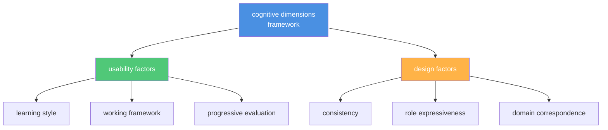

# Frameworks & Strategy

Meta-level frameworks and strategic approaches for API documentation work.
This section covers evaluation frameworks for API usability, developer
personas, organizational contexts, and market dynamics—the conceptual
models that inform how documentation teams plan and execute their work.
For technical API architectures and implementation
patterns, see [API Types & Architectures](api-types-architectures.md).

**Explore the cognitive dimensions framework**:

---

## cognitive dimensions of API usability

**Definition**: a framework for evaluating and enhancing API usability
by considering both designer and user perspectives to identify usability
issues and guide design improvements

**Purpose**: provides a structured approach to assess API design quality
across 12 dimensions, helping documentation teams identify where users
might struggle and where documentation can provide the most value; guides
documentation planning by highlighting which API aspects need clearer
explanation or examples

### the 12 dimensions

| Dimension | What it evaluates |
| ----------- | --------------- |
| **Abstraction Level** | Range of abstraction levels the API exposes and their usability for target developers |
| **Learning Style** | Learning requirements and how well they align with developers' available learning styles |
| **Working Framework** | Size of the conceptual chunk developers must hold in mind to work effectively - cognitive load |
| **Work-Step Unit** | Amount of a task developers complete in a single step |
| **Progressive Evaluation** | Degree to which developers can run incomplete code for feedback |
| **Premature Commitment** | Number of early decisions developers must make and their consequences |
| **Penetrability** | How easily the API facilitates exploration, analysis, and understanding of its components |
| **API Elaboration** | Degree to which the API needs adaptation or extension for specific developer needs |
| **API Viscosity** | Inherent barriers to change and effort required for developers to make modifications |
| **Consistency** | Uniformity and predictability of design, naming conventions, and behavior |
| **Role Expressiveness** | How plainly the API communicates the roles and responsibilities of its components |
| **Domain Correspondence** | How well the API's structure and terminology map to the problem domain |

**Example**: when documenting an authentication API with high premature
commitment, in which developers must choose OAuth vs. API keys early,
documentation should provide a clear decision guide upfront rather than
burying the comparison deep in reference docs

**Related terms**: [API](./core-concepts/api-fundamentals.md#api),
[API reference topic](./core-concepts/documentation-specific.md#api-reference-topic),
[Diátaxis](#diátaxis), [end-user software engineer](#end-user-software-engineer),
[usability testing](workflows-methodologies.md#usability-testing)

**Sources**:

- [Docs By Design: "Applying the Cognitive Dimensions of API Usability to Improve API Documentation Planning" by Robert Watson](https://docsbydesign.com/wp-content/uploads/2015/01/SIGDOC2014_CogDimForDocEstimate_PosterPaper.pdf)
- [Docs By Design: "Audience, Market, Product Webinar"](https://docsbydesign.com/category/technical-writing/audience-market-product/)

---

## Diátaxis

**Definition**: a systematic framework for organizing technical
documentation into four distinct content types: tutorials, how-to guides,
reference, and explanation - based on whether content serves acquisition
or knowledge use, and whether it's focused on practical steps
or theoretical knowledge

**Purpose**: provides documentation teams with a structured approach to
content planning and organization by identifying which documentation type
to create and how to write it; helps prevent common documentation problems
like mixing instructional content with reference material or explanations
with tutorials, resulting in clearer, more user-friendly documentation
that serves both beginners and experts effectively

### the four content types

| Content Type | Orientation | Focus | User Question |
| ------------ | ----------- | ----- | ------------- |
| **Tutorial** | Learning | Practical steps | "Can you teach me to - ?" |
| **How-to Guide** | Goals | Practical steps | "How do I - ?" |
| **Reference** | Information | Theoretical knowledge | "What is - ?" |
| **Explanation** | Understanding | Theoretical knowledge | "Why - ?" |

**The framework's two axes**:

- **Acquisition vs. Application**: whether users are learning something new,
acquisition, or applying existing knowledge to complete work, application
- **Practical Steps vs. Theoretical Knowledge**: whether content focuses on
doing, practical steps, or understanding, theoretical knowledge

**Example**: when documenting a payment API, Diátaxis guides writers to create
separate content types rather than combining all approaches into one confusing
page

| Content Type | Title | Orientation | Focus |
| ------------ | ----- | ----------- | ----- |
| Tutorial | "Process your first payment" | Learning | Practical |
| How-to Guide | "Handle payment failures" | Goals | Practical |
| Reference | "Payment API reference" | Information | Theoretical |
| Explanation | "How payment processing works" | Understanding | Theoretical |

**Related Terms**: [cognitive dimensions of API usability](#cognitive-dimensions-of-api-usability),
[content](writing-style.md#content), [domain knowledge](#domain-knowledge),
[end-user software engineer](#end-user-software-engineer),
[explanation guide](./core-concepts/documentation-specific.md#explanation-guide),
[how-to guide](./core-concepts/documentation-specific.md#how-to-guide),
[reference](./core-concepts/documentation-specific.md#reference),
[tutorial](./core-concepts/documentation-specific.md#tutorial)

**Sources**:

- [Diátaxis by Daniele Procida](https://diataxis.fr/)
- [GitHub: diataxis-documentation-framework](https://github.com/evildmp/diataxis-documentation-framework)

---

## docs-as-ecosystem

**Definition**: comprehensive framework for treating documentation as a complex,
dynamic system managed and nurtured through collaboration across diverse
stakeholders rather than as static code or isolated content

**Purpose**: expands beyond docs-as-code by recognizing that documentation
encompasses technical writing, design, community feedback, community management,
accessibility, SEO - search engine optimization - UX, and AI tools; encourages
holistic, multidisciplinary, and community-centered approaches to creating and
maintaining API documentation that foster sustained engagement and
collaborative growth

**Why this belongs in `Frameworks & Strategy`**: represents a conceptual paradigm
shift in how organizations approach documentation rather than a specific
operational workflow; docs-as-ecosystem expands the operational approaches of
docs-as-code and docs-as-tests into a _broader strategic framework_ that
encompasses the full complexity of documentation systems _beyond just code
management and testing practices_

| Term | Category | Focus |
| ---- | -------- | ----- |
| **docs-as-code** | `Workflows & Methodologies` | methodology for organizing documentation work using developer tools and processes |
| **docs-as-tests** | `Workflows & Methodologies` | concrete practice of running automated tests against documentation |
| **docs-as-ecosystem** | `Frameworks & Strategy` | _meta-level philosophy and organizational mindset_ for understanding documentation as a living system with multiple stakeholders, feedback loops, and interdisciplinary components |

**Example**: rather than treating API documentation as markdown files managed only by
technical writers, a docs-as-ecosystem approach establishes feedback channels through
GitHub discussions, social media, and forums, involves developer relations in analyzing
feedback trends, coordinates with product managers on documentation roadmap, and
integrates contributions from engineers, community members, and customer support to
create living documentation that evolves with community needs

**Related Terms**: [Agile](workflows-methodologies.md#agile),
[docs-as-code](workflows-methodologies.md#docs-as-code),
[docs-as-tests](workflows-methodologies.md#docs-as-tests),
[domain knowledge](#domain-knowledge),
[end-user software engineer](#end-user-software-engineer),
[technical communication](#technical-communication),
[usability testing](workflows-methodologies.md#usability-testing)

**Sources**:

- [Docs-as-Ecosystem: "The Community Approach to Engineering Documentation" by Alejandra Quetzalli](https://www.docsasecosystem.com/)
- [GovFresh: "Docs-as-Ecosystem" Review by Luke Fretwell](https://govfresh.com/books/docs-as-ecosystem)

---

## domain knowledge

**Definition**: the understanding of a specific industry, discipline,
or activity

**Purpose**: enables technical writers to communicate effectively
with subject matter experts and create accurate, contextually
appropriate API documentation; writers with domain knowledge can
better assess what information developers need, ask informed questions
during research, and identify gaps or inaccuracies in documentation

**Example**: a technical writer documenting a financial trading API
benefits from domain knowledge of trading terminology, market mechanics,
and regulatory requirements - allowing them to write clearer explanations
of rate limiting during market hours or authentication requirements
for different account types

**Related Terms**: [API](./core-concepts/api-fundamentals.md#api),
[Diátaxis](#diátaxis), [docs-as-ecosystem](#docs-as-ecosystem),
[end-user software engineer](#end-user-software-engineer).
[technical communication](#technical-communication)

**Source**: [Parson: "API documentation - What software engineers can teach us" by Stephanie Steinhardt](https://www.parson-europe.com/en/knowledge-base/api-documentation-what-software-engineers-can-teach-us)

---

## end-user software engineer

**Definition**: a framework for categorizing developer work styles,
characteristics, and motivations into distinct personas

**Purpose**: helps documentation teams understand different developer
approaches to learning and using APIs, enabling targeted content that
matches how each persona works; systematic developers need comprehensive
reference documentation, pragmatic developers favor structured
guides, and opportunistic developers require quick-start examples and
business-focused explanations

### the three personas

| Persona | Approach | Pride | Documentation Needs |
| ------- | -------- | -------- | -------- |
| Systematic Developer | Writes code defensively, develops deep understanding before using technology | Building elegant solutions | Comprehensive reference, architectural overviews, edge case documentation |
| Pragmatic Developer | Writes code methodically, develops enough understanding to use technology | Building robust apps | Structured tutorials, best practices, troubleshooting guides |
| Opportunistic Developer | Writes code in exploratory fashion, develops enough understanding to solve business problems | Solving business problems | Quickstart guides, business use cases, code examples |

**Example**: when documenting a payment processing API, systematic
developers need detailed security architecture documentation, pragmatic
developers need step-by-step integration guides with error handling,
and opportunistic developers need a five-minute "process your
first payment" tutorial

**Related Terms**: [Diátaxis](#diátaxis), [docs-as-ecosystem](#docs-as-ecosystem),
[domain knowledge](#domain-knowledge),
[error handling](./core-concepts/api-fundamentals.md#error-handling),
[usability testing](workflows-methodologies.md#usability-testing)

**Sources**:

- [Dagstuhl Seminar Proceedings: "What is an End-User Software Engineer?" by Steven Clarke](https://drops.dagstuhl.de/entities/document/10.4230/DagSemProc.07081.26)
- UW API Docs: Module 4, Lesson 1, "Audience analysis and readers' goals"

---

## market

**Definition**: the space in which customers access a company or products
that compete with similar offerings

**Purpose**: influences content priorities and documentation strategy based
on competitive positioning, as an open source API competing in a crowded
marketplace needs different documentation emphasis than a proprietary
enterprise API with few alternatives; market position determines whether
documentation should focus on differentiation, ease of adoption, or
enterprise features

**Example**: a new authentication API entering a market dominated by
established players needs documentation that highlights unique
features and migration guides from competitors, while an established
API can focus on advanced use cases and optimization

**Related Terms**:
[API overview topic](./core-concepts/documentation-specific.md#api-overview-topic),
[sales collateral](#sales-collateral)

**Source**: [Docs By Design: "Audience, Market, Product Webinar"](https://docsbydesign.com/category/technical-writing/audience-market-product/)

---

## sales collateral

**Definition**: materials used internally to inform sales representatives
or externally to educate and convert prospective customers

**Purpose**: bridges the gap between technical documentation and business
value communication; technical writers often create or contribute to sales
collateral by translating API capabilities into business benefits, use cases,
and return on investment (ROI) narratives that sales teams and prospects
can understand without deep technical knowledge

**Example**: a technical writer transforms detailed webhook documentation
into a one-page sales sheet explaining how real-time notifications reduce
customer support tickets by 40%, using non-technical language and
business metrics

**Related Terms**:
[API overview topic](./core-concepts/documentation-specific.md#api-overview-topic),
[market](#market)

**Sources**:

- [Docs By Design: "Audience, Market, Product Webinar"](https://docsbydesign.com/category/technical-writing/audience-market-product/)
- [Turtl: "What is Sales Collateral?"](https://turtl.co/blog/sales-collateral/#:~:text=Sales%20collateral%20examples%20can%20either,convert%20them%20into%20new%20customers%29.)

---

## skunkworks

**Definition**: a group within an organization given high autonomy and
freedom from bureaucracy to work on advanced or experimental projects

**Purpose**: affects documentation approach for APIs and features
developed in skunkworks environments as these projects often have minimal
initial documentation, rapid iteration cycles, and uncertain futures,
requiring flexible documentation strategies that balance thoroughness
with the reality that features may change dramatically or
risk discontinuation

**Example**: a skunkworks team building an experimental machine learning
API may need lightweight, frequently updated documentation focused on
current capabilities rather than comprehensive reference materials,
with clear disclaimers about experimental status

**Related Terms**: [Agile](workflows-methodologies.md#agile),
[project management methodologies](workflows-methodologies#project-management-methodology)

**Sources**:

- [Docs By Design: "Audience, Market, Product Webinar"](https://docsbydesign.com/category/technical-writing/audience-market-product/)
- [Wikipedia: Skunk Works](https://en.wikipedia.org/wiki/Skunk_Works)

---

## technical communication

**Definition**: also known as tech comm; professional field focused on
creating documentation, instructions, and informational materials that
help people accomplish specific tasks or understand technical concepts

**Purpose**: establishes the discipline within which API documentation
practices, tools, and methodologies exist; encompasses writing,
information design, user experience, and content strategy for
technical audiences

**Why this belongs in `Frameworks & Strategy`**: represents the overarching
professional discipline and conceptual framework that contains all API
documentation work; `Core Concepts` focuses on API-specific fundamentals -
endpoints, authentication, responses - while technical communication is the
_meta-level field_ that defines the nature of documentation work itself -
similar to how docs-as-ecosystem frames documentation philosophy rather than
describing specific API concepts

**Example**: API reference documentation, SDK tutorials, developer guides,
installation instructions, and troubleshooting articles are all forms of
technical communication created by technical communicators working in the
API documentation domain

**Related Terms**: [content](writing-style.md#content),
[docs-as-ecosystem](#docs-as-ecosystem), [domain knowledge](#domain-knowledge)

**Sources**:

- [Society for Technical Communication - STC, Homepage](https://www.stc.org/)
- [Wikipedia: "Technical communication"](https://en.wikipedia.org/wiki/Technical_communication)

---
