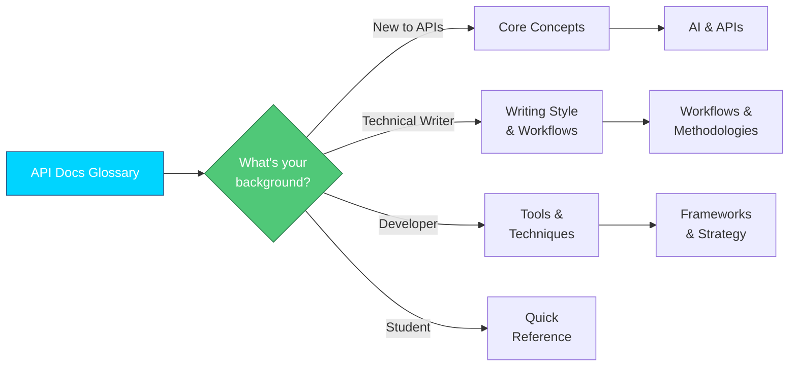

# Introduction

Welcome to the API Docs Glossary. From REST fundamentals to documentation
best practices, API Docs Glossary is a comprehensive reference for anyone
working with API documentation. Whether technical writer, developer, or
student learning API documentation, this resource provides clear definitions
and context for essential concepts.

**Find a path through the glossary**:

---

## Why this glossary?

This glossary emerged organically from real learning needs during
[the University of Washington's AI-Enhanced API Documentation certification program](https://www.pce.uw.edu/specializations/api-documentation).
The project began as study notes - a way to define and cross-reference terms from
course materials, industry resources, and hands-on work. What started as
personal reference material quickly evolved into something more comprehensive, and
comprehensive enough that the course instructor called it a "hidden gem" and
encouraged sharing it with the broader
[Write the Docs](https://www.writethedocs.org/) community.

**How this glossary is different:**

- **Learner-perspective definitions**: terms include the context that
help concepts click, rather than isolated dictionary-style definitions
- **AI-enhanced focus**: reflects the evolving intersection of AI and
API documentation practices
- **Curated from certification coursework**: draws from
industry-recognized curriculum and best practices taught in the
UW program
- **Practical context**: each entry connects theory to real-world use,
bridging the gap between learning and doing
- **A living document**: terms are regularly updated as the field evolves,
reflecting current industry practices and emerging technologies

This resource serves as a practical reference built from a
learner's journey, designed for learners and practitioners who want
clear explanations grounded in current API documentation practices.

---

## Scope & Approach

This glossary covers:

- API architecture and design patterns
- Documentation types and best practices
- AI applications in technical documentation  
- Tools commonly used in API documentation workflows
- Processes for creating and maintaining API docs

Each entry includes practical context and real-world applications,
not just definitions.

---

## Get Started

| Scenario | Action |
| ---------------- | --------- |
| New to API documentation? | Start with [Core Concepts, API Fundamentals](./core-concepts/api-fundamentals.md) |
| Need a concise definition? | Check [Quick Reference](quick-reference.md) |
| Looking for something specific? | Use the search function or browse categories in the sidebar |
| Found an error or have a suggestion? | Visit the [Contribution Guide](../docs/meta/contribution-guide.md) |

---
