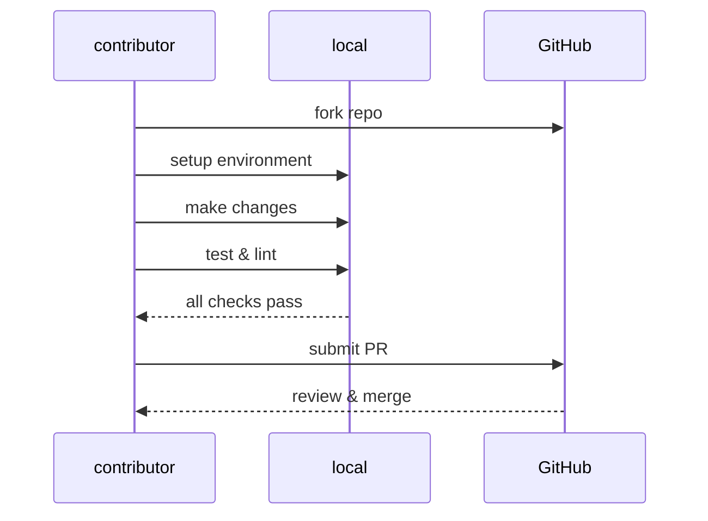

# Contribution Guide
<!-- ignore this Vale capitalization error, see Style Guide #Headings-->

This guide covers the technical process for contributing to the
API Docs Glossary: forking the repository, setting up the
development environment, submitting pull requests,
and troubleshooting common issues.

_For content standards, writing conventions, and formatting
requirements, visit the [Style Guide](style-guide.md)._

**Contribution workflow**:



---

## Code of conduct

Please be respectful and constructive in all interactions.
This project follows standard open source etiquette. Visit
[MDN Web Docs: "Open source etiquette"](https://developer.mozilla.org/en-US/docs/MDN/Community/Open_source_etiquette)
for more standard open source etiquette guidance.

---

## Pull request tips

1. Fork this repository to a personal [GitHub](https://github.com) account.
2. Build a local copy of the documentation from the fork:

   ```bash
      npm install
      npm start
   ```

3. Install [Vale](https://vale.sh/) in the development environment.
4. If using [VS Code](https://code.visualstudio.com/download), install extensions
[markdownlint](https://marketplace.visualstudio.com/items?itemName=DavidAnson.vscode-markdownlint)
and [Vale VS Code](https://marketplace.visualstudio.com/items?itemName=ChrisChinchilla.vale-vscode).
5. Test all changes locally before submitting a pull request.
6. Pull requests should be complete and self-contained. Don't submit
placeholder content or partial entries.
7. Ideally, pull requests should address an existing issue,
but this isn't required.
8. Don't submit pull requests with lint or Vale errors in
the content or code examples.

---

## Commit message guidelines

This project follows the [Conventional Commits](https://www.conventionalcommits.org/)
specification to maintain clear, consistent commit history.

### Format

Each commit message consists of a **type**, **scope**, and **subject**:

```markdown
<type>(<scope>): <subject>
```

Example: `docs(tools-techniques): add relevant terms links`

### Type

Must be one of the following:

- **docs**: documentation changes - term entries, examples, explanations
- **fix**: bug fixes - broken links, typos, technical inaccuracies
- **style**: formatting changes - capitalization, punctuation, Vale fixes
- **refactor**: restructuring content without changing meaning
- **chore**: maintenance tasks - dependencies, configuration

### Scope

The scope identifies which glossary section the changes impact:

- glossary term category names:
    - `core-concepts`
    - `api-types-architectures`
    - `ai-and-apis`
    - `tools-techniques`
    - `workflows-methodologies`
    - `frameworks-strategy`
    - `writing-style`

- meta documentation and/or styling filenames:
    - `config`
    - `contribution-guide`
    - `getting-started`
    - `introduction`
    - `quick-reference`
    - `README`
    - `src` / `static`
    - `style-guide`

### Subject

- use present tense - "add" not "added"
- these are labels, not complete sentences
- don't capitalize the first letter
- no period at the end
- keep it concise - 50 characters or less

### Examples

**Good commit messages:**

```markdown
docs(core-concepts): add HTTP status codes entry
fix(tools-techniques): correct cURL installation link
style(writing-style): fix capitalization in active voice
docs(quick-reference): add REST API entry
```

**Bad commit messages:**

```markdown
Updated files
Fixed stuff
Added new term
docs: changes
```

### Pull request commits

When submitting a pull request:

1. **Reference the issue** in the PR description: "Resolves Issue #72"
2. **Squash commits** - maintainers should squash many commits into
one when merging
3. **Write clear PR titles** - these become the commit message in the
`main` branch

The final squashed commit should follow the format:

```markdown
docs(scope): brief description (#issue-number)
```

Example: `docs(tools-techniques): add relevant terms links (#72)`

---

## Troubleshooting

### Documentation build fails locally

Make sure all software requirements installed correctly.
For example, ensure [Node.js](https://nodejs.org/en/download)
and [npm](https://docs.npmjs.com/downloading-and-installing-node-js-and-npm)
are up to date. Run `npm install` in the fork directory,
then attempt the build again.

### Vale or markdownlint extensions don't appear in VS Code

Install the extensions from
[the Visual Studio Code marketplace](https://marketplace.visualstudio.com/VSCode).
Reload VS Code (`Ctrl+R` on Windows/Linux, `Cmd+R` on Mac) after installation.

### Vale reports errors but the content appears correct

Check the `.vale.ini` configuration file in the repository root.
Use `vale .` to run Vale from the command line and observe
detailed error output.

### Pull request marked as having lint errors

Run `npm run lint` locally to identify errors before submission.
Most formatting issues can be auto-fixed with `npm run lint:fix`.

### Changes don't appear after pushing to GitHub

GitHub Pages can take a few minutes to rebuild and deploy.
Wait a few minutes, then refresh the site. Clear the browser cache
(`Ctrl+Shift+Delete` on Windows/Linux, `Cmd+Shift+Delete` on Mac)
if changes still don't appear.

---

<!--## MIT License

_By contributing to this project, you agree to contribution license
under the MIT License; visit the [LICENSE](../LICENSE) for details_

---
--->
