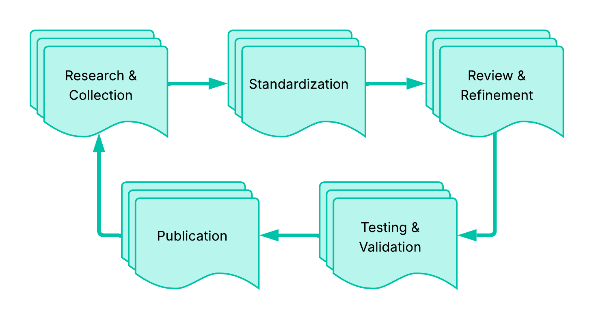

# How This Glossary is Built

This page documents the workflow, tools, and processes used to create
and maintain the ADG. Transparency about methodology helps
contributors understand the project's standards and enables others to
replicate similar documentation projects. Review the four-stage
ADG development workflow:



---

## Research & Collection

| Stage | Description | Key Activities |
| ----- | ----------- | -------------- |
| **Research & Collection** | Term identification from authoritative sources | UW API Docs course materials; industry standards - RFC documents, OpenAPI Specification; authoritative sources - MDN Web Docs, official specifications; community needs via issues and discussions |
| **Standardization** | AI-assistance applies [Style Guide](style-guide.md) formatting | Consistent formatting and structure; appropriate capitalization rules; proper anchor link syntax; related term connections |
| **Review & Refinement** | Human review for accuracy and clarity | Technical accuracy of definitions; source verification and proper citation; clarity and readability; appropriate examples for API documentation context |
| **Testing & Validation** | Contributors verify each entry before merging | Local build testing with `npm start`; anchor link verification; cross-reference validation; navigation panel review |

---

## AI Tools & Usage

AI assists with content generation, standardization, code review, and feature development.
While AI-generated content includes initial brainstorming and templating, AI-assistance doesn't
replace expert verification, judgment on term relevance, understanding of audience needs,
or decision-making about information architecture - and is susceptible to bias and
hallucination, requiring explicit prompting for context-specific work.

| Aspect | AI Role | Human Role |
| ------ | ------- | ---------- |
| **Content Generation** | Drafts initial entries from sources | Reviews, edits, verifies accuracy |
| **Standardization** | Applies style guide formatting | Ensures consistency, fixes edge cases |
| **Code Review** | Suggests improvements | Makes final decisions |
| **Feature Development** | Pair programming on tooling | Directs implementation, tests |

---

## Prompt Templates

Reusable prompts maintain consistency across contributions.
Review [Prompt Templates](prompt-templates.md); add more to
expedite glossary workflows.

---

## Quality Control Process

**Verification Checklist**:

- [ ] **Entry completion**: definition in both category and Quick Reference
- [ ] **Technical accuracy**: definition matches authoritative sources
- [ ] **Source verification**: links work, citations are specific
- [ ] **Style compliance**: follows all capitalization and formatting rules
- [ ] **Related terms**: links point to existing entries only
- [ ] **Anchor links**: all internal links tested and working
- [ ] **Examples**: clear, relevant to API documentation context
- [ ] **Build success**: `npm run build` completes without errors

**Testing Commands**:

```bash
# Verify build and check for broken links
npm run build

# Search for specific anchor references
grep -rn "](#anchor-name)" . --include="*.md"

# Test locally
npm start
```

**Common Issues & Solutions**:

| Issue | Solution |
| ----- | -------- |
| Broken anchor links | Run `npm run build` to identify, use grep to find references |
| Inconsistent capitalization | Review [Capitalization](style-guide.md#capitalization) section |
| Missing related terms | Check if linked terms have glossary entries |
| Vale warnings | Add ignore comments for intentional style guide breaks |

---

## Contribution Workflow

Contributors can use similar AI-assisted workflows:

1. **Create an issue** describing the proposed additions or changes
2. **Use prompt templates** to generate initial drafts with AI assistance
3. **Review and refine** AI-generated content for accuracy
4. **Test locally** with `npm start` before submitting
5. **Submit pull request** with clear description of changes
6. **Reference the issue** in the pull request

**When to Use AI Assistance**:

| Aspect | Use AI For | Use Human Judgment For |
| ------ | ---------- | ---------------------- |
| **Entries** | Formatting many entries consistently | Selecting which terms to include |
| **Structure** | Generating table structures | Determining term relationships |
| **Definitions** | Drafting initial definitions from sources | Verifying technical accuracy |
| **Links** | Finding anchor link references | Choosing appropriate examples |

---

## Maintaining Consistency

The [Style Guide](style-guide.md) documents standards as they emerge
including new patterns, resolved edge cases, and rules refined based
on experience. Version control using Git provides a complete record of
changes, reasoning through commit messages, and the ability to track
when and why entries have changed.

---

## Lessons Learned

The [Style Guide](style-guide.md) evolves to document new patterns, resolve edge
cases, and refine ADG rules. Git history provides a complete record of changes
and reasoning. The workflow itself improves through contributor feedback,
discovery of new patterns, refinement of prompt templates, and updates to
tooling. Adapt this workflow for similar docs projects:

| Aspect | Needs | Adjustments |
| ------ | ------------- | -------------- |
| **Standards** | Clear style guide documenting standards | Adapt prompt templates to the domain |
| **AI Tooling** | AI tool access | Edit prompts for different AI assistants |
| **Version Control** | Version control system | Customize verification scripts |
| **Build System** | Local testing capability | Adapt syntax for the build system |
| **Process** | Commitment to human review | Document what AI should/shouldn't do |

Key success factors include clear standards and a transparent process that
includes human oversight, testing automation, and continuous refinement -

| Aspect | AI Excels At | Human Expertise Essential For |
| ------ | ------------ | ----------------------------- |
| **Formatting** | Applying consistency across all entries | Judging term relevance and priority |
| **Content** | Generating structured content from examples | Verifying technical accuracy |
| **Connections** | Suggesting related term connections | Understanding audience needs |
| **Quality** | Catching formatting inconsistencies | Making editorial decisions |

---

## Feedback and Questions

This workflow documentation evolves based on contributor experience and feedback.
Questions about this workflow or suggestions for improvement?
[Open an issue](https://github.com/rhyannonjoy/api-docs-glossary/issues).
