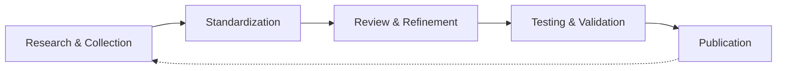

# How This Glossary is Built

This page documents the workflow, tools, and processes used to create
and maintain the API Docs Glossary. Transparency about methodology helps
contributors understand the project's standards and enables others to
replicate similar documentation projects.

**Four-stage glossary development workflow**:



---

### Research & Collection

Term identification happens through:

- UW API Docs course materials, API documentation
- industry standards such as RFC documents, OpenAPI Specification
- authoritative sources like MDN Web Docs, official specifications
- community needs identified through issues and discussions

### Standardization

AI assistance, specifically Claude AI, standardizes entries to match the
[Style Guide](style-guide.md) requirements:

- consistent formatting and structure
- appropriate capitalization rules
- proper anchor link syntax
- related term connections

### Review & Refinement

Human review ensures:

- technical accuracy of definitions
- source verification and proper citation
- clarity and readability
- appropriate examples for API documentation context

### Testing & Validation

Each entry undergoes:

- local build testing with `npm start`
- anchor link verification
- cross-reference validation
- navigation panel review

---

## AI Tools and Usage

### Claude AI Role

Claude AI assists with:

| Task | AI Role | Human Role |
| ---- | ------- | ---------- |
| **Content Generation** | Drafts initial entries from sources | Reviews, edits, verifies accuracy |
| **Standardization** | Applies style guide formatting | Ensures consistency, fixes edge cases |
| **Code Review** | Suggests improvements | Makes final decisions |
| **Feature Development** | Pair programming on tooling | Directs implementation, tests |

### What AI Generates

**AI-assisted content:**

- initial term definitions based on provided sources
- structure and formatting standardization
- related term suggestions
- example code blocks and tables

### AI Limitations

**AI assistance doesn't replace**:

- expert verification of technical details
- judgment about term relevance
- understanding of audience needs
- decision-making about information architecture

---

## Master Prompts

Reusable prompts maintain consistency across contributions.

### Adding New Terms

```markdown
Please generate glossary term entries for my API Docs Glossary:
https://github.com/rhyannonjoy/api-docs-glossary

Terms to add:
* [Term 1]
* [Term 2]
* [Term 3]

Please use [SOURCE NAME] as a source: [SOURCE URL]

I think these terms should go in [FILENAME], in the [SECTION NAME] section,
do you agree?

Here is my glossary style guide: [paste or link to style-guide.md]

Please generate glossary term entries in Markdown so that I can copy 
them easily.
```

### Standardizing Existing Entries

```markdown
Please review these glossary entries against the style guide and 
suggest improvements:

[paste entries]

Style guide: [paste or link to style-guide.md]

Focus on:
- formatting consistency
- capitalization rules
- related term linking
- definition clarity
```

---

## Quality Control Process

### Verification Checklist

Before merging new entries:

- [ ] **Entry completion**: definition in both category and Quick Reference
- [ ] **Technical accuracy**: definition matches authoritative sources
- [ ] **Source verification**: links work, citations are specific
- [ ] **Style compliance**: follows all capitalization and formatting rules
- [ ] **Related terms**: links point to existing entries only
- [ ] **Anchor links**: all internal links tested and working
- [ ] **Examples**: clear, relevant to API documentation context
- [ ] **Build success**: `npm run build` completes without errors

### Testing Commands

```bash
# Verify build and check for broken links
npm run build

# Search for specific anchor references
grep -rn "](#anchor-name)" . --include="*.md"

# Test locally
npm start
```

### Common Issues and Solutions

| Issue | Solution |
| ----- | -------- |
| Broken anchor links | Run `npm run build` to identify, use grep to find references |
| Inconsistent capitalization | Review [Capitalization](style-guide.md#capitalization) section |
| Missing related terms | Check if linked terms have glossary entries |
| Vale warnings | Add ignore comments for intentional style guide breaks |

---

## Contribution Workflow

Contributors can use similar AI-assisted workflows:

### Recommended Approach

1. **Create an issue** describing the proposed additions or changes
2. **Use master prompts** to generate initial drafts with AI assistance
3. **Review and refine** AI-generated content for accuracy
4. **Test locally** with `npm start` before submitting
5. **Submit pull request** with clear description of changes
6. **Reference the issue** in the pull request

### When to Use AI Assistance

**Appropriate use cases:**

- formatting many entries consistently
- generating table structures
- drafting initial definitions from sources
- finding anchor link references

**Requires human judgment:**

- selecting which terms to include
- verifying technical accuracy
- choosing appropriate examples
- determining term relationships

---

## Maintaining Consistency

### Style Guide Evolution

The [Style Guide](style-guide.md) documents standards as they emerge:

- new patterns get documented
- edge cases get resolved
- rules get refined based on experience

### Version Control

Git history provides:

- complete record of changes
- reasoning through commit messages
- ability to track when and why entries changed

---

## Lessons Learned

### What Works Well

**AI assistance excels at:**

- applying consistent formatting across many entries
- generating structured content from examples
- suggesting related term connections
- catching formatting inconsistencies

**Human expertise essential for:**

- judging term relevance and priority
- verifying technical accuracy
- understanding audience needs
- making editorial decisions

### Continuous Improvement

The workflow evolves through:

- contributor feedback
- discovery of new patterns
- refinement of master prompts
- updates to tooling and automation

---

## Replicating This Process

Others can adapt this workflow for similar documentation projects:

### Prerequisites

- clear style guide documenting standards
- AI tool access - Claude AI, ChatGPT, etc.
- version control system - Git
- local testing capability
- commitment to human review

### Adaptation Tips

**For different content types:**

- adjust master prompts to the domain
- define what AI should and shouldn't do
- document the specific quality standards

**For different tools:**

- adjust master prompts to work with different AI assistants
- adapt syntax for the build system
- customize verification scripts

### Key Success Factors

1. **Clear standards**: comprehensive style guide
2. **Transparent process**: document what AI does
3. **Human oversight**: review everything
4. **Continuous refinement**: improve prompts over time
5. **Testing automation**: catch issues early

---

## Feedback and Questions

This workflow documentation evolves based on contributor experience and feedback.
Questions about this workflow or suggestions for improvement?
[Open an issue](https://github.com/rhyannonjoy/api-docs-glossary/issues).
