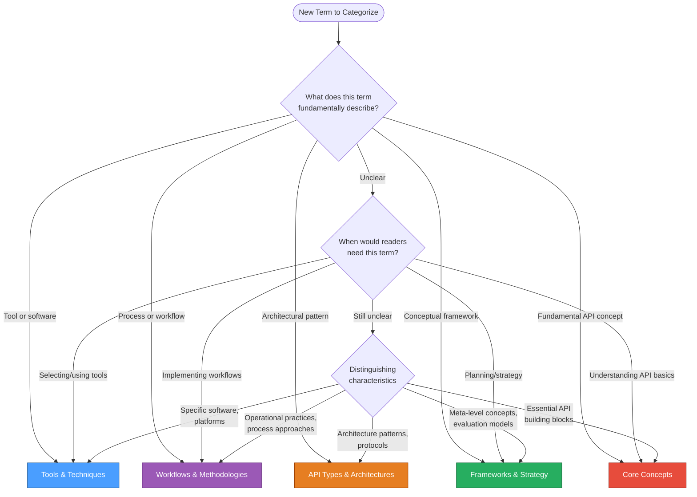

# Style Guide

This guide defines content standards for the API Docs Glossary:
what makes a good term entry, how to format definitions,
capitalization rules, and writing conventions. All contributions
must follow these standards to maintain consistency and quality.

_For technical setup and the pull request process, visit the
[Contribution Guide](contribution-guide.md)._

---

## Glossary Philosophy

The API Docs Glossary exists to demystify API documentation terminology
for writers, developers, and technical communicators.
Good glossary entries:

- **Aim for clarity over comprehensiveness** - brief, scannable
definitions that get readers oriented quickly
- **Connect concepts** - show how terms relate to each other through
thoughtful linking
- **Focus on API documentation context** - explain why terms matter
specifically for documenting APIs
- **Serve real needs** - address terms readers actually encounter in
API documentation work
- **Make decision-making visible** - document the "why" behind structural
choices, demonstrating that good technical writing includes **explaining
the reasoning, not just presenting information**

_This glossary isn't an exhaustive technical reference. It's a practical
resource for people learning or working in API documentation who need
quick, reliable definitions. The Style Guide itself models this philosophy:
when making non-obvious choices about structure, formatting, or categorization,
<u>document the reasoning explicitly</u>._

---

## Contribution Content Strategy

Documentation improvements are always welcome. Contributions must
benefit API Docs Glossary readers. Contributions are _especially_
welcome if they:

- add new API documentation terms with clear definitions
- improve clarity of existing definitions
- add relevant examples to existing terms
- fix technical inaccuracies

Before contributing, create
[an issue](https://github.com/rhyannonjoy/api-docs-glossary/issues)
to discuss additions or changes.

---

## Add a new glossary term

Most terms live in existing category files. To add a new term:

1. Identify which category file the term belongs in:
   - `quick-reference.md` - common terms, concise definitions
   - `core-concepts.md` - fundamental API documentation concepts
   - `api-types-architectures.md` - different architectural patterns and protocols
   - `ai-and-apis.mdx` - AI technologies, concepts relevant to API documentation
   - `tools-techniques.md` - tools, software, methods
   - `workflows-methodologies.md` - development, documentation workflows for API projects
   - `frameworks-strategy.md` - conceptual models, strategic approaches for API documentation work
   - `writing-style.md` - language conventions, tone guidelines, rhetorical approaches

2. Add the term using this format:

    ```markdown
    ## term name

    **Definition**: [brief, clear definition]

    **Purpose**: [why this matters for API documentation]

    **Example**: [real-world example or use case]

    **Related Terms**: [links to related glossary terms]

    **Source**: [acknowledgement of the information's origin]
    ```

3. Place the term alphabetically within its section
or at the end of the appropriate subsection

4. Test locally with `npm run build` and `npm start` to ensure links work and
formatting looks correct

---

## Category Placement

Choosing the correct category for a glossary term ensures readers can find
information intuitively and understand how concepts relate to each other.
Most terms have an obvious category home, but some terms span multiple
domains or represent emerging practices that don't fit neatly into existing
categories.

### Selection Guidelines

When determining where a glossary term belongs, consider:

1. **Primary function**: _What does this glossary term fundamentally describe?_
2. **User context**: _When would readers need this term?_
3. **Distinguishing characteristics**: _Concept type and/or tool?_



### When to Document

Most glossary terms _don't need explicit_ category justification. Consider
the following when determining whether category reasoning serves
[the Glossary Philosophy](#glossary-philosophy) or not:

| **Scenario** | **Document?** | **Example** | **Why** |
| ------------ | -------------- | ------------- | --------- |
| Term could reasonably fit multiple categories | ✅ Yes | docs-as-tests involves both tools and workflow methodology | Clarifies the primary classification and prevents confusion |
| Term represents emerging practice without clear precedent | ✅ Yes | docs-as-tests is relatively new | Explaining the decision helps readers and future contributors understand the pattern |
| Category choice questioned or challenged | ✅ Yes | API testing could be a technique or part of a broader workflow | Anticipating confusion and addressing it proactively helps readers understand the term's scope |
| Decision establishes a pattern for similar future terms | ✅ Yes | Explaining why docs-as-tests goes in `Workflows & Methodologies` | Creates a reference point for similar methodology terms |
| Understanding the category helps readers grasp the term's nature | ✅ Yes | Category placement itself is educational context | Enriches understanding of what the term fundamentally is |
| Term has obvious category fit | ❌ No | Git clearly belongs in `Tools & Techniques` | Adding reasoning would be redundant and clutter the entry |
| Category is self-evident from the definition | ❌ No | API obviously belongs in `Core Concepts` | Readers don't need explanation for clear categorization |

### Reasoning Format

Add category placement reasoning as a visible field in the term entry using the
**"Why this belongs in `[Category]`"** format. This makes the reasoning transparent
to readers and helps them understand the scope and nature of the term.

**Why category reasoning gets its own field**:

Separating category reasoning into its own field demonstrates a core technical writing
principle: make decision-making processes explicit and structured. This Style Guide
emphasizes _concise, scannable_ definitions using sentence fragments and phrases.
Category placement reasoning needs its own dedicated field to:

- **Preserve clarity in `Definition` and `Purpose` fields** - these fields should remain
focused on what the term means and why it matters, not why it's categorized a certain way
- **Avoid overloading `Example` fields** - examples should illustrate usage, not justify
categorization
- **Maintain scannability** - readers can quickly find core information without wading
through meta-commentary about category decisions
- **Be explicit and structured** - category reasoning is meta-information that deserves
clear separation from the term's actual definition and purpose

**Use this format:**

```markdown
## term name

**Definition**: [brief, clear definition]

**Purpose**: [why this matters for API documentation]

**Why this belongs in `[Category Name]`**: [explain why this category is the best fit,
focusing on the term's primary function and distinguishing characteristics]

**Example**: [real-world example or use case]

**Related Terms**: [links to related glossary terms]

**Source**: [acknowledgement of the information's origin]
```

**Example with placement reasoning:**

```markdown
## docs-as-tests

**Definition**: documentation strategy that treats documentation as testable assertions
to verify content accuracy against the current product state

**Purpose**: maintains documentation accuracy through automated testing that validates
docs work as written by directly testing against product UIs, APIs, and CLIs

**Why this belongs in `Workflows & Methodologies`**: describes an operational workflow
approach that focuses on processes and practices rather than specific tools or conceptual
frameworks; represents a documentation methodology similar to Agile or docs-as-code,
emphasizing the practice of continuous validation rather than the tools that implement it
...
```

**Example showing distinction from another category:**

```markdown
## API testing

**Definition**: the practice of validating that APIs function correctly, return expected
responses, handle errors appropriately, and meet performance requirements

**Purpose**: ensures API reliability and accuracy before production deployment; in
API documentation contexts, validates that documented endpoints, parameters, and code
examples work as written

**Why this belongs in `Workflows & Methodologies`**: describes a testing practice and
validation workflow that focuses on how teams verify APIs as part of documentation
maintenance and emphasizes the practice of testing rather than a specific tool;
`Core Concepts` covers what APIs are fundamentally, while API testing is about what
teams do with APIs—a workflow practice, not a fundamental API characteristic
...

```

### Reasoning Best Practices

- **Don't over-document**: most terms don't need placement reasoning -
only include it when it adds value for readers
- **Be concise**: keep reasoning focused and clear; explain the primary reason first
- **Show distinctions**: when relevant, briefly explain why the term doesn't fit
in another obvious category
- **Think forward**: consider how the decision guides future similar terms
- **Test the placement**: if articulating why a term belongs in its category is too
difficult, reconsider the placement
- **Ask for feedback**: when uncertain, create an issue to discuss with other
contributors before committing to a category

---

## Acronyms

Acronym use is most impactful in headings because headings serve as both
navigation labels and anchor links in Docusaurus. Consider the relationship
of the glossary term's official name and how someone is _most_ likely to
reference it in conversation. Use the _most_ recognizable form of a term in
headings to create clean, scannable navigation and maintainable anchor links.

### Rules

**Use the acronym alone** when it's widely recognized and commonly used:

- ✅ `## API` not `## API (Application Programming Interface)`
- ✅ `## HTTP` not `## HTTP (Hypertext Transfer Protocol)`
- ✅ `## JSON` not `## JSON (JavaScript Object Notation)`
- ✅ `## REST API` not `## REST (Representational State Transfer) API`

**Rationale**: acronyms in headings create shorter, cleaner navigation panels
and anchor links; `[HTTP](#http)` is easier to write and maintain than
`[HTTP](#http-hypertext-transfer-protocol)`

**Explain the full name in the definition field** immediately after
the heading:

```markdown
## REST API

**Definition**: acronym for *RE*presentational State Transfer
application programming interface...
```

```markdown
## gRPC API

**Definition**: uses gRPC - *Google's Remote Procedure Call* - framework...
```

```markdown
<!-- definition structure in Quick Reference-->

### UI

- acronym for _user interface_
- space where interactions between humans and machines occur

**Glossary Term Entry Location**: [Tools & Techniques, Development Essentials, Interfaces & Formats - UI](../tools-techniques/development-essentials.md#ui)
```

**Use the full name** when the acronym isn't widely recognized or when the
full name is more commonly used:

- ✅ `## Critical Chain Project Management` not `## CCPM`
- ✅ `## Waterfall` not `## Waterfall Project Management Methodology`
- ✅ `## guerilla usability testing` not `## GUT`

**When unsure**, check common usage patterns:

- Search API documentation, technical articles, and MDN Web Docs
- If the acronym appears more frequently than the full name, use the acronym
- If the full name is more recognizable, use the full name
- Consider the glossary target audience - _what term would they search for?_

**Never use parenthetical expansions in headings** - they clutter navigation
and create unnecessarily long anchor links:

- ❌ `## SOAP (Simple Object Access Protocol) API`
- ✅ `## SOAP API` with definition explaining "Simple Object Access Protocol"
- ❌ `## URI (Uniform Resource Identifier)`
- ✅ `## URI` with definition explaining "Uniform Resource Identifier"

### Anchor Link Consistency

Headings become anchor links automatically. Keep them concise to:

- streamline cross-referencing between terms
- reduce errors when creating links
- improve navigation panel readability

**Example of the difference**:

| Heading Style | Anchor Link | Usability |
| ------------- | ----------- | --------- |
| `## HTTP` | `[HTTP](#http)` | ✅ Short, clear, maintainable |
| `## HTTP (Hypertext Transfer Protocol)` | `[HTTP](#http-hypertext-transfer-protocol)` | ❌ Long, error-prone |
| `## URL` | `[URL](#url)` | ✅ Short, clear, maintainable |
| `## URL (Uniform Resource Locator)` | `[URL](#uniform-resource-locator-url)` | ❌ Long, error-prone |

---

#### Updating Links

When renaming terms or reorganizing the glossary, don't forget to update
all anchor links that reference the changed term. Use grep to find all
instances in Markdown files:

**Find all links to a specific anchor:**

```bash
grep -rn "](#anchor-name)" . --include="*.md"
```

**Example - find links to `#openapi-specification-oas`:**

```bash
grep -rn "](#openapi-specification-oas)" . --include="*.md"
```

**Break down the command:**

- `grep` - search tool
- `-r` - recursive, searches all subdirectories
- `-n` - shows line numbers in results
- `"](#anchor-name)"` - the pattern to find, Markdown link syntax
- `.` - current directory
- `--include="*.md"` - only search Markdown files, _exclude config files_

**After finding all instances:**

1. Review each result to determine if it needs updating
2. Some links may need just the anchor changed: `#new-anchor`
3. Others may need the specific file in the path changed: `glossary.md#anchor`
4. Update each link manually based on context

#### Troubleshooting Broken Links

After updating headings, run `npm run build` to verify that all anchor
links are working. Docusaurus reports any broken anchors it finds.

**Example build output with broken anchors:**

```shell
[WARNING] Docusaurus found broken anchors!
- Broken anchor on source page path = /docs/tools-techniques:
   -> linking to #pull-request-pr
```

**Find and fix broken anchors:**

1. Run the build command to identify broken links:

   ```bash
   npm run build
   ```

2. Use grep to find all instances of the old anchor format. Common
patterns when removing acronyms from headings:

   ```bash
   # Find links with acronym suffixes that need updating
   grep -rn "#guerrilla-usability-testing-gut" . --include="*.md"
   grep -rn "#pull-request-pr" . --include="*.md"
   grep -rn "#openapi-specification-oas" . --include="*.md"

   # Find cross-file links that may have changed
   grep -rn "core-concepts#rest" . --include="*.md"
   ```

3. Update each link manually to match the new heading format

4. Run `npm run build` again to verify the corrections

**Common causes of broken anchors:**

- updated a heading but forgot to update the **Related Terms** links
- removed acronyms from headings but left them in anchor links
- changed file organization but didn't update cross-file references
- typos in manually created anchor links

---

## Capitalization

Use consistent capitalization to maintain clarity and
professionalism.

### Term Rules by Category

| Category | Rule | Examples |
| -------- | -------- | --------- |
| Proper noun & products | Always capitalize official names | Agile, Git, GitHub |
| Official tools | Capitalize specific product names | GitHub Desktop, Swagger Editor |
| Acronyms | Always capitalize | API, GUI, HTTP/HTTPS, REST |
| Brand-specific | Follow the product's capitalization | cURL, json-server, macOS |
| Common terms | Use lowercase | branch, commit, repository |
| Git commands | Use lowercase | pull, push, rebase |
| Generic phrases | Use lowercase | merge conflict, pull request, version control |
| File types | Use lowercase unless referring to the language | `markdown` file, but Markdown language |

### Headings

Match term headings with the capitalization of the term itself:

- `## branch` not `## Branch`
- `## GitHub` not `## github`
- `##REST API` not `##REST api`

**Category and section headings** use different capitalization based
on their function:

- **Labels and titles** use title case: `# Core Concepts`,
`# Tools & Techniques`, `## Glossary Philosophy`
- **Task-based or action phrases** use sentence case:
`## Add a new glossary term`, `## Create a new category`

**Rationale**: term headings follow the natural capitalization of the
term definition - lowercase for common terms, proper capitalization for
brands and/or acronyms; category headings use title case because they
function as navigation labels and section titles rather than as terms
themselves

_**Note**: this glossary disables `Google.Headings` in
[`.vale.ini`](https://github.com/rhyannonjoy/api-docs-glossary/blob/main/.vale.ini),
which prefers sentence-case headings. Matching term capitalization and using
title case for categories improves clarity and usability for this project.
Disable any Vale or Google rules that conflict with the project's goals -
style guides should serve the documentation, not constrain it._

### Field Content

Use sentence fragments and/or phrases rather than complete sentences.
Start with lowercase unless the word is a proper noun:

```markdown
## branch

**Definition**: a parallel version of a repository that enables work on changes without affecting the main codebase

**Purpose**: enables multiple developers to work on different features simultaneously in API documentation workflows
```

**Rare exception:** if a definition must be a complete sentence
for clarity, capitalize the first word per standard sentence rules,
even if it's the term itself:

```markdown
## rebase

**Definition**: Rebase updates the base commit from which a branch was created.
```

---

## Related Terms Linking Strategy

Link related terms to help readers navigate connected concepts
and build understanding of how terms relate to each other.
Include 3-6 related terms per entry. Too few misses valuable
connections, while too many overwhelms and dilutes relevance.
Link terms that are:

- **Directly connected**: terms used together in workflows,
such as branch → merge, commit, rebase
- **Prerequisite concepts**: terms readers need to understand
first, such as REST API → HTTP, JSON
- **Higher-level concepts**: category terms that provide context,
such as cURL → API testing, command line

### Related Terms Format

- list terms in alphabetical or local order: prerequisites first,
then workflow-related, then alternatives
- use the exact term name as it appears in its heading
- separate with commas: `**Related Terms**: branch, commit, merge, rebase`

### Related Terms Syntax

**For terms in the same file:**

```markdown
**Related Terms**: [term name](#term-name)
```

Example: `**Related Terms**: [API](#api), [REST API](#rest-api)`

**For terms in different files:**

```markdown
**Related Terms**: [term name](filename.md#term-name)
```

Example: `**Related Terms**: [Git](tools-techniques/development-essentials.md#git), [GitHub](tools-techniques/development-essentials.md#github)`

**Important**:

- the anchor link - `#term-name` - must exactly match the heading
- use lowercase and hyphens for multi-word terms: `#http-status-codes`
- acronyms are lowercase in anchors: `#rest-api` not `#REST-API`
- test all links locally with `npm run build` and `npm start` before submitting
- _**only link to terms that exist** - don't list terms in the
Related Terms list that don't have glossary entries_

---

## Source Reference

Provide specific, verifiable sources for all term definitions
and information. Sources acknowledge where information originates
and allow readers to explore topics further.

### Source Format

**For web sources**, use descriptive link text with the full URL:

```markdown
**Source**: [Organization Name: "Page Title"](https://full-url.com)
```

Example:

```markdown
**Source**: [IETF RFC 9110 - HTTP Semantics](https://www.rfc-editor.org/rfc/rfc9110.html)
```

**For course materials**, include course name, module, lesson, and topic title:

```markdown
**Source**: Course Name: Module X, Lesson Y, "Topic Title"
```

Example:

```markdown
**Source**: UW API Docs: Module 5, Lesson 1, "REST API Fundamentals"
```

**For many sources**, use a bulleted list:

```markdown
**Sources**:

- [Organization: "Title"](https://url.com)
- Course Name: Module X, Lesson Y, "Topic"
```

Example:

```markdown
**Sources**:

- [University of Washington: "AI + Teaching"](https://teaching.washington.edu/course-design/ai/)
- UW API Docs: Module 1, Lesson 4, "Intro to AI and API docs"
```

### Source Best Practices

- be as specific as possible - include authors' names, exact page titles,
section names, or [RFC numbers](../tools-techniques/documentation-specific.md#rfc)
- for official specifications - HTTP, OpenAPI - link to the authoritative
source
- for course materials without public URLs, provide enough detail for
verification
- if citing forum discussions or informal sources, note the context:
"UW API Docs Canvas Forum"
- when a term draws from many sources, sort them alphabetically

---

## Expanding Glossary Term Entries

While the basic term structure - `Definition`, `Purpose`, `Example`,
`Related Terms`, `Sources` - provides a solid foundation, some terms benefit
from additional context, clarification, or community insights. The glossary
should grow organically to address real confusion, document important
distinctions, and capture valuable perspectives from the API documentation
community.

The goal is a living glossary that grows thoughtfully in response to real
needs while maintaining its core mission: demystifying API documentation
terminology with clarity and practical focus.

### When to Create Comparison Entries

Some terms benefit from direct comparison rather than separate entries.
Consider creating a dedicated comparison entry when:

| **Scenario** | **Example** | **Action** |
| ------------ | ----------- | ---------- |
| Terms are frequently confused or used interchangeably | [REST vs *REST*ful](../api-types-architectures.md#rest-vs-restful) - often treated as synonyms despite technical distinction | Create a comparison entry that explains both the technical distinction and practical usage |
| The relationship between terms is more important than individual definitions | Understanding that REST is the architectural style while *REST*ful describes implementations | Focus the entry on the relationship and when each term applies |
| Explaining the difference helps writers make better terminology choices | Knowing both terms are acceptable in API docs reduces terminology anxiety | Document that consistency matters more than picking the "right" term |
| Common usage differs from technical precision | Practitioners use REST and *REST*ful interchangeably in documentation | Acknowledge both the technical distinction and real-world practice |

**Format for comparison entries**: use `Term A vs Term B` as the
entry name/header, then structure as:

- **Definition** - explain both terms and their relationship
- **Purpose** - focus on why understanding the distinction, or lack thereof,
matters for API documentation
- **Example** - show both terms in practical use
- **Related Terms** - link to the underlying concepts both terms reference
- **Sources** - cite relevant discussions or information origin

### When to Expand Entries

| **Scenario** | **Example** | **Action** |
| ------------ | ----------- | ---------- |
| The term is frequently misunderstood or misapplied | API testing in documentation contexts vs. QA testing | Add clarification fields to address common confusion points |
| Important distinctions exist that readers need to understand | How docs-as-tests differs from traditional QA workflows | Add dedicated comparison or distinction fields |
| Category placement is non-obvious or could be questioned | Whether API testing belongs in `Workflows & Methodologies` vs. `Tools & Techniques` | Add **Why This Belongs in `[Category]`**: |
| Community discussions have surfaced valuable insights | Write the Docs book club observations about documentation testing | Incorporate these perspectives into **Purpose** or add dedicated insight fields |
| The term represents emerging practices that need context | Docs-as-tests as a relatively new methodology | Provide additional background to help readers understand adoption and implementation |
| Sharp observations or nuanced perspectives exist that serve readers | The distinction between testing "what the product does" vs. "what we tell users to do" | Don't hide these insights, make them explicit |

### Available Expansion Fields

Beyond the standard structure, consider adding these types of
fields when appropriate:

**Comparison** - clarify distinctions:

```markdown
**[term name] vs [related term name]**: explain the key differences, what each validates, why both might be necessary
```

**Context** - provide background:

```markdown
**Historical Context**: how this practice evolved, what problems it addresses

**Current Adoption**: where this practice is common, who uses it
```

**Implementation** - offer practical guidance:

```markdown
**Get Started**: first steps for implementing this practice

**Common Pitfalls**: what to avoid, where teams struggle
```

**Community Perspective** - capture collective wisdom:

```markdown
**Community Insights**: observations from Write the Docs, conference talks, practitioner discussions

**Practitioner Perspectives**: how technical writers describe using this in practice
```

### Expansion Guidelines

**Expand when it serves readers**:

- addresses documented confusion - course discussions, Slack questions,
conference talks
- provides clarity that prevents misapplication of concepts
- captures hard-won insights from practitioners
- documents emerging patterns before they become entrenched misconceptions

**Don't expand unnecessarily**:

- avoid expansion just for comprehensiveness - stay focused on API
documentation context
- don't add fields that repeat information already in **Definition** or
**Purpose**
- don't expand terms that are already clear and unambiguous
- resist the urge to document every possible edge case

**Balance brevity with completeness**:

- core information should remain scannable
- expansion fields should be skimmable - use clear field labels
- readers should be able to get the basics quickly and dive deeper if needed
- _"Would a confused reader find this additional context helpful?"_

**Format Considerations**: treat maintainer and reader content the same;
whether it's category placement reasoning, editorial notes, or distinctions,
comparisons, or insights -

- don't keep it hidden from the rendered documentation
- use visible fields with clear labels
- place after **Purpose** but before **Example**
- document decision-making for future contributors
- keep concise and focused on practical value

**Example of expanded entry structure**:

```markdown
## term name

**Definition**: [brief, clear definition]

**Purpose**: [why this matters for API documentation]

**[term name] vs [related term name]**: [visible clarification for readers]
...
```

**Documenting Points of View**:

| **Scenario** | **Approach** | **Example** |
| ------------ | ------------ | ----------- |
| Practitioners hold different valid views | Acknowledge different approaches without prescribing one "right" way | "Some teams integrate docs testing in CI/CD, others run tests manually" |
| Organizational context affects implementation | Note when practices work differently in different environments | "In skunkworks environments, documentation testing may be lightweight" |
| The field is evolving and consensus is forming | Document emerging consensus while acknowledging it's still developing | "Docs-as-tests is gaining adoption as teams recognize documentation drift" |
| Sharp observations challenge conventional thinking | Don't shy away from documenting insights that question assumptions | The observation that QA and docs testing validate different sources of truth |

**Voice for Points of View**:

- remain neutral in presentation, _"Some practitioners argue - "_
not _"We believe - "_
- attribute perspectives when possible, _"Write the Docs discussions
suggest - "_
- present multiple viewpoints fairly when legitimate disagreement exists
- be clear when documenting emerging vs. established practices

**Evolution Through Community Input**: capture community wisdom
including -

1. **Classroom confusion** - common struggles with a concept
2. **Book club discussions** - insights from Write the Docs reading groups
3. **Conference presentations** - practitioner experiences shared at events
4. **Slack conversations** - recurring questions or "aha" moments
5. **Blog posts and articles** - practitioner perspectives from published work

**When Adding Community-Sourced Insights**:

- cite the source appropriately as documented in the
[Source Reference section](#source-reference)
- consider adding a **Community Insights** or **Practitioner Perspectives** field
- ensure the insight serves the glossary's API documentation focus
- get permission if directly quoting individuals from informal contexts

**Maintaining Consistency as Entries Expand**: as glossary
terms grow more detailed -

1. **Keep the Basic Structure Intact** - `Definition`, `Purpose`, `Example`, `Sources`
remain standard
2. **Use Consistent Field Naming** - if adding `Term A vs Term B` to one term,
use the same phrasing for similar distinctions in other terms
3. **Update this Style Guide** - document new patterns as they emerge so future
contributors follow them
4. **Review Periodically** - expanded entries may need trimming as concepts become
better understood in the field

---

## Child Headings in Glossary Term Entries

Use child headings such as `<H3>###` and `<H4>####` sparingly within term
entries, and only when they genuinely improve navigation for substantial
content. Avoid congesting the right-side navigation pane with
unnecessary complexity. When in doubt, let _the content complexity_
drive the decision to add a child heading, not a rigid rule.

**Do Use Child Headings For**:

- large tables or complex structured content
- multiple paragraphs requiring their own navigation
- long entries where jump-to navigation adds value

**Don't Use Child Headings For**:

- short bullet lists, _5-7 items_ - use `**bold labels**` instead
- single paragraphs or brief sections
- content that's already scannable without hierarchy

**Child Headings Format**:

- use sentence case
- avoid repeating the term name to prevent capitalization
inconsistencies
- use descriptive phrases: `### Benefits`, `### Common Tools`

**Example - No Child Heading Needed**:

```markdown
## docs-as-code

**Definition**: ...

**Purpose**: ...

**Considerations**

- **Transparency**: ...
- **Collaboration**: ...
...
```

**Example - Child Heading Adds Value**:

```markdown
## API documentation testing

**Definition**: ...

### API docs testing vs QA testing

[large comparison table]

### API docs testing types

[large comparison table]
```

---

## Voice and Tone

Write in active voice without first-person pronouns to maintain
directness and professional tone.

**Use Active Voice** where the subject performs the action:

- ✅ "Git tracks changes in files"
- ❌ "Changes in files are tracked by Git"
- ✅ "Developers use branches to isolate work"
- ❌ "Branches are used by developers to isolate work"

**Avoid First-Person Pronouns**: write from a neutral, instructional
perspective -

- ❌ "We use branches to isolate work"
- ❌ "I recommend committing changes frequently"
- ✅ "Branches isolate work without affecting the main codebase"
- ✅ "Frequent commits create detailed project history"

**Avoid Second-Person Pronouns**:

- ❌ "You should commit changes frequently"
- ✅ "Frequent commits create detailed project history"

**When describing who performs actions** in the fields content,
use third-person references like "users," "developers," or "writers":

- ✅ `**Purpose**: enables developers to work on different features simultaneously`
- ✅ `**Example**: developers create a branch named docs/add-webhook-guide`

**Clarity Over Rules**: if passive voice improves clarity or readability,
use it - but this is likely rare. When in doubt, rewrite in active voice.

---

## Add a term to Quick Reference

_**Note**: every Quick Reference entry must have a corresponding full entry in a
category file; don't create Quick Reference entries for terms that lack detailed
definitions elsewhere in the glossary_

[The Quick Reference page](../quick-reference.md) provides concise definitions and filing
locations for commonly used terms. Add terms to Quick Reference when
they meet these criteria:

- frequently referenced across many contexts
- benefit from a brief, scannable definition
- already have a full entry in one of the main category files

To add a term to Quick Reference:

1. **Add the term alphabetically** under the appropriate letter
heading in `quick-reference.md`

2. **Use this format**:

   ```markdown
      ### term name

      - category or ecosystem context
      - brief definition or key characteristic

      **Glossary Term Entry Location**: [Category Name - term name](category-file.md#term-name)

      ---
   ```

3. **Link to the full entry** using the syntax: `[Link Text](page-name.md#header-id)`

   - `page-name.md` is the category filename
   - `header-id` follows these conversion rules from the heading:
     - convert all letters to lowercase
     - replace spaces with hyphens
     - remove special characters - keep existing hyphens and alphanumerics
     - remove slashes, parentheses, and other punctuation

   **Heading → Anchor examples:**

   | Heading | Anchor Link |
   | --------- | ------------- |
   | `## HTTP` | `#http` |
   | `## API` | `#api` |
   | `## CI/CD pipeline` | `#cicd-pipeline` |
   | `## REST API` | `#rest-api` |
   | `## docs-as-code` | `#docs-as-code` |

4. **Example**:

   ```markdown
      ### Waterfall

      - project management method
      - traditional, sequential, linear, idealistic

      **Glossary Term Entry Location**: [Workflows & Methodologies - Waterfall](workflows-methodologies.md#waterfall)

      ---
   ```

5. **Test the link** locally with `npm run build` and `npm start` to
ensure it navigates correctly to the full entry

---

## Create a new category

If the term doesn't fit existing categories and warrants a new one:

1. Create a new Markdown file in the `docs/` directory, such as `advanced-topics.md`
2. Add a category overview following this format:

   ```markdown
   # Category Name
   
   Brief description of what this category covers. This section explains
   the scope and purpose, helping readers understand what types of terms
   they'll find here and why these concepts matter for API documentation.
   ```

   ```markdown
   <!-- Example overview with value proposition -->
   # Tools & Techniques
   
   Essential tools and methods for API documentation workflows.
   From version control to interactive documentation generators,
   this section covers the software, platforms, and practices used
   to create, test, validate, and publish API documentation.
   ```

3. Add the term and/or terms using the format described in
[Add a new glossary term section](#add-a-new-glossary-term)
4. Add the new file to `sidebars.ts` in the logical position within the array:
  
   ```typescript
   items: [
     'quick-reference',
     'core-concepts',
     'api-types-architectures', // New category added here
     'ai-and-apis',
     'tools-techniques',
     // ... other categories
   ],
   ```

5. Update this `style-guide.md` by adding the new term category to the list in
the [Add a new glossary term section](#add-a-new-glossary-term):

    ```markdown
   1. Identify which category file the term belongs in:
   
   - `quick-reference.md` - common terms, concise definitions
   - `core-concepts.md` - fundamental API documentation concepts
   - `api-types-architectures.md` - different architectural patterns and protocols
   - `ai-and-apis.mdx` - AI technologies, concepts relevant to API documentation
   <!--> ... continue list-->
   ```

6. Update the `contribution-guide.md` by adding the new term category to any lists
or descriptions of the glossary structure
7. Update `getting-started.md` by adding the new term category to any lists or
descriptions of the glossary structure
8. Update the `README.md` by adding the new category to the `Topics` section with
a brief description of the category contents and a link to its
documentation page
9. Test the navigation locally with `npm run build` and `npm start` to ensure:

   - the new category appears correctly in navigation
   - all links work properly
   - the new category is accessible from all relevant locations

---
