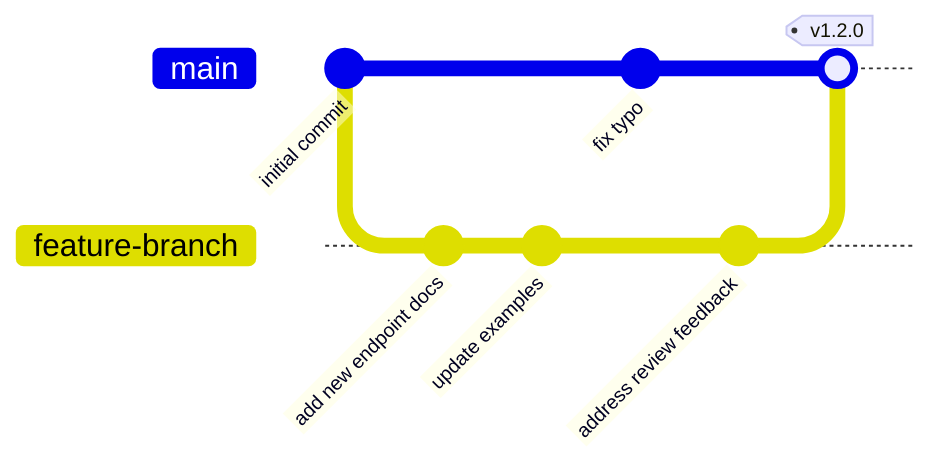

# Tools & Techniques

Essential tools and methods for API documentation workflows.
From version control to interactive documentation generators,
this section covers the software, platforms, and practices used
to create, test, verify, and publish API documentation.

**Git branch workflow example:**



---

## branch

**Definition**: version control concept and Git feature; a parallel
version of a repository, enabling users to work on changes without
affecting the main codebase

**Purpose**: enables many developers to work on different features
simultaneously - in API documentation workflows, branches allow
users to draft documentation updates independently before merging
them into the published version

**Related Terms**: [dev branch](#dev-branch), [feature branch](#feature-branch),
[main branch](#main-branch), [merge](#merge), [rebase](#rebase)

**Source**: UW API Docs: Module 2, Lesson 1, "Getting Started with Git"

---

## cherry-pick

**Definition**: version control concept and Git feature; copy selected
commits from one branch to another without merging the entire branch

**Purpose**: allows users to port specific documentation fixes
or updates between branches without bringing along
unrelated changes

**Related Terms**: [branch](#branch), [commit](#commit),
[merge](#merge)

**Source**: UW API Docs: Module 2, Lesson 1, "Getting Started with Git"

---

## CI/CD pipeline

**Definition**: acronym for Continuous Integration/Continuous Deployment pipeline;
an automated workflow that builds, tests, and deploys code changes to production
environments with minimal manual intervention

**Purpose**: enables documentation teams to integrate automated documentation
testing into the software development lifecycle; allows docs-as-tests strategies to
run automatically whenever code or documentation changes, catching
documentation-product mismatches before deployment; validate and publish
documentation updates alongside product releases

**Example**: a documentation team configures their CI/CD pipeline to run
docs-as-tests validation during each pull request submission; if a developer's code
change breaks documented API examples, the pipeline fails and prevents the merge
until the team releases code and/or documentation fixes; when documentation passes
all tests, the pipeline automatically publishes updated docs to the production site

**Related Terms**: [Agile](workflows-methodologies.md#agile),
[docs-as-tests](workflows-methodologies.md#docs-as-tests),
[Documentation Development Life Cycle](workflows-methodologies.md#document-development-life-cycle),
[pull request](#pull-request)

**Sources**:

- [Docs as Tests: "Add Docs as Tests to Your CI/CD Pipeline with GitHub Actions"](https://www.docsastests.com/ci-with-github-actions)
- [James Tasse: "Docs as Tests: Part I - On a High Level"](https://jamestasse.tech/2025/05/29/docs-as-tests-on-a-high-level/)

---

## CLI

**Definition**: acronym for Command Line Interface; a text-based interface where
users interact with software by typing commands rather than clicking graphical
elements

**Purpose**: enables developers and technical users to automate tasks, script
workflows, and integrate tools into their development environments; many APIs
provide CLI tools as alternatives to direct API calls, offering simplified
command syntax and built-in authentication handling; documentation teams must
document CLI commands, arguments, flags, and expected outputs

**Example**: [GitHub CLI](https://cli.github.com/) allows developers to run
`gh api repos/owner/repo` instead of manually constructing HTTP requests with
authentication headers; documentation describes each command's syntax, required
arguments, optional flags, and example outputs; docs-as-tests validates that
documented CLI commands execute successfully and produce expected results

**Related Terms**: [API](core-concepts.md#api),
[docs-as-tests](workflows-methodologies.md#docs-as-tests),
[GUI](#gui), [REST API](api-types-architectures.md#rest-api), [UI](#ui)

**Sources**:

- [Boffin Education: "About Docs as Tests" by Manny Silva](https://boffin.education/about-docs-as-tests/)
- [Manny Silva, Docs as Tests: "Validate Commands and Scripts with Doc Detective"](https://www.docsastests.com/validate-scripts-with-doc-detective)

---

## clone

**Definition**: version control concept and Git feature; a copy of a
repository that lives on a user's local computer rather than on GitHub

**Purpose**: enables users to work on API documentation locally,
using their preferred text editor and build tools, before pushing
changes back to the remote repository

**Related Terms**: [fork](#fork), [origin repository](#origin-repository),
[pull](#pull), [push](#push), [upstream repository](#upstream-repository)

**Source**: UW API Docs: Module 2, Lesson 1, "Getting Started with Git"

---

## commit

**Definition**: version control concept and Git feature; a repository
snapshot at a specific point-in-time, identified by commit hash

**Purpose**: creates a trackable history of documentation changes;
each commit represents a logical unit of work such as "add
authentication endpoints" or "fix typo in rate limiting docs"

**Related Terms**: [cherry-pick](#cherry-pick), [commit hash](#commit-hash),
[pull](#pull), [push](#push), [squash](#squash)

**Source**: UW API Docs: Module 2, Lesson 1, "Getting Started with Git"

---

## commit hash

**Definition**: version control concept and Git feature; a unique
alphanumeric automatically generated for each commit in a Git repository

**Purpose**: enables precise referencing of specific documentation
versions; use commit hashes to troubleshoot issues,
track published content, or revert to previous states

**Example**: `a3f2b1c` refers to a specific commit with
authentication endpoint updates

**Formatting Note**: commonly represented as
40-character strings, but Git displays shortened versions
that are 7-characters long, can be longer depending on
the repository size to ensure uniqueness

**Related Terms**: [branch](#branch), [cherry-pick](#cherry-pick),
[commit](#commit)

**Source**: UW API Docs: Module 2, Lesson 1, "Getting Started with Git"

---

## cURL

**Definition**: an acronym for "client URL" - a command-line tool
available on Windows, macOS, and Linux that sends and receives HTTP
and HTTPS requests

**Purpose**: enables communication with web services and API testing
without a web browser; supports scripting and automation by combining
with other command-line tools, with output displayable in the terminal
or saved to files; essential for testing API endpoints during
documentation development

**Example**: `curl -X GET https://api.example.com/users`
retrieves user data from an API endpoint

**Related Terms**: [json-server](#json-server),
[REST API](api-types-architectures.md#rest-api), [Postman](#postman),
[Swagger](#swagger)

**Further Reading**:

- [everything.curl.dev](https://everything.curl.dev/index.html)
- [Geeks for Geeks: "curl Command in Linux with Examples"](https://www.geeksforgeeks.org/linux-unix/curl-command-in-linux-with-examples/)
- [IBM Developer: "What is cURL and how does it relate to APIs?"](https://developer.ibm.com/articles/what-is-curl-command/)

**Sources**:

- UW API Docs: Module 3, Lesson 3, "Introduction to json-server, cURL, and Postman"
- UW API Docs: Module 5, Lesson 3, "API Test and Documentation Tools"

---

## dev branch

**Definition**: version control concept; short for
"development" branch - a version of the repository actively
undergoing development, separate from the published `main` branch

**Purpose**: provides a testing ground for documentation
changes before publishing; users can stage many updates,
review them collectively, and ensure all changes work
together before merging to main

**Related Terms**: [branch](#branch), [feature branch](#feature-branch),
[main branch](#main-branch), [merge](#merge), [pull request](#pull-request)

**Source**: UW API Docs: Module 2, Lesson 1, "Getting Started with Git"

---

## feature branch

**Definition**: version control concept; a development
branch dedicated to work on a specific feature or documentation update

**Purpose**: isolates changes for a particular API endpoint,
guide, or documentation section and allows parallel work on
many documentation tasks without conflicts; delete after
merging into the `main` branch

**Example**: a branch names `docs/add-webhook-guide` contains
only the documentation for a new webhook feature

**Related Terms**: [branch](#branch), [dev branch](#dev-branch),
[main branch](#main-branch), [merge](#merge), [pull request](#pull-request)

**Source**: UW API Docs: Module 2, Lesson 1, "Getting Started with Git"

---

## fork

**Definition**: version control concept and Git feature; a personal copy
of another user's repository that lives in a GitHub account

**Purpose**: enables contributions to open source API
documentation without requiring direct write access to the
original repository; contributors make changes in their
fork, then submit pull requests to the upstream repository

**Related Terms**: [clone](#clone), [pull request](#pull-request),
[repository](#repository), [upstream repository](#upstream-repository)

**Source**: UW API Docs: Module 2, Lesson 1, "Getting Started with Git"

---

## force push

**Definition**: version control concept and Git feature; move changes
to a remote repository that rewrites commits already present in
that repository

**Purpose**: allows cleanup of commit history in feature
branches, particularly after rebasing or squashing commits -
only use on personal dev branches, never on shared
branches like `main`

**Related Terms**: [dev branch](#dev-branch), [feature branch](#feature-branch),
[push](#push), [rebase](#rebase), [squash](#squash)

**Source**: UW API Docs: Module 2, Lesson 1, "Getting Started with Git"

---

## Git

**Definition**: command-line program that executes version control
functions for tracking changes in files

**Purpose**: enables collaborative API documentation workflows where
many writers can work simultaneously, track revision history, and
maintain published versions separate from draft content

**Core Git Concepts**:

| Term | Brief Definition |
| -------- | --------- |
| branch | parallel version of a repository |
| clone | local copy of a repository |
| commit | repository snapshot at a specific point-in-time |
| fork | personal copy of another user's repository |
| merge | move changes from one branch into another |
| pull | fetch changes from a remote repository |
| push | move local changes to a remote repository |
| rebase | update the base commit from its source branch |
| squash | bundle many commits into a single commit |

**Related Terms**: [docs-as-code](workflows-methodologies.md#docs-as-code),
[Git Bash](#git-bash), [GitHub](#github), [GitHub Desktop](#github-desktop)

**Source**: UW API Docs: Module 2, Lesson 1, "Getting Started with Git"

---

## Git Bash

**Definition**: command-line interface for Windows that emulates
the Unix Bash command line

**Purpose**: provides Windows users access to Git
commands and Unix-style terminal operations; enables
Windows users to execute the same Git commands as macOS and
Linux users, who already have native Bash terminals, creating
consistent workflows across all operating systems

**Key clarification**: when downloading
[Git for Windows](https://git-scm.com/), Git Bash is part of the
installation, while macOS users install Git either through the same
site or [Homebrew](https://brew.sh/) and user their existing
Terminal app

**Related Terms**: [Git](#git), [GitHub](#github),
[GitHub Desktop](#github-desktop)

**Sources**:

- [Software Freedom Conservancy: Git-SCM Homepage](https://git-scm.com/)
- UW API Docs: Module 2, Lesson 1, "Getting Started with Git"

---

## GitHub

**Definition**: cloud-based platform that provides storage,
version control, and automation services for Git repositories

**Purpose**: hosts remote repositories for API documentation
projects, enabling team collaboration, automated deployments,
and integrated workflows; provides web-based tools for
code review, issue tracking, and continuous integration that
complement local Git operations

**Related Terms**: [docs-as-code](workflows-methodologies.md#docs-as-code),
[Git](#git), [Git Bash](#git-bash), [GitHub Desktop](#github-desktop)

**Sources**:

- [GitHub, Inc.: GitHub Homepage](https://github.com/)
- UW API Docs: Module 2, Lesson 1, "Getting Started with Git"

---

## GitHub Desktop

**Definition**: graphical user interface - GUI - app that
manages GitHub repositories

**Purpose**: offers a visual alternative to command-line
Git operations; allows documentation teams to commit changes,
manage branches, and sync repositories without memorizing
Git commands, making version control more accessible to
non-technical writers

**Related Terms**: [Git](#git), [Git Bash](#git-bash),
[GitHub](#github), [GUI](#gui), [repository](#repository),
[UI](#ui)

**Sources**:

- [GitHub, Inc.: GitHub Desktop Homepage](https://github.com/apps/desktop)
- UW API Docs: Module 2, Lesson 1, "Getting Started with Git"

---

## GUI

**Definition**: acronym for graphical user interface;
a form of user interface that allows users to interact with
software through graphical icons, visual indicators, and pointing
devices rather than text-based commands

**Purpose**: GUI design principles inform API documentation
when explaining visual elements, interface components, and user
interactions; documentation often needs to describe both GUI
applications that consume APIs and developer tools with graphical
interfaces for API testing and exploration

**Example**: a REST API documentation portal with clickable endpoints,
visual request builders, and interactive response viewers provides
a GUI for developers to explore the API without writing code first

**Related Terms**: [CLI](#cli), [Postman](#postman),
[Swagger](#swagger), [UI](#ui)

**Source**: UW API Docs: Module 3, Lesson 3, "Introduction to json-server, cURL, and Postman"

---

## json-server

**Definition**: a [Node.js](https://nodejs.org/en)
tool that creates a mock REST API from a JSON file;
commonly referred to as "json-server" in lowercase when
discussing
[the npm package](https://www.npmjs.com/package/json-server),
while "JSON Server" is often used in a more general context
to describe the tool itself

**Purpose**: allows documentation writers and developers to
prototype and test API documentation without a live backend;
generates a fully functional REST API with CRUD operations -
create, read, update, delete - using methods
`GET`, `POST`, `PUT`, and `DELETE` based on a
streamlined JSON structure, enabling realistic examples
and testing scenarios

**Example**: a `db.json` file with user data automatically
creates REST endpoints: `/users` returns all users,
`/users/1` returns the user with `id` 1

**Related Terms**: [cURL](#postman), [Postman](#postman),
[REST API](api-types-architectures.md#rest-api), [Swagger](#swagger)

**Sources**:

- [JSON Server Homepage](https://json-server.dev/)
- UW API Docs: Module 3, Lesson 3, "Introduction to json-server, cURL, and Postman"

---

## main branch

**Definition**: version control concept; the default branch of
a repository containing the published, released, or trusted
version of content

**Purpose**: represents the single source of truth for live
API documentation; all feature branches merge into `main`,
and development systems typically publish documentation
directly from this branch

**Related Terms**: [branch](#branch), [dev branch](#dev-branch),
[docs-as-code](workflows-methodologies.md#docs-as-code),
[feature branch](#feature-branch), [merge](#merge)

**Source**: UW API Docs: Module 2, Lesson 1, "Getting Started with Git"

---

## Markdown

**Definition**: lightweight markup language created by John Gruber in 2004

**Purpose**: popular for writing documentation - designed to format plain
text documents and allows users to add elements like headers,
links, lists, and tables

**Related Terms**: [Git](#git), [Git Bash](#git-bash), [GitHub](#github),
[Vale](#vale)

**Sources**:

- [Markdown Guide: Markdown Cheat Sheet](https://www.markdownguide.org/cheat-sheet/)
- UW API Docs: Canvas General Forum

---

## merge

**Definition**: version control concept and Git feature; move changes from
one branch into another branch, combining their histories

**Purpose**: integrates completed documentation updates
from feature branches into the `main` branch for
publication; the merge process preserves the commit
history from both branches

**Related Terms**: [branch](#branch), [merge conflict](#merge-conflict),
[pull request](#pull-request), [rebase](#rebase)

**Source**: UW API Docs: Module 2, Lesson 1, "Getting Started with Git"

---

## merge commit

**Definition**: version control concept and Git feature; a commit
in which, after branching, integrates changes from a feature branch
with updates that occurred in the original branch

**Purpose**: bundles all commits from a feature branch
together with updates to `main` into a single commit,
marking the exact point when the feature branch
merged into `main`

**The Tradeoff**: merge commits create a branched
history structure that's more complex to navigate than
a linear commit sequence; they're _clear markers_ as in,
"this feature was added here" - but _create complex graphs_
with lots of branches splitting and rejoining

**Related Terms**: [commit](#commit), [feature branch](#feature-branch),
[merge](#merge), [rebase](#rebase), [squash](#squash)

**Source**: UW API Docs: Module 2, Lesson 1, "Getting Started with Git"

---

## merge conflict

**Definition**: version control concept and Git feature; situation where
two commits contain changes to the same file that Git can't automatically
resolve

**Purpose**: requires manual intervention to decide which changes
to keep; common in collaborative documentation environments
when many writers edit the same page simultaneously

**Example**: two writers update the same API endpoint
description - Git flags the conflict and requests manual
resolution before completing the merge; resolution can
sometimes be in the GitHub UI directly, but some conflicts
are too complex and require resolution from the text editor

**Related Terms**: [branch](#branch), [commit](#commit),
[merge](#merge), [pull request](#pull-request)

**Source**: UW API Docs: Module 2, Lesson 1, "Getting Started with Git"

---

## origin repository

**Definition**: version control concept; the default
upstream repository, typically the clone source repository

**Purpose**: serves as the primary remote destination when
pushing local documentation changes; Git automatically
configures origin when cloning a repository

**Related Terms**: [clone](#clone), [pull](#pull),
[push](#push), [repository](#repository),
[upstream repository](#upstream-repository)

**Source**: UW API Docs: Module 2, Lesson 1, "Getting Started with Git"

---

## Postman

**Definition**: API development platform for designing, testing,
documenting, and monitoring APIs through a graphical interface

**Purpose**: commonly used for REST API development and testing
workflows; enables API testing and exploration without
command-line tools; provides a [GUI](#gui) alternative to cURL
for making HTTP requests, supports automated test suites, collection
sharing, and API documentation generation

**Related Terms**: Bruno, [cURL](#curl), [GUI](#gui),
[json-server](#json-server), [REST API](api-types-architectures.md#rest-api),
[Swagger](#swagger), [UI](#ui)

**Sources**:

- UW API Docs: Module 3, Lesson 3, "Introduction to json-server, cURL, and Postman"
- [Postman, Inc.: "What is Postman?"](https://www.postman.com/product/)

---

## Protocol Buffers

**Definition**: language and platform neutral mechanism for serializing
structured data developed by Google; uses `.proto` files to define data
schemas that compile into efficient binary format

**Purpose**: "like JSON, except smaller and faster, and it generates
native language bindings" -  provides compact, fast serialization for gRPC
APIs and other high-performance systems; enables strongly typed contracts
between services

**Example**: a `.proto` file defines a user message with fields like
`string_name` and `int32_id`, which compiles into classes for many
programming languages

**Related Terms**: [API](core-concepts.md#api),
[gRPC API](api-types-architectures.md#graphql-api),
[schema](core-concepts.md#schema), [serialization](core-concepts.md#serialization)

**Source**: [Google, LLC: Protocol Buffers Documentation: "Overview"](https://protobuf.dev/overview/)

---

## pull

**Definition**: version control concept and Git feature; fetch changes
from a remote repository and integrating them into the local branch

**Purpose**: keep local documentation copies synchronized
with remote changes made by other team members; running
`git pull` before starting work prevents merge conflicts

**Related Terms**: [clone](#clone), [merge](#merge),
[origin repository](#origin-repository), [pull request](#pull-request),
[push](#push)

**Source**: UW API Docs: Module 2, Lesson 1, "Getting Started with Git"

---

## pull request

**Definition**: also known as a PR; version control concept and GitHub feature;
invites repository maintainers to review and merge changes from one branch or
fork into their repository

**Purpose**: enables peer review of documentation changes
before publication; team members can comment on specific
lines, suggest edits, and approve or request changes
before merging

**Related Terms**: [branch](#branch), [CI/CD pipeline](#cicd-pipeline),
[docs-as-code](workflows-methodologies.md#docs-as-code),
[feature branch](#feature-branch), [fork](#fork), [merge](#merge)

**Source**: UW API Docs: Module 2, Lesson 1, "Getting Started with Git"

---

## push

**Definition**: version control concept and Git feature; move local
commits to a remote repository

**Purpose**: shares documentation changes with the team
by uploading commits from a local machine to GitHub;
enables collaboration and backs up work to the remote
repository

**Related Terms**: [commit](#commit), [force push](#force-push),
[origin repository](#origin-repository), [pull](#pull)

**Source**: UW API Docs: Module 2, Lesson 1, "Getting Started with Git"

---

## rebase

**Definition**: version control concept and Git feature; updates
the base commit from the source branch, relocating commits to
appear after current commits in the target branch

**Purpose**: maintains a clean, linear commit history in the
`main` branch; resyncs feature branches with `main` after the
source branch changes, making documentation history easier to
follow than merge commits

**The Tradeoff**: rebasing rewrites commit history, which
can cause problems on shared branches where others have based
work on the original commits; complex rebases may require
resolving the same conflict across many commits, and
rebasing becomes impossible if the branch already contains
merge commits or squashed history

**Related Terms**: [branch](#branch), [commit](#commit),
[feature branch](#feature-branch), [force push](#force-push),
[merge](#merge), [squash](#squash)

**Source**: UW API Docs: Module 2, Lesson 1, "Getting Started with Git"

---

## repository

**Definition**: also known as "repo"; a storage location for files under Git
version control that tracks the complete history of changes

**Purpose**: contains all API documentation source files,
configuration, and revision history; serves as the central
hub for collaborative documentation work

**Related Terms**: [branch](#branch), [clone](#clone),
[fork](#fork), [Git](#git), [GitHub](#github)

**Source**: UW API Docs: Module 2, Lesson 1, "Getting Started with Git"

---

## RFC

**Definition**: acronym for Request for Comments; numbered technical documents
published by the IETF - Internet Engineering Task Force - that define standards,
protocols, and procedures for internet technologies

**Purpose**: RFCs provide authoritative specifications for protocols
like HTTP, HTTPS, and other web standards; API documentation writers
reference RFCs to ensure accurate technical descriptions and link to
them as sources for protocol definitions and behavior

**Example**: when documenting HTTP status codes, writers cite
[IETF RFC 9110 - HTTP Semantics](https://www.rfc-editor.org/rfc/rfc9110.html)
as the authoritative source; RFC numbers, such as RFC 9110, provide
a permanent, verifiable reference that remains accessible even as
web pages change

**Related Terms**: [HTTP](core-concepts.md#http), [HTTPS](core-concepts.md#https),
[REST API](api-types-architectures.md#rest-api)

**Sources**:

- [Geeks for Geeks: "RFC (Request For Comment)"](https://www.geeksforgeeks.org/computer-networks/rfc-request-for-comment/)
- [IETF: About Page](https://www.ietf.org/about/)

---

## squash

**Definition**: version control concept and Git feature; combining
many commits into a single commit

**Purpose**: allows writers to save small, incremental commits
during work while condensing them into one logical unit before
creating a pull request or merging; creates cleaner
documentation history by grouping related changes

**Example**: ten commits like "fix typo," "clean whitespace"
become one commit: "Add OAuth 2.0 authentication guide"

**Related Terms**: [commit](#commit), [merge](#merge),
[pull request](#pull-request), [rebase](#rebase)

**Source**: UW API Docs: Module 2, Lesson 1, "Getting Started with Git"

---

## Swagger

**Definition**: suite of open source tools for designing, building,
documenting, and testing REST APIs based on the OpenAPI Specification

**Purpose**: provides practical tooling to work with OpenAPI Specification
(OAS) documents; enabling visual editing, interactive documentation,
and code generation from a single OAS source file

**Common Swagger tools**:

- [Swagger UI](https://swagger.io/tools/swagger-ui/) -
Generates interactive API documentation from OAS files
- [Swagger Editor](https://editor.swagger.io/) -
Web-based editor for creating and editing OAS documents
- [Swagger Codegen](https://swagger.io/tools/swagger-codegen/) -
Generates client libraries and server stubs from OAS files

**Related terms**: [GUI](#gui),
[OpenAPI Specification](core-concepts.md#openapi-specification),
[REST API](api-types-architectures.md#rest-api)

**Source**: [SmartBear Software: "What is Swagger"](https://swagger.io/docs/specification/v2_0/what-is-swagger/)

---

## upstream repository

**Definition**: version control concept; the original, source repository of a fork

**Purpose**: serves as the authoritative source for open source
documentation projects; contributors sync their forks with
the upstream repo to incorporate the latest changes before
creating pull requests

**Related Terms**: [clone](#clone), [fork](#fork),
[origin repository](#origin-repository), [pull](#pull),
[repository](#repository)

**Source**: UW API Docs: Module 2, Lesson 1, "Getting Started with Git"

---

## UI

**Definition**: acronym for user interface; space where interactions
between humans and machines occur; includes all visual elements, controls,
and interaction patterns that allow users to communicate with software or
hardware systems

**Purpose**: API documentation often needs to describe UI elements, explain
how API responses appear in user interfaces, or clarify the relationship
between backend API capability and frontend display; understanding UI terminology
helps technical writers bridge the gap between developer-focused API
specifications and user-facing product behavior

**Example**: a REST API returns JSON data that populates a dashboard's user
interface, where buttons, forms, and data visualizations allow users to
interact with the underlying system; documentation might specify which UI
elements trigger specific API calls or how API responses render in the interface

**Related Terms**: [API endpoint](core-concepts.md#api-endpoint),
[CLI](#cli), [GUI](#gui), [REST API](api-types-architectures.md#rest-api)

**Source**: UW API Docs: Module 3, Lesson 3, "Introduction to json-server, cURL, and Postman"

---

## Vale

**Definition**: an open source command-line tool for linting prose and enforcing
editorial style rules in documentation

**Purpose**: maintains consistency in technical writing by automatically checking
documentation against customizable style guides; catches grammar errors,
terminology inconsistencies, and style violations; integrates with docs-as-code
workflows and CI/CD pipelines to enforce writing standards before publishing;
supports multiple style guides including Microsoft, Google, and
custom rules

**Example**: a documentation team configures Vale to enforce their API documentation
style guide, which requires using "endpoint" instead of "API call" and prohibits
passive voice in code examples; when a writer submits a pull request with
documentation that violates these rules, Vale flags the issues in the CI/CD pipeline,
preventing merge until the team releases corrections

**Related Terms**: [CI/CD pipeline](#cicd-pipeline),
[docs-as-code](workflows-methodologies.md#docs-as-code),
[Markdown](#markdown), [pull request](#pull-request)

**Sources**:

- [JD Kato, Vale: Official Documentation](https://vale.sh/)
- [Manny Silva, Docs as Tests: "Tools"](https://www.docsastests.com/tools)

---

## version control

**Definition**: system that tracks changes in documents
and other files over time

**Purpose**: records the complete history of documentation
changes, enabling teams to see who made what changes and when,
revert to previous versions, and work on many updates
simultaneously without overwriting each other's work; Git
repositories store projects under the control of the project
owner, who can grant access or require contributors to fork
the repository to their own GitHub account

**Related Terms**: [branch](#branch), [commit](#commit),
[docs-as-code](workflows-methodologies.md#docs-as-code),
[Git](#git), [Git Bash](#git-bash), [GitHub](#github),
[repository](#repository)

**Source**: UW API Docs: Module 2, Lesson 1, "Getting Started with Git"

---

## workspace

**Definition**: version control concept; the directory on a local
computer that contains cloned repositories

**Purpose**: provides the local environment where writers
edit documentation files, test builds, and prepare commits
before pushing to remote repositories

**Related Terms**: [clone](#clone), [fork](#fork),
[repository](#repository)

**Source**: UW API Docs: Module 2, Lesson 1, "Getting Started with Git"

---

## XML

**Definition**: acronym for Extensible Markup Language; a text-based
format for representing structured data using tags like HTML,
commonly used for data exchange in APIs and configuration files

**Purpose**: provides a standardized way to encode documents and data
that's both human-readable and machine-parsable; while JSON has
essentially replaced XML in modern REST APIs, XML remains important
in enterprise systems, SOAP APIs, and legacy integrations

**Example**: representing a user in XML format

```xml
<?xml version="1.0" encoding="UTF-8"?>
<user>
  <id>123</id>
  <firstName>Jane</firstName>
  <lastName>Doe</lastName>
  <email>jane.doe@example.com</email>
</user>
```

| Aspect | XML | JSON |
| ---------------- | ---------------- | ---------------- |
| Syntax | Tag-based with opening/closing tags | Key-value pairs with braces |
| Verbosity | More verbose | More concise |
| Data types | Everything is text | Supports numbers, booleans, `null` |
| Common use | SOAP APIs, enterprise systems | REST APIs, web applications |

**Related Terms**: [JSON](core-concepts.md#json), [payload](core-concepts.md#payload),
[REST API](api-types-architectures.md#rest-api), [serialization](core-concepts.md#serialization),
[SOAP API](api-types-architectures.md#soap-api)

**Source**: [W3C: "Extensible Markup Language (XML)"](https://www.w3.org/XML/)

---
