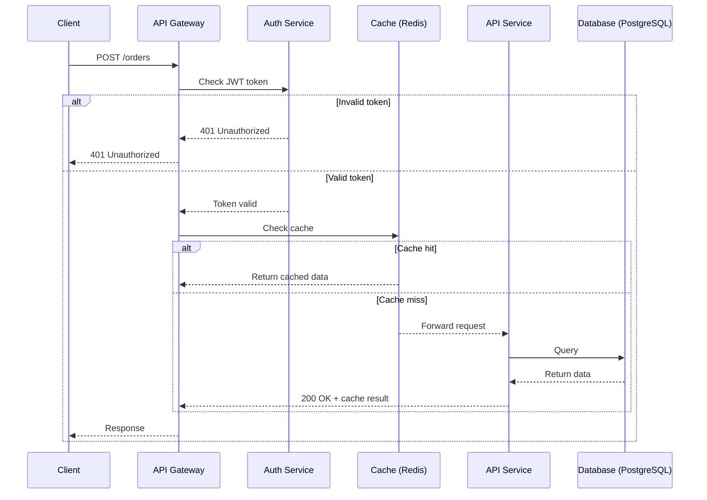

# Diagramming & Visualization

Tools and techniques for creating visual representations of technical concepts,
system architectures, and workflows in API documentation. From straightforward
flowcharts to complex infrastructure diagrams, this section covers software and
approaches for making abstract concepts concrete and scannable to serve
diverse reader needs.

---

## C4 model

**Definition**: hierarchical approach to software architecture diagrams consisting
of four levels - _Context, Containers, Components, and Code_; each level provides
different abstraction for a different audience; created by software architect Simon
Brown between 2006 and 2011

**Purpose**: provides consistent framework for API architecture documentation that
serves both high-level stakeholders and implementation-focused developers;
enables architects to communicate system design at the right level of detail
for each audience without creating separate ad-hoc diagrams

### the four levels

| **Number** | **Name** | **Abstraction** | **Shows** | **Audience** |
| --------- | --------------- | --------- | ------------ | --------- |
| 1 | Context | Highest | How the system fits in the broader environment - users, external systems, integrations | Technical and non-technical; executives, product, architects, developers |
| 2 | Container | High | Applications, data stores, microservices, and how they communicate | Architects, developers, product; high-level technical audiences |
| 3 | Component | Low | Internal components within each container and their interactions | Architects and developers; low-level technical audiences |
| 4 | Code | Lowest | Implementation details - classes, modules, relationships; often auto-generated from code | Architects and developers; rarely used in practice as it can go into too much detail for most teams |

**Example**: documenting a payments API using all four levels -

- **Context**: payment system interacts with customers, merchants, and a third-party banking API
- **Container**: API Gateway → Auth Service → Payment Service → PostgreSQL database
- **Component**: Payment Service contains Invoice module, Fraud Detection module, and Ledger module
- **Code**: class diagram showing how Invoice and Ledger classes relate, _optional_

**Why this belongs in `Tools & Techniques`**: describes a technique
for structuring and communicating software architecture visually rather
than a workflow methodology or organizational framework; while
notation-independent and tool-independent, C4 is a practical technique
applied at the diagram level - Structurizr and PlantUML are tools that
implement it, but C4 itself belongs with the techniques that guide how docs
teams create architecture diagrams

**Related Terms**: [diagram](#diagram), [PlantUML](#plantuml),
[Structurizr](#structurizr), [UML](#uml)

**Sources**:

- [Simon Brown: "The C4 Model - Visualising Software Architecture"](https://c4model.com/)
- [Wikipedia: "C4 model"](https://en.wikipedia.org/wiki/C4_model)

---

## D2

**Definition**: modern DSL that turns text to diagrams; declarative diagramming
language designed for software architecture diagrams with contemporary syntax and
extensive layout options

**Purpose**: provides more expressive
[diagram-as-code](https://dev.to/r_elena_mendez_escobar/diagram-as-code-creating-dynamic-and-interactive-documentation-for-visual-content-2p93)
capabilities than Mermaid for complex system architectures while maintaining
text-based version control benefits

**Example**: define a microservices architecture in D2 syntax with containers,
connections, and styling that renders as a professional architecture diagram -

```shell
api: API Gateway {
  style.fill: "#d4e8ff"
}
lambda: Lambda Functions
db: DynamoDB

api -> lambda: REST requests
lambda -> db: Query data
```

**Related Terms**: [diagram](#diagram), [diagrams-as-code](../workflows-methodologies.md#diagrams-as-code),
[docs-as-code](../workflows-methodologies.md#docs-as-code), [DSL](#dsl),
[Ilograph](#ilograph), [Mermaid](#mermaid), [PlantUML](#plantuml),
[Structurizr](#structurizr), [UML](#uml)

**Sources**:

- [Terrastruct, Inc.: "D2: Declarative Diagramming"](https://d2lang.com/)
- [Terrastruct, Inc., Homepage: "The diagramming tool for developers"](https://terrastruct.com/)

---

## diagram

**Definition**: visual representation of a system, process, or concept
that communicates technical information more efficiently than prose alone;
in API documentation, diagrams typically represent architecture, data flows,
sequences, or relationships between components

**Purpose**: helps docs teams select the appropriate visual type for
the information they need to communicate; different diagram types serve
different audiences and answer different questions, and choosing the wrong
type forces readers to extract information the diagram wasn't designed
to convey

### common API docs diagrams

| Type | What It Shows | Best For | Common Tools |
| ---- | ------------- | -------- | ------------ |
| **Architecture** | structural relationships between systems, services, and infrastructure | API system overviews, microservices topology, deployment context | D2, PlantUML, C4 model, Python Diagrams |
| **ERD - _Entity-Relationship_** | data models and relationships between entities | documenting API resource structures and database schemas | PlantUML, draw.io, Lucidchart |
| **Flowchart** | decision points and branching logic in a process | error handling flows, onboarding decision trees, conditional API behavior | Mermaid, draw.io, Excalidraw |
| **Graph** | nodes and edges showing connections or dependencies | API dependency maps, knowledge graphs, network topologies | Graphviz DOT, D2 |
| **Mind Map** | hierarchical branching from a central concept | documentation planning, API feature overviews, taxonomy visualization | PlantUML, draw.io |
| **Sequence** | time-ordered interactions between systems or components | documenting API request-response flows, authentication steps, webhook event chains | Mermaid, PlantUML |

**Example**: documenting a payment API requires multiple diagram types
to serve different reader needs -

- **Architecture Diagram**: shows how the payment service, fraud detection
service, and database relate within the broader system
- **ERD**: shows the relationships between `Payment`, `Transaction`,
`Refund`, and `Webhook` resources
- **Flowchart**: shows decision logic for handling payment failures,
retries, and fallback behavior
- **Sequence Diagram**: shows the step-by-step flow of a payment
transaction from client request through auth, processing, and webhook callback

**Related Terms**: [C4 model](#c4-model), [D2](#d2),
[diagrams-as-code](../workflows-methodologies.md#diagrams-as-code),
[draw.io](#drawio), [DSL](#dsl), [Excalidraw](#excalidraw),
[Ilograph](#ilograph), [knowledge graph](../ai-and-apis.mdx#knowledge-graph),
[Lucidchart](#lucidchart), [Mermaid](#mermaid), [PlantUML](#plantuml),
[Python Diagrams](#python-diagrams), [Structurizr](#structurizr),
[SVG](#svg), [UML](#uml)

**Sources**:

- [draw.io Ltd, blog: "The many types of technical diagrams"](https://www.drawio.com/blog/types-of-technical-diagrams)
- [Google Developer Documentation Style Guide: "Diagrams, figures, and other images"](https://developers.google.com/style/images)
- [Wikipedia: "Diagram"](https://en.wikipedia.org/wiki/Diagram)

---

## draw.io

**Definition**: also known as `diagrams.net` - free, open source diagramming tool
for creating flowcharts, network diagrams, UML diagrams, and technical architecture
visualizations

**Purpose**: enables tech writers to create professional diagrams without licensing
costs; supports export to multiple formats including PNG, SVG, and PDF for embedding
in documentation

**Example**: create an AWS architecture diagram showing API Gateway → Lambda → DynamoDB
flow with proper AWS service icons, then export as SVG for docs embedding

**Related Terms**: [diagram](#diagram), [Excalidraw](#excalidraw), [Ilograph](#ilograph),
[Lucidchart](#lucidchart), [SVG](#svg), [UML](#uml)

**Sources**:

- [draw.io Ltd Homepage: "Security-first diagramming for teams"](https://www.drawio.com/)
- [Wikipedia: "diagrams.net"](https://en.wikipedia.org/wiki/Diagrams.net)

---

## DSL

**Definition**: acronym for _domain-specific language_; a programming or
specification language designed for a particular domain, problem space, or
tool rather than general-purpose software development

**Purpose**: helps tech writers understand and document the specialized
syntax and conventions that appear across API documentation tooling;
particularly relevant in diagramming and visualization contexts, where
many tools - D2, Mermaid, PlantUML - use their own DSL to define
diagrams as text rather than through graphical interfaces

**Why this belongs in `Diagramming & Visualization`**: DSL appears
repeatedly as a characteristic of diagramming tools that API docs
teams use; understanding that a tool has its own DSL shapes how writers
document it, explaining not just what the tool produces but how users
write in it, including its syntax rules, constraints, and vocabulary;
while DSLs exist across _many tool categories_, diagramming tools represent
the most consistent and concentrated use of the term in API docs contexts

**Example**: common tools, including diagramming tools, used in API docs
that implement their own DSL -

| Tool | DSL Style | Example Syntax |
| ---- | --------- | -------------- |
| Cucumber / Gherkin | Gherkin syntax | `Given / When / Then` scenario structure for docs-as-tests workflows |
| D2 | Declarative text syntax | `server -> database: query` defines a connection with a label |
| GraphQL | GraphQL schema definition language | type definitions, queries, mutations, and resolver patterns |
| Graphviz DOT | Graph description language | `digraph { a -> b }` defines a directed graph |
| Markdown | Markdown syntax | formatting conventions, extensions, and rendering differences across platforms |
| Mermaid | Markdown-inspired text syntax | `graph TD; A-->B` defines a top-down flowchart |
| OpenAPI Specification | YAML/JSON schema syntax | structure, rules, and field conventions of the spec format |
| PlantUML | Keyword-based text syntax | `@startuml / @enduml` wraps sequence diagram definitions |

**Related Terms**: [Cucumber](testing-validation.md#cucumber), [D2](#d2),
[diagram](#diagram), [diagrams-as-code](../workflows-methodologies.md#diagrams-as-code),
[docs-as-code](../workflows-methodologies.md#docs-as-code),
[domain knowledge](../frameworks-strategy.md#domain-knowledge),
[graphQL API](../api-types-architectures.md#graphql-api),
[Markdown](documentation-specific.md#markdown), [Mermaid](#mermaid),
[Open API Specification](../core-concepts/documentation-specific.md#openapi-specification),
[PlantUML](#plantuml), [taxonomy](../frameworks-strategy.md#taxonomy), [UML](#uml)

**Sources**:

- [Martin Fowler: "Domain Specific Languags Guide"](https://martinfowler.com/dsl.html)
- [Wikipedia: "Domain-specific language"](https://en.wikipedia.org/wiki/Domain-specific_language)

---

## Excalidraw

**Definition**: open source sketching tool that creates hand-drawn style diagrams
with a minimalist interface and collaborative features

**Purpose**: provides quick, low-fidelity diagramming for documentation where
informal visual style aids comprehension without the overhead of polished graphics

**Example**: sketch a request-response flow between client and API server using
hand-drawn boxes and arrows that render instantly without design decisions

**Related Terms**: [diagram](#diagram), [draw.io](#drawio), [Lucidchart](#lucidchart),
[request-response](../core-concepts/api-fundamentals.md#request-response),
[SVG](#svg)

**Sources**:

- [Excalidraw Whiteboard](https://excalidraw.com/)
- [YouTube: "How to Use Excalidraw: Complete Beginner Tutorial (2026 Update)" by Lvl 99 TechSkillz](https://www.youtube.com/watch?v=OU83LfTIWn8)

---

## Ilograph

**Definition**: interactive diagramming tool for software architecture that creates
layered, explorable views of systems; renders navigable visualizations from
text and/or YAML files; available online,
[on-prem](https://www.ilograph.com/desktop/index.html),
and in
[Confluence Cloud](https://marketplace.atlassian.com/apps/1229877/ilograph-interactive-diagrams-for-confluence?tab=overview&hosting=cloud)

**Purpose**: enables docs teams to create architecture diagrams that users can
explore interactively, drilling down into different levels of system detail without
creating separate diagrams for each view

**Example**: define a microservices architecture once in Ilograph syntax, then users
can click to expand individual services to see their internal components, database
connections, and API endpoints

**Related Terms**: [D2](#d2), [diagram](#diagram),
[diagrams-as-code](../workflows-methodologies.md#diagrams-as-code),
[draw.io](#drawio), [Mermaid](#mermaid), [Structurizr](#structurizr),
[YAML](development-essentials.md#yaml)

**Sources**:

- [Ilograph LLC, Ilograph Homepage: "Diagram In Depth"](https://www.ilograph.com/)
- [Medium, IcePanel: "Top 7 diagrams as code tools for software architecture"](https://icepanel.medium.com/top-7-diagrams-as-code-tools-for-software-architecture-1a9dd0df1815)

---

## Lucidchart

**Definition**: web-based diagramming tool with real-time collaboration features,
extensive shape libraries, and integrations with documentation platforms

**Purpose**: enables teams to collaboratively create and maintain technical
diagrams with professional templates for system architecture, API flows, and
network topologies

**Example**: multiple technical writers simultaneously update a microservices
architecture diagram while integrating it with
[Confluence](https://www.atlassian.com/software/confluence) documentation

**Related Terms**: [diagram](#diagram), [draw.io](#drawio), [Excalidraw](#excalidraw)

**Sources**:

- [Lucid Software Inc., Lucidchart Homepage: "Diagramming powered by intelligence"](https://www.lucidchart.com/)
- [Wikipedia: "Lucidchart"](https://en.wikipedia.org/wiki/Lucidchart)

---

## Mermaid

**Definition**: JavaScript-based diagramming tool that renders text-based diagram
definitions into flowcharts, sequence diagrams, and other visualizations directly
in Markdown files; particularly common in docs workflows

**Purpose**: enables streamlined diagrams in API documentation through text markup
that renders visually in docs platforms supporting Mermaid syntax

**Example**: Mermaid sequence diagram showing API request flow without requiring
external image files -



**Related Terms**: [D2](#d2), [diagram](#diagram),
[diagrams-as-code](../workflows-methodologies.md#diagrams-as-code),
[docs-as-code](../workflows-methodologies.md#docs-as-code), [Ilograph](#ilograph),
[Markdown](documentation-specific.md#markdown), [MDX](documentation-specific.md#mdx),
[PlantUML](#plantuml), [UML](#uml)

**Sources**:

- [Mermaid Homepage: "Mermaid Starts Here"](https://mermaid.ai)
- [Wikipedia: "Mermaid (software)"](https://en.wikipedia.org/wiki/Mermaid_(software))

---

## PlantUML

**Definition**: DSL and text-based diagramming tool that generates
architecture, sequence, and UML diagrams from plain text markup; has
support for other software development related formats such as
[Archimate](https://en.wikipedia.org/wiki/ArchiMate),
[Block diagram](https://en.wikipedia.org/wiki/Block_diagram),
[BPMN - _Business Process Model and Notation_ -](https://en.wikipedia.org/wiki/Business_Process_Model_and_Notation),
[C4 model](https://en.wikipedia.org/wiki/C4_model),
[computer network diagram](https://en.wikipedia.org/wiki/Computer_network_diagram),
[ERD - _entity-relationship diagram_ -](https://en.wikipedia.org/wiki/Entity%E2%80%93relationship_model),
[Gantt chart](https://en.wikipedia.org/wiki/Gantt_chart),
[mind map](https://en.wikipedia.org/wiki/Mind_map), and
[WBD - _work breakdown structure_](https://en.wikipedia.org/wiki/Work_breakdown_structure) -
as well as visualisation of JSON and YAML files

**Purpose**: enables version-controlled diagrams in API documentation
through text-based source files that render visually in docs platforms;
supports multiple input languages and output formats making it adaptable
to diverse docs workflows and accessibility needs

**Language Support**: besides its own DSL, PlantUML understands
[AsciiMath](https://en.wikipedia.org/wiki/AsciiMath),
[Creole](https://en.wikipedia.org/wiki/Creole_(markup)),
[DOT](https://en.wikipedia.org/wiki/DOT_(graph_description_language)), and
[LaTeX](https://en.wikipedia.org/wiki/LaTeX) - making it interoperable with
other text-based docs and diagramming ecosystems

**Output Formats**: renders diagrams as PNG, SVG, LaTeX, and ASCII art -
notably, ASCII art output makes PlantUML diagrams consumable in
plain-text environments like terminals, email, and code comments

**Accessibility**: PlantUML's text-based input and ASCII art output
enables blind users to both design and read UML diagrams -
making it one of the few diagramming tools with meaningful accessibility
applications beyond visual rendering

**Example**: write text markup describing an API authentication sequence,
then render it automatically in documentation as a visual sequence diagram

```bash
@startuml
Client -> API: POST /auth/login
API -> Database: Validate credentials
Database --> API: User token
API --> Client: 200 OK {token}
@enduml
```

**Related Terms**: [C4 model](#c4-model), [D2](#d2), [diagram](#diagram),
[diagrams-as-code](../workflows-methodologies.md#diagrams-as-code),
[DSL](#dsl), [JSON](../core-concepts/api-fundamentals.md#json),
[Mermaid](#mermaid), [Python Diagrams](#python-diagrams), [Structurizr](#structurizr),
[UML](#uml), [YAML](development-essentials.md#yaml)

**Sources**:

- [PlantUML Homepage: "PlantUML at a Glance"](https://plantuml.com/)
- [PlantUML Web Server](http://www.plantuml.com)
- [Wikipedia: "PlantUML"](https://en.wikipedia.org/wiki/PlantUML)
- [Wikipedia: "Unified Modeling Language"](https://en.wikipedia.org/wiki/Unified_Modeling_Language)

---

## Python Diagrams

**Definition**: Python library that generates infrastructure architecture diagrams
using code; includes pre-built icons for
[AWS](https://aws.amazon.com/what-is-aws/),
[Azure](https://azure.microsoft.com/en-us), [GCP](https://cloud.google.com/),
[Kubernetes](https://kubernetes.io/), and other cloud services

**Purpose**: enables version-controlled, reproducible infrastructure diagrams in
API documentation through code rather than manual drawing tools

**Example**: write Python code that generates an AWS architecture diagram with
proper service icons, then commit both the code and output image to version control -

```python
from diagrams import Diagram
from diagrams.aws.compute import Lambda
from diagrams.aws.network import APIGateway
from diagrams.aws.database import Dynamodb

with Diagram("API Architecture"):
    APIGateway("API") >> Lambda("Function") >> Dynamodb("Database")
```

**Related Terms**: [commit](development-essentials.md#commit), [diagram](#diagram),
[diagrams-as-code](../workflows-methodologies.md#diagrams-as-code),
[docs-as-code](../workflows-methodologies.md#docs-as-code),
[PlantUML](#plantuml), [version control](development-essentials.md#version-control)

**Sources**:

- [Mingrammer: "Diagrams - Diagram as Code"](https://diagrams.mingrammer.com/)
- [Python Software Foundation: "diagrams 0.25.1"](https://pypi.org/project/diagrams/)

---

## Structurizr

**Definition**: toolset for creating software architecture diagrams based
on the C4 model - _Context, Containers, Components, Code_; uses a
domain-specific language to define architecture as code

**Purpose**: enables consistent, hierarchical architecture documentation
that maintains relationships between different abstraction levels in API docs

**Example**: define system architecture once in Structurizr DSL, then automatically
generate context diagrams for executives, container diagrams for architects, and
component diagrams for developers

**Related Terms**: [C4 model](#c4-model), [D2](#d2), [diagram](#diagram),
[DSL](#dsl), [Ilograph](#ilograph), [PlantUML](#plantuml), [UML](#uml)

**Source**:

- [Baeldung: "Intro to Structurizr"](https://www.baeldung.com/structurizr)
- [Structurizr Cloud Service, Structurizr Homepage: "Software architecture models as code"](https://structurizr.com/)

---

## SVG

**Definition**: acronym for _Scalable Vector Graphics_; an XML-based
markup language for describing two-dimensional based vector graphics;
essentially to graphics what HTML is to text; text-based image format
and open Web standard that supports interactivity and animation

**Purpose**: enables high-quality diagrams in API documentation that remain
crisp at any zoom level and can include interactive elements like clickable
regions or [tooltips](https://en.wikipedia.org/wiki/Tooltip)

**Example**: export architecture diagrams as SVG files that scale perfectly
across desktop and mobile documentation views without pixelation

**Related Terms**: [diagram](#diagram), [draw-io](#drawio),
[Excalidraw](#excalidraw), [XML](development-essentials.md#xml)

**Sources**:

- [Mozilla Corporation, MDN Web Docs: "SVG: Scalable Vector Graphics"](https://developer.mozilla.org/en-US/docs/Web/SVG)
- [Wikipedia: "SVG"](https://en.wikipedia.org/wiki/SVG)

---

## UML

**Definition**: acronym for _Unified Modeling Language_; standardized
visual modeling language for describing software systems through a
family of diagram types covering structure, behavior, and interaction

**Purpose**: provides a common visual vocabulary for documenting software
architecture and behavior in API documentation; understanding UML helps
writers recognize and document diagram types produced by tools like
PlantUML, draw.io, and Lucidchart, and communicate accurately with
engineers who use UML notation in architecture discussions

### UML diagrams in API docs

| Category | Diagram Type | What It Shows |
| -------- | ------------ | ------------- |
| **Structural** | Class Diagram | object types, properties, and relationships in an API's data model |
| **Structural** | Component Diagram | how system components and APIs connect and depend on each other |
| **Behavioral** | Activity Diagram | workflow logic, decision points, and branching in API processes |
| **Behavioral** | Sequence Diagram | time-ordered message exchanges between components in an API flow |
| **Behavioral** | State machine Diagram | how a resource changes state -`pending` → `processing` → `complete` |
| **Interaction** | Use Case Diagram | how different actors, users, systems, interact with an API |

**Example**: a tech writer documenting an order management API
uses UML sequence diagrams to show the message exchange between
client, API gateway, and fulfillment service, then UML state machine
diagrams to show how an order moves through `pending`, `confirmed`,
`shipped`, and `delivered` states

**Related Terms**: [C4 model](#c4-model), [diagram](#diagram), [D2](#d2),
[diagrams-as-code](../workflows-methodologies.md#diagrams-as-code),
[draw.io](#drawio), [DSL](#dsl), [Mermaid](#mermaid), [PlantUML](#plantuml),
[Structurizr](#structurizr)

**Sources**:

- [Object Management Group: "Unified Modeling Language (UML)"](https://www.uml.org/)
- [Wikipedia: "Unified Modeling Language"](https://en.wikipedia.org/wiki/Unified_Modeling_Language)

---
