# Documentation-Specific

Tools for rendering, exploring, and maintaining API documentation.
From interactive specification viewers to automated style checkers,
this section covers the platforms that help teams create accurate,
consistent, and developer-friendly API documentation.

---

## CMS

**Definition**: acronym for _content management system_; software platform
that enables teams to create, organize, store, and publish content without
requiring direct code or database manipulation

**Purpose**: centralizes content management, enables collaboration among
multiple contributors, and supports structured content workflows in API
documentation projects; not interchangeable with but complements a DAM,
_digital asset management_ system, and commonly uses some version
control under the hood, abstracted away for user-friendliness

### CMS vs DAM

| Aspect | CMS | DAM |
| -------- | ----- | ----- |
| **Primary Purpose** | Create, edit, and publish web content and documentation | Store, organize, and distribute media files and digital assets |
| **Content Types** | Text-based content, structured documentation, web pages | Images, videos, audio files, diagrams, downloadable files |
| **Key Features** | Page templates, content workflows, publishing controls | Advanced metadata, version control, usage rights management |
| **Common Users** | Technical writers, content creators, web managers | Creative teams, marketing teams, asset managers |
| **API Docs Use Case** | Managing endpoint reference pages, tutorials, guides | Managing architecture diagrams, video tutorials, screenshots |
| **Example Tools** | [Contentful](https://www.contentful.com/), [Strapi](https://strapi.io/), [WordPress](https://wordpress.com/), [Docusaurus](https://docusaurus.io/) | [Bynder](https://www.bynder.com/en/), [Adobe Experience Manager](https://business.adobe.com/products/experience-manager/adobe-experience-manager.html), [Cloudinary](https://cloudinary.com/) |

### CMS vs version control

| Aspect | Version Control - Git | CMS |
| -------- | ---------------------- | ----- |
| **What It Tracks** | File-level changes, commits, branches | Content versions, publishing states, editorial workflows |
| **Who Uses It** | Developers, technical writers comfortable with CLI | Writers, marketers, non-technical contributors |
| **Interface** | Command line, Git clients | Web-based GUI, WYSIWYG, _What You See Is What You Get_, editors |
| **Collaboration Model** | Branch/merge workflows, pull requests | Editorial workflows, review/approval states |
| **Version History** | Complete file history, diffs, blame | Content revisions, rollback, scheduled publishing |
| **Publishing** | Requires build process, deployment | Often has built-in publishing capabilities |

**Example**: using a headless CMS like
[Contentful](https://www.contentful.com/) or
[Strapi](https://strapi.io/), a technical writer edits API endpoint documentation
through a web form interface, saving drafts that are version-tracked automatically;
meanwhile, engineers can access the same content via API for integration into SDK
documentation, and the CMS handles publishing to production without requiring writers
to use Git commands

**Related Terms**: [content](../writing-style.md#content), [DAM](#dam),
[docs-as-code](../workflows-methodologies.md#docs-as-code),
[Git](../tools-techniques/development-essentials.md#git),
[GUI](../tools-techniques/development-essentials.md#gui), [metadata](#metadata),
[SDK](../core-concepts/api-fundamentals.md#sdk),
[structured content](../writing-style.md#structured-content),
[version control](development-essentials.md#version-control)

**Sources**:

- [IBM: "What is a content management system (CMS)?" by Teaganne Finn, Amanda Downie](https://www.ibm.com/think/topics/content-management-system)
- [Wikipedia: "Content management system"](https://en.wikipedia.org/wiki/Content_management_system)

---

## DAM

**Definition**: acronym for _digital asset management_; software platform and
business process for storing, organizing, managing, retrieving, and distributing
digital files such as images, videos, audio, graphics, and other media assets

**Purpose**: provides centralized repository for API documentation teams to manage
visual and multimedia assets - architecture diagrams, tutorial videos, screenshots,
code examples, logos, and downloadable files - enabling version control, brand
consistency, and efficient reuse across documentation, marketing, and developer
relations materials

### DAM vs CMS

| Aspect | DAM | CMS |
| ------ | --- | --- |
| Primary Focus | organizing and distributing media files | creating, editing, and publishing structured text content |
| Content Types | images, videos, downloadable assets | web pages and structured documentation |
| Key Capabilities | advanced metadata tagging and asset version control | content editing, workflow approval, and page publishing |
| Role in API docs | manages visual assets referenced within documentation | manages the documentation pages themselves |
| Typical Use Together | source for images, diagrams, and downloadable SDKs | authoring environment for the documentation that references those assets |

**Example**: Cloudinary Media Library with
API Docs Glossary asset organization

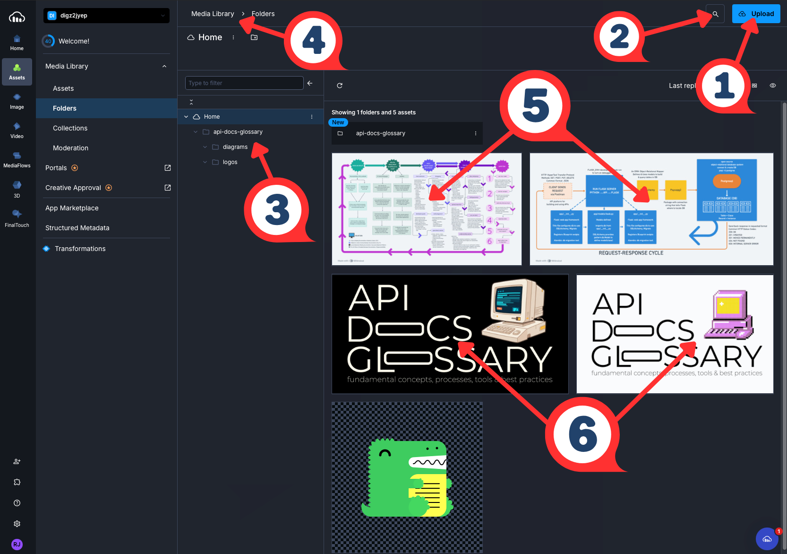

| # | Element | What It Demonstrates |
| - | ------- | -------------------- |
| 1 | Upload Button | Asset Ingestion - where new files enter the DAM |
| 2 | Search Icon | Metadata-Driven Retrieval - find assets without manual browsing |
| 3 | Folder Tree | Taxonomy - project-scoped folder hierarchy organizes assets by type |
| 4 | Breadcrumb Path | Navigation - locates assets within the broader library structure |
| 5 | Architecture Diagrams | Reusable Assets - single source referenced across multiple docs pages |
| 6 | Dark/Light Logos | Asset Variants - theme variants managed as a set |

**Related Terms**: [content](../writing-style.md#content), [CMS](#cms),
[docs-as-ecosystem](../frameworks-strategy.md#docs-as-ecosystem),
[metadata](#metadata), [taxonomy](../frameworks-strategy.md#taxonomy)

**Sources**:

- [Cloudinary: "An Overview of Digital Asset Management (DAM) Systems: Basics and Beyond"](https://cloudinary.com/guides/digital-asset-management/digital-asset-management)
- [IBM: What is Digital Asset Management?](https://www.ibm.com/think/topics/digital-asset-management)

---

## Docusaurus

**Definition**: open source static site generator built by Meta;
creates docs websites with built-in versioning, search, and
[internationalization](https://en.wikipedia.org/wiki/Internationalization)

**Purpose**: streamlines API docs site creation by providing
[React-based](https://react.dev/) theming, MDX support for interactive
components, automatic sidebar generation from file structure, and native
OpenAPI integration; reduces setup complexity compared to general-purpose
static site generators while maintaining flexibility for customization

**Docusaurus Ecosystem**:

- **[Docusaurus Core](https://docusaurus.io/)** - static site generator with
docs-focused features
- **[docusaurus-plugin-openapi-docs](https://github.com/PaloAltoNetworks/docusaurus-openapi-docs)** -
Palo Alto Networks plugin that generates API reference docs from OpenAPI
specifications, creating flexible API docs compatible with Docusaurus
- **[MDX](https://mdxjs.com/)** - Markdown format that supports embedded React
components

**Example**: developer docs portal workflow -

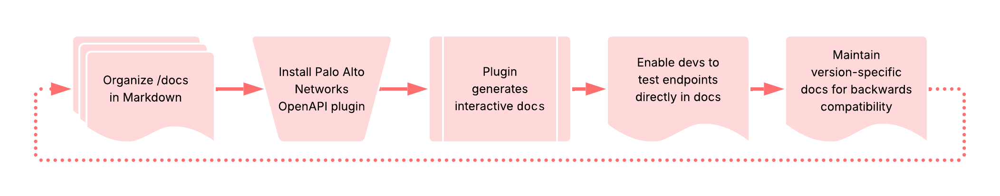

**Related Terms**: [docs-as-code](../workflows-methodologies.md#docs-as-code),
[GitHub Pages](#github-pages), [Markdown](#markdown), [MDX](../tools-techniques/documentation-specific.md#mdx),
[MkDocs](#mkdocs), [OpenAPI Specification](../core-concepts/documentation-specific.md#openapi-specification),
[static site generator](#static-site-generator)

**Sources**:

- [Kovai.co, Document360: "What Should You Consider When Choosing Docusaurus?" by Arunkumar Kumaresan](https://document360.com/blog/docusaurus-documentation/)
- [Meta Platforms, Inc.: Docusaurus Homepage](https://docusaurus.io/)

---

## Fern

**Definition**: open source toolset acquired by Postman in January 2026;
automatically generates type-safe SDKs in multiple languages and
interactive API docs from AsyncAPI, Fern definition, gRPC, and
OpenAPI specs

**Purpose**: streamlines docs-as-code workflows by maintaining a single
source of truth; ensures code examples, docs, and SDKs stay sychronized
as APIs evolve; reduces manual SDK maintenance across many programming
languages to enhance DX, _developer experience_

**Example**: Fern workflow with OpenAPI specs -

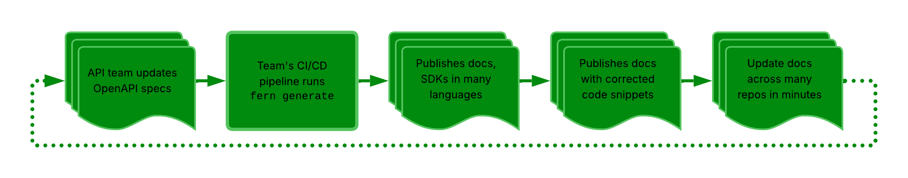

**Related Terms**: [AsyncAPI](../core-concepts/documentation-specific.md#asyncapi),
[CI/CD pipeline](../tools-techniques/development-essentials.md#cicd-pipeline),
[docs-as-code](../workflows-methodologies.md#docs-as-code), [DX](../frameworks-strategy.md#dx),
[gRPC API](../api-types-architectures.md#grpc-api),
[OpenAPI Specification](../core-concepts/documentation-specific.md#openapi-specification),
[Postman](#postman), [SDK](../core-concepts/api-fundamentals.md#sdk),
[Speakeasy](testing-validation.md#speakeasy)

**Sources**:

- [Fern, Birch Solutions: "Instant Docs and SDKs for your API"](https://buildwithfern.com/)
- [GitHub Repository: fern-api/fern](https://github.com/fern-api/fern)
- [Postman, Inc.: "Postman acquires Fern" by Abhinav Asthana](https://blog.postman.com/postman-acquires-fern/)

---

## GitHub Pages

**Definition**: free static site hosting service provided by GitHub that
builds and deploys websites directly from a GitHub repository

**Purpose**: enables API docs teams to publish docs sites without managing
servers or paying for hosting; integrates seamlessly with docs-as-code
workflows by automatically deploying from repository branches, commonly
used for open source project docs, API references, and developer portals

**Example**: GitHub Pages builds sites using [Jekyll](https://jekyllrb.com/)
or custom static site generator and deploys to `username.github.io/repo-name` -

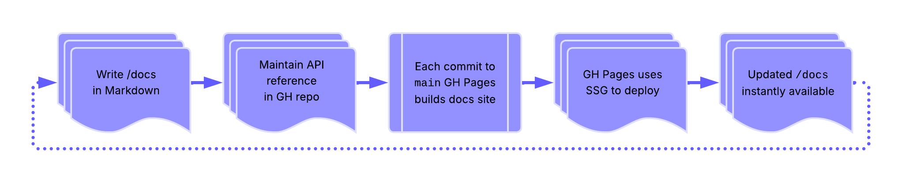

**Related Terms**: [docs-as-code](../workflows-methodologies.md#docs-as-code),
[Git](development-essentials.md#git), [GitHub](development-essentials.md#github),
[Markdown](#markdown), [MDX](#mdx), [static site generator](#static-site-generator)

**Sources**:

- [Geeks for Geeks: "GitHub Pages"](https://www.geeksforgeeks.org/git/github-pages/)
- [GitHub, Inc., GitHub Docs: "What is GitHub Pages?"](https://docs.github.com/en/pages/getting-started-with-github-pages/what-is-github-pages)

---

## Markdown

**Definition**: lightweight markup language created by John Gruber in 2004

**Purpose**: popular for writing documentation - designed to format plain
text documents and allows users to add elements like headers,
links, lists, and tables

**Related Terms**: [Git](development-essentials.md#git),
[Git Bash](development-essentials.md#git-bash),
[GitHub](development-essentials.md#github), [MDX](#mdx),
[MkDocs](#mkdocs), [partials](#partials), [Vale](#vale)

**Sources**:

- [Markdown Guide: Markdown Cheat Sheet](https://www.markdownguide.org/cheat-sheet/)
- UW API Docs: Canvas General Forum

---

## MDX

**Definition**: file format and syntax that combines Markdown with JSX,
_JavaScript XML_, enabling writers to embed interactive React components
directly within Markdown content

**Purpose**: allows API documentation to include interactive elements -
live code editors, API explorers, dynamic examples, custom UI components -
while maintaining the simplicity and readability of Markdown for standard
content; bridges the gap between static documentation and interactive
developer experiences

**Example**: an `.mdx` file for API authentication documentation might
include standard Markdown for explanatory text, but embed an interactive
`<ApiKeyGenerator />` React component that lets developers create test
API keys directly in the documentation, or a `<CodeSandbox />` component
showing a live authentication flow that developers can modify and test
without leaving the docs

```mdx
# Authentication

Our API uses API keys for authentication. Include your key in the header:

<CodeExample language="javascript">
  {`fetch('https://api.example.com/data', {
    headers: { 'X-API-Key': 'your-key-here' }
  })`}
</CodeExample>

<ApiKeyGenerator />
```

**Example in API Docs Glossary**: [Interactive KG Explorer](../ai-and-apis.mdx#interactive-kg-explorer)

### MDX vs Markdown

| Aspect | Markdown - `.md` | MDX - `.mdx` |
| -------- | ---------------- | ------------ |
| **Content Type** | Purely text-based markup | Text-based markup + React components |
| **Output** | Converts to static HTML | Renders interactive React components + HTML |
| **Interactivity** | Static content only | Can include dynamic, interactive elements |
| **Capabilities** | Formatting, links, images, code blocks | Everything Markdown does + embedded UI components, live code editors, API calls, user input handling |
| **Use Case** | Documentation that doesn't need interactivity | Documentation with live demos, interactive examples, dynamic content |

**Related Terms**: [docs-as-code](../workflows-methodologies.md#docs-as-code),
[Docusaurus](#docusaurus), [GUI](development-essentials.md#gui),
[knowledge graph](../ai-and-apis.mdx#knowledge-graph), [Markdown](#markdown),
[partials](#partials), [UI](development-essentials.md#ui)

**Sources**:

- [MDX Docs: "What is MDX?"](https://mdxjs.com/docs/what-is-mdx/)
- [Meta Platforms, Inc., Docusaurus: "MDX and React"](https://docusaurus.io/docs/markdown-features/react)

---

## metadata

**Definition**: data about data; structured information that describes,
explains, locates, or otherwise makes it easier to retrieve, use, or
manage content

**Purpose**: enables findability, organization, and automation in API
documentation by providing machine-readable context about endpoints,
parameters, content status, versioning, and relationships between
documentation components

**Example**: while an API docs page might have metadata that allows
documentation systems to automatically display deprecation warnings,
filter by category, or show freshness indicators - the screenshot
below shows how Cloudinary Media Library's metadata panel organizes
different types of metadata about API Docs Glossary's assets -

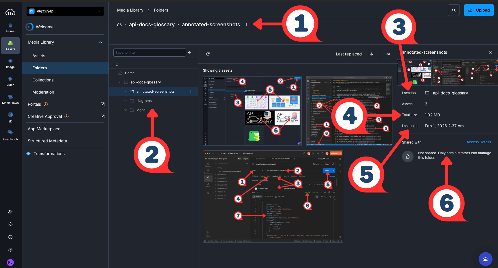

| # | UI Element | What It Demonstrates |
| - | ------- | -------------------- |
| 1 | Breadcrumb Path - `api-docs-glossary > annotated-screenshots` | Location Metadata - site of asset organization |
| 2 | Folder Tree | Structural Metadata - hierarchy that enables findability |
| 3 | Location | Organizational Metadata - asset’s place within the DAM |
| 4 | Total Size | System-Generated Metadata - automatically captured |
| 5 | Last Uploaded | Temporal Metadata - tracks date/time of content changes |
| 6 | Shared With | Permission Metadata - controls access |

**Related Terms**: [CMS](#cms), [content](../writing-style.md#content),
[DAM](#dam), [information architecture](../frameworks-strategy.md#information-architecture),
[knowledge graph](../ai-and-apis.mdx#knowledge-graph),
[structured content](../writing-style.md#structured-content),
[taxonomy](../frameworks-strategy.md#taxonomy),
[technical communication](../frameworks-strategy.md#technical-communication)

**Sources**:

- [Geeks for Geeks: "What is Metadata?"](https://www.geeksforgeeks.org/software-engineering/what-is-metadata/)
- [NISO: "Understanding Metadata: What is Metadata, and What is it For?: A Primer" by Jenn Riley](https://www.niso.org/publications/understanding-metadata-2017)

---

## MkDocs

**Definition**: abbreviation of _Markdown documentation_; Python-based static
site generator designed specifically for building project docs from Markdown
files

**Purpose**: streamlines docs site creation with minimal configuration; widely
adopted in API docs workflows for its clean default theme, automatic navigation
generation, and built-in search;
[the Material for MkDocs theme](https://squidfunk.github.io/mkdocs-material/)
features include enhanced UI, syntax highlighting, and content tabs commonly
used for code examples in multiple languages

**Example**: Python API Project with MkDocs workflow -

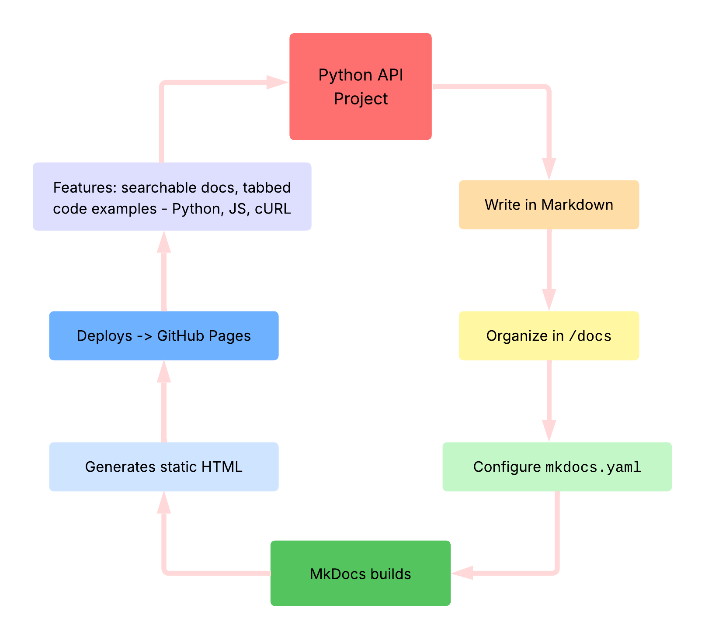

**Related Terms**: [docs-as-code](../workflows-methodologies.md#docs-as-code),
[Docusaurus](#docusaurus), [GitHub Pages](#github-pages), [Markdown](#markdown),
[static site generator](#static-site-generator)

**Sources**:

- [Martin Donath: Material for MkDocs Documentation](https://squidfunk.github.io/mkdocs-material/)
- [Tom Christie, MkDocs: "Getting Started with MkDocs"](https://www.mkdocs.org/getting-started/)
- [Wikipedia: "MkDocs"](https://en.wikipedia.org/wiki/MkDocs)

---

## partials

**Definition**: static site generator feature that inserts reusable
content fragments into multiple pages; feature name depends on the static
site generator - `includes` for Jekyll and snippets with MkDocs

**Purpose**: eliminates content duplication by maintaining a single source
for shared content like API endpoint descriptions, code examples, or data
model definitions; enables consistent documentation across multiple pages,
versions, or white-labeled variants while reducing maintenance burden when
shared content changes

**Partials In Monorepos**: these strategies address different problems
and often work together; content reuse, `includes` and/or snippets solve
the page-level problem of _what gets shared within a documentation site_,
while monorepos solve the repository-level problem of _where multiple
documentation projects live_; teams commonly combine both - using a monorepo
to house multiple documentation sites that each leverage `includes` for
shared content

**Example**: authentication flow reused across multiple pages in a monorepo;
the structure enables a single `/shared` folder and each product's
getting-started and API reference pages include `auth-flow.md`, so updating
the shared file propagates changes across all six pages -

```markdown
api-docs-monorepo/
├── shared/
│   └── auth-flow.md              # Single source for all products
├── product-a/
│   ├── getting-started.md
│   └── api-reference.md
├── product-b/
│   ├── getting-started.md
│   └── api-reference.md
└── product-c/
    ├── getting-started.md
    └── api-reference.md
```

**Implementation by Tool**:

| Tool | Syntax |
| ---- | ------ |
| Jekyll | `` |
| MkDocs Material | `--8<-- "auth-flow.md"` |
| Docusaurus | `import AuthFlow from './auth-flow.md';` then `<AuthFlow />` |

**Related Terms**: [docs-as-code](../workflows-methodologies.md#docs-as-code),
Docusaurus, [Markdown](#markdown), [MDX](#mdx), MkDocs,
[monorepo](development-essentials.md#monorepo),
[static site generator](#static-site-generator),
[white-labeling](../frameworks-strategy.md#white-labeling)

**Sources**:

- [Jekyll: "Includes"](https://jekyllrb.com/docs/includes/)
- [Meta Platforms, Inc., Docusaurus: "Importing code snippets"](https://docusaurus.io/docs/markdown-features/react#importing-code-snippets)
- [SmartSymbols, PyMdown Extensions Documentation: "Snippets"](https://facelessuser.github.io/pymdown-extensions/extensions/snippets/)
- [W3Tutorials: "Node.js Partial"](https://www.w3tutorials.net/blog/nodejs-partial/)

---

## Postman

**Definition**: API development platform for designing, testing,
documenting, and monitoring APIs through a graphical interface

**Purpose**: commonly used for REST API development, exploration,
and testing workflows; provides a GUI alternative to cURL
for making HTTP requests, supports automated test suites, collection
sharing, and API documentation generation; power lies in its
ability to chain requests, validate responses, and maintain
test environments, validating both API behavior and
documentation accuracy

**Why this belongs in `Documentation-Specific`**: Postman is primarily
a platform for exploring, documenting, and sharing APIs through
collections, automated documentation generation, and collaborative
workspaces; while it includes testing capabilities, its _core identity_
centers on API discovery and documentation workflows rather than
automated validation - teams use Postman to understand how APIs work
and communicate that understanding to others, making it
_fundamentally a documentation and exploration tool_

**Postman Ecosystem**:

- **[Fern](https://buildwithfern.com/)** - generates API docs and SDKs;
acquired in January 2026
- **[Postman App](https://www.postman.com/downloads/)** - interactive interface for exploring and documenting APIs
- **[Postman Collections](https://www.postman.com/product/collections/)** -
organized groups of API requests with documentation
- **[Postman Newman](https://learning.postman.com/docs/collections/using-newman-cli/installing-running-newman/)** -
CLI collection runner executes tests for API requests, workflows

**Example**: a technical writer documents a pet adoption API using
Postman collections -

1. **Organizes** endpoints into folders: authentication, `/pets`, `/shelters`
2. **Documents** each endpoint with descriptions, example requests, and expected responses
3. **Shares** collection with developers and partners for interactive API exploration
4. **Maintains** living documentation that stays synchronized as the API evolves

The screenshot below shows step two in action - documenting a single endpoint
by examining its method, headers, and JSON response:

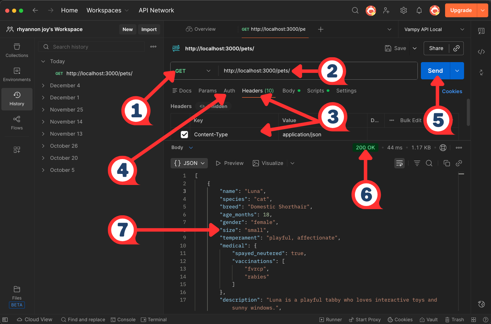

| # | Element | What It Demonstrates |
| - | ------- | -------------------- |
| 1 | Method Selector | HTTP method - defines the type of request |
| 2 | URL Bar | API endpoint - the address the request targets |
| 3 | Headers | request headers - metadata accompanying the request |
| 4 | Auth Tab | authentication - configure credentials here |
| 5 | Send Button | request trigger - initiates the request-response cycle |
| 6 | `200 OK` | HTTP status code - indicates the request succeeded |
| 7 | Response Body | payload - JSON data returned by the API |

**Related Terms**:
[Bruno](testing-validation.md#bruno), [cURL](development-essentials.md#curl), [Fern](#fern),
[GUI](development-essentials.md#gui), [`json-server`](testing-validation.md#json-server),
[Postman Newman](testing-validation.md#postman-newman),
[REST API](../api-types-architectures.md#rest-api), [Stoplight](#stoplight),
[Swagger](#swagger), [UI](development-essentials.md#ui)

**Sources**:

- [Postman, Inc.: "What is Postman?"](https://www.postman.com/product/)
- [Silva, Manny. _Docs As Tests_. First edition, Release 2, Boffin Education, May 2025.](https://boffin.education/about-docs-as-tests/)
- UW API Docs: Module 3, Lesson 3, "Introduction to json-server, cURL, and Postman"

---

## RFC

**Definition**: acronym for _Request for Comments_; numbered technical documents
published by the IETF - _Internet Engineering Task Force_ - that define standards,
protocols, and procedures for internet technologies

**Purpose**: RFCs provide authoritative specifications for protocols
like HTTP, HTTPS, and other web standards; API documentation writers
reference RFCs to ensure accurate technical descriptions and link to
them as sources for protocol definitions and behavior

**Example**: when documenting HTTP status codes, writers cite
[IETF RFC 9110 - HTTP Semantics](https://www.rfc-editor.org/rfc/rfc9110.html)
as the authoritative source; RFC numbers, such as RFC 9110, provide
a permanent, verifiable reference that remains accessible even as
web pages change

**Related Terms**: [HTTP](../core-concepts/api-fundamentals.md#http),
[HTTPS](../core-concepts/api-fundamentals.md#https),
[REST API](../api-types-architectures.md#rest-api)

**Sources**:

- [Geeks for Geeks: "RFC (Request For Comment)"](https://www.geeksforgeeks.org/computer-networks/rfc-request-for-comment/)
- [IETF: About Page](https://www.ietf.org/about/)

---

## Redocly

**Definition**: API documentation platform and OpenAPI tooling suite for
creating, validating, and publishing API reference documentation

**Purpose**: transforms OpenAPI specifications into interactive,
customizable documentation; provides linting and validation for API
specifications through automated rule enforcement

**Common Redocly Tools**:

- [Redocly CLI](https://redocly.com/docs/cli/) - command-line interface
for linting, bundling, and building OpenAPI documents
- [Redocly Respect](https://redocly.com/docs/respect/) - contract and
workflow testing tool that continuously validates live APIs against
Arazzo/OpenAPI definitions
- [Redocly Developer Portal](https://redocly.com/docs/developer-portal/) -
hosts and renders interactive API documentation

**Example**: teams use Redocly CLI with Respect to lint OpenAPI files for
style guide compliance in CI/CD pipelines, catching specification errors
like missing descriptions or inconsistent naming conventions before
deployment; once validated, documentation deploys to Redocly's hosting
platform where developers can explore endpoints interactively

**Related Terms**:
[API documentation testing](../workflows-methodologies.md#api-documentation-testing),
[CI/CD pipeline](development-essentials.md#cicd-pipeline),
[CLI](development-essentials.md#cli),
[docs-as-tests](../workflows-methodologies.md#docs-as-tests),
[OpenAPI Specification](../core-concepts/documentation-specific.md#openapi-specification),
[Redocly Respect](testing-validation.md#redocly-respect),
[Spectral](#spectral), [Stoplight](#stoplight), [Swagger](#swagger), [Vale](#vale)

**Sources**:

- [Redocly Docs: "About Redocly Documentation"](https://redocly.com/docs/)
- [Redocly Docs: "Redocly Respect Use Cases"](https://redocly.com/docs/respect/use-cases)
- [Silva, Manny. _Docs As Tests_. First edition, Release 2, Boffin Education, May 2025.](https://boffin.education/about-docs-as-tests/)

---

## Spectral

**Definition**: open source JSON/YAML linter for creating automated
style guides and validating API descriptions against customizable rulesets

**Purpose**: enforces API design standards and best practices by checking
OpenAPI, AsyncAPI, and JSON Schema documents for structure, completeness,
and style compliance; catches specification errors before API implementation;
ensures consistent API design patterns across teams through automated validation
of OpenAPI/AsyncAPI documents

**Example**: a documentation team configures Spectral to enforce their API
style guide, requiring all endpoints to have descriptions, examples, and
proper HTTP status code documentation; when a developer submits a pull
request with an OpenAPI spec missing operation descriptions, Spectral flags
the violations in CI/CD, preventing merge until documentation is complete

**Related Terms**:
[API documentation testing](../workflows-methodologies.md#api-documentation-testing),
[AsyncAPI](../core-concepts/documentation-specific.md#asyncapi),
[contract testing](../workflows-methodologies.md#contract-testing),
[JSON](../core-concepts/api-fundamentals.md#json),
[OpenAPI Specification](../core-concepts/documentation-specific.md#openapi-specification),
[Redocly](#redocly)

**Sources**:

- [SmartBear Software, Stoplight: "Spectral: An open source API style guide enforcer and linter"](https://stoplight.io/open-source/spectral)
- [GitHub: stoplightio/spectral](https://github.com/stoplightio/spectral)

---

## static site generator

**Definition**: also known as an SSG; build tool that transforms plain text
content and templates into HTML files without requiring a database or
server-side processing; popular SSGs include [Docusaurus](https://docusaurus.io/),
[Gatsby](https://www.gatsbyjs.com/), [Hugo](https://gohugo.io/), and
[Jekyll](https://jekyllrb.com/)

**Purpose**: enables fast, secure, and scalable documentation sites by
pre-building all pages during deployment rather than generating them on each
request; commonly used in API docs for version control integration, Markdown
support, and streamlining deployment

**Example 1**: a docs team uses an SSG to build their API reference from Markdown
files; the CI/CD pipeline runs the generator to rebuild the site, then deploys it
to a CDN, _content delivery network_, for loading -

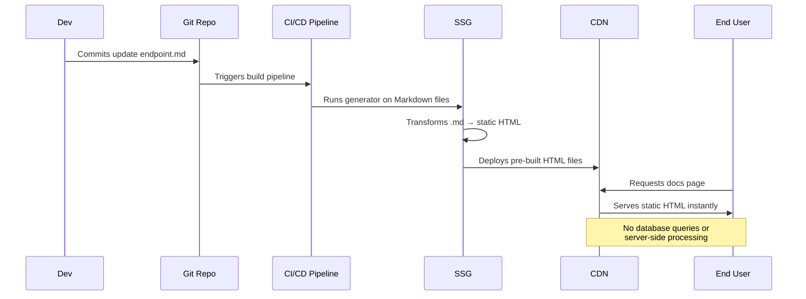

**Example 2**: API Docs Glossary's Markdown and rendered docs side-by-side:

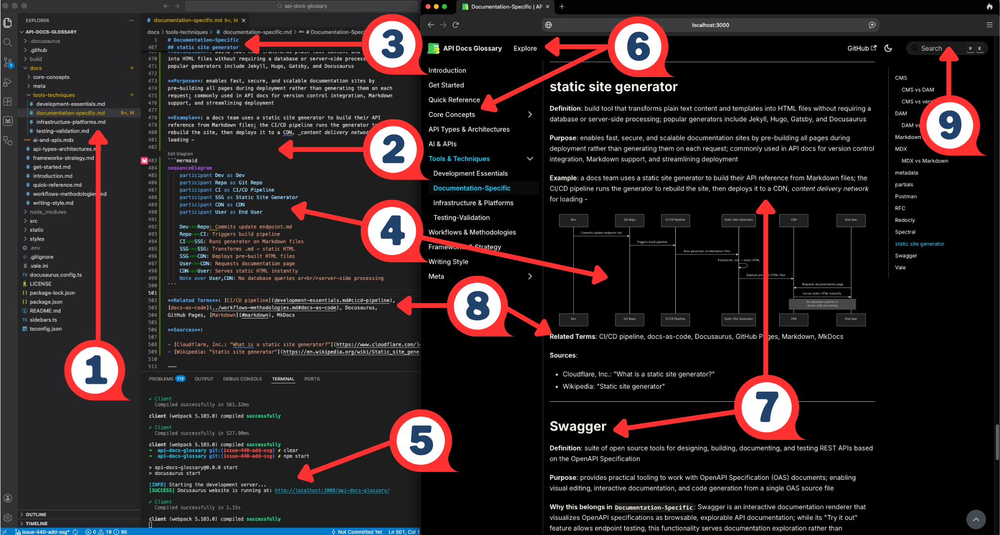

| # | Element | What It Demonstrates |
| --- | --------- | ---------------------- |
| 1 | Repo Project Tree | Docs live in a version‑controlled code repo, following a docs‑as‑code workflow |
| 2 | Markdown Glossary Category File | SSG reads Markdown files as the source for each docs page |
| 3 | Markdown Headings and Body | Writers focus on content using lightweight syntax instead of HTML |
| 4 | Mermaid Diagram | SSG renders diagrams in Mermaid code as site images |
| 5 | Dev Server, Build Output | A local command compiles Markdown into a static site, serves a preview |
| 6 | Site Header and Nav | SSG assembles a full documentation UI from the config |
| 7 | Rendered Page Content | Markdown on the left appears here as HTML in the final static docs site |
| 8 | Related Terms Links | Structured metadata generates cross‑links between glossary entries |
| 9 | Search Bar| SSG features like search enhance the generated docs site |

**Related Terms**: [CI/CD pipeline](development-essentials.md#cicd-pipeline),
[docs-as-code](../workflows-methodologies.md#docs-as-code),
[Docusaurus](#docusaurus), [GitHub Pages](#github-pages), [Markdown](#markdown),
[MkDocs](#mkdocs)

**Sources**:

- [Cloudflare, Inc.: "What is a static site generator?"](https://www.cloudflare.com/learning/performance/static-site-generator/)
- [Wikipedia: "Static site generator"](https://en.wikipedia.org/wiki/Static_site_generator)

---

## Stoplight

**Definition**: API design and documentation platform that provides visual
editors, automated docs generation, and mock servers for API development
workflows

**Purpose**: enables API-first development by allowing teams to design APIs
visually, generate OpenAPI specifications, create interactive docs, and
validate implementations against specs; commonly used in API docs workflows
for collaborative design reviews, automated doc generation from OpenAPI files,
and maintaining consistency between API design and documentation

**Example**: [Stoplight Studio](https://stoplight.io/getting-started-with-stoplight)
design-development workflow -

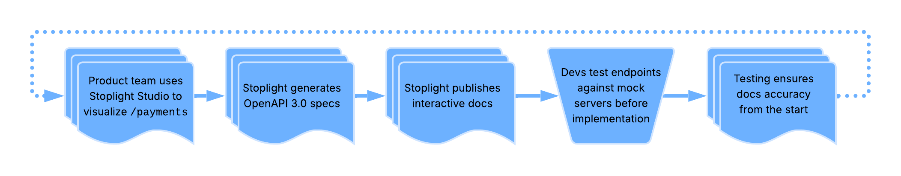

**Related Terms**: [docs-as-code](../workflows-methodologies.md#docs-as-code),
[OpenAPI Specification](../core-concepts/documentation-specific.md#openapi-specification),
[Postman](#postman), [Redocly](#redocly), [Swagger](#swagger)

**Sources**:

- [Apidog, Inc.: "Tutorial: What is Stoplight Studio and How to use it (2026 Guide)"](https://apidog.com/blog/how-to-use-stoplight-studio/)
- [SmartBear Software, Stoplight: "Design, document, and build APIs faster"](https://stoplight.io/)

---

## Swagger

**Definition**: suite of open source tools for designing, building,
documenting, and testing REST APIs based on the OpenAPI Specification

**Purpose**: provides practical tooling to work with OpenAPI Specification
(OAS) documents; enabling visual editing, interactive documentation,
and code generation from a single OAS source file

**Why this belongs in `Documentation-Specific`**: Swagger is an
interactive documentation renderer that visualizes OpenAPI specifications
as browsable, explorable API documentation; while its "Try it out" feature
allows endpoint testing, this functionality serves documentation exploration
rather than automated validation - the tool's primary purpose is presenting
API specifications to developers in human-readable, interactive format,
making it a _documentation presentation tool_ rather than a testing framework

**Common Swagger Tools**:

- [Swagger UI](https://swagger.io/tools/swagger-ui/) -
generates interactive API documentation from OAS files
- [Swagger Editor](https://editor.swagger.io/) -
web-based editor for creating and editing OAS documents
- [Swagger Codegen](https://swagger.io/tools/swagger-codegen/) -
generates client libraries and server stubs from OAS files

**Example**: API development workflow with Swagger -

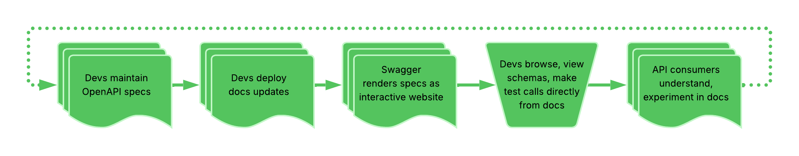

**Related terms**: [GUI](development-essentials.md#gui),
[OpenAPI Specification](../core-concepts/documentation-specific.md#openapi-specification),
[Redocly](#redocly), [REST API](../api-types-architectures.md#rest-api),
[Stoplight](#stoplight)

**Sources**:

- [Kovai.co, Document360: "Swagger API: How They Work & What You Need to Know" by Shakeer Hussain](https://document360.com/blog/swagger-api/)
- [SmartBear Software: "What is Swagger"](https://swagger.io/docs/specification/v2_0/what-is-swagger/)

---

## Vale

**Definition**: an open source command-line tool for linting prose and enforcing
editorial style rules in documentation

**Purpose**: maintains consistency in technical writing by automatically checking
documentation against customizable style guides; catches grammar errors,
terminology inconsistencies, and style violations; integrates with docs-as-code
workflows and CI/CD pipelines to enforce writing standards before publishing;
supports multiple style guides including Microsoft, Google, and
custom rules

**Example**: The screenshot below shows Vale running in VS Code against the
glossary - each warning maps to a specific style rule enforced across the project.
Vale flags style violations across all docs files simultaneously;
the screenshot filters
[`Google.WordList`](https://developers.google.com/style/word-list)
warnings from 817 total rules - the same type of triage that informed the Vale
configuration decisions documented in the
[Style Guide](../meta/style-guide.md#term-rules-by-category):


| # | UI Element | What It Demonstrates |
| - | ------- | -------------------- |
| 1 | `.vale.ini` in the file tree | Configuration file where teams define and manage style rules |
| 2 | Filter showing `Google...Showing 24 of 817` | Rule filtering - Vale enforces hundreds of rules, but teams focus on specific ones |
| 3 | File Grouping - `api-fundamentals.md`, `documentation-specific.md` | Project-wide enforcement - Vale lints all docs files simultaneously |
| 4 | `WordList` Suggestions - "Use 'APIs Explorer' instead of 'API explorer'" | Terminology consistency - enforcing preferred vocabulary across the project |
| 5 | Line and Column Reference - `[Ln 336, Col 12]` | Precise location - pinpoints exactly where each violation occurs |
| 6 | ⚠ Warning Count vs ⛒ 0 Errors in Status Bar | Severity levels - warnings flag style preferences without blocking the workflow |

**Related Terms**: [CI/CD pipeline](development-essentials.md#cicd-pipeline),
[docs-as-code](../workflows-methodologies.md#docs-as-code),
[Markdown](#markdown), [pull request](development-essentials.md#pull-request),
[Redocly](#redocly)

**Sources**:

- [JD Kato, Vale: Official Documentation](https://vale.sh/)
- [Manny Silva, Docs as Tests: "Tools"](https://www.docsastests.com/tools)

---
