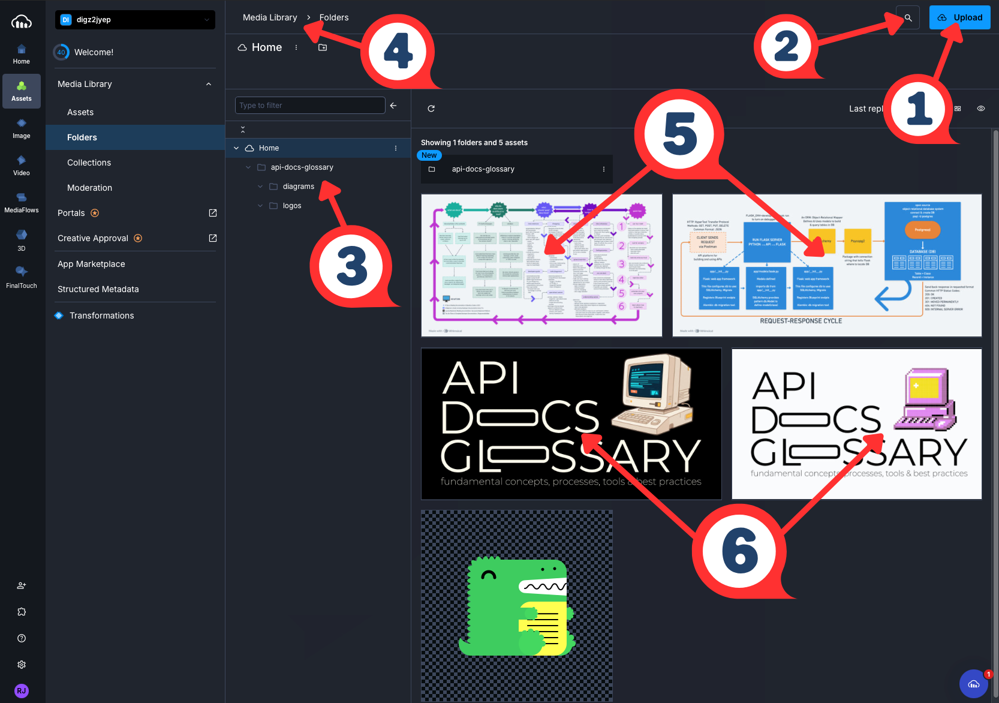
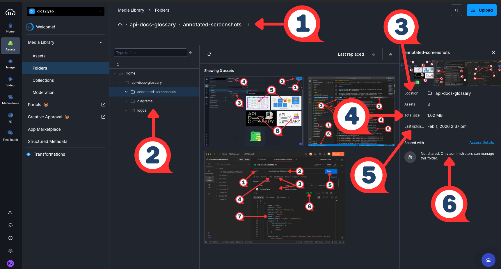
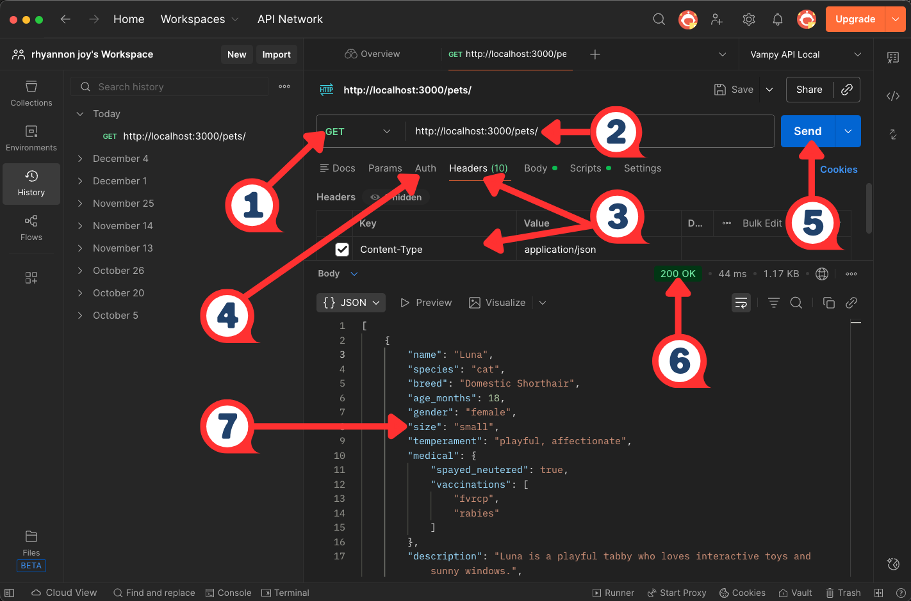
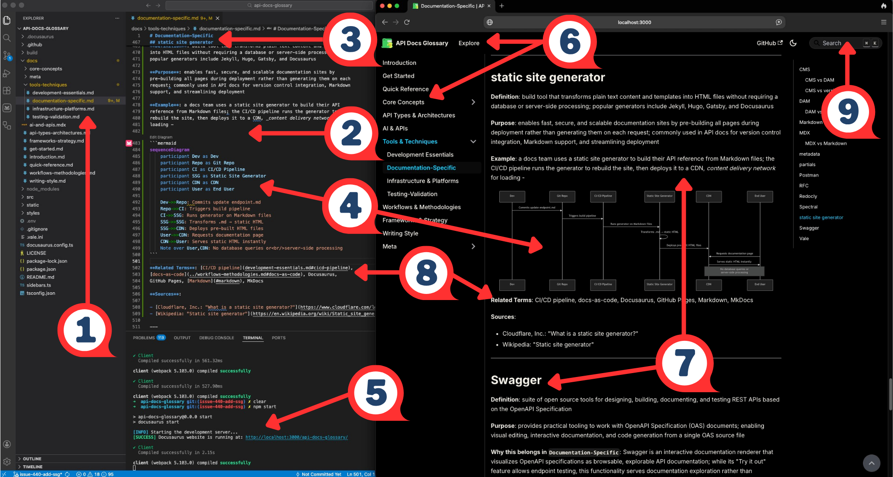
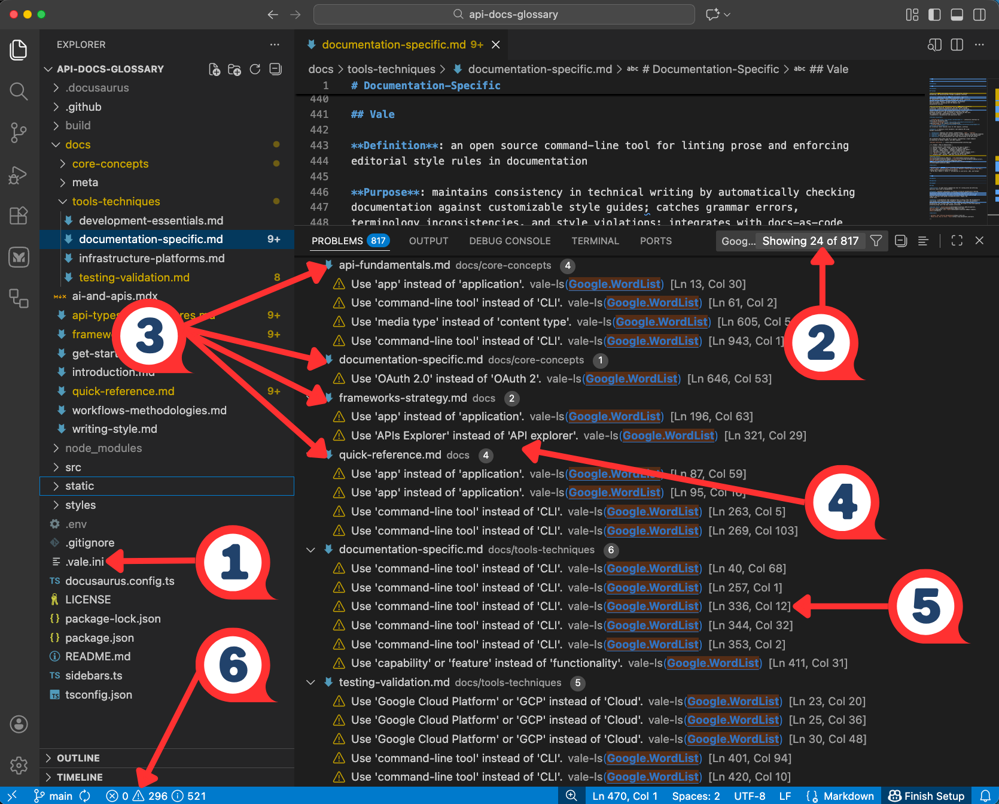

import ZoomImage from '@site/src/components/ZoomImage';
import ZoomMermaid from '@site/src/components/ZoomMermaid';

# Documentation-Specific

Tools for rendering, exploring, and maintaining API documentation.
From interactive specification viewers to automated style checkers,
this section covers the platforms that help teams create accurate,
consistent, and developer-friendly API documentation.

---

## API playground

**Definition**: interactive environment embedded in API documentation that lets developers
send real requests to endpoints and view live responses directly in the browser, without
setting up a local development environment

**Purpose**: lowers the barrier to API adoption by letting developers test endpoints,
experiment with parameters, and see immediate results from within the documentation itself;
reduces the feedback loop between reading about an API and understanding how it actually behaves;
documentation platforms like [Mintlify](https://www.mintlify.com/) and [Zuplo](https://zuplo.com/)
generate API playgrounds automatically from OpenAPI specifications, keeping the interactive
environment in sync with the API as it changes

### API playground vs related tools

| | **API playground** | **Developer portal** | **API sandbox** |
|---|---|---|---|
| **Scope** | single interactive feature | broad destination with many components | controlled testing environment |
| **Contains** | live request/response testing | docs, tutorials, forums, analytics, playgrounds | simulated or limited data |
| **Oversight** | minimal | varies | provider-monitored |
| **Relationship** | component of a portal | may include a playground | alternative to playground for safer testing |

**Example**: within an API playground, a developer reading about the `POST /charges` endpoint
can enter test values for `amount`, `currency`, and a test card token directly in the pages,
submit the request, and see the full JSON response — including headers and status codes — without
leaving the docs or writing a single line of code

**Related Terms**: [API](../core-concepts/api-fundamentals.mdx#api),
[API endpoint](../core-concepts/api-fundamentals.mdx#api-endpoint), [API sandbox](#api-sandbox),
[developer portal](#developer-portal), [HTTP status codes](../core-concepts/api-fundamentals.mdx#http-status-codes),
[JSON](../core-concepts/api-fundamentals.mdx#json), [Mintlify](#mintlify),
[OpenAPI Specification](../core-concepts/documentation-specific.mdx#openapi-specification),
[Swagger](#swagger)

**Sources**:

- [Hygraph: "API Playground"](https://hygraph.com/glossary/api-playground)
- [Mintlify, Document APIs: "Playground"](https://www.mintlify.com/docs/api-playground/overview)
- [Zuplo: "New API Playground in the Zuplo Developer Portal" by Nate Totten](https://zuplo.com/blog/2023/10/12/new-api-playground)

---

## API sandbox

**Definition**: isolated testing environment that simulates a production API's
behavior using mock data and predefined responses, allowing developers to
experiment with endpoints and test integrations without affecting live systems
or real user data

**Purpose**: enables developers to safely build, test, and troubleshoot API
integrations before deployment; reduces the risk of errors reaching production
by providing a controlled space to validate authentication flows, error handling,
and edge cases; API docs writers reference sandboxes when writing getting started
guides and tutorials, directing readers to sandbox credentials and endpoints so
they can follow along without production access

### API sandbox vs API playground

| Aspect | API Sandbox | API Playground |
|---|---|---|
| **Purpose** | Integration development and pre-deployment testing | Quick, exploratory testing of individual endpoints |
| **Audience** | Developers building integrations | Developers reading and learning from docs |
| **Environment** | Persistent, isolated environment mirroring production infrastructure | Lightweight, browser-based tool embedded in docs |
| **Workflow Support** | Full development workflows | Docs comprehension |
| **Maintainers** | API provider | Typically built into docs platform |

**Example**: a fintech company building on a payments API receives sandbox credentials —
a test API key and a dedicated sandbox base URL — from the provider; devs use these
credentials to simulate payment flows, trigger error responses like declined cards or
insufficient funds, and validate their integration logic against realistic scenarios before
pointing their app at the production environment; the sandbox explains how to access test
credentials, which endpoints are available, and how simulated responses differ from live ones

**Related Terms**: [API documentation testing](../workflows-methodologies.mdx#api-documentation-testing),
[API playground](#api-playground), [developer portal](#developer-portal),
[docs-as-code](../workflows-methodologies.mdx#docs-as-code), [DX](../frameworks-strategy.mdx#dx),
[getting started](../core-concepts/documentation-specific.mdx#getting-started),
[OpenAPI Specification](../core-concepts/documentation-specific.mdx#openapi-specification),
[reference](../core-concepts/documentation-specific.mdx#reference),
[tutorial](../core-concepts/documentation-specific.mdx#tutorial)

**Sources**:

- [Katalon: "What is API Sandbox? Definition, Examples, Key Components, Benefits"](https://katalon.com/resources-center/blog/what-is-api-sandbox)
- [SmartBear Software: "What Is an API Sandbox?"](https://smartbear.com/learn/api-design/what-is-an-api-sandbox/)
- [WireMock Inc., WireMock Cloud: "API Sandbox: Definition, Core Features, and When to Use Mocks Instead"](https://www.wiremock.io/glossary/api-sandbox)

---

## CMS

**Definition**: acronym for _content management system_; software platform
that enables teams to create, organize, store, and publish content without
requiring direct code or database manipulation

**Purpose**: centralizes content management, enables collaboration among
multiple contributors, and supports structured content workflows in API
documentation projects; not interchangeable with but complements a DAM,
_digital asset management_ system, and commonly uses some version
control under the hood, abstracted away for user-friendliness

### CMS vs DAM

| Aspect | CMS | DAM |
| -------- | ----- | ----- |
| **Primary Purpose** | Create, edit, and publish web content and documentation | Store, organize, and distribute media files and digital assets |
| **Content Types** | Text-based content, structured documentation, web pages | Images, videos, audio files, diagrams, downloadable files |
| **Key Features** | Page templates, content workflows, publishing controls | Advanced metadata, version control, usage rights management |
| **Common Users** | Technical writers, content creators, web managers | Creative teams, marketing teams, asset managers |
| **API Docs Use Case** | Managing endpoint reference pages, tutorials, guides | Managing architecture diagrams, video tutorials, screenshots |
| **Example Tools** | [Contentful](https://www.contentful.com/), [Strapi](https://strapi.io/), [WordPress](https://wordpress.com/), [Docusaurus](https://docusaurus.io/) | [Bynder](https://www.bynder.com/en/), [Adobe Experience Manager](https://business.adobe.com/products/experience-manager/adobe-experience-manager.html), [Cloudinary](https://cloudinary.com/) |

### CMS vs version control

| Aspect | Version Control - Git | CMS |
| -------- | ---------------------- | ----- |
| **What It Tracks** | File-level changes, commits, branches | Content versions, publishing states, editorial workflows |
| **Who Uses It** | Developers, technical writers comfortable with CLI | Writers, marketers, non-technical contributors |
| **Interface** | Command line, Git clients | Web-based GUI, WYSIWYG, _What You See Is What You Get_, editors |
| **Collaboration Model** | Branch/merge workflows, pull requests | Editorial workflows, review/approval states |
| **Version History** | Complete file history, diffs, blame | Content revisions, rollback, scheduled publishing |
| **Publishing** | Requires build process, deployment | Often has built-in publishing capabilities |

**Example**: using a headless CMS like
[Contentful](https://www.contentful.com/) or
[Strapi](https://strapi.io/), a technical writer edits API endpoint documentation
through a web form interface, saving drafts that are version-tracked automatically;
meanwhile, engineers can access the same content via API for integration into SDK
documentation, and the CMS handles publishing to production without requiring writers
to use Git commands

**Related Terms**: [content](../writing-style.mdx#content), [DAM](#dam),
[docs-as-code](../workflows-methodologies.mdx#docs-as-code),
[Git](../tools-techniques/development-essentials.mdx#git),
[GUI](../tools-techniques/development-essentials.mdx#gui),
[knowledge management](../frameworks-strategy.mdx#knowledge-management),
[metadata](#metadata), [SDK](../core-concepts/api-fundamentals.mdx#sdk),
[structured content](../writing-style.mdx#structured-content),
[version control](development-essentials.mdx#version-control)

**Sources**:

- [IBM: "What is a content management system (CMS)?" by Teaganne Finn, Amanda Downie](https://www.ibm.com/think/topics/content-management-system)
- [Wikipedia: "Content management system"](https://en.wikipedia.org/wiki/Content_management_system)

---

## DAM

**Definition**: acronym for _digital asset management_; software platform and
business process for storing, organizing, managing, retrieving, and distributing
digital files such as images, videos, audio, graphics, and other media assets

**Purpose**: provides centralized repository for API documentation teams to manage
visual and multimedia assets - architecture diagrams, tutorial videos, screenshots,
code examples, logos, and downloadable files - enabling version control, brand
consistency, and efficient reuse across documentation, marketing, and developer
relations materials

### DAM vs CMS

| Aspect | DAM | CMS |
| ------ | --- | --- |
| Primary Focus | organizing and distributing media files | creating, editing, and publishing structured text content |
| Content Types | images, videos, downloadable assets | web pages and structured documentation |
| Key Capabilities | advanced metadata tagging and asset version control | content editing, workflow approval, and page publishing |
| Role in API docs | manages visual assets referenced within documentation | manages the documentation pages themselves |
| Typical Use Together | source for images, diagrams, and downloadable SDKs | authoring environment for the documentation that references those assets |

**Example**: Cloudinary Media Library with
API Docs Glossary asset organization



| # | Element | What It Demonstrates |
| - | ------- | -------------------- |
| 1 | Upload Button | Asset Ingestion - where new files enter the DAM |
| 2 | Search Icon | Metadata-Driven Retrieval - find assets without manual browsing |
| 3 | Folder Tree | Taxonomy - project-scoped folder hierarchy organizes assets by type |
| 4 | Breadcrumb Path | Navigation - locates assets within the broader library structure |
| 5 | Architecture Diagrams | Reusable Assets - single source referenced across multiple docs pages |
| 6 | Dark/Light Logos | Asset Variants - theme variants managed as a set |

**Related Terms**: [content](../writing-style.mdx#content), [CMS](#cms),
[docs-as-ecosystem](../frameworks-strategy.mdx#docs-as-ecosystem),
[knowledge management](../frameworks-strategy.mdx#knowledge-management),
[metadata](#metadata), [taxonomy](../frameworks-strategy.mdx#taxonomy)

**Sources**:

- [Cloudinary: "An Overview of Digital Asset Management (DAM) Systems: Basics and Beyond"](https://cloudinary.com/guides/digital-asset-management/digital-asset-management)
- [IBM: What is Digital Asset Management?](https://www.ibm.com/think/topics/digital-asset-management)

---

## developer portal

**Definition**: centralized, web-based platform where API providers publish
documentation, code samples, SDKs, tutorials, and support resources for
developers who want to discover, learn, and integrate with their APIs

**Purpose**: serves as the primary interface between an API provider and
its developer audience; consolidates everything a developer needs —
reference docs, getting started guides, authentication instructions, API
playgrounds, sandbox access, versioning information, and community resources —
into a single destination; reduces time-to-first-API-call and lowers the
support burden on the API provider by enabling developer self-service;
for tech writers, the developer portal is the publishing target and
organizational framework that shapes how docs are structured and what
content gets prioritized

**Why this belongs in `Tools & Techniques > Documentation-Specific`**:
describes a platform that tech writers and developers actively publish to,
maintain, and design content for — it's a docs infrastructure tool, not an
abstract API concept; placing it alongside API playground, API sandbox,
[Mintlify](https://www.mintlify.com/), and OpenAPI Specification keeps the
cluster of docs publishing and DX tools together; `Core Concepts` covers what
APIs fundamentally are, while the developer portal is a tooling and workflow
concern that's about _how teams publish and present_ API docs to the world

### developer portal vs API docs

| Aspect | API Docs | Developer Portal |
|---|---|---|
| **Definition** | The content itself — reference material, guides, and examples explaining how an API works | The platform that hosts and organizes that content alongside other resources |
| **Dependency** | Can exist without a portal | Defined by the docs and tooling it surfaces |
| **Scope** | The content layer | Contains API docs plus additional tooling |

**Example**: a tech writer adding docs for a new payment method publishes
directly to the portal, where it immediately becomes discoverable alongside
authentication guides, error code references, and getting started tutorials —
devs never need to leave the portal to get from "what is this API?" to a working
integration

**Related Terms**: [API playground](#api-playground), [API sandbox](#api-sandbox),
[docs-as-code](../workflows-methodologies.mdx#docs-as-code),
[DX](../frameworks-strategy.mdx#dx),
[getting started](../core-concepts/documentation-specific.mdx#getting-started),
[Mintlify](#mintlify), [OpenAPI Specification](../core-concepts/documentation-specific.mdx#openapi-specification),
[reference](../core-concepts/documentation-specific.mdx#reference),
[SDK](../core-concepts/api-fundamentals.mdx#sdk), [tutorial](../core-concepts/documentation-specific.mdx#tutorial)

**Sources**:

- [Moesif: "What is an API Developer Portal? The Ultimate Guide"](https://www.moesif.com/blog/api-strategy/api-development/What-is-an-API-Developer-Portal-The-Ultimate-Guide/)
- [Pronovix: "What is the Difference Between API Documentation and a Developer Portal?" by Kathleen De Roo](https://pronovix.com/blog/what-difference-between-api-documentation-and-developer-portal)
- [Solo.io: "API Developer Portals: Empowering Developers with APIs"](https://www.solo.io/topics/api-management/api-developer-portals-empowering-developers-with-apis)

---

## Docusaurus

**Definition**: open source static site generator built by Meta;
creates docs websites with built-in versioning, search, and
[internationalization](https://en.wikipedia.org/wiki/Internationalization)

**Purpose**: streamlines API docs site creation by providing
[React-based](https://react.dev/) theming, MDX support for interactive
components, automatic sidebar generation from file structure, and native
OpenAPI integration; reduces setup complexity compared to general-purpose
static site generators while maintaining flexibility for customization

**Docusaurus Ecosystem**:

- **[Docusaurus Core](https://docusaurus.io/)** - static site generator with
docs-focused features
- **[docusaurus-plugin-openapi-docs](https://github.com/PaloAltoNetworks/docusaurus-openapi-docs)** -
Palo Alto Networks plugin that generates API reference docs from OpenAPI
specifications, creating flexible API docs compatible with Docusaurus
- **[MDX](https://mdxjs.com/)** - Markdown format that supports embedded React
components

**Example**: developer docs portal workflow -

<ZoomImage 
  src="/api-docs-glossary/img/flowchart-docusaurus-workflow.png" 
  alt="Flowchart showing steps: organize docs in Markdown, install plugin, plugin generates interactive docs, devs test endpoints in docs, maintain version-specific docs"
/>

**Related Terms**: [docs-as-code](../workflows-methodologies.mdx#docs-as-code),
[GitHub Pages](#github-pages), [Markdown](#markdown), [MDX](#mdx),
[MkDocs](#mkdocs), [OpenAPI Specification](../core-concepts/documentation-specific.mdx#openapi-specification),
[static site generator](#static-site-generator)

**Sources**:

- [Kovai.co, Document360: "What Should You Consider When Choosing Docusaurus?" by Arunkumar Kumaresan](https://document360.com/blog/docusaurus-documentation/)
- [Meta Platforms, Inc.: Docusaurus Homepage](https://docusaurus.io/)

---

## Falconer

**Definition**: AI-powered knowledge platform that maintains synchronized
internal engineering docs by integrating with [GitHub](https://docs.github.com),
[Linear](https://linear.app/), and [Slack](https://slack.com/)

**Purpose**: prevents internal docs from drifting out of sync with codebases
as engineers ship features; provides AI-powered search and question-answering
across organizational knowledge, tacit information, and code repositories

**Why this belongs in `Tools & Techniques`**: Falconer is specifically for
internal docs management, _not an AI concept, methodology, or technology that
impacts how technical writers work with APIs_; `AI & APIs` category covers AI
concepts and terminology relevant to API docs work - prompt engineering,
retrieval-augmented generation, or AI-assisted usability analysis - while Falconer
is a general-purpose internal knowledge management platform _that happens to use AI_;
comparable to how [Notion](https://www.notion.com/) or
[Confluence](https://www.atlassian.com/software/confluence)
are collaboration tools with AI features rather than AI technologies themselves

**Example**: internal docs integration workflow with Falconer -

<ZoomImage 
  src="/api-docs-glossary/img/flowchart-falconer-workflow.png" 
  alt="Flowchart showing steps: integrate Falconer, devs ship features, Falconer updates internal docs, Falconer answers questions accurately"
/>

**Related Terms**: [docs-as-code](workflows-methodologies.mdx#docs-as-code),
[docs-as-ecosystem](../frameworks-strategy.mdx#docs-as-ecosystem),
[domain knowledge](../frameworks-strategy.mdx#domain-knowledge),
[Git](development-essentials.mdx#git), [GitHub](development-essentials.mdx#github),
[Inkeep](#inkeep), [Linear](infrastructure-platforms.mdx#linear)

**Sources**:

- [Falconer Homepage: "The source of truth for high-speed teams"](https://falconer.ai/)
- Write the Docs community discussion, January 2026

---

## Fern

**Definition**: open source toolset acquired by Postman in January 2026;
automatically generates type-safe SDKs in multiple languages and
interactive API docs from AsyncAPI, Fern definition, gRPC, and
OpenAPI specs

**Purpose**: streamlines docs-as-code workflows by maintaining a single
source of truth; ensures code examples, docs, and SDKs stay synchronized
as APIs evolve; reduces manual SDK maintenance across many programming
languages to enhance DX, _developer experience_

**Example**: Fern workflow with OpenAPI specs -

<ZoomImage 
  src="/api-docs-glossary/img/flowchart-fern-workflow.png" 
  alt="Flowchart showing steps: team updates specs, CI/CD pipeline runs Fern, publishes docs with corrections, updated docs across many repos in minutes"
/>

**Related Terms**: [AsyncAPI](../core-concepts/documentation-specific.mdx#asyncapi),
[CI/CD pipeline](../tools-techniques/development-essentials.mdx#cicd-pipeline),
[docs-as-code](../workflows-methodologies.mdx#docs-as-code), [DX](../frameworks-strategy.mdx#dx),
[gRPC API](../api-types-architectures.mdx#grpc-api), [Inkeep](#inkeep),
[OpenAPI Specification](../core-concepts/documentation-specific.mdx#openapi-specification),
[Postman](#postman), [SDK](../core-concepts/api-fundamentals.mdx#sdk),
[Speakeasy](testing-validation.md#speakeasy)

**Sources**:

- [Fern, Birch Solutions: "Instant Docs and SDKs for your API"](https://buildwithfern.com/)
- [GitHub Repository: fern-api/fern](https://github.com/fern-api/fern)
- [Postman, Inc.: "Postman acquires Fern" by Abhinav Asthana](https://blog.postman.com/postman-acquires-fern/)

---

## Fin

**Definition**: Intercom's AI customer support agent that resolves technical
questions using information from docs, help centers, and support tickets

**Purpose**: automates customer support responses for API products by parsing
context from existing docs and providing accurate answers; reduces support team
workload while maintaining quality through AI training on company-specific
knowledge base

**Example**: SaaS company with API product integrates Fin to handle common
developer questions such as _"What's my rate limit?"_ or _"How do I generate an
API key?"_ using answers from their API docs

**Related Terms**: [docs-as-ecosystem](../frameworks-strategy.mdx#docs-as-ecosystem),
[domain knowledge](../frameworks-strategy.mdx#domain-knowledge),
[DX](../frameworks-strategy.mdx#dx), [Falconer](#falconer), [Fern](#fern), [Fin](#fin),
[Inkeep](#inkeep), [Kapa.ai](#kapaai), [RAG](../ai-and-apis.mdx#rag)

**Sources**:

- [Intercom, Fin Homepage: "The #1 AI Agent for all your customer service"](https://www.intercom.com/fin)
- [PixieBrix, Inc.: "What is Intercom Fin? Benefits, use cases, and alternatives"](https://www.pixiebrix.com/tool/intercom-fin)

---

## GitHub Pages

**Definition**: free static site hosting service provided by GitHub that
builds and deploys websites directly from a GitHub repository

**Purpose**: enables API docs teams to publish docs sites without managing
servers or paying for hosting; integrates seamlessly with docs-as-code
workflows by automatically deploying from repository branches, commonly
used for open source project docs, API references, and developer portals

**Example**: GitHub Pages builds sites using [Jekyll](https://jekyllrb.com/)
or custom static site generator and deploys to `username.github.io/repo-name` -

<ZoomImage 
  src="/api-docs-glossary/img/flowchart-github-pages-workflow.png" 
  alt="Flowchart showing steps: write docs in Markdown, maintain API reference in GitHub repo, each commit to main builds docs site, GitHub Pages uses static site generator to deploy, updated docs available"
/>

**Related Terms**: [docs-as-code](../workflows-methodologies.mdx#docs-as-code),
[Git](development-essentials.mdx#git), [GitHub](development-essentials.mdx#github),
[Markdown](#markdown), [MDX](#mdx), [static site generator](#static-site-generator)

**Sources**:

- [Geeks for Geeks: "GitHub Pages"](https://www.geeksforgeeks.org/git/github-pages/)
- [GitHub, Inc., GitHub Docs: "What is GitHub Pages?"](https://docs.github.com/en/pages/getting-started-with-github-pages/what-is-github-pages)

---

## Inkeep

**Definition**: AI-powered search and chat platform specifically designed to enhance
docs discoverability; provides contextual answers from the docs, code repositories, and
community discussions; similar AI-powered docs search tools include
[Fern's Ask Fern](https://buildwithfern.com/learn/docs/ai-features/ask-fern/overview),
[Mendable](https://docs.mendable.ai/) and [Markprompt](https://www.markprompt.com/),
while traditional search solutions include
[Algolia DocSearch](https://docsearch.algolia.com/)

**Purpose**: improves DX, _developer experience_ by offering intelligent search that
understands technical context and programming concepts; helps users find relevant API
docs, code examples, and solutions without manually searching through multiple pages

**Example**: developer docs site integrates Inkeep's search widget, allowing users to
search "rate limiting best practices" and receive synthesized answers from multiple
docs sections plus relevant GitHub discussions

### Inkeep vs Related Tools

These tools all help build and surface domain knowledge in API documentation, but through
different approaches:

| Tool | Primary Function | Domain Knowledge Approach | Best For | Integration Level |
| ------ | ----------------- | --------------------------- | ---------- | ------------------- |
| **Inkeep** | AI-powered search and chat | Synthesizes answers from docs, repos, and discussions | Finding information across fragmented sources | Widget/embed in existing docs |
| **Algolia DocSearch** | Traditional search | Indexes docs content for fast keyword search | Fast, accurate keyword-based search | Widget/embed in existing docs |
| **Falconer** | Docs sync and consistency | Maintains single source of truth, auto-updates across platforms | Keeping docs synchronized and current | Integrates with Linear, Slack, docs platforms |
| **Fern** | Full docs framework | Generates docs from API definitions, includes Ask Fern AI chat, RAG-powered AI search that answers questions | End-to-end API docs automation | Complete docs platform replacement |
| **Fin** | AI customer support agent | Intercom ecosystem - resolves questions using docs, help centers, and support tickets | Companies already using Intercom for support | Native Intercom integration |
| **Kapa.ai** | AI assistant for developer communities | RAG-based answers from docs, GitHub, Discord/Slack with source citations | Open source projects with active communities | Integrates with community platforms |

**Related Terms**: [docs-as-ecosystem](../frameworks-strategy.mdx#docs-as-ecosystem),
[domain knowledge](../frameworks-strategy.mdx#domain-knowledge),
[DX](../frameworks-strategy.mdx#dx), [Falconer](#falconer), [Fern](#fern), [Fin](#fin),
[Kapa.ai](#kapaai), [RAG](../ai-and-apis.mdx#rag)

**Sources**:

- [AIStage: "Inkeep Introduction"](https://aistage.net/tool/inkeep/introduction)
- [Inkeep Homepage: "AI Agents you can trust for customer operations"](https://inkeep.com/)

---

## Kapa.ai

**Definition**: AI assistant platform that integrates with developer docs and
community resources to answer technical questions using RAG

**Purpose**: provides accurate, context-aware answers to technical questions by
retrieving information from docs, [GitHub](https://github.com) repos,
[Discord](https://discord.com/) and/or [Slack](https://slack.com/) communities,
and other developer resources; reduces repetitive support questions while
maintaining answer accuracy through source citation

**Example**: open source project integrates Kapa.ai to answer developer questions
from docs, GitHub issues, and Discord conversations, providing cited answers such
as _"According to the authentication docs, you need to include the API key in the
Authorization header"_

**Related Terms**: [docs-as-ecosystem](../frameworks-strategy.mdx#docs-as-ecosystem),
[domain knowledge](../frameworks-strategy.mdx#domain-knowledge),
[DX](../frameworks-strategy.mdx#dx), [Falconer](#falconer), [Fern](#fern), [Fin](#fin),
[GitHub](development-essentials.mdx#github), [Inkeep](#inkeep), [RAG](../ai-and-apis.mdx#rag),
[repository](development-essentials.mdx#repository)

**Sources**:

- [Kapa.ai Homepage: "Ai agents that actually understand your product"](https://www.kapa.ai/)
- [PixieBrix, Inc.: "What is Kapa.ai? Benefits, use cases, and alternatives"](https://www.pixiebrix.com/tool/kapa-ai)

---

## Markdown

**Definition**: lightweight markup language created by John Gruber in 2004

**Purpose**: popular for writing documentation - designed to format plain
text documents and allows users to add elements like headers,
links, lists, and tables

**Example**: review this glossary term entry in Markdown -

```markdown
## Markdown

**Definition**: lightweight markup language created by John Gruber in 2004

**Purpose**: popular for writing documentation - designed to format plain
text documents and allows users to add elements like headers,
links, lists, and tables

...

**Related Terms**: [agent configuration](../ai-and-apis.mdx#agent-configuration),
[Git](development-essentials.mdx#git), [Git Bash](development-essentials.mdx#git-bash),
[GitHub](development-essentials.mdx#github), [MDX](#mdx), [Mermaid](diagramming-visualization.mdx#mermaid),
[MkDocs](#mkdocs), [partials](#partials), [Vale](#vale)

**Sources**:

- [Markdown Guide: Markdown Cheat Sheet](https://www.markdownguide.org/cheat-sheet/)
- UW API Docs: Canvas General Forum

---
```

**Related Terms**: [Git](development-essentials.mdx#git),
[Git Bash](development-essentials.mdx#git-bash),
[GitHub](development-essentials.mdx#github), [MDX](#mdx),
[Mermaid](diagramming-visualization.mdx#mermaid),
[MkDocs](#mkdocs), [partials](#partials), [Vale](#vale)

**Sources**:

- [Markdown Guide: Markdown Cheat Sheet](https://www.markdownguide.org/cheat-sheet/)
- UW API Docs: Canvas General Forum

---

## MDX

**Definition**: file format and syntax that combines Markdown with JSX,
_JavaScript XML_, enabling writers to embed interactive React components
directly within Markdown content

**Purpose**: allows API documentation to include interactive elements -
live code editors, API explorers, dynamic examples, custom UI components -
while maintaining the simplicity and readability of Markdown for standard
content; bridges the gap between static documentation and interactive
developer experiences

**Example**: an `.mdx` file for API authentication documentation might
include standard Markdown for explanatory text, but embed an interactive
`<ApiKeyGenerator />` React component that lets developers create test
API keys directly in the documentation, or a `<CodeSandbox />` component
showing a live authentication flow that developers can modify and test
without leaving the docs

```mdx
# Authentication

Our API uses API keys for authentication. Include your key in the header:

<CodeExample language="javascript">
  {`fetch('https://api.example.com/data', {
    headers: { 'X-API-Key': 'your-key-here' }
  })`}
</CodeExample>

<ApiKeyGenerator />
```

**Example in API Docs Glossary**: [Interactive KG Explorer](../ai-and-apis.mdx#interactive-kg-explorer)

### MDX vs Markdown

| Aspect | Markdown - `.md` | MDX - `.mdx` |
| -------- | ---------------- | ------------ |
| **Content Type** | Purely text-based markup | Text-based markup + React components |
| **Output** | Converts to static HTML | Renders interactive React components + HTML |
| **Interactivity** | Static content only | Can include dynamic, interactive elements |
| **Capabilities** | Formatting, links, images, code blocks | Everything Markdown does + embedded UI components, live code editors, API calls, user input handling |
| **Use Case** | Documentation that doesn't need interactivity | Documentation with live demos, interactive examples, dynamic content |

**Related Terms**: [docs-as-code](../workflows-methodologies.mdx#docs-as-code),
[Docusaurus](#docusaurus), [GUI](development-essentials.mdx#gui),
[knowledge graph](../ai-and-apis.mdx#knowledge-graph), [Markdown](#markdown),
[Mermaid](diagramming-visualization.mdx#mermaid), [Mintlify](#mintlify),
[partials](#partials), [UI](development-essentials.mdx#ui)

**Sources**:

- [MDX Docs: "What is MDX?"](https://mdxjs.com/docs/what-is-mdx/)
- [Meta Platforms, Inc., Docusaurus: "MDX and React"](https://docusaurus.io/docs/markdown-features/react)

---

## metadata

**Definition**: data about data; structured information that describes,
explains, locates, or otherwise makes it easier to retrieve, use, or
manage content

**Purpose**: enables findability, organization, and automation in API
documentation by providing machine-readable context about endpoints,
parameters, content status, versioning, and relationships between
documentation components

**Example**: while an API docs page might have metadata that allows
documentation systems to automatically display deprecation warnings,
filter by category, or show freshness indicators - the screenshot
below shows how Cloudinary Media Library's metadata panel organizes
different types of metadata about API Docs Glossary's assets -



| # | UI Element | What It Demonstrates |
| - | ------- | -------------------- |
| 1 | Breadcrumb Path - `api-docs-glossary > annotated-screenshots` | Location Metadata - site of asset organization |
| 2 | Folder Tree | Structural Metadata - hierarchy that enables findability |
| 3 | Location | Organizational Metadata - asset’s place within the DAM |
| 4 | Total Size | System-Generated Metadata - automatically captured |
| 5 | Last Uploaded | Temporal Metadata - tracks date/time of content changes |
| 6 | Shared With | Permission Metadata - controls access |

**Related Terms**: [CMS](#cms), [content](../writing-style.mdx#content),
[DAM](#dam), [information architecture](../frameworks-strategy.mdx#information-architecture),
[knowledge graph](../ai-and-apis.mdx#knowledge-graph),
[knowledge management](../frameworks-strategy.mdx#knowledge-management),
[ontology](../frameworks-strategy.mdx#ontology), [structured content](../writing-style.mdx#structured-content),
[taxonomy](../frameworks-strategy.mdx#taxonomy), [technical communication](../frameworks-strategy.mdx#technical-communication)

**Sources**:

- [Geeks for Geeks: "What is Metadata?"](https://www.geeksforgeeks.org/software-engineering/what-is-metadata/)
- [NISO: "Understanding Metadata: What is Metadata, and What is it For?: A Primer" by Jenn Riley](https://www.niso.org/publications/understanding-metadata-2017)

---

## Mintlify

**Definition**: cloud-based documentation platform that generates and
publishes interactive API reference sites from OpenAPI specifications and MDX files,
with Git-based version control and AI-assisted writing features

**Purpose**: reduces the overhead of building and maintaining a polished API docs
site by handling design, hosting, and OpenAPI rendering out of the box; enables tech
writers and developers to publish interactive API references — including live API
playgrounds, auto-generated code snippets, and built-in search — without managing
custom infrastructure; supports a docs-as-code workflow through native GitHub
integration, allowing docs changes to follow the same review and deployment process
as code

**Example**: Mintlify detection workflow -

<ZoomImage 
  src="/api-docs-glossary/img/flowcharts/mintlify-workflow.png" 
  alt="Flowchart showing steps: team maintains docs, ships new endpoint, engineer updates specs, opens a PR, Mintlify detects change, rebuilds docs, deploys docs with API playground"
/>

**Related Terms**: [AI-assisted documentation](../ai-and-apis.mdx#ai-assisted-documentation),
[API playground](#api-playground), [developer portal](#developer-portal),
[docs-as-code](../workflows-methodologies.mdx#docs-as-code), [Git](development-essentials.mdx#git),
[MDX](#mdx), [OpenAPI Specification](../core-concepts/documentation-specific.mdx#openapi-specification),
[Swagger](#swagger), [version control](development-essentials.mdx#version-control)

**Sources**:

- [Apidog, Inc.: "What is Mintlify Docs and How to Use It: A Beginner's Guide" by Ashley Goolam](https://apidog.com/blog/mintlify-docs/)
- [Mintlify, Inc., Mintlify Homepage: "The Intelligent Documentation Platform"](https://www.mintlify.com/)

---

## MkDocs

**Definition**: abbreviation of _Markdown documentation_; Python-based static
site generator designed specifically for building project docs from Markdown
files

**Purpose**: streamlines docs site creation with minimal configuration; widely
adopted in API docs workflows for its clean default theme, automatic navigation
generation, and built-in search;
[the Material for MkDocs theme](https://squidfunk.github.io/mkdocs-material/)
features include enhanced UI, syntax highlighting, and content tabs commonly
used for code examples in multiple languages

**Example**: Python API Project with MkDocs workflow -

<ZoomImage 
  src="/api-docs-glossary/img/flowchart-mkdocs.png" 
  alt="Flowchart showing steps: write in Markdown, organize in /docs, configure mkdocs.yaml, MkDocs builds, generates static HTML, deploys to GitHub Pages, available features searchable, tabbed code examples"
/>

**Related Terms**: [docs-as-code](../workflows-methodologies.mdx#docs-as-code),
[Docusaurus](#docusaurus), [GitHub Pages](#github-pages), [Markdown](#markdown),
[static site generator](#static-site-generator)

**Sources**:

- [Martin Donath: Material for MkDocs Documentation](https://squidfunk.github.io/mkdocs-material/)
- [Tom Christie, MkDocs: "Getting Started with MkDocs"](https://www.mkdocs.org/getting-started/)
- [Wikipedia: "MkDocs"](https://en.wikipedia.org/wiki/MkDocs)

---

## partials

**Definition**: static site generator feature that inserts reusable
content fragments into multiple pages; feature name depends on the static
site generator - `includes` for Jekyll and snippets with MkDocs

**Purpose**: eliminates content duplication by maintaining a single source
for shared content like API endpoint descriptions, code examples, or data
model definitions; enables consistent documentation across multiple pages,
versions, or white-labeled variants while reducing maintenance burden when
shared content changes

**Partials In Monorepos**: these strategies address different problems
and often work together; content reuse, `includes` and/or snippets solve
the page-level problem of _what gets shared within a documentation site_,
while monorepos solve the repository-level problem of _where multiple
documentation projects live_; teams commonly combine both - using a monorepo
to house multiple documentation sites that each leverage `includes` for
shared content

**Example**: authentication flow reused across multiple pages in a monorepo;
the structure enables a single `/shared` folder and each product's
getting-started and API reference pages include `auth-flow.md`, so updating
the shared file propagates changes across all six pages -

```markdown
api-docs-monorepo/
├── shared/
│   └── auth-flow.md              # Single source for all products
├── product-a/
│   ├── getting-started.md
│   └── api-reference.md
├── product-b/
│   ├── getting-started.md
│   └── api-reference.md
└── product-c/
    ├── getting-started.md
    └── api-reference.md
```

**Implementation by Tool**:

| Tool | Syntax |
| ---- | ------ |
| Jekyll | `` |
| MkDocs Material | `--8<-- "auth-flow.md"` |
| Docusaurus | `import AuthFlow from './auth-flow.md';` then `<AuthFlow />` |

**Related Terms**: [docs-as-code](../workflows-methodologies.mdx#docs-as-code),
Docusaurus, [Markdown](#markdown), [MDX](#mdx), MkDocs,
[monorepo](development-essentials.mdx#monorepo),
[static site generator](#static-site-generator),
[white-labeling](../frameworks-strategy.mdx#white-labeling)

**Sources**:

- [Jekyll: "Includes"](https://jekyllrb.com/docs/includes/)
- [Meta Platforms, Inc., Docusaurus: "Importing code snippets"](https://docusaurus.io/docs/markdown-features/react#importing-code-snippets)
- [SmartSymbols, PyMdown Extensions Documentation: "Snippets"](https://facelessuser.github.io/pymdown-extensions/extensions/snippets/)
- [W3Tutorials: "Node.js Partial"](https://www.w3tutorials.net/blog/nodejs-partial/)

---

## Postman

**Definition**: API development platform for designing, testing,
documenting, and monitoring APIs through a graphical interface

**Purpose**: commonly used for REST API development, exploration,
and testing workflows; provides a GUI alternative to cURL
for making HTTP requests, supports automated test suites, collection
sharing, and API documentation generation; power lies in its
ability to chain requests, validate responses, and maintain
test environments, validating both API behavior and
documentation accuracy

**Why this belongs in `Documentation-Specific`**: Postman is primarily
a platform for exploring, documenting, and sharing APIs through
collections, automated documentation generation, and collaborative
workspaces; while it includes testing capabilities, its _core identity_
centers on API discovery and documentation workflows rather than
automated validation - teams use Postman to understand how APIs work
and communicate that understanding to others, making it
_fundamentally a documentation and exploration tool_

**Postman Ecosystem**:

- **[Fern](https://buildwithfern.com/)** - generates API docs and SDKs;
acquired in January 2026
- **[Postman App](https://www.postman.com/downloads/)** - interactive interface for exploring and documenting APIs
- **[Postman Collections](https://www.postman.com/product/collections/)** -
organized groups of API requests with documentation
- **[Postman Newman](https://learning.postman.com/docs/collections/using-newman-cli/installing-running-newman/)** -
CLI collection runner executes tests for API requests, workflows

**Example**: a technical writer documents a pet adoption API using
Postman collections -

1. **Organizes** endpoints into folders: authentication, `/pets`, `/shelters`
2. **Documents** each endpoint with descriptions, example requests, and expected responses
3. **Shares** collection with developers and partners for interactive API exploration
4. **Maintains** living documentation that stays synchronized as the API evolves

The screenshot below shows step two in action - documenting a single endpoint
by examining its method, headers, and JSON response:



| # | Element | What It Demonstrates |
| - | ------- | -------------------- |
| 1 | Method Selector | HTTP method - defines the type of request |
| 2 | URL Bar | API endpoint - the address the request targets |
| 3 | Headers | request headers - metadata accompanying the request |
| 4 | Auth Tab | authentication - configure credentials here |
| 5 | Send Button | request trigger - initiates the request-response cycle |
| 6 | `200 OK` | HTTP status code - indicates the request succeeded |
| 7 | Response Body | payload - JSON data returned by the API |

**Related Terms**:
[Bruno](testing-validation.md#bruno), [cURL](development-essentials.mdx#curl), [Fern](#fern),
[GUI](development-essentials.mdx#gui), [`json-server`](testing-validation.md#json-server),
[Postman Newman](testing-validation.md#postman-newman),
[REST API](../api-types-architectures.mdx#rest-api), [Stoplight](#stoplight),
[Swagger](#swagger), [UI](development-essentials.mdx#ui)

**Sources**:

- [Postman, Inc.: "What is Postman?"](https://www.postman.com/product/)
- [Silva, Manny. _Docs As Tests_. First edition, Release 2, Boffin Education, May 2025.](https://boffin.education/about-docs-as-tests/)
- UW API Docs: Module 3, Lesson 3, "Introduction to json-server, cURL, and Postman"

---

## RFC

**Definition**: acronym for _Request for Comments_; numbered technical documents
published by the IETF - _Internet Engineering Task Force_ - that define standards,
protocols, and procedures for internet technologies

**Purpose**: RFCs provide authoritative specifications for protocols
like HTTP, HTTPS, and other web standards; API documentation writers
reference RFCs to ensure accurate technical descriptions and link to
them as sources for protocol definitions and behavior

**Example**: when documenting HTTP status codes, writers cite
[IETF RFC 9110 - HTTP Semantics](https://www.rfc-editor.org/rfc/rfc9110.html)
as the authoritative source; RFC numbers, such as RFC 9110, provide
a permanent, verifiable reference that remains accessible even as
web pages change

**Related Terms**: [HTTP](../core-concepts/api-fundamentals.mdx#http),
[HTTPS](../core-concepts/api-fundamentals.mdx#https),
[REST API](../api-types-architectures.mdx#rest-api)

**Sources**:

- [Geeks for Geeks: "RFC (Request For Comment)"](https://www.geeksforgeeks.org/computer-networks/rfc-request-for-comment/)
- [IETF: About Page](https://www.ietf.org/about/)

---

## Redocly

**Definition**: API documentation platform and OpenAPI tooling suite for
creating, validating, and publishing API reference documentation

**Purpose**: transforms OpenAPI specifications into interactive,
customizable documentation; provides linting and validation for API
specifications through automated rule enforcement

**Common Redocly Tools**:

- [Redocly CLI](https://redocly.com/docs/cli/) - command-line interface
for linting, bundling, and building OpenAPI documents
- [Redocly Respect](https://redocly.com/docs/respect/) - contract and
workflow testing tool that continuously validates live APIs against
Arazzo/OpenAPI definitions
- [Redocly Developer Portal](https://redocly.com/docs/developer-portal/) -
hosts and renders interactive API documentation

**Example**: teams use Redocly CLI with Respect to lint OpenAPI files for
style guide compliance in CI/CD pipelines, catching specification errors
like missing descriptions or inconsistent naming conventions before
deployment; once validated, documentation deploys to Redocly's hosting
platform where developers can explore endpoints interactively

**Related Terms**:
[API documentation testing](../workflows-methodologies.mdx#api-documentation-testing),
[CI/CD pipeline](development-essentials.mdx#cicd-pipeline),
[CLI](development-essentials.mdx#cli),
[docs-as-tests](../workflows-methodologies.mdx#docs-as-tests),
[OpenAPI Specification](../core-concepts/documentation-specific.mdx#openapi-specification),
[Redocly Respect](testing-validation.md#redocly-respect),
[Spectral](#spectral), [Stoplight](#stoplight), [Swagger](#swagger), [Vale](#vale)

**Sources**:

- [Redocly Docs: "About Redocly Documentation"](https://redocly.com/docs/)
- [Redocly Docs: "Redocly Respect Use Cases"](https://redocly.com/docs/respect/use-cases)
- [Silva, Manny. _Docs As Tests_. First edition, Release 2, Boffin Education, May 2025.](https://boffin.education/about-docs-as-tests/)

---

## Spectral

**Definition**: open source JSON/YAML linter for creating automated
style guides and validating API descriptions against customizable rulesets

**Purpose**: enforces API design standards and best practices by checking
OpenAPI, AsyncAPI, and JSON Schema documents for structure, completeness,
and style compliance; catches specification errors before API implementation;
ensures consistent API design patterns across teams through automated validation
of OpenAPI/AsyncAPI documents

**Example**: a documentation team configures Spectral to enforce their API
style guide, requiring all endpoints to have descriptions, examples, and
proper HTTP status code documentation; when a developer submits a pull
request with an OpenAPI spec missing operation descriptions, Spectral flags
the violations in CI/CD, preventing merge until documentation is complete

**Related Terms**:
[API documentation testing](../workflows-methodologies.mdx#api-documentation-testing),
[AsyncAPI](../core-concepts/documentation-specific.mdx#asyncapi),
[contract testing](../workflows-methodologies.mdx#contract-testing),
[JSON](../core-concepts/api-fundamentals.mdx#json),
[OpenAPI Specification](../core-concepts/documentation-specific.mdx#openapi-specification),
[Redocly](#redocly)

**Sources**:

- [SmartBear Software, Stoplight: "Spectral: An open source API style guide enforcer and linter"](https://stoplight.io/open-source/spectral)
- [GitHub: stoplightio/spectral](https://github.com/stoplightio/spectral)

---

## static site generator

**Definition**: also known as an SSG; build tool that transforms plain text
content and templates into HTML files without requiring a database or
server-side processing; popular SSGs include [Docusaurus](https://docusaurus.io/),
[Gatsby](https://www.gatsbyjs.com/), [Hugo](https://gohugo.io/), and
[Jekyll](https://jekyllrb.com/)

**Purpose**: enables fast, secure, and scalable documentation sites by
pre-building all pages during deployment rather than generating them on each
request; commonly used in API docs for version control integration, Markdown
support, and streamlining deployment

**Example 1**: a docs team uses an SSG to build their API reference from Markdown
files; the CI/CD pipeline runs the generator to rebuild the site, then deploys it
to a CDN, _content delivery network_, for loading -

<ZoomMermaid chart={`
sequenceDiagram
    participant Dev as Dev
    participant Repo as Git Repo
    participant CI as CI/CD Pipeline
    participant SSG as SSG
    participant CDN as CDN
    participant User as End User

    Dev->>Repo: Commits update endpoint.md
    Repo->>CI: Triggers build pipeline
    CI->>SSG: Runs generator on Markdown files
    SSG->>SSG: Transforms .md → static HTML
    SSG->>CDN: Deploys pre-built HTML files
    User->>CDN: Requests docs page
    CDN->>User: Serves static HTML instantly
    Note over User,CDN: No database queries or<br/>server-side processing
`}/>

**Example 2**: API Docs Glossary's Markdown and rendered docs side-by-side:



| # | Element | What It Demonstrates |
| --- | --------- | ---------------------- |
| 1 | Repo Project Tree | Docs live in a version‑controlled code repo, following a docs‑as‑code workflow |
| 2 | Markdown Glossary Category File | SSG reads Markdown files as the source for each docs page |
| 3 | Markdown Headings and Body | Writers focus on content using lightweight syntax instead of HTML |
| 4 | Mermaid Diagram | SSG renders diagrams in Mermaid code as site images |
| 5 | Dev Server, Build Output | A local command compiles Markdown into a static site, serves a preview |
| 6 | Site Header and Nav | SSG assembles a full documentation UI from the config |
| 7 | Rendered Page Content | Markdown on the left appears here as HTML in the final static docs site |
| 8 | Related Terms Links | Structured metadata generates cross‑links between glossary entries |
| 9 | Search Bar| SSG features like search enhance the generated docs site |

**Related Terms**: [CI/CD pipeline](development-essentials.mdx#cicd-pipeline),
[docs-as-code](../workflows-methodologies.mdx#docs-as-code),
[Docusaurus](#docusaurus), [GitHub Pages](#github-pages), [Markdown](#markdown),
[MkDocs](#mkdocs)

**Sources**:

- [Cloudflare, Inc.: "What is a static site generator?"](https://www.cloudflare.com/learning/performance/static-site-generator/)
- [Wikipedia: "Static site generator"](https://en.wikipedia.org/wiki/Static_site_generator)

---

## Stoplight

**Definition**: API design and documentation platform that provides visual
editors, automated docs generation, and mock servers for API development
workflows

**Purpose**: enables API-first development by allowing teams to design APIs
visually, generate OpenAPI specifications, create interactive docs, and
validate implementations against specs; commonly used in API docs workflows
for collaborative design reviews, automated doc generation from OpenAPI files,
and maintaining consistency between API design and documentation

**Example**: [Stoplight Studio](https://stoplight.io/getting-started-with-stoplight)
design-development workflow -

<ZoomImage 
  src="/api-docs-glossary/img/flowchart-stoplight-workflow.png" 
  alt="Flowchart showing steps: product team visualizes /payments, Stoplight generates specs and publishes docs, devs test endpoint, testing ensures accuracy"
/>

**Related Terms**: [docs-as-code](../workflows-methodologies.mdx#docs-as-code),
[OpenAPI Specification](../core-concepts/documentation-specific.mdx#openapi-specification),
[Postman](#postman), [Redocly](#redocly), [Swagger](#swagger)

**Sources**:

- [Apidog, Inc.: "Tutorial: What is Stoplight Studio and How to use it (2026 Guide)"](https://apidog.com/blog/how-to-use-stoplight-studio/)
- [SmartBear Software, Stoplight: "Design, document, and build APIs faster"](https://stoplight.io/)

---

## Swagger

**Definition**: suite of open source tools for designing, building,
documenting, and testing REST APIs based on the OpenAPI Specification

**Purpose**: provides practical tooling to work with OpenAPI Specification
(OAS) documents; enabling visual editing, interactive documentation,
and code generation from a single OAS source file

**Why this belongs in `Documentation-Specific`**: Swagger is an
interactive documentation renderer that visualizes OpenAPI specifications
as browsable, explorable API documentation; while its "Try it out" feature
allows endpoint testing, this functionality serves documentation exploration
rather than automated validation - the tool's primary purpose is presenting
API specifications to developers in human-readable, interactive format,
making it a _documentation presentation tool_ rather than a testing framework

**Common Swagger Tools**:

- [Swagger UI](https://swagger.io/tools/swagger-ui/) -
generates interactive API documentation from OAS files
- [Swagger Editor](https://editor.swagger.io/) -
web-based editor for creating and editing OAS documents
- [Swagger Codegen](https://swagger.io/tools/swagger-codegen/) -
generates client libraries and server stubs from OAS files

**Example**: API development workflow with Swagger -

<ZoomImage 
  src="/api-docs-glossary/img/flowchart-swagger-workflow.png" 
  alt="Flowchart showing steps: devs maintain specs, deploy docs updates, Swagger renders interactive website, devs interact with docs, API consumers experiment in docs"
/>

**Related terms**: [API playground](#api-playground), [GUI](development-essentials.mdx#gui),
[Mintlify](#mintlify), [OpenAPI Specification](../core-concepts/documentation-specific.mdx#openapi-specification),
[Redocly](#redocly), [REST API](../api-types-architectures.mdx#rest-api), [Stoplight](#stoplight)

**Sources**:

- [Kovai.co, Document360: "Swagger API: How They Work & What You Need to Know" by Shakeer Hussain](https://document360.com/blog/swagger-api/)
- [SmartBear Software: "What is Swagger"](https://swagger.io/docs/specification/v2_0/what-is-swagger/)

---

## Vale

**Definition**: an open source command-line tool for linting prose and enforcing
editorial style rules in documentation

**Purpose**: maintains consistency in technical writing by automatically checking
documentation against customizable style guides; catches grammar errors,
terminology inconsistencies, and style violations; integrates with docs-as-code
workflows and CI/CD pipelines to enforce writing standards before publishing;
supports multiple style guides including Microsoft, Google, and
custom rules

**Example**: The screenshot below shows Vale running in VS Code against the
glossary - each warning maps to a specific style rule enforced across the project.
Vale flags style violations across all docs files simultaneously;
the screenshot filters
[`Google.WordList`](https://developers.google.com/style/word-list)
warnings from 817 total rules - the same type of triage that informed the Vale
configuration decisions documented in the
[Style Guide](../meta/style-guide.mdx#term-rules-by-category):



| # | UI Element | What It Demonstrates |
| - | ------- | -------------------- |
| 1 | `.vale.ini` in the file tree | Configuration file where teams define and manage style rules |
| 2 | Filter showing `Google...Showing 24 of 817` | Rule filtering - Vale enforces hundreds of rules, but teams focus on specific ones |
| 3 | File Grouping - `api-fundamentals.mdx`, `documentation-specific.md` | Project-wide enforcement - Vale lints all docs files simultaneously |
| 4 | `WordList` Suggestions - "Use 'APIs Explorer' instead of 'API explorer'" | Terminology consistency - enforcing preferred vocabulary across the project |
| 5 | Line and Column Reference - `[Ln 336, Col 12]` | Precise location - pinpoints exactly where each violation occurs |
| 6 | ⚠ Warning Count vs ⛒ 0 Errors in Status Bar | Severity levels - warnings flag style preferences without blocking the workflow |

**Related Terms**: [CI/CD pipeline](development-essentials.mdx#cicd-pipeline),
[docs-as-code](../workflows-methodologies.mdx#docs-as-code),
[Markdown](#markdown), [pull request](development-essentials.mdx#pull-request),
[Redocly](#redocly)

**Sources**:

- [JD Kato, Vale: Official Documentation](https://vale.sh/)
- [Manny Silva, Docs as Tests: "Tools"](https://www.docsastests.com/tools)

---
