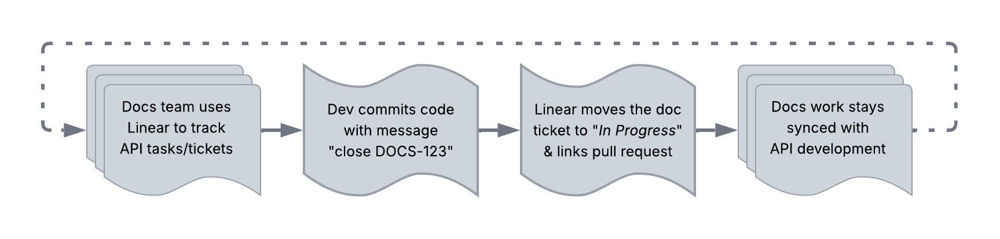

# Infrastructure & Platforms

Foundational systems that enable API development and documentation workflows.
This subcategory includes both technical infrastructure - event streaming,
message queues, cloud platforms - and organizational infrastructure - project
management and issue tracking - that teams rely on to build, document, and
ship APIs.

<!-- TODO: add Confluence, Jira, RabbitMQ, Redis, cloud platforms -->

---

## Kafka

**Definition**: also known as Apache Kafka; distributed event
streaming platform that stores, processes, and transmits streams
of events in real-time using it own binary TCP - _Transmission
Control Protocol_

**Purpose**: enables building real-time data pipelines and streaming
applications with high throughput, fault tolerance, and scalability;
combines messaging, storage, and stream processing capabilities

**Example**: companies use Kafka to process millions of events per
second for real-time analytics, log aggregation, and change data capture,
with events persisted to disk for replay and historical analysis

**Related Terms**: [AMQP](../api-types-architectures.md#amqp),
[AsyncAPI](../core-concepts/documentation-specific.md#asyncapi),
[event-driven](../api-types-architectures.md#event-driven),
[message broker](../core-concepts/api-fundamentals.md#message-broker),
[MQTT](../api-types-architectures.md#mqtt)

**Sources**:

- [Apache Software Foundation, Docs: "Apache Kafka is an event streaming plaform. What does that mean?"](https://kafka.apache.org/41/getting-started/introduction/#apache-kafka-is-an-event-streaming-platform-what-does-that-mean)
- [Amazon Web Services: "What is Apache Kafka?"](https://aws.amazon.com/what-is/apache-kafka/)

---

## Linear

**Definition**: project management and issue tracking software designed for
software development teams with focus on speed, keyboard shortcuts, and
streamlined workflows; related tools include [Asana](https://asana.com/),
[ClickUp](https://clickup.com/), [Jira](https://www.atlassian.com/software/jira),
[Monday.com](https://monday.com/), and [Notion](https://www.notion.com/)

**Purpose**: helps development and docs teams track tasks, bugs, and feature
requests with Git integration for automatic issue updates based on commit
messages and pull request merges; commonly used in API docs projects for
managing tickets, tracking docs debt, and coordinating releases between
engineering and technical writing teams

**Example**: docs tasks tracking with Linear -

### Linear vs Related Tools

| Tool | Best For | API Docs Strengths | Git Integration |
| ------ | ---------- | ------------------- | ----------------- |
| **Linear** | Software development teams prioritizing speed | Native Git integration, automatic issue updates from commits, keyboard-first workflow | Native - GitHub, GitLab |
| **Asana** | Cross-functional teams with diverse workflows | Flexible views, timeline planning, broad integrations | Via third-party apps |
| **ClickUp** | Teams wanting all-in-one customization | Highly customizable, docs and tasks in one platform, multiple view types | Via integrations |
| **Jira** | Enterprise software teams with complex processes | Powerful issue tracking, extensive DevOps integrations, advanced workflows | Native - Bitbucket, GitHub, GitLab |
| **Monday.com** | Visual workflow management across departments | Visual boards, automation recipes, status-centric tracking | Via integrations |
| **Notion** | Knowledge management and lightweight project tracking | Excellent for docs and task databases, flexible content creation | Via third-party integrations |

**Related Terms**: [CI/CD pipeline](development-essentials.md#cicd-pipeline),
[docs-as-code](../workflows-methodologies.md#docs-as-code),
[Falconer](documentation-specific.md#falconer),
[Git](development-essentials.md#git),
[GitHub](development-essentials.md#github),
[version control](development-essentials.md#version-control)

**Sources**:

- [Linear Homepage: "The product development system for teams and agents"](https://linear.app/)
- Write the Docs community discussion, January 2026

---
