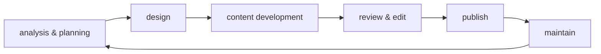

# Workflows & Methodologies
<!-- ignore this Vale capitalization error, see Style Guide #Headings-->

Development and documentation workflows for API projects. This section
covers methodologies, testing approaches, and lifecycle management
practices that guide how API documentation teams plan, create,
test, and maintain their work.

---

## Agile

**Definition**: methodology with a collection of project management
frameworks that break projects down into smaller phases and
rely on iterative cycles

**Purpose**: allows teams to adapt to changes and regularly refine
their work through flexibility rather than linear, rigid planning

**Key Values**:

- People over processes
- Working solutions over detailed documentation
- Customer collaboration over rigid contracts
- Adapting to change over following a strict plan

**Related Terms**: [docs-as-code](#docs-as-code),
[docs-as-tests](#docs-as-tests),
[Document Development Life Cycle](#document-development-life-cycle),
[project management methodology](#project-management-methodology),
[Scrum](#scrum), [Waterfall](#waterfall)

**Sources**:

- ["Manifesto for Agile Software Development"](https://agilemanifesto.org/)
- UW API Docs: Module 2, Lesson 3, "Introduction to Project Scheduling"
- [Wrike: "What Is Agile Methodology in Project Management?" by Artem Gurnov](https://www.wrike.com/project-management-guide/faq/what-is-agile-methodology-in-project-management/)

---

## API testing

**Definition**: the practice of validating that APIs function correctly,
return expected responses, handle errors appropriately, and meet performance
requirements

**Purpose**: ensures API reliability and accuracy before production deployment;
in API documentation contexts, validates that documented endpoints, parameters,
and code examples work as written; catches breaking changes that would make
documentation inaccurate or misleading to developers

**Why this belongs in `Workflows & Methodologies`**: describes a testing
practice and validation workflow that focuses on how teams verify APIs
as part of documentation maintenance and _emphasizes the practice_ of
testing rather than a specific tool; `Core Concepts` covers what APIs are and
API testing is about _what teams do with APIs, not a fundamental API
characteristic_

**How this differs from QA testing**: both testing approaches are necessary and
complementary - QA ensures the product works correctly, while documentation
testing ensures that user content is accurate:

| Aspect | QA Testing | Documentation Testing |
| -------- | ------------ | ---------------------- |
| **What it tests** | APIs meet engineering specifications and function correctly | Documented workflows, code examples, and instructions work as written |
| **Source of truth** | Engineering specifications and technical requirements | User-facing documentation and tutorials |
| **Purpose** | Validates product works to spec | Validates user-facing instructions remain accurate |
| **Can catch documentation drift?** | **No** - validates against different source of truth | **Yes** - specifically designed to catch this |
| **Example scenario** | Developers add a required parameter, tests pass &rarr; API works correctly | Developers add a required parameter, tests fail &rarr; documented examples no longer work |

**Example**: a technical writer implements automated tests that send HTTP requests
to each documented API endpoint with the exact parameters shown in code examples,
verifying that responses match documented schemas and status codes; when developers
change an endpoint's required parameters, the test fails, alerting the documentation
team to update their integration guides

**Related Terms**: [API](core-concepts.md#api), [docs-as-tests](#docs-as-tests),
Doc Detective, [HTTP status codes](core-concepts.md#http-status-codes),
[REST API](api-types-architectures.md#rest-api)

**Sources**:

- [James Tasse: "Docs as Tests: Part I - On a High (Level)"](https://jamestasse.tech/2025/05/29/docs-as-tests-on-a-high-level/)
- [Manny Silva, Docs as Tests: "Validate an API with Doc Detective" by Niko Berry](https://www.docsastests.com/validate-api-with-doc-detective)
- Write the Docs Book Club Slack discussions while reading Manny Silva's _Docs as Tests_, December 2025 - January 2026

---

## Critical Chain Project Management

**Definition**: also known as CCPM; takes the critical path method
one step further - focuses on resources needed to complete tasks
rather than solely on task dependencies

**Purpose**: ensures project schedules account for resource constraints,
not just task dependencies

**Related Terms**: [Agile](#agile),
[Critical Path Method](#critical-path-method),
[project management methodology](#project-management-methodology)

**Sources**:

- UW API Docs: Module 2, Lesson 3, "Introduction to Project Scheduling"
- [Wrike: "Project Management Methodologies" by Artem Gurnov](https://www.wrike.com/project-management-guide/methodologies/)

---

## Critical Path Method

**Definition**: also known as CPM; project management technique
identifying task sequences where some tasks can't start until
previous ones finish, often visualized with Gantt charts

**Purpose**: helps teams understand task dependencies and identify
bottlenecks in project timelines

**Example**: the "critical path" in a software release might include code
freeze → QA testing → documentation review → deployment, where delays in
any step delay the entire release

**Related Terms**: [Agile](#agile),
[Critical Chain Project Management](#critical-chain-project-management),
[project management methodology](#project-management-methodology)

**Sources**:

- [ProjectManager: "A Gantt Chart Guide with Definitions & Examples"](https://www.projectmanager.com/guides/gantt-chart)
- UW API Docs - Module 2, Lesson 3, "Introduction to Project Scheduling"
- [Wrike: "Project Management Methodologies" by Artem Gurnov](https://www.wrike.com/project-management-guide/methodologies/)

---

## docs-as-code

**Definition**: methodology for developing and publishing documentation
using the same tools, processes, and workflows as software development

**Purpose**: enables documentation teams to manage content in version
control systems alongside code, leverage developer workflows like pull
requests and code review, and automate publishing through CI/CD pipelines;
treats documentation files as code artifacts that follow the same quality
standards, testing processes, and deployment procedures as software

**Why this belongs in `Workflows & Methodologies`**: docs-as-code is
fundamentally a methodology for organizing work, _not a specific tool or
analytical framework_; it describes a strategic approach to documentation
processes and operational workflows, how teams organize daily documentation
work within development cycles, rather than an evaluation framework like
cognitive dimensions, or a specific software platform, like
[Git](tools-techniques.md#git) or [Swagger](tools-techniques.md#swagger)

**Example**: a technical writing team stores [Markdown](tools-techniques.md#markdown)
documentation files in the same Git repository as app code, uses
GitHub or GitLab issues to track documentation tasks, reviews changes through
pull/merge requests, previews content in staging environments, and
automatically deploys to production when changes merge to the `main` branch

**Benefits**:

- **Transparency**: all documentation discussions, decisions, and changes
visible in one place
- **Collaboration**: developers draft initial documentation, writers review
and refine, everyone can contribute feedback
- **Traceability**: complete history of what changed and why, accessible
years later
- **Efficiency**: eliminates context-switching between many tools, reduces
time searching through email or chat for past decisions
- **Integration**: documentation stays synchronized with code changes
through the same review and deployment process

**Considerations**:

- requires all contributors to learn the version control system and
documentation toolchain
- may limit spontaneous collaboration if team relies solely on formal issue
tracking
- effectiveness depends on comprehensive documentation testing and review
processes
- demands clear communication standards, especially for asynchronous,
distributed teams
- success requires balancing standardization with space for creative,
informal discussion

**Related Terms**: [Agile](#agile), [Git](tools-techniques.md#git),
[GitHub](tools-techniques.md#github), [main branch](tools-techniques.md#main-branch),
[pull request](tools-techniques.md#pull-request),
[version control](tools-techniques.md#version-control)

**Sources**:

- [GitLab: "Five fast facts about docs as code at GitLab"](https://about.gitlab.com/blog/five-fast-facts-about-docs-as-code-at-gitlab/)
- UW API Docs: Module 3, Lesson 1, "Introduction to Docs-as-Code"

---

## docs-as-tests

**Definition**: documentation strategy that treats documentation as
testable assertions to verify content accuracy against the current
product state

**Purpose**: maintains documentation accuracy through automated testing
that validates docs work as written by directly testing against product
UIs, APIs, and CLIs; catches documentation and product issues before
users encounter them while reducing manual maintenance effort in
environments with frequent product updates; enables technical writers to
identify breaking changes in products before release, like how developers
use automated tests to catch code regressions

**Why this belongs in `Workflows & Methodologies`**: describes an operational
workflow approach that focuses on processes and practices rather than
specific tools or conceptual frameworks

**Example**: a team implements automated tests that execute each step in
their API integration guide against their staging environment, verifying
that endpoints respond correctly and code examples produce expected results;
when an API endpoint changes, the test fails immediately, alerting writers
to update the documentation before the change reaches production; a UI
documentation test fails when a button label changes from "Sign Up" to
"Create Account," catching the discrepancy before users see inconsistent
documentation

**Related Terms**: [Agile](#agile), [API testing](#api-testing),
CI/CD pipeline, [docs-as-code](#docs-as-code), [UI](tools-techniques.md#ui)

**Sources**:

- [Boffin Education: "About Docs as Tests" by Manny Silva](https://boffin.education/about-docs-as-tests/)
- [James Tasse: "Docs as Tests: Part I - On a High Level"](https://jamestasse.tech/2025/05/29/docs-as-tests-on-a-high-level/)
- [Manny Silva, Docs as Tests: "Never have stale docs again"](https://www.docsastests.com/)

---

## Document Development Life Cycle

**Definition**: also known as DDLC; process of writing and delivering
content in the form of documentation such as PDFs, Word documents,
online articles, or website content

**Purpose**: provides a structured approach to creating documentation
with well-defined phases that ensure content meets user needs

**Phases**:

1. Analysis and planning
2. Designing
3. Content development
4. Proofreading and editing
5. Publishing
6. Implementation
7. Approval
8. Maintenance

**Related Terms**: [Agile](#agile),
[project management methodology](#project-management-methodology),
[usability testing](#usability-testing)

**Sources**:

- [Geeks for Geeks: "Document Development Life Cycle"](https://www.geeksforgeeks.org/software-engineering/document-development-life-cycle-ddlc/)
- UW API Docs: Module 2, Lesson 3, "Introduction to Project Scheduling"

---

## guerrilla usability testing

**Definition**: evaluation method that tests interface effectiveness
by approaching participants in public spaces for quick feedback rather
than recruiting in advance

**Purpose**: provides a quick, cost-effective way to gather feedback
from target users without formal recruitment processes

**Characteristics**:

- Low maintenance with predefined tasks
- Best for testing that doesn't require advanced device knowledge
- Returns less accurate results than formal testing
- Participants approached ad hoc in public settings

**Deliverables**:

- Test plan with timeframe and research objectives
- Video with screen and participant recordings
- Summary report with key findings and next steps
- Presentation covering findings and recommendations

**Related Terms**:
[AI-assisted usability analysis](ai-and-apis.md#ai-assisted-usability-analysis),
[Document Development Life Cycle](#document-development-life-cycle),
[usability testing](#usability-testing)

**Sources**:

- [Usability Geek: "Guerrilla Usability Testing: How To Introduce It In Your Next UX Project" by Emily Grace Adiseshiah](https://usabilitygeek.com/guerrilla-usability-testing-how-to/)
- UW API Docs: Module 4, Lesson 3, "Review usability testing for API"

---

## project management methodology

**Definition**: different approaches to organizing and executing projects,
ranging from sequential to iterative frameworks

**Purpose**: provides structured ways to plan, execute, and complete
projects based on team needs and project characteristics

**Common Methodologies**:

| Methodology | Approach | Focus | Best For |
| ------------- | ---------- | ------- | ---------- |
| Waterfall | Sequential, linear | Phase completion | Stable requirements, predictable projects |
| Critical Path Method | Dependency-based | Task sequences | Projects with clear dependencies |
| Critical Chain Project Management | Resource-focused | Resource availability | Resource-constrained projects |
| Agile | Iterative, flexible | Adaptation | Changing requirements, feedback loops |
| Scrum | Sprint-based | Team collaboration | Fast-paced development, quick iterations |

**Related Terms**: [Agile](#agile),
[Critical Chain Project Management](#critical-chain-project-management),
[Critical Path Method](#critical-path-method),
[Document Development Life Cycle](#document-development-life-cycle),
[Scrum](#scrum), [Waterfall](#waterfall)

**Sources**:

- UW API Docs: Module 2, Lesson 3, "Introduction to Project Scheduling"
- [Wrike: "Project Management Methodologies" by Artem Gurnov](https://www.wrike.com/project-management-guide/methodologies/)

---

## Scrum

**Definition**: Agile framework where small teams led by a scrum master
work in short two-week cycles called sprints with daily meetings

**Purpose**: enables rapid development and testing while removing
obstacles to efficient work

**Characteristics**:

- Scrum master clears obstacles to team efficiency
- Work completed in two-week sprints
- Daily team meetings to discuss progress
- Iterative approach to development

**Related Terms**: [Agile](#agile),
[project management methodology](#project-management-methodology)

**Sources**:

- UW API Docs: Module 2, Lesson 3, "Introduction to Project Scheduling"
- [Wrike: "Project Management Methodologies" by Artem Gurnov](https://www.wrike.com/project-management-guide/methodologies/)

---

## usability testing

**Definition**: practice of testing how easy a design is to use with
representative users, typically by observing them as they attempt to
complete tasks

**Purpose**: identifies problems before customers encounter them and
provides user perspective before product release

**Benefits**:

- Finds problems before customers do
- Provides customer perspective pre-release
- Informs design improvements

**Limitations**:

- Not designed to generalize beyond test scope
- Can't prove that a feature works universally
- Not statistically significant but still useful
- Participant recruitment is challenging

**Related Terms**:
[AI-assisted usability analysis](ai-and-apis.md#ai-assisted-usability-analysis),
[Document Development Life Cycle](#document-development-life-cycle),
[guerrilla usability testing](#guerrilla-usability-testing)

**Source**: UW API Docs: Module 4, Lesson 3, "Review usability testing for API"

---

## Waterfall

**Definition**: traditional, sequential, linear project management
methodology where each phase must complete before the next begins

**Purpose**: provides idealistic approach for projects with
well-defined requirements and minimal expected changes

**Characteristics**:

- Sequential, non-iterative phases
- First introduced by Winston W. Royce in 1970
- Each phase gates the next
- Limited flexibility for changes

**Related Terms**: [Agile](#agile),
[project management methodology](#project-management-methodology),
[Scrum](#scrum)

**Sources**:

- [Geeks for Geeks: "Waterfall Model - Software Engineering"](https://www.geeksforgeeks.org/software-engineering/waterfall-model/)
- UW API Docs: Module 2, Lesson 3, "Introduction to Project Scheduling"
- [Wrike: "Project Management Methodologies" by Artem Gurnov](https://www.wrike.com/project-management-guide/methodologies/)

---
