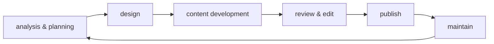

# Workflows & methodologies

Development and documentation workflows for API projects. This section
covers methodologies, testing approaches, and lifecycle management
practices that guide how API documentation teams plan, create,
validate, and maintain their work.

## Agile

**Definition**: methodology with a collection of project management
frameworks that break projects down into smaller phases and
rely on iterative cycles

**Purpose**: allows teams to adapt to changes and regularly refine
their work through flexibility rather than linear, rigid planning

**Key Values**:

- People over processes
- Working solutions over detailed documentation
- Customer collaboration over rigid contracts
- Adapting to change over following a strict plan

**Related Terms**: Document Development Life Cycle, project management
methodology, Scrum, Waterfall

**Sources**:

- [Manifesto for Agile Software Development](https://agilemanifesto.org/)
- UW API Docs - Module 2, Lesson 3, "Introduction to Project Scheduling"
- [What Is Agile Methodology in Project Management?](https://www.wrike.com/project-management-guide/faq/what-is-agile-methodology-in-project-management/)

---

## Critical Chain Project Management (CCPM)

**Definition**: approach that focuses on resources needed to complete
tasks rather than solely on task dependencies; takes the critical
path method one step further

**Purpose**: ensures project schedules account for resource constraints,
not just task dependencies

**Related Terms**: Agile, Critical Path Method, project management methodology

**Sources**:

- [Project Management Methodologies](https://www.wrike.com/project-management-guide/methodologies/)
- UW API Docs - Module 2, Lesson 3, "Introduction to Project Scheduling"

---

## Critical Path Method (CPM)

**Definition**: project management technique identifying task sequences
where some tasks can't start until previous ones finish, often visualized
with Gantt charts

**Purpose**: helps teams understand task dependencies and identify
bottlenecks in project timelines

**Example**: the "critical path" in a software release might include code
freeze → QA testing → documentation review → deployment, where delays in
any step delay the entire release

**Related Terms**: Agile, Critical Chain Project Management,
project management methodology

**Sources**:

- [A Gantt Chart Guide](https://www.projectmanager.com/guides/gantt-chart)
- [Project Management Methodologies](https://www.wrike.com/project-management-guide/methodologies/)
- UW API Docs - Module 2, Lesson 3, "Introduction to Project Scheduling"

---

## Document Development Life Cycle (DDLC)

**Definition**: process of writing and delivering content in the form
of documentation such as PDFs, Word documents, online articles, or
website content

**Purpose**: provides a structured approach to creating documentation
with well-defined phases that ensure content meets user needs

**Phases**:

1. Analysis and planning
2. Designing
3. Content development
4. Proofreading and editing
5. Publishing
6. Implementation
7. Approval
8. Maintenance

**Related Terms**: Agile, project management methodology, usability testing

**Sources**:

- [Geeks for Geeks: Document Development Life Cycle](https://www.geeksforgeeks.org/software-engineering/document-development-life-cycle-ddlc/)
- UW API Docs - Module 2, Lesson 3, "Introduction to Project Scheduling"

---

## Guerrilla Usability Testing

**Definition**: evaluation method that tests interface effectiveness
by approaching participants in public spaces for quick feedback rather
than recruiting in advance

**Purpose**: provides a quick, cost-effective way to gather feedback
from target users without formal recruitment processes

**Characteristics**:

- Low maintenance with predefined tasks
- Best for testing that doesn't require advanced device knowledge
- Returns less accurate results than formal testing
- Participants approached ad hoc in public settings

**Deliverables**:

- Test plan with timeframe and research objectives
- Video with screen and participant recordings
- Summary report with key findings and next steps
- Presentation covering findings and recommendations

**Related Terms**: AI-assisted usability analysis, usability testing

**Sources**:

- [Guerrilla Usability Testing: How To Introduce It In Your Next UX Project](https://usabilitygeek.com/guerrilla-usability-testing-how-to/)
- UW API Docs - Module 4, Lesson 3, "Review usability testing for API"

---

## project management methodology

**Definition**: different approaches to organizing and executing projects,
ranging from sequential to iterative frameworks

**Purpose**: provides structured ways to plan, execute, and complete
projects based on team needs and project characteristics

**Common Methodologies**:

| Methodology | Approach | Focus | Best For |
| ------------- | ---------- | ------- | ---------- |
| Waterfall | Sequential, linear | Phase completion | Stable requirements, predictable projects |
| Critical Path Method | Dependency-based | Task sequences | Projects with clear dependencies |
| Critical Chain Project Management | Resource-focused | Resource availability | Resource-constrained projects |
| Agile | Iterative, flexible | Adaptation | Changing requirements, feedback loops |
| Scrum | Sprint-based | Team collaboration | Fast-paced development, quick iterations |

**Related Terms**: Agile, Critical Chain Project Management,
Critical Path Method, Document Development Life Cycle, Scrum, Waterfall

**Sources**:

- [Project Management Methodologies](https://www.wrike.com/project-management-guide/methodologies/)
- UW API Docs - Module 2, Lesson 3, "Introduction to Project Scheduling"

---

## Scrum

**Definition**: Agile framework where small teams led by a scrum master
work in short two-week cycles called sprints with daily meetings

**Purpose**: enables rapid development and testing while removing
obstacles to efficient work

**Characteristics**:

- Scrum master clears obstacles to team efficiency
- Work completed in two-week sprints
- Daily team meetings to discuss progress
- Iterative approach to development

**Related Terms**: Agile, project management methodology

**Sources**:

- [Project Management Methodologies](https://www.wrike.com/project-management-guide/methodologies/)
- UW API Docs - Module 2, Lesson 3, "Introduction to Project Scheduling"

---

## usability testing

**Definition**: practice of testing how easy a design is to use with
representative users, typically by observing them as they attempt to
complete tasks

**Purpose**: identifies problems before customers encounter them and
provides user perspective before product release

**Benefits**:

- Finds problems before customers do
- Provides customer perspective pre-release
- Informs design improvements

**Limitations**:

- Not designed to generalize beyond test scope
- Can't prove that a feature works universally
- Not statistically significant but still useful
- Participant recruitment is challenging

**Related Terms**: AI-assisted usability analysis, Guerrilla Usability Testing

**Source**: UW API Docs - Module 4, Lesson 3, "Review usability testing for API"

---

## Waterfall

**Definition**: traditional, sequential, linear project management
methodology where each phase must complete before the next begins

**Purpose**: provides simple, idealistic approach for projects with
well-defined requirements and minimal expected changes

**Characteristics**:

- Sequential, non-iterative phases
- First introduced by Winston W. Royce in 1970
- Each phase gates the next
- Limited flexibility for changes

**Related Terms**: Agile, project management methodology, Scrum

**Sources**:

- [Project Management Methodologies](https://www.wrike.com/project-management-guide/methodologies/)
- UW API Docs - Module 2, Lesson 3, "Introduction to Project Scheduling"
- [Waterfall Model - Software Engineering](https://www.geeksforgeeks.org/software-engineering/waterfall-model/)

---
