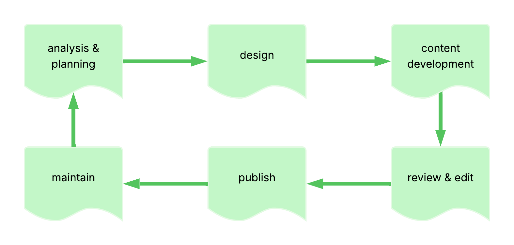
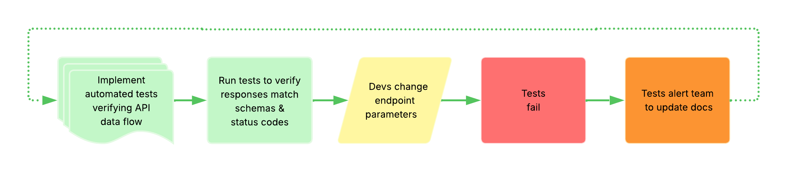
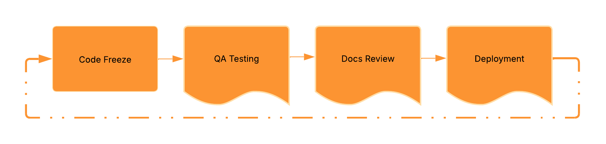
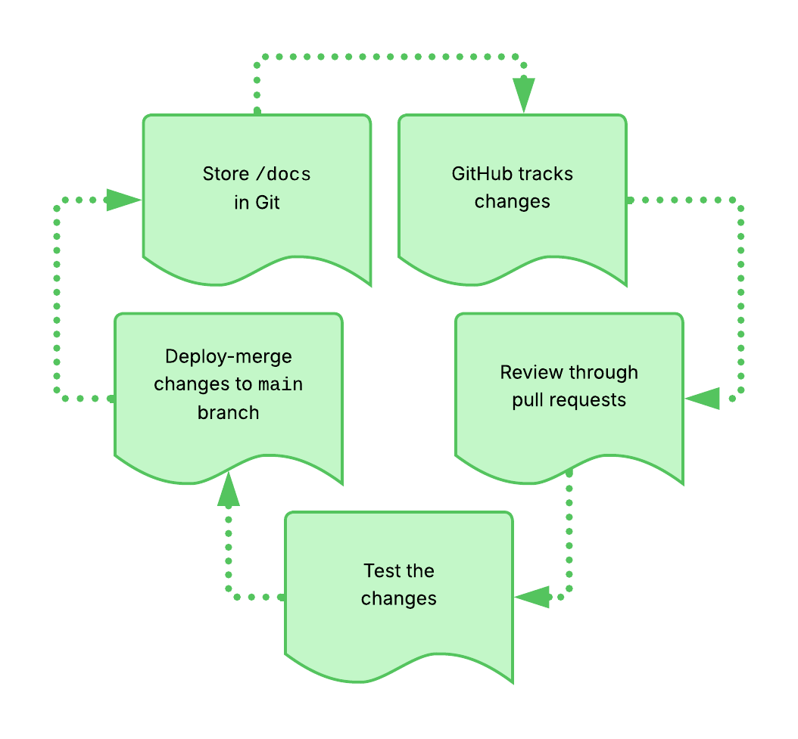
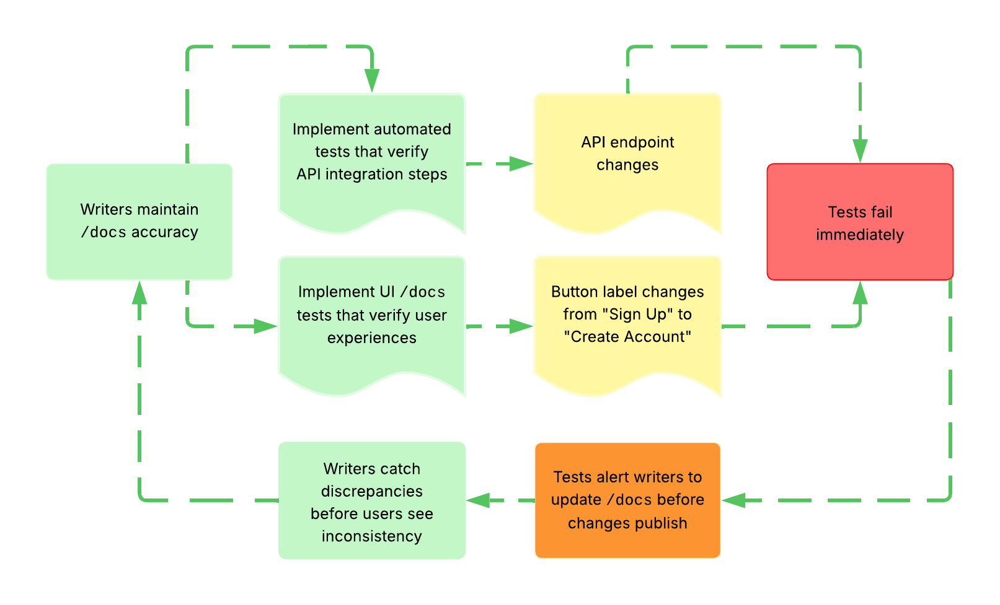
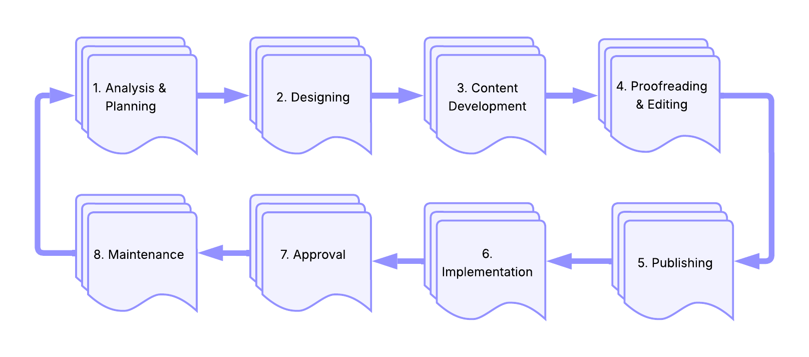
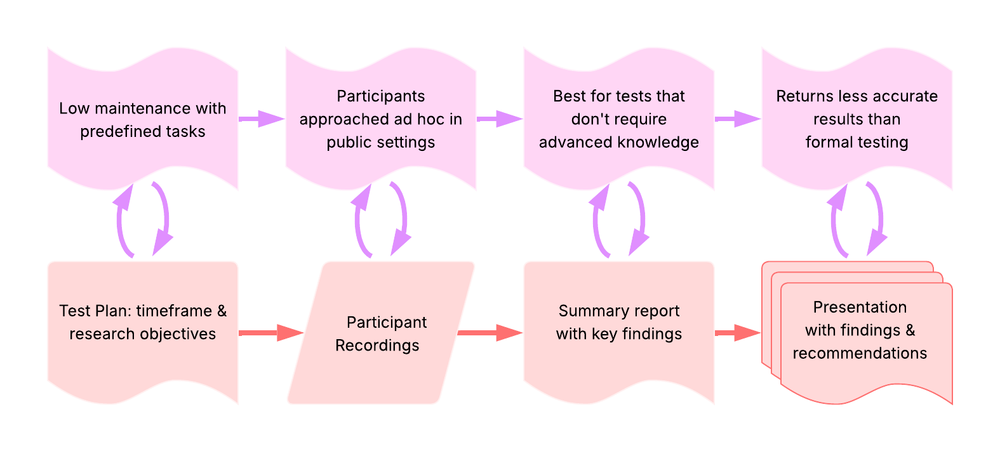
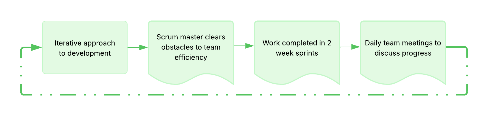

# Workflows & Methodologies

Development and documentation workflows for API projects. This section
covers methodologies, testing approaches, and lifecycle management
practices that guide how API documentation teams plan, create,
test, and maintain their work.



---

## Agile

**Definition**: methodology with a collection of project management
frameworks that break projects down into smaller phases and
rely on iterative cycles

**Purpose**: allows teams to adapt to changes and regularly refine
their work through flexibility rather than linear, rigid planning

**Example**: key values -


**Related Terms**:
[CI/CD pipeline](./tools-techniques/development-essentials.md#cicd-pipeline),
[docs-as-code](#docs-as-code),
[docs-as-ecosystem](frameworks-strategy.md#docs-as-ecosystem),
[docs-as-tests](#docs-as-tests),
[Document Development Life Cycle](#document-development-life-cycle),
[project management methodology](#project-management-methodology),
[Scrum](#scrum), [Waterfall](#waterfall)

**Sources**:

- ["Manifesto for Agile Software Development"](https://agilemanifesto.org/)
- UW API Docs: Module 2, Lesson 3, "Introduction to Project Scheduling"
- [Wrike: "What Is Agile Methodology in Project Management?" by Artem Gurnov](https://www.wrike.com/project-management-guide/faq/what-is-agile-methodology-in-project-management/)

---

## API documentation testing

**Definition**: the practice of validating that APIs function correctly,
return expected responses, handle errors appropriately, and meet performance
requirements

**Purpose**: ensures API reliability and accuracy before production deployment;
in API documentation contexts, validates that documented endpoints, parameters,
and code examples work as written; catches breaking changes that would make
documentation inaccurate or misleading to developers

**Why this belongs in `Workflows & Methodologies`**: describes a testing
practice and validation workflow that focuses on how teams verify APIs
as part of documentation maintenance and _emphasizes the practice_ of
testing rather than a specific tool; `Core Concepts` covers what APIs are and
API testing is about _what teams do with APIs, not a fundamental API
characteristic_

### API docs testing vs QA testing

Both testing approaches are necessary and complementary - QA ensures the product
works correctly, while documentation testing ensures that user content is
accurate:

| Aspect | QA Testing | Documentation Testing |
| -------- | ------------ | ---------------------- |
| **What it Tests** | APIs meet engineering specifications and function correctly | Documented workflows, code examples, and instructions work as written |
| **Source of Truth** | Engineering specifications and technical requirements | User-facing documentation and tutorials |
| **Purpose** | Validates product works to spec | Validates user-facing instructions remain accurate |
| **Can catch documentation drift?** | **No** - validates against different source of truth | **Yes** - specifically designed to catch this |
| **Example Scenario** | Developers add a required parameter, tests pass &rarr; API works correctly | Developers add a required parameter, tests fail &rarr; documented examples no longer work |

### API docs testing types

| Testing Type | What It Validates | Scope | Example |
| ------------ | ----------------- | ----- | ------- |
| **Contract Testing** | API conforms to agreed contracts between consumer and provider | Interface contracts, message formats, protocols | Consumer defines expected response format, provider verifies implementation matches |
| **Snippet Testing** | Code examples execute successfully | Individual code samples in documentation | Python snippet makes API call and returns expected data structure |
| **Workflow Testing** | Multi-step API sequences accomplish tasks | Complete user journeys across endpoints | Authentication → create resource → retrieve resource → delete resource all work in sequence |

**Example**: API docs testing workflow -



**Related Terms**: [AI agent](ai-and-apis.mdx#ai-agent),
[API](./core-concepts/api-fundamentals.md#api), [BDD](#bdd),
[Bruno](./tools-techniques/testing-validation.md#bruno),
[contract testing](#contract-testing),
[Cypress](./tools-techniques/testing-validation.md#cypress),
[Doc Detective](./tools-techniques/testing-validation.md#doc-detective),
[docs-as-tests](#docs-as-tests),
[HTTP status codes](./core-concepts/api-fundamentals.md#http-status-codes),
[Playwright](./tools-techniques/testing-validation.md#playwright),
[REST API](api-types-architectures.md#rest-api),
[UX](frameworks-strategy.md#ux), [workflow testing](#workflow-testing)

**Sources**:

- [James Tasse: "Docs as Tests: Part I - On a High (Level)"](https://jamestasse.tech/2025/05/29/docs-as-tests-on-a-high-level/)
- [Manny Silva, Docs as Tests: "Validate an API with Doc Detective" by Niko Berry](https://www.docsastests.com/validate-api-with-doc-detective)
- Write the Docs Book Club Slack discussions while reading Manny Silva's _Docs as Tests_, December 2025 - January 2026

---

## BDD

**Definition**: acronym for _behavior-driven development_; software development
methodology that extends TDD - _test-driven development_ - by writing tests in
natural language that describes how software should behave from a user's
perspective

**Purpose**: bridges communication between technical and non-technical
stakeholders by expressing requirements and tests in plain language; enables
collaboration between developers, testers, and business analysts through shared
understanding of expected behavior; in API documentation contexts, allows teams
to validate API behavior using human-readable scenarios that serve as both tests
and documentation

**Example**: a team uses BDD to document and test their payment API by writing
scenarios that become executable tests through frameworks like
[Cucumber](https://cucumber.io/) while simultaneously serving as readable
documentation of API behavior -

```shell
"Given a valid credit card, 
When a charge request is submitted,
Then the transaction succeeds and returns a confirmation ID"
```

**Related Terms**: [API documentation testing](#api-documentation-testing),
[Cucumber](./tools-techniques/testing-validation.md#cucumber),
[Given-When-Then](./tools-techniques/testing-validation.md#given-when-then),
[docs-as-tests](#docs-as-tests), [workflow testing](#workflow-testing)

**Sources**:

- [Cucumber: "Behaviour-Driven Development"](https://cucumber.io/docs/bdd/)
- [Silva, Manny. _Docs As Tests_. First edition, Release 2, Boffin Education, May 2025.](https://boffin.education/about-docs-as-tests/)
- [Wikipedia: "Behavior-driven development"](https://en.wikipedia.org/wiki/Behavior-driven_development)

---

## contract testing

**Definition**: verifies APIs and services conform to agreed-upon
contracts between consumers/client and providers/server by
validating message formats, protocols, and behaviors

**Purpose**: verifies that the API does what the docs say it does;
catches integration issues early without requiring full end-to-end
testing environments; ensures API changes don't break existing consumers;
specifically ensures that the API definition, implementation, and
consumer's code all remain accurate and trustworthy

### contract testing vs linters

contract testing validates _runtime behavior_ against executable
specifications by testing actual API responses, while linters like
Vale perform static analysis of API description documents to check
formatting, style, and specification compliance without making requests

**Example**: consumer team writes tests defining expected API responses,
provider team verifies their API implementation satisfies these expectations,
catching breaking changes before deployment

**Related Terms**: [API documentation testing](#api-documentation-testing),
[Bruno](./tools-techniques/testing-validation.md#bruno),
[docs-as-tests](#docs-as-tests),
[Dredd](./tools-techniques/testing-validation.md#dredd),
[Microcks](./tools-techniques/testing-validation.md#microcks),
[Pact](./tools-techniques/testing-validation.md#pact), Spectral,
[snippet testing](#snippet-testing),
[Vale](./tools-techniques/documentation-specific.md#vale),
[workflow testing](#workflow-testing)

**Sources**:

- [Silva, Manny. _Docs As Tests_. First edition, Release 2, Boffin Education, May 2025.](https://boffin.education/about-docs-as-tests/)
- [SmartBear Software, Swagger: "What is contract testing and why should I try it?" by Matt Fellows](https://pactflow.io/blog/what-is-contract-testing/)

---

## Critical Chain Project Management

**Definition**: also known as CCPM; takes the critical path method
one step further - focuses on resources needed to complete tasks
rather than solely on task dependencies

**Purpose**: ensures project schedules account for resource constraints,
not just task dependencies

**Related Terms**: [Agile](#agile),
[Critical Path Method](#critical-path-method),
[project management methodology](#project-management-methodology)

**Sources**:

- UW API Docs: Module 2, Lesson 3, "Introduction to Project Scheduling"
- [Wrike: "Project Management Methodologies" by Artem Gurnov](https://www.wrike.com/project-management-guide/methodologies/)

---

## Critical Path Method

**Definition**: also known as CPM; project management technique
identifying task sequences where some tasks can't start until
previous ones finish, often visualized with Gantt charts

**Purpose**: helps teams understand task dependencies and identify
bottlenecks in project timelines

**Example**: the "critical path" in a software release might include the
following steps, where delays in any step delay the entire release -



**Related Terms**: [Agile](#agile),
[Critical Chain Project Management](#critical-chain-project-management),
[project management methodology](#project-management-methodology)

**Sources**:

- [ProjectManager: "A Gantt Chart Guide with Definitions & Examples"](https://www.projectmanager.com/guides/gantt-chart)
- UW API Docs - Module 2, Lesson 3, "Introduction to Project Scheduling"
- [Wrike: "Project Management Methodologies" by Artem Gurnov](https://www.wrike.com/project-management-guide/methodologies/)

---

## diagrams-as-code

**Definition**: documentation approach that represents diagrams as text-based
code artifacts rather than binary image files; subset of the broader
docs-as-code philosophy applied specifically to visual information
in text form and/or content

**Purpose**: enables diagrams to live alongside code in repositories,
reviewed and maintained through the same workflows as the documentation
they support

**Why this belongs in `Workflows & Methodologies`**: describes a documentation
methodology and workflow pattern rather than a specific tool; similar to how
docs-as-code describes a tool-agnostic path, diagrams-as-code describes a
capability implemented by tools like Mermaid, PlantUML, D2, and Python Diagrams -
_the methodology is distinct from any individual implementation_

**Example**: instead of exporting a PNG from a GUI tool and committing the
binary file, a team writes Mermaid or PlantUML markup that renders automatically
in their docs platform - when the architecture changes, they update the text,
not the image

**Key Benefits**:

| **Benefit** | **Diagrams-as-Code** | **Binary Image Files** |
| ----------- | -------------------- | ---------------------- |
| Version Control | Text diffs show exactly what connection, label, or component changed; supports inline PR comments | Visual diff shows something changed but _not what or why_ |
| Collaboration | Reviewers comment on specific code lines in PRs | Reviewers describe changes in prose comments |
| Consistency | Tooling handles layout and styling automatically | Manual adjustment required each update |
| Maintainability | Searchable, refactorable, [grep](https://en.wikipedia.org/wiki/Grep)-able text | Binary file requires opening a GUI tool to inspect or edit |
| Accessibility | Text source readable by screen readers and LLMs natively | Requires [alt text](https://en.wikipedia.org/wiki/Alt_attribute) added separately |

**Related Terms**: [accessibility](frameworks-strategy.md#accessibility),
[D2](./tools-techniques/diagramming-visualization.md#d2),
[diagram](./tools-techniques/diagramming-visualization.md#diagram),
[docs-as-code](#docs-as-code), [GUI](./tools-techniques/development-essentials.md#gui),
[Ilograph](./tools-techniques/diagramming-visualization.md#ilograph),
[Large Language Model](ai-and-apis.mdx#large-language-model),
[Mermaid](./tools-techniques/diagramming-visualization.md#mermaid),
[PlantUML](./tools-techniques/diagramming-visualization.md#plantuml),
[pull request](./tools-techniques/development-essentials.md#pull-request),
[Python Diagrams](./tools-techniques/diagramming-visualization.md#python-diagrams),
[UML](./tools-techniques/diagramming-visualization.md#uml),
[version control](./tools-techniques/development-essentials.md#version-control)

**Sources**:

- [DEV Community: "Diagram-as-Code: Creating Dynamic and Interactive Documentation for Visual Content" by Romina Elena Mendez Escobar](https://dev.to/r_elena_mendez_escobar/diagram-as-code-creating-dynamic-and-interactive-documentation-for-visual-content-2p93)
- [Perforce Software Inc., Gliffy: "Understanding Diagrams as Code From Idea to Implementation"](https://www.gliffy.com/blog/diagrams-as-code)

---

## docs-as-code

**Definition**: methodology for developing and publishing documentation
using the same tools, processes, and workflows as software development

**Purpose**: enables documentation teams to manage content in version
control systems alongside code, leverage developer workflows like pull
requests and code review, and automate publishing through CI/CD pipelines;
treats documentation files as code artifacts that follow the same quality
standards, testing processes, and deployment procedures as software

**Why this belongs in `Workflows & Methodologies`**: docs-as-code is
fundamentally a methodology for organizing work, _not a specific tool or
analytical framework_; it describes a strategic approach to documentation
processes and operational workflows, how teams organize daily documentation
work within development cycles, rather than an evaluation framework like
cognitive dimensions, or a specific software platform, like
[Git](./tools-techniques/development-essentials.md#git)
or [Swagger](./tools-techniques/documentation-specific.md#swagger)

**Example** docs-as-code workflow:



**Benefits**:

- **Transparency**: all documentation discussions, decisions, and changes
visible in one place
- **Collaboration**: developers draft initial documentation, writers review
and refine, everyone can contribute feedback
- **Traceability**: complete history of what changed and why, accessible
years later
- **Efficiency**: eliminates context-switching between many tools, reduces
time searching through email or chat for past decisions
- **Integration**: documentation stays synchronized with code changes
through the same review and deployment process

**Considerations**:

- requires all contributors to learn the version control system and
documentation toolchain
- may limit spontaneous collaboration if team relies solely on formal issue
tracking
- effectiveness depends on comprehensive documentation testing and review
processes
- demands clear communication standards, especially for asynchronous,
distributed teams
- success requires balancing standardization with space for creative,
informal discussion

**Related Terms**: [Agile](#agile),
[CMS](./tools-techniques/documentation-specific.md#cms),
[diagrams-as-code](#diagrams-as-code),
[docs-as-ecosystem](frameworks-strategy.md#docs-as-ecosystem),
[Git](./tools-techniques/development-essentials.md#git),
[GitHub](./tools-techniques/development-essentials.md#github),
[`main` branch](./tools-techniques/development-essentials.md#main-branch),
[MDX](./tools-techniques/documentation-specific.md#mdx),
[pull request](./tools-techniques/development-essentials.md#pull-request),
[version control](./tools-techniques/development-essentials.md#version-control)

**Sources**:

- [GitLab: "Five fast facts about docs as code at GitLab"](https://about.gitlab.com/blog/five-fast-facts-about-docs-as-code-at-gitlab/)
- UW API Docs: Module 3, Lesson 1, "Introduction to Docs-as-Code"

---

## docs-as-tests

**Definition**: documentation strategy that treats documentation as
testable assertions to verify content accuracy against the current
product state

**Purpose**: maintains documentation accuracy through automated testing
that validates docs work as written by directly testing against product
UIs, APIs, and CLIs; catches documentation and product issues before
users encounter them while reducing manual maintenance effort in
environments with frequent product updates; enables technical writers to
identify breaking changes in products before release, like how developers
use automated tests to catch code regressions

**Why this belongs in `Workflows & Methodologies`**: describes an
operational workflow approach that focuses on processes and practices
rather than specific tools or conceptual frameworks

**Example** docs-as-tests workflow:



**Related Terms**: [AI agent](ai-and-apis.mdx#ai-agent),
[API documentation testing](#api-documentation-testing),
[BDD](#bdd), [contract testing](#contract-testing),
[Doc Detective](./tools-techniques/testing-validation.md#doc-detective),
[snippet testing](#snippet-testing),
[usability testing](#usability-testing),
[workflow testing](#workflow-testing)

**Sources**:

- [Boffin Education: "About Docs as Tests" by Manny Silva](https://boffin.education/about-docs-as-tests/)
- [James Tasse: "Docs as Tests: Part I - On a High Level"](https://jamestasse.tech/2025/05/29/docs-as-tests-on-a-high-level/)
- [Manny Silva, Docs as Tests: "Never have stale docs again"](https://www.docsastests.com/)

---

## Document Development Life Cycle

**Definition**: also known as DDLC; process of writing and delivering
content in the form of documentation such as PDFs, Word documents,
online articles, or website content

**Purpose**: provides a structured approach to creating documentation
with well-defined phases that ensure content meets user needs

**Phases**:



**Related Terms**: [Agile](#agile),
[API documentation testing](#api-documentation-testing),
[CI/CD pipeline](./tools-techniques/development-essentials.md#cicd-pipeline),
[project management methodology](#project-management-methodology),
[usability testing](#usability-testing)

**Sources**:

- [Geeks for Geeks: "Document Development Life Cycle"](https://www.geeksforgeeks.org/software-engineering/document-development-life-cycle-ddlc/)
- UW API Docs: Module 2, Lesson 3, "Introduction to Project Scheduling"

---

## guerrilla usability testing

**Definition**: evaluation method that tests interface effectiveness
by approaching participants in public spaces for quick feedback rather
than recruiting in advance

**Purpose**: provides a quick, cost-effective way to gather feedback
from target users without formal recruitment processes

**Example**: key characteristics and deliverables -



**Related Terms**: [accessibility](frameworks-strategy.md#accessibility),
[AI-assisted usability analysis](ai-and-apis.mdx#ai-assisted-usability-analysis),
[API documentation testing](#api-documentation-testing),
[contract testing](#contract-testing),
[Document Development Life Cycle](#document-development-life-cycle),
[DX](frameworks-strategy.md#dx),
[information architecture](frameworks-strategy.md#information-architecture),
[snippet testing](#snippet-testing), [usability testing](#usability-testing),
[UX](frameworks-strategy.md#ux), [workflow testing](#workflow-testing)

**Sources**:

- [Usability Geek: "Guerrilla Usability Testing: How To Introduce It In Your Next UX Project" by Emily Grace Adiseshiah](https://usabilitygeek.com/guerrilla-usability-testing-how-to/)
- UW API Docs: Module 4, Lesson 3, "Review usability testing for API"

---

## project management methodology

**Definition**: different approaches to organizing and executing projects,
ranging from sequential to iterative frameworks

**Purpose**: provides structured ways to plan, execute, and complete
projects based on team needs and project characteristics

### common methodologies

| Methodology | Approach | Focus | Best For |
| ------------- | ---------- | ------- | ---------- |
| Waterfall | Sequential, linear | Phase completion | Stable requirements, predictable projects |
| Critical Path Method | Dependency-based | Task sequences | Projects with clear dependencies |
| Critical Chain Project Management | Resource-focused | Resource availability | Resource-constrained projects |
| Agile | Iterative, flexible | Adaptation | Changing requirements, feedback loops |
| Scrum | Sprint-based | Team collaboration | Fast-paced development, quick iterations |

**Related Terms**: [Agile](#agile),
[Critical Chain Project Management](#critical-chain-project-management),
[Critical Path Method](#critical-path-method),
[Document Development Life Cycle](#document-development-life-cycle),
[Scrum](#scrum), [Waterfall](#waterfall)

**Sources**:

- UW API Docs: Module 2, Lesson 3, "Introduction to Project Scheduling"
- [Wrike: "Project Management Methodologies" by Artem Gurnov](https://www.wrike.com/project-management-guide/methodologies/)

---

## Scrum

**Definition**: Agile framework where small teams led by a scrum master
work in short two-week cycles called sprints with daily meetings

**Purpose**: enables rapid development and testing while removing
obstacles to efficient work

**Example**: key characteristics -



**Related Terms**: [Agile](#agile),
[project management methodology](#project-management-methodology)

**Sources**:

- UW API Docs: Module 2, Lesson 3, "Introduction to Project Scheduling"
- [Wrike: "Project Management Methodologies" by Artem Gurnov](https://www.wrike.com/project-management-guide/methodologies/)

---

## snippet testing

**Definition**: automated testing practice that validates code examples
or "code snippets" in documentation execute successfully and produce expected
results

**Purpose**: prevents documentation drift by ensuring code examples
remain accurate as APIs evolve; catches breaking changes that would make
documented examples fail

**Example**: documentation builds execute Python code examples against
test API instances, failing the build if examples return errors or
unexpected responses

**Related Terms**: [API documentation testing](#api-documentation-testing),
[contract testing](#contract-testing), [docs-as-tests](#docs-as-tests),
[usability testing](#usability-testing), [workflow testing](#workflow-testing)

**Source**: [Silva, Manny. _Docs As Tests_. First edition, Release 2, Boffin Education, May 2025.](https://boffin.education/about-docs-as-tests/)

---

## usability testing

**Definition**: practice of testing how easy a design is to use with
representative users, typically by observing them as they attempt to
complete tasks

**Purpose**: identifies problems before customers encounter them and
provides user perspective before product release

**Benefits**:

- Finds problems before customers do
- Provides customer perspective pre-release
- Informs design improvements

**Limitations**:

- Not designed to generalize beyond test scope
- Can't prove that a feature works universally
- Not statistically significant but still useful
- Participant recruitment is challenging

**Related Terms**: [accessibility](frameworks-strategy.md#accessibility),
[AI-assisted usability analysis](ai-and-apis.mdx#ai-assisted-usability-analysis),
[API documentation testing](#api-documentation-testing),
[docs-as-ecosystem](frameworks-strategy.md#docs-as-ecosystem),
[Document Development Life Cycle](#document-development-life-cycle),
[DX](frameworks-strategy.md#dx),
[guerrilla usability testing](#guerrilla-usability-testing),
[information architecture](frameworks-strategy.md#information-architecture),
[UX](frameworks-strategy.md#ux), [workflow testing](#workflow-testing)

**Source**: UW API Docs: Module 4, Lesson 3, "Review usability testing for API"

---

## Waterfall

**Definition**: traditional, sequential, linear project management
methodology where each phase must complete before the next begins

**Purpose**: provides idealistic approach for projects with
well-defined requirements and minimal expected changes

**Characteristics**:

- Sequential, non-iterative phases
- First introduced by Winston W. Royce in 1970
- Each phase gates the next
- Limited flexibility for changes

**Related Terms**: [Agile](#agile),
[project management methodology](#project-management-methodology),
[Scrum](#scrum)

**Sources**:

- [Geeks for Geeks: "Waterfall Model - Software Engineering"](https://www.geeksforgeeks.org/software-engineering/waterfall-model/)
- UW API Docs: Module 2, Lesson 3, "Introduction to Project Scheduling"
- [Wrike: "Project Management Methodologies" by Artem Gurnov](https://www.wrike.com/project-management-guide/methodologies/)

---

## workflow testing

**Definition**: validates the sequences of API calls that accomplish
real tasks - multi-step interactions and user journeys across
multiple endpoints and operations

**Purpose**: ensures complete business processes work correctly beyond
individual endpoint testing; verifies APIs support real-world use cases
and user workflows; specifically validates that a series of API calls
work together as defined, confirming that users can successfully complete
tasks by following documentation procedures

**Example**: e-commerce workflow test validates entire checkout process by
testing user authentication, cart management, payment processing, and order
confirmation endpoints in sequence

**Related Terms**: [API documentation testing](#api-documentation-testing),
[BDD](#bdd), [contract testing](#contract-testing), [docs-as-tests](#docs-as-tests),
[guerilla usability testing](#guerrilla-usability-testing),
[Karate](./tools-techniques/testing-validation.md#karate),
[snippet testing](#snippet-testing), [usability testing](#usability-testing)

**Sources**:

- [Silva, Manny. _Docs As Tests_. First edition, Release 2, Boffin Education, May 2025.](https://boffin.education/about-docs-as-tests/)
- [Testsigma Technologies Inc., Automation Testing: "Workflow Testing | What it is & How to Perform?" by Ranjana Kodlekere](https://testsigma.com/blog/workflow-testing/)

---
