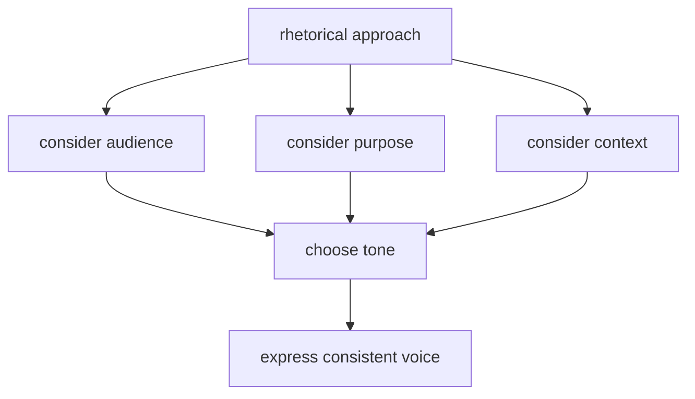

# Writing Style

Language conventions, tone guidelines, and rhetorical approaches
that shape how API documentation communicates with its audience.
This section covers grammar distinctions, content strategy principles,
and stylistic choices that affect clarity, professionalism, and user
engagement in technical writing.

**Example audience communication workflow**:

---

## active voice

**Definition**: sentence structure where the subject performs the
action rather than receiving it

**Purpose**: creates direct, clear communication that emphasizes
who does what in API documentation

**Example**:

- ✅ Active - "The API returns a JSON response"
- ❌ Passive - "A JSON response is returned by the API"

**Related Terms**: [rhetorical approach](#rhetorical-approach),
[tone](#tone), [voice](#voice)

**Source**: [API Docs Glossary: Style Guide](../docs/meta/style-guide.md)

---

## affect vs effect

**Definition**: commonly confused words where "affect" typically
functions as a _verb_ meaning "to influence" and "effect" typically
functions as a _noun_ meaning "the result"

**Purpose**: maintains professional credibility and clarity in
technical writing by using correct grammar

**Examples**:

- verb - "API latency affects user experience"
- noun - "The effect of caching improves response time"

**Related Terms**: [content](#content), [voice](#voice)

**Sources**:

- [I'd Rather Be Writing: "How do design, length, and relevance affect how people use API reference docs -- interview with Bob Watson"](https://idratherbewriting.com/2015/07/30/bob-watson-phd-dissertation-on-api-doc-mythbusting-testing-usability-performance/)
- [Wordrake: "Affect vs. Effect: Understanding the Difference and Choosing the Right Word" by Ivy B.Grey](https://www.wordrake.com/resources/affect-vs.-effect-understanding-the-difference-and-choosing-the-right-word)

---

## content

**Definition**: anything written for someone else to read,
encompassing documentation, guides, reference materials,
and instructional text

**Purpose**: establishes the scope of technical communication work
and emphasizes the reader-focused nature of documentation

**Example**: API reference topics, tutorials, quickstart guides,
and conceptual explanations all constitute content

**Related Terms**: [rhetorical approach](#rhetorical-approach),
[structured content](#structured-content), [tone](#tone),
[voice](#voice)

**Source**: [Docs By Design: "Audience, Market, Product Webinar"](https://docsbydesign.com/category/technical-writing/audience-market-product/)

---

## rhetorical approach

**Definition**: framework that treats communication as action embedded
in culture, values, and power structures, recognizing that each
communication situation is unique and requires analysis of its
specific context

**Purpose**: ensures technical writers consider audience, purpose,
and context when crafting API documentation rather than applying
one-size-fits-all solutions

**Example**: choosing between formal reference documentation for
experienced developers versus conversational tutorials for beginners
demonstrates rhetorical awareness

**Related Terms**: [active voice](#active-voice), [content](#content),
[tone](#tone)

**Sources**:

- [Docs By Design: "Audience, Market, Product Webinar"](https://docsbydesign.com/category/technical-writing/audience-market-product/)
- [Pressbooks, University of Minnesota, Introduction to Technical and Professional Communication: "Understanding Rhetoric" by Brigitte Mussack and Evelyn Dsouza](https://pressbooks.umn.edu/techwriting/chapter/chapter-1/#:~:text=A%20rhetorical%20approach%20frames%20communication,systems%20of%20power%20and%20oppression.)

---

## structured content

**Definition**: content organized into discrete, clearly labeled
components documentation teams can easily manage, query, and use
systematically across multiple outputs; concept of treating
digital content like data

**Purpose**: enables content reuse, consistency, and efficient
maintenance by separating content from presentation; forms the
foundation for modular, kinetic, and liquid content approaches

**Example**: an API endpoint description stored as separate fields -
method, path, parameters, response codes - in a CMS rather than
as a single block of text, allowing the same information to appear
in reference docs, tutorials, and SDK documentation

**Related Terms**: CMS, [content](#content),
kinetic content, liquid content, modular content,
[reference](./core-concepts/documentation-specific.md#reference),
[SDK](./core-concepts/api-fundamentals.md#sdk)

**Sources**:

- [ButterCMS: "Structured Content 101: What Is It? Why Do You Need It?" by Alex Williams](https://buttercms.com/blog/structured-content/)
- [Wikipedia: "Structured content"](https://en.wikipedia.org/wiki/Structured_content)

---

## tone

**Definition**: the attitude or emotional quality conveyed through
word choice, sentence structure, and stylistic decisions in
written communication

**Purpose**: establishes the relationship between documentation
and readers, affecting engagement, trust, and comprehension

**Example**: conversational tone uses contractions and direct
address - "you'll need to authenticate," while formal tone avoids
both - "authentication is required"

**Related Terms**: [active voice](#active-voice),
[rhetorical approach](#rhetorical-approach),
[tone](#tone)

**Source**: [API Docs Glossary: Style Guide](../docs/meta/style-guide.md)

---

## voice

**Definition**: the consistent personality and perspective expressed
throughout documentation, distinct from tone which can vary by context

**Purpose**: creates cohesive documentation that readers recognize as
coming from a unified source regardless of who writes individual pieces

**Example**: a documentation voice might be "helpful but not condescending"
or "technically precise but accessible," maintained across all content types

**Related Terms**: [active voice](#active-voice),
[rhetorical approach](#rhetorical-approach),
[tone](#tone)

**Source**: [API Docs Glossary: Style Guide](../docs/meta/style-guide.md)

---
